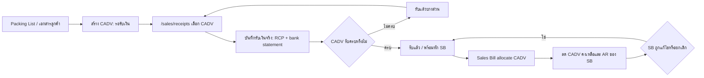

# Customer Advance Receipt Flow / รับเงินล่วงหน้า Customer

`CADV` คือเอกสารต้นทางที่ลงจาก Packing List หรือเอกสารภายนอกของลูกค้า เพื่อระบุเงินล่วงหน้าที่ต้องรับและสินค้าที่อ้างอิงอยู่ก่อนเกิดเงินเข้า จริง. `CADV` ไม่ใช่ใบเสร็จ และไม่สร้างเงินเข้า, `bank_statement`, หรือ AR ด้วยตัวเอง.

เงินเข้าจริงเกิดเมื่อหน้า `/sales/receipts` เลือก CADV แล้วออก `RCP`. หลังจากนั้น CADV ที่รับเงินจริงและมียอดคงเหลือจึงนำไปหัก Sales Bill (`SB`) ของลูกค้าคนเดียวกันได้.

## UI Ownership

หน้า `/purchase/advance-payments` เป็นหน้าร่วมแบบสอง tab เพื่อลดเมนูซ้ำ แต่ธุรกรรมเป็นคนละ domain และต้องแยก component/API/ข้อมูล:

| Tab | Document owner | ความหมาย |
|---|---|---|
| จ่ายเงินล่วงหน้า | Supplier `ADV` | เงินออกก่อน Purchase Bill |
| รับเงินล่วงหน้า | Customer `CADV` | คำขอรับเงินจาก Packing List ก่อน Receipt Voucher |

การรับเงินจริง, วิธีรับเงิน, บัญชีรับเงิน, bank statement และเลข `RCP` อยู่ที่ `/sales/receipts` เท่านั้น.

## CADV Form Contract

### Header

| Field | Required | Rule |
|---|---:|---|
| สาขา | Yes | ต้องเลือกก่อนลูกค้า; ใช้กำหนดเลขเอกสาร `CADV{branch}{YYMM}-####` และกรองลูกค้าจาก `customer_branches` |
| วันที่เอกสาร | Yes | วันที่ Packing List/วันที่ตั้ง CADV; ไม่ใช่วันที่รับเงินจริง |
| ลูกค้า | Yes | เลือกจาก Customer master ที่ active และผูกกับสาขาที่เลือก |
| Invoice No. | No | snapshot จากเอกสารภายนอก |
| Contract No. | No | snapshot จากเอกสารภายนอก |
| VAT | Yes | dropdown `ไม่มี VAT` / `มี VAT`; อัตรามาจาก VAT master ตามวันที่เอกสาร ไม่มี hardcode/fallback |
| ยอดเงินล่วงหน้าที่ต้องรับ | Yes | amount > 0; เมื่อเลือก `มี VAT` ช่องนี้คือยอดก่อน VAT และระบบคำนวณยอด VAT/ยอดรวมที่ RCP ต้องรับ |
| หมายเหตุ | No | ข้อความอ้างอิงเพิ่ม |
| ไฟล์ Packing List/Invoice | No | attachment reference; ไม่เก็บ Data URL ใน row |

### Item Lines

Packing List หนึ่งใบมีได้หลายรายการ จึงใช้ตารางเพิ่ม/ลบแถว:

| Field | Required | Rule |
|---|---:|---|
| สินค้า | Yes | active product master |
| จำนวน | Yes | quantity > 0; ใช้ unit snapshot ของสินค้า |
| น้ำหนักรวม | Yes | numeric(18,2), kg |
| น้ำหนักสุทธิ | Yes | numeric(18,2), kg; ต้องไม่มากกว่าน้ำหนักรวม |

หน้าจอแสดงผลรวมจำนวน, น้ำหนักรวม และน้ำหนักสุทธิใต้ตาราง. CADV ไม่ใช่เอกสาร stock movement และไม่ตัด/เพิ่ม stock.

## Lifecycle



| CADV status | ชื่อที่แสดง | Meaning | Allowed next action |
|---|---|---|---|
| `pending_receipt` | รอรับชำระ | ยังไม่มี RCP active | แก้ไข/ยกเลิก/เลือกใน Receipt |
| `partially_received` | รับชำระบางส่วน | มี RCP แต่ยอดรับยังไม่ครบ | รับเพิ่ม; แก้รายการการเงินผ่าน cancel/reissue RCP |
| `received` | รับชำระครบ | RCP ครบยอด | เลือกใช้หัก SB ได้ |
| `partially_allocated` | ใช้หักบิลบางส่วน | ใช้หัก SB บางส่วน | ใช้หัก SB ต่อได้ตามยอดคงเหลือ |
| `allocated` | ใช้หักบิลครบ | ใช้ยอดครบแล้ว | อ่านประวัติเท่านั้น |
| `cancelled` | ยกเลิก | ยกเลิกก่อนหรือหลัง reverse ความสัมพันธ์ครบ | ห้ามเลือกต่อ |

### การแก้ไขและยกเลิก CADV

หน้ารายการ CADV แสดงปุ่ม `แก้ไข` และ `ยกเลิก` เฉพาะเอกสารสถานะ `pending_receipt` ที่ `received_amount = 0` และ `allocated_amount = 0` เท่านั้น. API ตรวจซ้ำว่าต้องไม่มี `sales_bill_customer_advance_allocations` ที่ active ก่อนทำรายการ จึงห้ามแก้เอกสารหลังเริ่มรับเงินจริงหรือใช้หัก SB แม้ UI จะเป็นข้อมูลเก่าจากการโหลดก่อนหน้า.

- แก้ไข: คง `doc_no` เดิม, validate สาขา/ลูกค้า/สินค้า/VAT ใหม่, replace item snapshots ใน transaction เดียว, เพิ่ม `version`, status log action `edited`, และ audit log.
- ยกเลิก: ต้องระบุเหตุผล, set cancellation snapshot (`cancelled_at`, `cancelled_by`, `cancel_reason`), เปลี่ยนสถานะเป็น `cancelled`, เพิ่ม status log action `cancelled`, และ audit log.
- เอกสารที่รับเงินจริงหรือถูกใช้หัก SB แล้วไม่แสดงปุ่ม และ endpoint ปฏิเสธโดยไม่ใช้ fallback หรือแก้ข้อมูลย้อนหลัง.

### Detail Timeline

หน้า detail ของ CADV ต้องอ่าน `customer_advance_status_logs` โดยตรงผ่าน `GET /api/sales/customer-advances/{docNo}` และแสดงเรียงล่าสุดก่อน ไม่ใช้ข้อมูลแถว list หรือ audit log รวมเป็นตัวเดาประวัติ. แต่ละเหตุการณ์แสดง action, ผู้ทำ, เวลา, สถานะก่อน/หลัง, ยอดที่ต้องรับ, ยอดรับจริง, เครดิตคงเหลือ และหมายเหตุ/เหตุผลยกเลิกเมื่อมี. เหตุการณ์ที่ write path ต้อง append อย่างน้อยคือ `created`, `edited`, `cancelled`; เมื่อยอดรับจริงหรือยอดหักบิลทำให้สถานะเปลี่ยน ให้ settlement เขียน `status_{code}` เช่น `status_partially_received`, `status_received`, `status_partially_allocated`, `status_allocated` ใน transaction เดียวกับยอดและสถานะ.

## Page Surface Matrix

| Page / Route | Current role | CADV behavior | Source of truth |
|---|---|---|---|
| `/purchase/advance-payments` tab `รับเงินล่วงหน้า` | CADV source-document working page | แสดง list/filter และสร้าง CADV จาก Packing List/Invoice ภายนอกผ่าน modal; ไม่รับเงินจริงและไม่เขียน bank statement | `customer_advances`, `customer_advance_items`, `customer_advance_statuses` |
| `/sales/receipts` | Receipt/RCP working page | Target ถัดไป: เลือก CADV ที่ยังต้องรับเงิน, ออก RCP, เขียน cash/bank fact, และเพิ่มยอดรับจริงให้ CADV | `customer_receipts`, future `customer_receipt_advance_allocations`, `bank_statement`, `customer_advances` |
| `/sales/bills` | Sales Bill working page | เลือก CADV ที่ `received/partially_allocated` และมี `available_amount > 0`; หักฐานก่อน VAT แล้วคำนวณ VAT ใหม่จากฐานที่เหลือ | `sales_bills`, `sales_bill_customer_advance_allocations`, `customer_advances` |
| `/sales/bills/[docNo]` detail/print | Sales Bill read model | แสดง CADV ที่ใช้กับบิลจาก allocation facts และแสดงยอดที่ใช้เป็น total amount ของ allocation | `sales_bill_customer_advance_allocations` |
| `/finance/ar` | AR aging/drilldown | ใช้ `sales_bills.receivable_balance` เป็น source หลัก และแสดง CADV allocation เป็น drilldown/audit fact | `sales_bills`, `sales_bill_customer_advance_allocations` |
| `/finance/customer-advance` | Retired legacy page | ไม่ใช่หน้า active สำหรับสร้าง/จัดการ CADV แล้ว; เก็บเป็น historical reference ของ read model เก่า | legacy `bank_statement.ref_type = CADV`; target อ่าน dedicated CADV tables |

ผู้ใช้ทำงานกับ CADV ผ่าน tab `รับเงินล่วงหน้า` ใน `/purchase/advance-payments` เพราะเป็น source document ก่อนเงินเข้า. การรับเงินจริงต้องอยู่ใน `/sales/receipts`; การใช้หักบิลต้องอยู่ใน `/sales/bills`; การดูยอดลูกหนี้ต้องอยู่ใน `/finance/ar`.

### ตาราง CADV

ตารางรายการใช้ server-side pagination, filter, และ sort เพื่อไม่ให้เรียงเพียงข้อมูลของหน้าปัจจุบัน. ผู้ใช้ปรับความกว้างคอลัมน์ได้ผ่าน shared `useResizableColumns` และ browser จดจำความกว้างตามตาราง; มีปุ่ม `คืนค่าเดิมตาราง` เมื่อขนาดถูกแก้ไข.

- sortable: เลขที่ CADV, วันที่เอกสาร, ลูกค้า, ยอดที่ต้องรับ, เครดิตคงเหลือ, และสถานะ เพราะเป็นค่าที่เก็บโดยตรงใน `customer_advances` หรือ status relation
- display-only: สาขา, Invoice/Contract, น้ำหนักสุทธิ, และเครดิตที่ใช้ได้ เพราะเป็น snapshot หลายค่า, aggregate item lines, หรือคำนวณจากยอดรับเงินจริงกับ VAT; ห้าม client-side sort เพื่อหลีกเลี่ยงลำดับที่ไม่ตรงกับข้อมูลทั้งชุด

## API Design

### Customer Advance source document

| Endpoint | Purpose |
|---|---|
| `GET /api/sales/customer-advances` | list/filter CADV, summary และ pagination |
| `POST /api/sales/customer-advances` | สร้าง CADV + item snapshots; ไม่เขียน bank statement |
| `GET /api/sales/customer-advances/{docNo}` | detail, item lines และ status timeline |
| `PUT /api/sales/customer-advances/{docNo}` | แก้ header/item ก่อนมี active RCP หรือ SB allocation |
| `PATCH /api/sales/customer-advances/{docNo}` | ยกเลิกได้เมื่อไม่มี active RCP/allocation หรือ reverse เหตุการณ์ต้นทางครบแล้ว; request ต้องมี `reason` |

`POST` request target:

```ts
{
  branchId: "01",
  documentDate: "2026-07-15",
  customerId: "101",
  invoiceNo?: "IE6906005",
  contractNo?: "MAX-2606002",
  amount: "500000.00",
  vatType: "INCLUDE",
  remark?: "",
  lines: [{
    productId: "501",
    quantity: "1850",
    grossWeight: "17560.000",
    netWeight: "17560.000"
  }]
}
```

### Receipt integration

`/sales/receipts` รองรับ CADV เป็น source อีกชนิดหนึ่ง โดยไม่ปนกับ SB allocation:

| Endpoint / payload | Contract |
|---|---|
| `GET /api/sales/receipts` | ส่ง `customerAdvances` เฉพาะ CADV ที่ยังมี `availableAmount > 0` สำหรับเลือกใน modal |
| `POST /api/sales/receipts` | รับ `sourceType: 'CADV'` และ `customerAdvanceLines: [{ customerAdvanceDocNo, receiptAmount }]` พร้อมข้อมูลวิธีรับเงิน/บัญชีรับเงิน |
| `PATCH /api/sales/receipts` cancel/reissue | reverse CADV receipt allocation และ bank statement ก่อนออก RCP ใหม่ |

ใน modal ผู้ใช้เลือก `ประเภทเอกสารรับเงิน` ก่อน (`SB` หรือ `CADV`) แล้วเลือก source lines ได้เพียงประเภทเดียว. เมื่อ RCP commit สำเร็จใน transaction เดียว ต้อง: สร้าง receipt header, สร้าง `customer_receipt_advance_allocations`, สร้าง bank statement เงินเข้า, recalculate CADV received/remaining/status, และ append timeline. CADV ไม่สร้าง AR; AR เกิดและลดที่ SB เท่านั้น. ไม่มีการใช้ `billId` เดิมเป็น fallback เพื่อเดา source.

### Sales Bill integration

Sales Bill เลือกได้เฉพาะ CADV ที่ `received/partially_allocated` ของลูกค้าคนเดียวกัน สาขาเดียวกัน และมี `available_amount > 0`. `available_amount` เป็นเครดิตฐานก่อน VAT ไม่ใช่ยอดเงินสดรวม. ลำดับคำนวณต้องเหมือน Supplier ADV/PB: หักส่วนลดของ SB ก่อน, หัก CADV จากฐานก่อน VAT หลังส่วนลด, แล้วคำนวณ VAT ของ SB ใหม่จากฐานที่เหลือ. การหักเขียน `sales_bill_customer_advance_allocations` พร้อม `allocated_subtotal_amount`, `allocated_vat_amount`, และ `allocated_total_amount`; `allocated_amount` ต้องเท่ากับฐานที่ใช้หัก (`allocated_subtotal_amount`). ถ้า SB edit/cancel ต้อง release allocation กลับ CADV และ recalculate `allocated_amount`, `available_amount`, status ใน transaction เดียว. ห้ามเลือก CADV ที่เป็น `pending_receipt` หรือ `partially_received` มาใช้หัก SB.

## Target Data Model

| Table | Responsibility |
|---|---|
| `customer_advances` | CADV header, required branch FK, customer snapshot, invoice/contract, VAT snapshot, requested/received/allocated/remaining amounts, status |
| `customer_advance_items` | product/qty/gross/net snapshots ต่อ CADV |
| `customer_receipt_advance_allocations` | RCP -> CADV receipt facts; แยกจาก RCP -> SB allocation โดยเก็บยอดก่อน/หลังรับและคงเหลือ |
| `sales_bill_customer_advance_allocations` | CADV -> SB application facts; มีอยู่แล้วใน Sales Bill contract |
| `customer_advance_status_logs` | append-only lifecycle/audit |

`bank_statement` เป็น cash fact ของ `RCP` ไม่ใช่ header/source of truth ของ CADV. ไฟล์แนบอยู่ใน Storage/attachment table ภายหลัง ไม่อยู่ใน text/base64 field ของ CADV.

## Data Dictionary

### `customer_advance_statuses`

| Column | Meaning | Rule |
|---|---|---|
| `id` | internal status id | ใช้เป็น FK เท่านั้น |
| `code` | machine status code | unique; ใช้ใน runtime เช่น `pending_receipt`, `received`, `allocated` |
| `name` | ชื่อที่แสดง | Thai display label |
| `sort_order` | ลำดับแสดงผล | unique |
| `is_initial` | สถานะเริ่มต้น | `pending_receipt` ต้องเป็น initial |
| `active` | ใช้งานอยู่หรือไม่ | inactive status ไม่ควรถูกเลือกใน write path ใหม่ |

### `customer_advances`

| Column | Meaning | Rule |
|---|---|---|
| `id` | internal CADV id | ใช้เป็น FK ใน item/status log |
| `doc_no` | เลขเอกสาร CADV | unique; format `CADV{branch}{YYMM}-####` |
| `document_date` | วันที่เอกสารลูกค้า/Packing List | ไม่ใช่วันที่รับเงินจริง |
| `branch_id` | สาขาเจ้าของเอกสาร | required FK; ใช้กรองลูกค้าและเลขรัน |
| `customer_id` | ลูกค้าเจ้าของ CADV | required FK; ต้องผูกกับสาขาใน `customer_branches` |
| `customer_code_snapshot` | customer code ตอนสร้าง | ใช้แสดง/ตรวจ trace หาก master เปลี่ยน |
| `customer_name_snapshot` | customer name ตอนสร้าง | ใช้แสดง/พิมพ์เอกสาร |
| `invoice_no` | เลข invoice ภายนอก | optional reference; ไม่ unique |
| `contract_no` | เลข contract ภายนอก | optional reference; ไม่ unique |
| `currency_code` | สกุลเงินทางเทคนิค | ระบบบันทึก `THB` เสมอเพื่อรักษา FK และประวัติข้อมูล; CADV ไม่มีการเลือกหรือแสดงสกุลเงิน เพราะรับเป็นเงินบาทเท่านั้น |
| `vat_type` | VAT mode | `NONE` หรือ `INCLUDE`; `INCLUDE` หมายถึงผู้ใช้กรอกยอดก่อน VAT |
| `vat_rate_percent` | VAT rate snapshot | มาจาก VAT master ตาม `document_date`; ห้าม hardcode ใน client |
| `subtotal_amount` | ยอดฐานก่อน VAT | เป็นเครดิตฐานสูงสุดที่ใช้หัก SB หลังรับเงินครบตามสัดส่วน |
| `vat_amount` | VAT ของ CADV | `0` เมื่อ `vat_type = NONE` |
| `target_amount` | ยอดเงินสดรวมที่ต้องรับ | `subtotal_amount + vat_amount`; RCP ต้องรับยอด gross นี้ |
| `received_amount` | ยอดเงินสด gross ที่รับจริงแล้ว | เพิ่มจาก RCP -> CADV allocation; ไม่เพิ่มตอนสร้าง CADV |
| `available_amount` | เครดิตฐานก่อน VAT ที่ยังใช้หัก SB ได้ | คำนวณจากเงินรับ gross แปลงกลับเป็นฐาน แล้วหัก allocation active |
| `allocated_amount` | เครดิตฐานก่อน VAT ที่ใช้กับ SB แล้ว | ต้องเป็น base amount ไม่ใช่ gross |
| `status_id` | สถานะปัจจุบัน | FK ไป `customer_advance_statuses` |
| `remark` | หมายเหตุ | ข้อความประกอบเอกสาร |
| `created_at`, `created_by` | audit create | required |
| `updated_at`, `updated_by`, `version` | audit/update guard | update ใน write transaction |
| `cancelled_at`, `cancelled_by`, `cancel_reason` | cancellation snapshot | set เมื่อยกเลิก; ห้ามเลือกไปใช้ต่อ |

Balance invariant:

| Formula | Meaning |
|---|---|
| `target_amount = subtotal_amount + vat_amount` | ยอดเงินสดที่ต้องรับรวม VAT |
| `paid_base_capacity = min(subtotal_amount, received_amount * subtotal_amount / target_amount)` | เครดิตฐานก่อน VAT ที่ใช้ได้ตามเงินที่รับจริง |
| `available_amount = paid_base_capacity - allocated_amount` | เครดิตฐานคงเหลือสำหรับหัก SB |

### `customer_advance_items`

| Column | Meaning | Rule |
|---|---|---|
| `id` | internal line id | ใช้ภายใน |
| `customer_advance_id` | CADV header | FK ไป `customer_advances.id` |
| `line_no` | ลำดับรายการ | unique ต่อ CADV |
| `product_id` | สินค้า | required FK |
| `product_code_snapshot` | product code ตอนสร้าง | ใช้ trace/print |
| `product_name_snapshot` | product name ตอนสร้าง | ใช้ trace/print |
| `quantity` | จำนวน | > 0 |
| `gross_weight` | น้ำหนักรวม | numeric(18,2), kg |
| `net_weight` | น้ำหนักสุทธิ | numeric(18,2), kg; ต้องไม่มากกว่า gross |
| `created_at`, `created_by`, `updated_at`, `updated_by` | audit | เขียนพร้อม header transaction |

### `customer_advance_status_logs`

| Column | Meaning | Rule |
|---|---|---|
| `event_key` | idempotent event key | unique |
| `customer_advance_id`, `customer_advance_doc_no` | เอกสารที่เปลี่ยนสถานะ | ใช้ทั้ง FK และ outward trace |
| `from_status_id`, `to_status_id` | สถานะก่อน/หลัง | `from_status_id` เป็น null ได้ตอนสร้าง |
| `action` | เหตุการณ์ | เช่น create, status_received, status_allocated, cancel |
| `target_amount_snapshot` | gross target ตอน log | snapshot เพื่อ audit |
| `received_amount_snapshot` | gross received ตอน log | snapshot เพื่อ audit |
| `available_amount_snapshot` | base available ตอน log | snapshot เพื่อ audit |
| `allocated_amount_snapshot` | base allocated ตอน log | snapshot เพื่อ audit |
| `note`, `meta` | รายละเอียดเสริม | เก็บ context เช่น source route/reason |
| `created_at`, `created_by` | audit | append-only |

### `sales_bill_customer_advance_allocations`

| Column | Meaning | Rule |
|---|---|---|
| `sales_bill_id` | Sales Bill ที่ใช้ CADV | FK ไป `sales_bills` |
| `customer_advance_doc_no` | CADV ที่ถูกใช้ | outward link ไป `customer_advances.doc_no` |
| `customer_id`, `customer_code_snapshot`, `customer_name_snapshot` | ลูกค้า snapshot | ต้องเป็นลูกค้าเดียวกับ SB/CADV |
| `allocated_amount` | base credit ที่ใช้ | ต้องเท่ากับ `allocated_subtotal_amount` |
| `allocated_subtotal_amount` | ฐานก่อน VAT ที่หักจาก SB | ใช้ลด taxable base หลังส่วนลด |
| `allocated_vat_amount` | VAT ของ SB ที่ลดลงเพราะฐานถูกหัก | ใช้ audit/report; ไม่ใช่ VAT cash receipt |
| `allocated_total_amount` | ยอดรวมที่ SB ลดลง | `allocated_subtotal_amount + allocated_vat_amount` |
| `outstanding_before` | CADV base available ก่อน allocate | snapshot |
| `outstanding_after` | CADV base available หลัง allocate | snapshot |
| `status` | allocation status | `active` ใช้ลดยอด; cancel/edit SB ต้อง set non-active/release |
| `meta` | context เพิ่มเติม | เช่น `source`, `totalAppliedAmount` |
| `created_at`, `created_by`, `updated_at`, `updated_by`, `version` | audit/version | update ใน transaction เดียวกับ SB |

### Future `customer_receipt_advance_allocations`

| Field | Target meaning |
|---|---|
| `customer_receipt_id` / `customer_receipt_doc_no` | RCP ที่รับเงินจริง |
| `customer_advance_id` / `customer_advance_doc_no` | CADV ที่ถูกเติมยอดรับ |
| `received_gross_amount` | เงินสด gross ที่รับเข้า CADV |
| `received_base_amount` | ฐานก่อน VAT ที่คำนวณจาก gross ตามสัดส่วน CADV |
| `status` | active/reversed |
| `created_at`, `created_by`, `reversed_at`, `reversed_by` | audit |

ตารางนี้ยังเป็น target ถัดไป. ปัจจุบัน `/sales/receipts` ยังไม่ populate `received_amount`/`available_amount` ให้ CADV อัตโนมัติ.

## VAT And Balance Contract

- `vat_type = NONE`: `subtotal_amount = target_amount`, `vat_amount = 0`, `vat_rate_percent = 0`.
- `vat_type = INCLUDE`: ผู้ใช้กรอกยอดก่อน VAT ใน `amount`; server snapshot อัตราจาก VAT master แล้วเก็บ `target_amount = subtotal_amount + vat_amount`.
- `target_amount` คือยอดเงินสดรวมที่ RCP ต้องรับจากลูกค้า.
- เมื่อเชื่อม Receipt allocation ต้องแปลงเงินสดที่รับจริงเป็นเครดิตฐานตามสัดส่วนเดียวกับ ADV Supplier; `available_amount` สำหรับหัก Sales Bill ต้องเป็นยอดฐานก่อน VAT ไม่ใช่ยอด gross.
- Sales Bill ที่ใช้ CADV ต้องหักส่วนลดก่อน จากนั้นหักเครดิตฐานจากยอดก่อน VAT หลังส่วนลด แล้วคำนวณ VAT ของบิลจากฐานที่เหลือ เพื่อไม่เอา VAT ของเงินล่วงหน้ามาหักซ้ำ.
- Sales Bill allocation แก้แล้วให้เลือกจาก `customer_advances` ไม่ใช่ `bank_statement.ref_type = CADV`, และเขียน allocation breakdown สำหรับ AR/detail/print.
- รอบนี้ยังไม่แก้ `/sales/receipts`; CADV จะพร้อมใช้หัก SB ก็ต่อเมื่อ receipt integration หรือ data repair populate `received_amount`/`available_amount` ตาม contract นี้.

## Non-Responsibilities

- CADV ไม่ออก RCP หรือบันทึกเงินเข้าเอง
- CADV ไม่สร้าง/ลด AR, ไม่ตัด stock, และไม่ออก Sales Bill
- หน้า tab ร่วมไม่ทำให้ ADV Supplier และ CADV Customer ใช้ endpoint หรือตารางเดียวกัน
- ห้ามใช้ Invoice No. หรือ Contract No. เป็น unique identity เพราะเป็น optional external references

## Implementation Boundary

รอบ CADV source-document นี้มี `CustomerAdvanceForm` ใน tab รับเงินล่วงหน้าแล้ว: ตารางเรียก `GET /api/sales/customer-advances`, ฟอร์มเปิดเป็น modal จากหน้ารายการและเรียก `POST /api/sales/customer-advances`, และทุก lookup มาจาก master/status database records. การสร้าง CADV ต้องเลือกสาขาก่อนลูกค้า, API recheck ว่าลูกค้าผูกกับสาขานั้นผ่าน `customer_branches`, เลขเอกสารออกตามสาขาและเดือนเอกสารในรูป `CADV{branch}{YYMM}-####`, และ list filter มีสาขาเป็นตัวกรองหลัก. การสร้าง CADV เขียน header, VAT breakdown, lines, initial status log, และ audit log ใน transaction เดียว โดยไม่สร้าง RCP/bank statement/AR และไม่เปลี่ยนยอด SB. Migration `20260715133000_create_customer_advances.sql` ถูก apply แล้วบน dev-target เมื่อ 2026-07-15 ผ่าน env ใน `apps/next/.env.local`; migration follow-up `20260715143000_add_branch_to_customer_advances.sql` เพิ่ม required `branch_id`, FK/index, และ renumber ข้อมูลเดิมตามสาขาแล้ว. Migration `20260716190000_add_customer_advance_vat_breakdown.sql` เพิ่ม `vat_type`, `vat_rate_percent`, `subtotal_amount`, `vat_amount` และ arithmetic constraints; dev-target backfill CADV เดิม 2 รายการเป็น `NONE` และตรวจ breakdown ผ่าน 2/2 เมื่อ 2026-07-16. ตาราง `customer_advance_statuses`, `customer_advances`, `customer_advance_items`, และ `customer_advance_status_logs` พร้อม status seed ใช้งานได้จริงในฐาน dev. ยังไม่มี upload ไฟล์ เพราะ attachment table และ Storage contract ยังไม่ถูกเพิ่ม; ห้ามให้ form รับไฟล์แล้วทิ้งข้อมูล.
