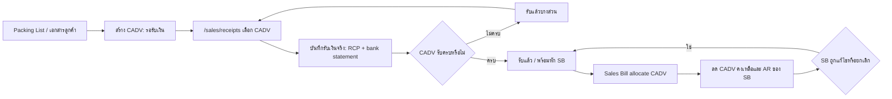

# Customer Advance Receipt Flow / รับเงินล่วงหน้า Customer

`CADV` คือเอกสารต้นทางที่ลงจาก Packing List หรือเอกสารภายนอกของลูกค้า เพื่อระบุเงินล่วงหน้าที่ต้องรับและสินค้าที่อ้างอิงอยู่ก่อนเกิดเงินเข้า จริง. `CADV` ไม่ใช่ใบเสร็จ และไม่สร้างเงินเข้า, `bank_statement`, หรือ AR ด้วยตัวเอง.

เงินเข้าจริงเกิดเมื่อหน้า `/sales/receipts` เลือก CADV แล้วออก `RCP`. หลังจากนั้น CADV ที่รับเงินจริงและมียอดคงเหลือจึงนำไปหัก Sales Bill (`SB`) ของลูกค้าคนเดียวกันได้.

## UI Ownership

หน้า `/purchase/advance-payments` เป็นหน้าร่วมแบบสอง tab เพื่อลดเมนูซ้ำ แต่ธุรกรรมเป็นคนละ domain และต้องแยก component/API/ข้อมูล:

| Tab | Document owner | ความหมาย |
|---|---|---|
| จ่ายเงินล่วงหน้า | Supplier `ADV` | เงินออกก่อน Purchase Bill |
| รับเงินล่วงหน้า | Customer `CADV` | คำขอรับเงินจาก Packing List ก่อน Receipt Voucher |

การรับเงินจริง, วิธีรับเงิน, บัญชีรับเงิน, bank statement และเลข `RCP` อยู่ที่ `/sales/receipts` เท่านั้น.

## CADV Form Contract

### Header

| Field | Required | Rule |
|---|---:|---|
| สาขา | Yes | ต้องเลือกก่อนลูกค้า; ใช้กำหนดเลขเอกสาร `CADV{branch}{YYMM}-####` และกรองลูกค้าจาก `customer_branches` |
| วันที่เอกสาร | Yes | วันที่ Packing List/วันที่ตั้ง CADV; ไม่ใช่วันที่รับเงินจริง |
| ลูกค้า | Yes | เลือกจาก Customer master ที่ active และผูกกับสาขาที่เลือก |
| Invoice No. | No | snapshot จากเอกสารภายนอก |
| Contract No. | No | snapshot จากเอกสารภายนอก |
| ยอดเงินล่วงหน้าที่ต้องรับ | Yes | amount > 0; เป็นยอดที่ RCP ดึงมาเป็นยอดตั้งต้น |
| สกุลเงิน | Yes | เลือกจาก Currency master; ไม่มี default/fallback ใน client |
| หมายเหตุ | No | ข้อความอ้างอิงเพิ่ม |
| ไฟล์ Packing List/Invoice | No | attachment reference; ไม่เก็บ Data URL ใน row |

### Item Lines

Packing List หนึ่งใบมีได้หลายรายการ จึงใช้ตารางเพิ่ม/ลบแถว:

| Field | Required | Rule |
|---|---:|---|
| สินค้า | Yes | active product master |
| จำนวน | Yes | quantity > 0; ใช้ unit snapshot ของสินค้า |
| น้ำหนักรวม | Yes | numeric(18,2), kg |
| น้ำหนักสุทธิ | Yes | numeric(18,2), kg; ต้องไม่มากกว่าน้ำหนักรวม |

หน้าจอแสดงผลรวมจำนวน, น้ำหนักรวม และน้ำหนักสุทธิใต้ตาราง. CADV ไม่ใช่เอกสาร stock movement และไม่ตัด/เพิ่ม stock.

## Lifecycle



| CADV status | ชื่อที่แสดง | Meaning | Allowed next action |
|---|---|---|---|
| `pending_receipt` | รอรับชำระ | ยังไม่มี RCP active | แก้ไข/ยกเลิก/เลือกใน Receipt |
| `partially_received` | รับชำระบางส่วน | มี RCP แต่ยอดรับยังไม่ครบ | รับเพิ่ม; แก้รายการการเงินผ่าน cancel/reissue RCP |
| `received` | รับชำระครบ | RCP ครบยอด | เลือกใช้หัก SB ได้ |
| `partially_allocated` | ใช้หักบิลบางส่วน | ใช้หัก SB บางส่วน | ใช้หัก SB ต่อได้ตามยอดคงเหลือ |
| `allocated` | ใช้หักบิลครบ | ใช้ยอดครบแล้ว | อ่านประวัติเท่านั้น |
| `cancelled` | ยกเลิก | ยกเลิกก่อนหรือหลัง reverse ความสัมพันธ์ครบ | ห้ามเลือกต่อ |

## API Design

### Customer Advance source document

| Endpoint | Purpose |
|---|---|
| `GET /api/sales/customer-advances` | list/filter CADV, summary และ pagination |
| `POST /api/sales/customer-advances` | สร้าง CADV + item snapshots; ไม่เขียน bank statement |
| `GET /api/sales/customer-advances/{docNo}` | detail, item lines, RCP/SB allocation timeline |
| `PATCH /api/sales/customer-advances/{docNo}` | แก้ header/item ก่อนมี active RCP หรือ SB allocation |
| `PATCH /api/sales/customer-advances/{docNo}` with `action=cancel` | ยกเลิกได้เมื่อไม่มี active RCP/allocation หรือ reverse เหตุการณ์ต้นทางครบแล้ว |

`POST` request target:

```ts
{
  branchId: "01",
  documentDate: "2026-07-15",
  customerId: "101",
  invoiceNo?: "IE6906005",
  contractNo?: "MAX-2606002",
  amount: "500000.00",
  currencyCode: "THB",
  remark?: "",
  lines: [{
    productId: "501",
    quantity: "1850",
    grossWeight: "17560.000",
    netWeight: "17560.000"
  }]
}
```

### Receipt integration

`/sales/receipts` ต้องเพิ่ม CADV เป็น source อีกชนิดหนึ่ง โดยไม่ปนกับ SB allocation:

| Endpoint / payload | Contract |
|---|---|
| `GET /api/sales/receipts` | ส่ง `customerAdvanceOptions` เฉพาะ CADV ของลูกค้าที่เลือกและยังมียอด `remaining_to_receive > 0` |
| `POST /api/sales/receipts` | รับ `customerAdvanceAllocations: [{ customerAdvanceDocNo, receivedAmount }]` พร้อมข้อมูลวิธีรับเงิน/บัญชีรับเงิน |
| `PATCH /api/sales/receipts/{docNo}` cancel/reissue | reverse CADV receipt allocation และ bank statement ก่อนออก RCP ใหม่ |

เมื่อ RCP commit สำเร็จใน transaction เดียว ต้อง: สร้าง receipt header/line, สร้าง `customer_receipt_advance_allocations`, สร้าง bank statement เงินเข้า, recalculate CADV received/remaining/status, และ append timeline. CADV ไม่สร้าง AR; AR เกิดและลดที่ SB เท่านั้น.

### Sales Bill integration

Sales Bill เลือกได้เฉพาะ CADV ที่ `received/partially_allocated` ของลูกค้าคนเดียวกัน และมี `available_to_allocate > 0`. การหักเขียน `sales_bill_customer_advance_allocations`; ถ้า SB edit/cancel ต้อง release allocation กลับ CADV ใน transaction เดียว. ห้ามเลือก CADV ที่เป็น `pending_receipt` หรือ `partially_received` มาใช้หัก SB.

## Target Data Model

| Table | Responsibility |
|---|---|
| `customer_advances` | CADV header, required branch FK, customer snapshot, invoice/contract, requested/received/allocated/remaining amounts, status |
| `customer_advance_items` | product/qty/gross/net snapshots ต่อ CADV |
| `customer_receipt_advance_allocations` | RCP -> CADV receipt facts; แยกจาก RCP -> SB allocation |
| `sales_bill_customer_advance_allocations` | CADV -> SB application facts; มีอยู่แล้วใน Sales Bill contract |
| `customer_advance_status_logs` | append-only lifecycle/audit |

`bank_statement` เป็น cash fact ของ `RCP` ไม่ใช่ header/source of truth ของ CADV. ไฟล์แนบอยู่ใน Storage/attachment table ภายหลัง ไม่อยู่ใน text/base64 field ของ CADV.

## Non-Responsibilities

- CADV ไม่ออก RCP หรือบันทึกเงินเข้าเอง
- CADV ไม่สร้าง/ลด AR, ไม่ตัด stock, และไม่ออก Sales Bill
- หน้า tab ร่วมไม่ทำให้ ADV Supplier และ CADV Customer ใช้ endpoint หรือตารางเดียวกัน
- ห้ามใช้ Invoice No. หรือ Contract No. เป็น unique identity เพราะเป็น optional external references

## Implementation Boundary

รอบ CADV source-document นี้มี `CustomerAdvanceForm` ใน tab รับเงินล่วงหน้าแล้ว: ตารางเรียก `GET /api/sales/customer-advances`, ฟอร์มเปิดเป็น modal จากหน้ารายการและเรียก `POST /api/sales/customer-advances`, และทุก lookup มาจาก master/status database records. การสร้าง CADV ต้องเลือกสาขาก่อนลูกค้า, API recheck ว่าลูกค้าผูกกับสาขานั้นผ่าน `customer_branches`, เลขเอกสารออกตามสาขาและเดือนเอกสารในรูป `CADV{branch}{YYMM}-####`, และ list filter มีสาขาเป็นตัวกรองหลัก. การสร้าง CADV เขียน header, lines, initial status log, และ audit log ใน transaction เดียว โดยไม่สร้าง RCP/bank statement/AR และไม่เปลี่ยนยอด SB. Migration `20260715133000_create_customer_advances.sql` ถูก apply แล้วบน dev-target เมื่อ 2026-07-15 ผ่าน env ใน `apps/next/.env.local`; migration follow-up `20260715143000_add_branch_to_customer_advances.sql` เพิ่ม required `branch_id`, FK/index, และ renumber ข้อมูลเดิมตามสาขาแล้ว. ตาราง `customer_advance_statuses`, `customer_advances`, `customer_advance_items`, และ `customer_advance_status_logs` พร้อม status seed ใช้งานได้จริงในฐาน dev. ยังไม่มี upload ไฟล์ เพราะ attachment table และ Storage contract ยังไม่ถูกเพิ่ม; ห้ามให้ form รับไฟล์แล้วทิ้งข้อมูล.
