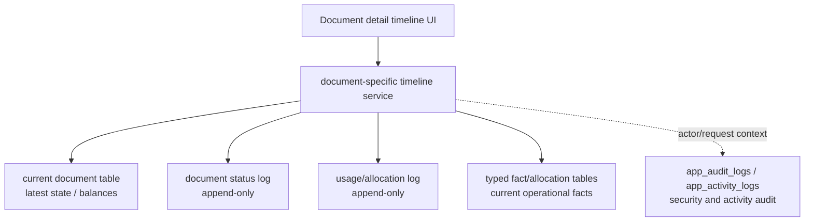

# Document History Table Design

เอกสารนี้เป็น target design ต่อจาก [[Document Timeline Policy]] สำหรับการเก็บ timeline/history ของเอกสารธุรกิจที่มีเลขเอกสารใน NS Scrap ERP

## Decision

ไม่ใช้ `document_events` กลาง table เดียวเป็น source of truth ของ business timeline

ใช้แนวทางแยก table ตามเอกสารหรือ business flow เป็น default แล้วให้ read service/UI รวมข้อมูลจาก table เฉพาะมาแสดงเป็น timeline

เหตุผล:

- แต่ละเอกสารมี payload ไม่เหมือนกัน เช่น `WTI -> PB` ต้องมีน้ำหนักและสินค้า, `PMA -> PMT` ต้องมียอดอนุมัติ/ยอดจ่าย/บัญชี, `SB -> RCP` ต้องมียอดรับเงิน
- business rule ต้อง enforce จาก typed columns และ FK จริง ไม่ใช่ JSON metadata
- active allocation/current facts ไม่ควรถูกใช้แทน history เพราะเมื่อยกเลิกหรือ reverse แล้ว active facts ต้องถูก release แต่ประวัติยังต้องอยู่
- `app_audit_logs` ใช้เป็น security/write audit ได้ แต่ไม่ใช่ business document timeline

## Target Architecture



หลักการ:

- current document table เก็บสถานะล่าสุด ยอดคงเหลือ และ field ที่ใช้ query/process ปัจจุบัน
- status log เก็บ lifecycle event เช่น create, edit, approve, cancel, void, paid, reverse
- usage/allocation log เก็บ event ที่เอกสารถูกใช้ต่อ เช่น WTI ถูก PB ใช้, ADV ถูก PB allocate, PMA ถูก PMT จ่าย
- fact/allocation table เก็บข้อเท็จจริงเชิง operation ที่ต้อง enforce เช่น active allocation, payment split, stock movement
- UI timeline ใช้ common view model ได้ แต่ DB ไม่ต้องบังคับให้ทุก event อยู่ table เดียว

## Common Log Contract

ทุก log table เฉพาะเอกสารควรมี field กลางขั้นต่ำ:

| Field | Type | Rule |
|---|---|---|
| `id` | `bigint generated by identity` | internal PK เท่านั้น |
| `event_key` | `text unique not null` | outward stable key สำหรับ UI/API |
| `<document>_id` | `bigint not null` | FK ไป current document table |
| `<document>_doc_no` | `text not null` | snapshot เลขเอกสารตอนเกิด event |
| `action` | `text not null` | controlled action เช่น `created`, `edited`, `cancelled` |
| `from_status` | `text` | สถานะก่อนหน้า ถ้ามี |
| `to_status` | `text` | สถานะหลัง event ถ้ามี |
| `reason` / `note` | `text` | เหตุผลหรือหมายเหตุ |
| `created_by` | `text` | user/app actor |
| `created_at` | `timestamptz not null default now()` | เวลา server |

Typed business fields ต้องมาก่อน `metadata` เสมอ เช่น `allocated_net_weight`, `approved_amount`, `paid_amount`, `account_id`

ใช้ `metadata jsonb` ได้เฉพาะข้อมูลประกอบ audit/display ที่ไม่ใช้ enforce rule, reconcile, report, หรือคำนวณยอด

## Purchase-Side Design

| เอกสาร | Current state | Status/history table | Usage/allocation history | Typed fact/current tables |
|---|---|---|---|---|
| `POB` | `po_buys` | `po_buy_status_logs` มีแล้ว | `po_buy_allocation_logs` มีแล้วสำหรับ PB allocate/release เชิง line | `purchase_bill_po_allocations` |
| `WTI/WTO` | `weight_tickets` | `weight_ticket_status_logs` มีแล้ว | `weight_ticket_usage_logs` มีแล้วสำหรับ `WTI -> PB`; target ต่อไปคือ `WTO -> SB` | `weight_ticket_lines`, `weight_ticket_product_summaries`, `purchase_bill_receipt_allocations`, future sales/WTO allocation |
| `PB` | `purchase_bills` | `purchase_bill_status_logs` มีแล้ว | timeline อ่านร่วมกับ WTI/PO/ADV usage logs | `purchase_bill_items`, `purchase_bill_receipt_allocations`, `purchase_bill_po_allocations`, `supplier_advance_allocations` |
| `ADV` | `supplier_advance_payments` | `supplier_advance_status_logs` มีแล้ว | `supplier_advance_allocation_logs` มีแล้วสำหรับ ADV -> PB allocation/release | `supplier_advance_allocations` |
| `EXP` | `expenses` | target `expense_status_logs` | Payment handoff อ่านจาก PMA/PMT logs | expense line/detail table ในอนาคต |

### `weight_ticket_status_logs`

ใช้กับทั้ง `WTI` และ `WTO`

เหตุการณ์หลัก:

- `created`
- `edited`
- `cancelled`
- `usage_status_changed`
- `status_synced`

field เฉพาะที่ควรมี:

| Field | ความหมาย |
|---|---|
| `weight_ticket_id` | FK ไป `weight_tickets.id` |
| `weight_ticket_doc_no` | snapshot `WTI...` / `WTO...` |
| `doc_type` | `IN` / `OUT` หรือ value ปัจจุบันของ `weight_tickets.doc_type` |
| `gross_weight_snapshot` | gross ตอนเกิด event |
| `deduct_weight_snapshot` | deduct ตอนเกิด event |
| `net_weight_snapshot` | net ตอนเกิด event |

### `weight_ticket_usage_logs`

ใช้ตอบคำถามว่าใบรับ/ใบส่งถูกนำไปใช้อะไร ใช้เท่าไหร่ และคืน/ยกเลิกเท่าไหร่

เหตุการณ์หลัก:

- `allocated_to_purchase_bill`
- `released_from_purchase_bill`
- `allocated_to_sales_bill`
- `released_from_sales_bill`

field เฉพาะที่ควรมี:

| Field | ความหมาย |
|---|---|
| `weight_ticket_id` | FK ไป `weight_tickets.id` |
| `weight_ticket_doc_no` | snapshot WTI/WTO |
| `weight_ticket_product_summary_id` | FK ไป summary ถ้าเป็น WTI/PB allocation |
| `product_id` | FK ไป `products.id` |
| `product_code_snapshot` | snapshot code สินค้า |
| `product_name_snapshot` | snapshot ชื่อสินค้า |
| `target_type` | `PURCHASE_BILL` / `SALES_BILL` |
| `target_id` | bigint id ของเอกสารปลายทาง |
| `target_doc_no` | เลขเอกสารปลายทาง เช่น `PB...` / `SB...` |
| `target_line_no` | line no ปลายทาง ถ้ามี |
| `allocated_qty` | จำนวน/น้ำหนักใช้งาน |
| `allocated_gross_weight` | gross ที่ใช้ |
| `allocated_deduct_weight` | deduct ที่ใช้ |
| `allocated_net_weight` | net ที่ใช้ |
| `from_remaining_weight` | remaining ก่อน event |
| `to_remaining_weight` | remaining หลัง event |

หมายเหตุ: `purchase_bill_receipt_allocations` เป็น active/current allocation fact ไม่ใช่ timeline ถ้า PB ถูกยกเลิก active allocation ต้องถูก release แต่ `weight_ticket_usage_logs` ต้องยังเห็นทั้งยอดใช้และยอดคืน

Implementation checkpoint 2026-06-06:

- `weight_ticket_status_logs` ถูกเพิ่มใน schema/migration แล้วสำหรับ lifecycle/status ของ `WTI/WTO`
- `weight_ticket_usage_logs` ถูกเพิ่มใน schema/migration แล้วสำหรับ `WTI -> PB`
- migration status-log backfill สร้าง `created` baseline และ `status_synced` สำหรับสถานะปัจจุบันที่ไม่ใช่ค่าเริ่มต้น เช่น `WTI012605-0002 received -> billed`
- migration usage-log backfill active `purchase_bill_receipt_allocations` เป็น `allocated_to_purchase_bill` event โดยเก็บ running remaining weight ต่อ WTI summary
- `/api/daily/weight-tickets` append `created`, `/api/daily/weight-tickets/[id]` append `edited/cancelled`, และ `/api/purchase/bills` append `usage_status_changed` เมื่อ PB create/edit/cancel ทำให้ WTI status เปลี่ยนจาก active allocation
- `/api/purchase/bills` append `allocated_to_purchase_bill` ตอนสร้าง PB, compare diff ตอนแก้ PB, และ append `released_from_purchase_bill` ก่อนลบ active allocation ตอน PB cancel/edit
- `/api/daily/weight-tickets/[id]` ส่ง `timeline` จาก `weight_ticket_status_logs` + `weight_ticket_usage_logs` และส่ง `usageTimeline` สำหรับตาราง `ประวัติการใช้งานใบรับของ`
- ยังไม่ถือว่า `WTI/WTO` timeline ครบทั้งหมด เพราะ `WTO -> SB` usage ยังเป็นงานถัดไป

### `po_buy_allocation_logs`

ใช้เมื่อ detail ของ POB ต้องเห็นว่าถูก PB ตัดยอดเท่าไหร่ ถูกยกเลิกคืนเท่าไหร่ หรือ short-close เท่าไหร่ระดับสินค้า/line

field เฉพาะที่ควรมี:

| Field | ความหมาย |
|---|---|
| `po_buy_id` | FK ไป `po_buys.id` |
| `po_buy_doc_no` | snapshot POB |
| `purchase_bill_id` | FK ไป PB ถ้ามี |
| `purchase_bill_doc_no` | snapshot PB |
| `purchase_bill_line_no` | line no ใน PB |
| `product_id` | FK สินค้า |
| `product_code_snapshot` | snapshot code |
| `allocated_qty` | qty/weight ที่ตัด PO |
| `allocated_amount` | amount ที่ตัด PO |
| `from_remaining_qty` | remaining ก่อน event |
| `to_remaining_qty` | remaining หลัง event |

`po_buy_status_logs` ยังเป็น timeline หลักของสถานะ POB เช่น open, partial, received, short-closed, cancelled

Implementation checkpoint 2026-06-06:

- `po_buy_allocation_logs` ถูกเพิ่มใน schema/migration แล้ว
- `purchase_bill_po_allocations` ยังเป็น active/current allocation fact
- `/api/purchase/bills` append `allocated_to_purchase_bill` ตอนสร้าง PB และ append `released_from_purchase_bill` ตอนยกเลิก PB
- edit PB compare old/new allocation แล้ว append เฉพาะ diff เพื่อไม่สร้าง history ขยะจากการ delete/create row ซ้ำ
- `/purchase/po-buy` detail อ่าน `po_buy_status_logs` + `po_buy_allocation_logs`

### `supplier_advance_status_logs`

ใช้เก็บ lifecycle ของ ADV เอง

เหตุการณ์หลัก:

- `created`
- `edited`
- `cancelled`
- `approved`
- `approval_voided`
- `paid`
- `payment_reversed`
- `partially_allocated`
- `allocated`
- `allocation_released`
- `status_synced`

หมายเหตุ 2026-06-08: `refund_required` / `refunded` ไม่ใช่ event/status runtime ของ `ADV` ใน phase ปัจจุบันแล้ว; ถ้ามี Supplier refund flow ต้องออกแบบเป็น flow/table แยกและไม่ทำให้ filter หน้า ADV แสดงสถานะคืนเงิน

field เฉพาะที่ควรมี:

| Field | ความหมาย |
|---|---|
| `advance_payment_id` | FK ไป `supplier_advance_payments.id` |
| `advance_doc_no` | snapshot ADV |
| `amount_snapshot` | ยอด ADV |
| `allocated_amount_snapshot` | ยอด allocate ตอนเกิด event |
| `remaining_amount_snapshot` | ยอดคงเหลือ |

### `supplier_advance_allocation_logs`

ใช้เก็บประวัติ ADV ถูกตัดเข้าบิลและคืนยอดเมื่อ PB cancel

field เฉพาะที่ควรมี:

| Field | ความหมาย |
|---|---|
| `advance_payment_id` | FK ไป ADV |
| `advance_doc_no` | snapshot ADV |
| `purchase_bill_id` | FK ไป PB |
| `purchase_bill_doc_no` | snapshot PB |
| `allocation_key` | key ของ allocation fact ถ้ามี |
| `allocated_amount` | ยอดที่ allocate หรือ release |
| `from_remaining_amount` | remaining ก่อน event |
| `to_remaining_amount` | remaining หลัง event |

Implementation checkpoint 2026-06-06:

- `supplier_advance_status_logs` และ `supplier_advance_allocation_logs` ถูกเพิ่มใน schema/migration แล้ว
- dev-target apply ของ `20260606093705_add_supplier_advance_timeline_logs.sql` สำเร็จด้วย direct `psql`; backfill ได้ status log `3` rows และ allocation log `0` rows ตามข้อมูล ADV ปัจจุบัน และ `supabase migration repair 20260606093705 --status applied` mark remote migration history แล้ว
- `/api/purchase/advance-payments` และ `/api/purchase/advance-payments/[id]` append lifecycle log สำหรับ create/edit/cancel
- `/api/daily/payment-approval`, `/api/purchase/payments`, `/api/purchase/payments/cancel`, และ `/api/purchase/payments/cancel-approved` append status log สำหรับ approve/void/paid/reverse
- `/api/purchase/bills` append allocation log สำหรับ ADV ถูกใช้หัก PB และถูก release เมื่อ PB edit/cancel ก่อน active allocation fact ถูก refresh
- ADV detail timeline อ่าน `supplier_advance_status_logs` + `supplier_advance_allocation_logs` เป็นหลัก ไม่อ่านจาก `app_audit_logs` หรือ current allocation rows

## Payment-Side Design

Payment Flow ต้องแยก 3 ชั้นชัดเจน:

- pending source queue ยังไม่ใช่ PMA และไม่ต้องมี table history ของตัวเอง
- `PMA` เกิดตอน approve เท่านั้น
- `PMT` เกิดตอนทำจ่ายเท่านั้น

| เอกสาร/ชั้นข้อมูล | Current state | Status/history table | Typed fact/current tables |
|---|---|---|---|
| Pending source | `purchase_bills`, `supplier_advance_payments`, `expenses` | ใช้ status log ของ source เอง | read model คำนวณจาก source current - active/consumed PMA |
| `PMA` | `payment_approvals` | target `payment_approval_status_logs` | source snapshot fields ใน `payment_approvals` |
| `PMT` | `payments` | target `payment_status_logs` | target `payment_allocations`, target `payment_account_splits` |

### `payment_approval_status_logs`

เหตุการณ์หลัก:

- `approved`
- `voided-before-payment`
- `selected-for-payment`
- `paid`
- `reversed-by-payment-cancel`

field เฉพาะที่ควรมี:

| Field | ความหมาย |
|---|---|
| `payment_approval_id` | FK ไป `payment_approvals.id` |
| `payment_approval_doc_no` | snapshot `PMA...` |
| `source_type` | `PB` / `ADV` / `EXP` |
| `source_id` | source id ตาม contract ของ current schema |
| `source_doc_no_snapshot` | เลขเอกสาร source |
| `approved_amount_snapshot` | ยอด PMA |
| `payment_id` | FK ไป PMT ถ้า event เกี่ยวกับ PMT |
| `payment_doc_no` | snapshot PMT ถ้ามี |

### `payment_status_logs`

เหตุการณ์หลัก:

- `created`
- `posted`
- `cancelled`
- `bank-posted`
- `bank-reversed`

field เฉพาะที่ควรมี:

| Field | ความหมาย |
|---|---|
| `payment_id` | FK ไป `payments.id` |
| `payment_doc_no` | snapshot `PMT...` |
| `supplier_id` | FK supplier |
| `supplier_code_snapshot` | snapshot supplier code |
| `amount_snapshot` | ยอด PMT |
| `net_amount_snapshot` | net paid |
| `account_id` | account หลักถ้ามี |
| `account_code_snapshot` | snapshot account code |

### `payment_allocations`

ไม่ใช่ timeline แต่เป็น fact table ที่จำเป็นสำหรับ PMT จ่ายหลาย PMA

ขั้นต่ำ:

| Field | ความหมาย |
|---|---|
| `allocation_key` | outward key |
| `payment_id` | FK PMT |
| `payment_doc_no` | snapshot PMT |
| `payment_approval_id` | FK PMA |
| `payment_approval_doc_no` | snapshot PMA |
| `source_type` | source ของ PMA |
| `source_doc_no_snapshot` | เลข source |
| `allocated_amount` | ยอดที่ PMT จ่ายให้ PMA |
| `status` | `active` / `reversed` |

กติกา:

- PMT ต้องจ่ายเต็มยอด PMA ที่เลือก
- ถ้า PMT ถูก cancel ให้ `payment_allocations.status = reversed` หรือสร้าง reversal fact ตาม design migration ตอนลงมือ
- ห้ามนำ PMA เดิมกลับมาใช้จ่ายซ้ำหลัง PMT cancel; ต้อง approve ใหม่เพื่อสร้าง PMA ใหม่

### `payment_account_splits`

ไม่ใช่ timeline แต่จำเป็นถ้า PMT เดียวจ่ายหลายบัญชี

ขั้นต่ำ:

| Field | ความหมาย |
|---|---|
| `split_key` | outward key |
| `payment_id` | FK PMT |
| `account_id` | FK account |
| `account_code_snapshot` | snapshot account code |
| `amount` | ยอดจ่ายจากบัญชีนั้น |
| `bank_statement_id` | FK statement ถ้ามี |
| `status` | `active` / `reversed` |

## Sales-Side Design

| เอกสาร | Current state | Status/history table | Usage/allocation history | Typed fact/current tables |
|---|---|---|---|---|
| `POS` | `po_sells` | target `po_sell_status_logs` | target `po_sell_allocation_logs` | future `sales_bill_po_allocations` |
| `PSALE` | `stock_issues` | target `stock_issue_status_logs` | stock effect trace through `stock_ledger` | future stock issue line/detail table |
| `WTO` | `weight_tickets` | `weight_ticket_status_logs` | `weight_ticket_usage_logs` | future WTO -> SB allocation table |
| `SB` | `sales_bills` | target `sales_bill_status_logs` | target sales allocation logs where needed | future `sales_bill_items`, `receipt_allocations` |
| `RCP` | `receipts` | target `receipt_status_logs` | target `receipt_allocation_logs` | target `receipt_allocations`, `receipt_account_splits` |

## Stock / Finance / Production Support Design

| เอกสาร/table | Target history design |
|---|---|
| `stock_ledger` | เป็น append-only movement ledger ของตัวเอง มี `ledger_key`; ไม่ใช้แทน timeline ของ source document |
| `stock_adjustments` | target `stock_adjustment_status_logs`; stock effect ต้องชี้ `stock_ledger.ledger_key` |
| `transfers` | target `transfer_status_logs`; cash/bank effect ต้อง trace ไป `bank_statement` |
| `bank_statement` | ถ้าเป็น user-facing imported/matched statement ให้มี `bank_statement_status_logs`; ถ้าเป็น generated posting ให้ trace จาก source PMT/RCP/transfer log |
| `grade_adjustments` | target `grade_adjustment_status_logs` และ stock ledger references |
| `production_orders` | target `production_order_status_logs` |
| `loan_payments` | target `loan_payment_status_logs` |
| `petty_advances` | target `petty_advance_status_logs` |
| `petty_advance_returns` | target `petty_advance_return_status_logs` |

## Write Path Rule

ทุก write path ที่กระทบเอกสารต้องทำใน transaction เดียว:

1. validate input ด้วย business key/doc no/code ที่ถูกต้อง
2. update current document table
3. update/release fact/allocation table ถ้ามี
4. append status/usage log เฉพาะเอกสาร
5. append audit/activity log ถ้าเป็น user/security action
6. refresh summary/current tables ถ้ามี

ถ้า insert log ล้มเหลว transaction ต้อง rollback ห้ามปล่อย current state เปลี่ยนโดยไม่มี history

ห้ามเขียน runtime fallback เพื่อสร้าง timeline จาก internal id, JSON เดิม, หรือข้อมูลผิดรูปแบบ

## UI Read Rule

แต่ละ detail page ควรมี service สำหรับ normalize timeline เป็น shape กลางของ UI เช่น:

```ts
type DocumentTimelineItem = {
  id: string
  at: string
  actor: string | null
  title: string
  description: string
  statusFrom?: string | null
  statusTo?: string | null
  amount?: string | null
  weight?: string | null
  relatedDocNo?: string | null
}
```

DB ยังแยก table เฉพาะเหมือนเดิม; common UI shape เป็น read model เท่านั้น

ตัวอย่าง source ของ timeline:

| Detail page | Query source |
|---|---|
| WTI detail | `weight_ticket_status_logs` + `weight_ticket_usage_logs`; `app_audit_logs` ไม่ใช่ document timeline |
| POB detail | `po_buy_status_logs` + `po_buy_allocation_logs` |
| PB detail | `purchase_bill_status_logs` + WTI/PO/ADV usage logs ที่อ้าง PB |
| ADV detail | `supplier_advance_status_logs` + `supplier_advance_allocation_logs` |
| PMA detail | `payment_approval_status_logs` + `payment_allocations` |
| PMT detail | `payment_status_logs` + `payment_allocations` + `payment_account_splits` |
| SB detail | `sales_bill_status_logs` + receipt/sales allocation logs |
| RCP detail | `receipt_status_logs` + `receipt_allocations` |

## Migration / Backfill Rule

สำหรับข้อมูลเดิม:

- backfill baseline event เช่น `created`, `imported`, หรือ `baseline`
- ถ้ามี field cancel/void/reverse ชัดเจน ให้ backfill event นั้นด้วย
- ถ้าขาดรายละเอียดว่าใช้ยอดไหนตอนไหน ให้บันทึกเป็น baseline/imported ไม่ fabricate usage detail
- active allocation ปัจจุบันสามารถ backfill เป็น `allocated-*` event ได้ถ้ามี FK/doc no/amount/weight ครบ
- cancelled/released history ที่ไม่มีหลักฐานใน DB ให้ไม่สร้างรายละเอียดปลอม

## Implementation Order

1. Purchase trace foundation: `weight_ticket_status_logs`, `weight_ticket_usage_logs` สำหรับ `WTI -> PB`, `po_buy_allocation_logs`, `supplier_advance_status_logs`, และ `supplier_advance_allocation_logs` ทำแล้ว; งานถัดไปคือ `WTO -> SB` usage
2. Payment trace foundation: `payment_approval_status_logs`, `payment_status_logs`, `payment_allocations`, `payment_account_splits`
3. Sales trace foundation: `po_sell_status_logs`, `stock_issue_status_logs`, `sales_bill_status_logs`, `receipt_status_logs`, sales/receipt allocation facts
4. Stock/finance/production support logs ตาม priority ของ flow ที่ถูกใช้งานจริง
