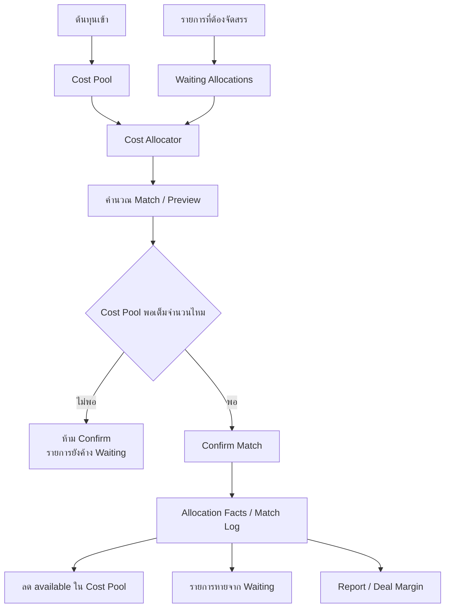
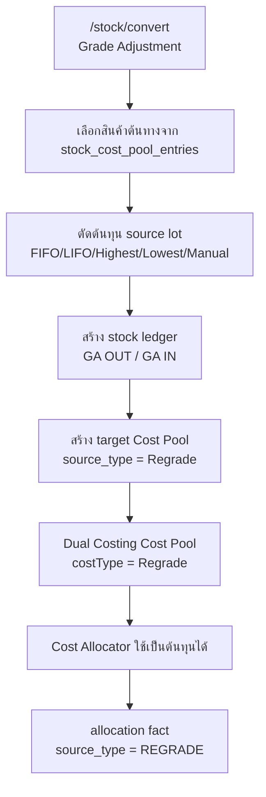

# Dual Costing Flow แบบละเอียด

เอกสารนี้สรุป flow การทำงานของ Dual Costing แบบละเอียดสำหรับใช้คุยงาน อธิบายการทำงานตั้งแต่ Cost Pool, Waiting Allocations, Cost Allocator, Allocation Facts, Report และการเชื่อมกับ Grade Adjustment / Regrade

## สรุปใจความ

Dual Costing คือ management view สำหรับจับคู่ต้นทุนจริงจาก Cost Pool กับรายการขายหรือผลิต เพื่อดู margin แบบ deal-by-deal โดยไม่ปนกับ WAC, Stock Ledger หรือ GL สำหรับปิดงบ

## 1. ขอบเขตของ Dual Costing

Dual Costing ใช้กับสินค้ากลุ่มทองแดงและทองเหลืองเป็นหลัก โดยอิง `products.metal_group` หรือ field equivalent

สินค้า eligible:

- `ทองแดง`
- `ทองเหลือง`
- `copper`
- `brass`

Dual Costing ใช้เพื่อ:

- วิเคราะห์กำไรต่อดีล
- trace ต้นทุนที่ถูกนำไปจับคู่กับรายการขาย
- แสดง management margin รายดีล
- ช่วยผู้บริหารเปรียบเทียบ deal cost กับมุมมอง stock/WAC

Dual Costing ไม่ใช่:

- Stock On Hand
- WAC / COGS สำหรับปิดบัญชี
- GL / statutory accounting
- flow ที่แก้ AP, AR, bank หรือเอกสารบัญชีโดยตรง

## 2. End-to-End Flow



| ลำดับ | ขั้นตอน | ทำอะไร | ผลลัพธ์ |
|---:|---|---|---|
| 1 | Cost Pool | รวบรวมต้นทุนที่พร้อมจัดสรร เช่น PO_Buy, Spot_Buy และ runtime ปัจจุบันอาจมี Production/Regrade | เห็น available qty/value ของแต่ละ source |
| 2 | Waiting Allocations | รวมรายการขายหรือผลิตที่ยังไม่ได้จัดสรรต้นทุน | ได้ queue ของ target ที่ต้อง allocate |
| 3 | Cost Allocator | เลือก target, product, allocation mode แล้วคำนวณ lot ที่จะใช้ | เกิด preview candidates |
| 4 | Confirm Match | บันทึกเมื่อ Cost Pool พอเต็มจำนวนตาม target | สร้าง allocation facts และ deal log |
| 5 | Reports | อ่านผลจาก ledger/facts | เห็น margin รายดีลและประวัติการจับคู่ |

## 3. Cost Pool

Cost Pool คือแหล่งต้นทุนที่รอให้ Cost Allocator หยิบไปจับคู่กับ target ไม่ใช่ stock จริงและไม่ใช่ WAC ของ stock ledger

| Source | เข้า Cost Pool เมื่อไหร่ | หมายเหตุ |
|---|---|---|
| `PO_Buy` | สร้าง PO Buy ของสินค้า eligible | เป็น reserve cost candidate ยังไม่ใช่ stock จริง |
| `Spot_Buy` | บันทึก Purchase Bill แบบไม่มี PO | เป็นต้นทุนซื้อจริงจาก PB line |
| `Production` | อ่านจาก `stock_cost_pool_entries` ที่ source เป็น Production | runtime ปัจจุบันแสดงได้ แต่ควร confirm policy |
| `Grade Adjustment / Regrade` | เกิดจาก `/stock/convert` ที่สร้าง target pool `source_type = Regrade` | runtime ปัจจุบันแสดงเป็น Grade Adjustment |

สูตรหลัก:

```text
availableQty = originalQty - allocatedQty - releasedQty
availableValue = availableQty * unitCost
```

สถานะที่พบได้:

- `Available`
- `Partially Used`
- `Fully Used`
- `Released`
- `Cancelled`

## 4. Waiting Allocations

หน้า Waiting Allocations คือ queue งาน ไม่ใช่หน้าบันทึก match เอง หน้าที่คือบอกว่ารายการใดยังต้องจัดสรรต้นทุน

API:

```text
GET /api/dual-costing/waiting-allocations
```

แหล่งข้อมูลที่รวมเข้ามา:

| Source | เงื่อนไขเข้า queue | การคำนวณ allocated |
|---|---|---|
| `PO Sell` | ยังไม่ cancelled / closed / completed / fully matched และสินค้า eligible | อ่าน active allocation facts และ fallback จาก trading deals |
| `Sales Bill` | ไม่ใช่ `TRADING`, ไม่มี PO Sell, line active, ไม่มี PO allocation และสินค้า eligible | อ่าน matched qty ตาม sales bill + product |
| `Production` | order ไม่ cancelled และ product eligible | ปัจจุบันตั้ง `allocatedQty = 0` และ `remainingQty = qty` |

Row กลางที่ส่งให้ UI:

```ts
{
  id,
  docNo,
  date,
  branchName,
  customerName,
  productId,
  productName,
  metalGroup,
  qty,
  allocatedQty,
  remainingQty,
  unitPrice,
  revenuePending,
  allocationStatus,
  salesBillId,
  itemId
}
```

คำนวณทั่วไป:

```text
allocatedQty = จำนวนที่เคย match แล้ว
remainingQty = qty - allocatedQty
revenuePending = remainingQty * unitPrice
```

### Production gap

Production ตอนนี้ยังไม่ได้ reconcile `allocatedQty` จาก allocation facts แบบ PO Sell และ Sales Bill

ผลที่อาจเกิดขึ้น:

- Production อาจยังแสดงใน Waiting Allocations แม้เคย allocate แล้ว
- summary pending qty อาจสูงเกินจริง
- ถ้า backend ไม่กันเพิ่ม อาจเสี่ยง match ซ้ำ

สิ่งที่ควรทำต่อ:

- ให้ allocation fact ระบุ production source key ชัดเจน
- lookup allocated qty ของ production order ก่อนสร้าง `waitingProductionRows`
- คำนวณ `remainingQty = qty - allocatedQty`
- ถ้า `remainingQty <= 0` ต้องไม่แสดงใน Waiting Allocations

## 5. Cost Allocator

Cost Allocator เป็นหน้าคำนวณและยืนยันการจับคู่ต้นทุนกับ target โดยรับ context จาก Waiting Allocations หรือเลือก target เอง

API:

```text
GET /api/dual-costing/cost-allocator
POST /api/dual-costing/cost-allocator
```

Allocation modes:

| Mode | ความหมาย |
|---|---|
| `FIFO` | ใช้ต้นทุนเก่าก่อน |
| `LIFO` | ใช้ต้นทุนใหม่ก่อน |
| `Cheap` | ใช้ต้นทุนถูกก่อน |
| `Expensive` | ใช้ต้นทุนแพงก่อน |
| `Manual` | runtime ปัจจุบันเรียง lot ที่ใกล้ target cost ไม่ใช่ manual เลือกทีละ lot แบบสมบูรณ์ |

ขั้นตอนคำนวณ preview:

```text
need = target.remainingQty

for each costPool lot ตาม allocation mode:
  qtyToUse = min(lot.availableQty, need)
  need -= qtyToUse
```

ผลลัพธ์ที่ได้:

- `candidates`
- `totalToMatch`
- `totalCostMatch`
- `expectedRevenue`
- `expectedMargin`
- `remainingAfterPreview`

## 6. Full Match Guard

กติกาที่ควรยึด:

```text
target ล่าสุดควรเป็น Full Match only
```

ถ้า Cost Pool ไม่พอเต็ม target row:

- ให้แสดง preview ได้
- แสดงจำนวนที่ขาด
- ปิดปุ่ม Confirm
- ไม่บันทึก partial target allocation
- รายการยังอยู่ใน Waiting Allocations ต่อไป

ตัวอย่าง:

```text
target ต้อง match 10,000 กก.
Cost Pool มี 7,000 กก.

totalToMatch = 7,000
remainingAfterPreview = 3,000
Confirm = disabled
```

จุดที่ควร harden:

- UI ต้อง disable Confirm เมื่อ `totalToMatch < target.remainingQty`
- POST ต้อง re-check ซ้ำว่า `sum(qtyToUse) == target.remainingQty`
- ห้ามเชื่อ candidates จาก client โดยไม่ validate server-side

## 7. Confirm Match และข้อมูลที่บันทึก

เมื่อยืนยัน match สำเร็จ ระบบควรสร้างหลักฐานถาวรของการจัดสรร เช่น `trading_deals` และ `trading_allocation_facts`

ข้อมูลสำคัญใน allocation fact:

| Field | ความหมาย |
|---|---|
| `allocation_no` | เลขอ้างอิง allocation |
| `source_type` | ประเภท source เช่น `TRADING_PURCHASE_BILL`, `PRODUCTION`, `REGRADE` |
| `source_doc_no` / `source_line_no` | เอกสารต้นทุนและบรรทัดที่ใช้ |
| `sales_doc_no` / `sales_line_no` | เอกสารขายหรือ target ที่ถูก match |
| `qty` | จำนวนที่จัดสรร |
| `matched_cogs` | ต้นทุนที่ match = qty x unitCost |
| `status` | `active` หรือ `reversed` |

ผลหลัง Confirm:

- Cost Pool available ลดลง
- target allocatedQty เพิ่มขึ้น
- ถ้า match ครบ target ต้องหายจาก Waiting Allocations
- Ledger, Report และ Deal Margin อ่านผลได้

## 8. Grade Adjustment / Regrade ที่เชื่อมมา Dual Costing

Grade Adjustment อยู่ใน owner flow ฝั่ง Stock:

```text
/stock/convert
```

เมื่อบันทึกสำเร็จ จะสร้าง target Cost Pool row ที่:

```text
source_type = Regrade
source_ref_type = GA
```

Flow:



ข้อควรระวัง:

```text
Dual Costing Cost Pool อาจเห็น Spot_Buy จาก Purchase Bill
แต่ Grade Adjustment ใช้เฉพาะ stock_cost_pool_entries สำหรับ preview/POST
```

ดังนั้น การเห็นรายการใน Dual Costing Cost Pool ไม่ได้แปลว่าจะตัดใน Grade Adjustment ได้เสมอ

ถ้าต้องการให้ Grade Adjustment ใช้ Spot_Buy จาก PB ได้ ต้อง:

- backfill หรือสร้าง `stock_cost_pool_entries` จาก PB Spot_Buy ที่เข้า stock จริง
- หรือปรับ `/stock/convert` ให้รองรับ PB source ด้วย แต่ต้องแก้ทั้ง preview และ POST

## 9. Reports และผลหลัง Confirm

| หน้า | ใช้ทำอะไร |
|---|---|
| Allocation Ledger | ดูประวัติ allocation และ source/target ที่ถูกจับคู่ |
| Match Log | ดู log การ match และสถานะ approved/reversed |
| Dual Costing Report | ดูภาพรวมต้นทุนที่จัดสรร |
| Deal Margin | ดู margin รายดีล |
| Compare Margin | เปรียบเทียบมุมมอง deal cost กับ stock/WAC view |

## 10. จุดที่ต้องตัดสินใจ / Hardening

- ยืนยันว่า Cost Pool scope จะใช้เฉพาะ `PO_Buy + Spot_Buy` หรือรวม `Production + Regrade` เป็น source ที่ใช้ขายได้จริง
- บังคับ Full Match guard ทั้ง UI และ backend POST เพื่อกันการบันทึก partial target allocation
- ทำ Production reconcile `allocatedQty` จาก allocation facts ก่อนส่งเข้า Waiting Allocations
- ถ้าต้องการให้ Grade Adjustment ใช้ Spot_Buy จาก PB ได้ ต้องทำ `stock_cost_pool_entries` ให้ครบ
- การแก้หรือ reverse allocation ควรใช้ reverse + recreate ไม่ลบ history ทิ้ง

## Related Docs

- [[Dual Costing Flow]]
- [[Cost Pool]]
- [[Stock Convert Page Flow]]
- [[PO Sell Flow]]
- [[Sales Bills Page Flow]]
