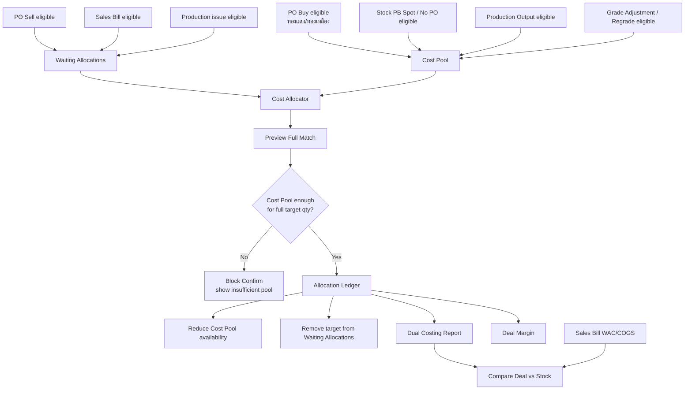

# Dual Costing Flow

เอกสารนี้เป็นภาพรวมหมวด `Dual Costing (จองดีล)` ของระบบใหม่ โดยอ่านจาก legacy เป็น baseline และผูกกลับกับเมนู active ใน Next เท่านั้น

## Scope ของหมวด

Dual Costing คือระบบจัดสรรต้นทุนจริงจาก lot/source ซื้อไปจับคู่กับดีลขาย เพื่อดู margin แบบ deal-by-deal สำหรับผู้บริหาร โดยเฉพาะสินค้า `ทองแดง` และ `ทองเหลือง`

Legacy ระบุ core rule ชัดเจน:

```text
DUAL_COSTING_GROUPS = ['ทองแดง', 'ทองเหลือง']
isDualCostingProduct(productId) => products.metalGroup อยู่ใน DUAL_COSTING_GROUPS
```

ดังนั้นทุกหน้าในหมวดนี้ต้องถือว่า product eligibility คือ `ทองแดง / ทองเหลือง / copper / brass` เท่านั้น และต้อง enforce ที่ backend ไม่ใช่แค่ซ่อนใน UI

## ไม่ใช่อะไร

- ไม่ใช่ `stock on hand`
- ไม่ใช่ `stock_ledger`
- ไม่ใช่ WAC หรือ COGS สำหรับปิดงบ
- ไม่ใช่ GL/statutory accounting
- ไม่ควรแก้ stock, bank statement, AP/AR หรือสถานะเอกสารซื้อขายโดยตรง

Legacy ย้ำหลายหน้าว่า `P&L / งบกำไรขาดทุน ใช้ WAC เสมอ` ส่วน Dual Costing เป็น management view สำหรับดูต้นทุนดีล

## Menu Scope in Next

| Route | Menu | Detailed file | Status |
|---|---|---|---|
| `/dual-costing/cost-pool` | Cost Pool | [[page-flows/dual-costing-dual-costing-cost-pool|Cost Pool Page Flow]] | Active |
| `/dual-costing/cost-allocator` | Cost Allocator (ทอง/เหลือง) | [[page-flows/dual-costing-dual-costing-cost-allocator|Cost Allocator Page Flow]] | Active |
| `/dual-costing/waiting-allocations` | Waiting Allocations | [[page-flows/dual-costing-dual-costing-waiting-allocations|Waiting Allocations Page Flow]] | Active |
| `/dual-costing/cost-allocation-ledger` | Allocation Ledger | [[page-flows/dual-costing-dual-costing-cost-allocation-ledger|Allocation Ledger Page Flow]] | Active |
| `/dual-costing/report` | Dual Costing Report | [[page-flows/dual-costing-dual-costing-report|Dual Costing Report Page Flow]] | Active |
| `/dual-costing/deal-margin` | Deal Margin Report | [[page-flows/dual-costing-dual-costing-deal-margin|Deal Margin Page Flow]] | Active |
| `/dual-costing/match-log` | Match Log | [[page-flows/dual-costing-dual-costing-match-log|Match Log Page Flow]] | Removed from sidebar |
| `/dual-costing/compare-margin` | Compare Deal vs Stock | [[page-flows/dual-costing-dual-costing-compare-margin|Compare Margin Page Flow]] | Removed from sidebar |

Legacy มี `PO Buy` และ `PO Sell` อยู่ในหมวด Dual Costing ด้วย แต่ Next ย้ายไปอยู่หมวด `รายการประจำวัน`; flow รายหน้าถูกแยกไว้ที่ [[PO Buy Page Flow]] และ [[PO Sell Flow]]

## Core Data Flow



## Full-Match Allocation Policy

Decision 2026-06-23: target flow ตัด `match บางส่วน` ออกจาก Dual Costing รอบนี้ เพื่อให้ Waiting Allocations และ Cost Allocator ทำงานแบบง่ายและตรวจสอบได้ชัดเจน

หลักการใหม่:

- Waiting Allocations แสดงเฉพาะรายการที่ยังไม่ถูก allocate เลย
- Cost Allocator ต้อง allocate เต็มจำนวนของ target row เท่านั้น
- ถ้า Cost Pool ของสินค้านั้นไม่พอสำหรับจำนวนเต็ม ต้องห้ามกด Confirm Match
- หลัง Confirm Match สำเร็จ รายการ target ต้องหายจาก Waiting Allocations
- ไม่มีสถานะ `partially_allocated` ใน target flow ใหม่
- ไม่มีปุ่ม `จัดสรรต่อ`

Required calculation:

```text
required_qty = target row qty
available_cost_pool_qty = sum Cost Pool available qty for selected product

Confirm enabled only when available_cost_pool_qty >= required_qty
```

หลัง Confirm:

```text
allocated_qty = required_qty
waiting target visibility = hidden / excluded from Waiting Allocations
```

## Target Cost Pool Source Decision

Target scope ล่าสุดใช้ source เข้า Cost Pool เฉพาะ:

| Source | เข้า Cost Pool | หมายเหตุ |
|---|---:|---|
| `PO_Buy` eligible | ใช่ | เป็น reserve cost candidate ตั้งแต่สร้าง PO |
| `Stock PB Spot / No PO` eligible | ใช่ | เป็นต้นทุนซื้อจริงจาก PB line ที่ไม่มี PO |
| PB line ที่อ้าง PO | ไม่สร้าง source ใหม่ | ใช้/reconcile `PO_Buy` candidate เดิม |
| Trading purchase | ไม่ | ใช้ trading/matching flow แยก |
| Production | ไม่ใน target รอบนี้ | legacy เคยมี cost type/report queue แต่ต้องมี decision ใหม่ก่อนนำกลับ |
| Regrade / Grade Adjustment | ไม่ใน target รอบนี้ | legacy เคยมี cost type/report queue แต่ต้องมี decision ใหม่ก่อนนำกลับ |

หมายเหตุ: legacy UI บางหน้าแสดง `Production` และ `Regrade` เป็น cost type หรือ waiting queue แต่ target ล่าสุดของเอกสาร [[Cost Pool]] จำกัด source ที่เข้า pool ไว้ที่ `PO_Buy` และ `Spot_Buy / No PO PB` เพื่อไม่ให้ต้นทุนผลิต/ปรับเกรดปนกับรอบจองดีลก่อน policy ชัด

Clarification 2026-06-13: `stock_cost_pool_entries` ที่ใช้โดย `/stock/convert` เป็น operational Grade Adjustment cost pool สำหรับ trace source lot -> target regrade lot ภายใน stock convert เท่านั้น ไม่ได้เปลี่ยน scope ของ Dual Costing Cost Allocator ซึ่งยังจำกัด source ตามตารางนี้จนกว่าจะมี decision แยก

## Allocation Status

| Status | Meaning |
|---|---|
| `Available` | Cost Pool row ยังไม่ถูกใช้ |
| `Partially Used` | ถูก match ไปบางส่วน |
| `Fully Used` | ถูกใช้ครบ |
| `pending_allocation` | รายการขาย eligible ยังไม่ถูก allocate ต้นทุน |
| `allocated` | รายการ target ถูก allocate ครบแล้ว และไม่ต้องแสดงใน Waiting Allocations |
| `approved` | match/allocation active |
| `reversed` | match ถูก reverse และต้องคืน available qty |

หมายเหตุ: `Partially Used` ยังใช้ได้ฝั่ง Cost Pool เพราะ Cost Pool lot หนึ่งอาจถูกใช้กับหลาย target เต็มรายการคนละใบได้ แต่ฝั่ง target/Waiting Allocations ไม่รองรับ partial target allocation ใน flow ล่าสุด

## Current Next API Map

| Route | Current API | Current source |
|---|---|---|
| `/dual-costing/cost-pool` | `GET /api/dual-costing/cost-pool` | `po_buys`, `purchase_bills`, `stock_cost_pool_entries` for Production/Regrade, `trading_deals` |
| `/dual-costing/cost-allocator` | `GET /api/dual-costing/cost-allocator` | `Cost Pool API`, Sales Bill no-PO lines by default, optional `po_sells`, `trading_deals`, `products` |
| `/dual-costing/waiting-allocations` | `GET /api/dual-costing/waiting-allocations` | shared `buildDualCostingManagement()` from `sales_bills`, `sales_bill_lines`, PO allocation facts, `trading_deals`, `products` |
| `/dual-costing/cost-allocation-ledger` | `GET /api/dual-costing/cost-allocation-ledger` | shared `buildDualCostingManagement()` from `trading_deals` |
| `/dual-costing/report` | `GET /api/dual-costing/report` | shared `buildDualCostingManagement()` |
| `/dual-costing/match-log` | `GET /api/dual-costing/match-log` | `trading_deals` as current read baseline |
| `/dual-costing/deal-margin` | `GET /api/dual-costing/deal-margin` | `trading_deals` |
| `/dual-costing/compare-margin` | `GET /api/dual-costing/compare-margin` | deal side `trading_deals`, stock side trading/PO-linked `sales_bills` |

## Implementation Gaps To Keep Visible

- `/api/dual-costing/cost-pool` must filter product eligibility by `products.metal_group`.
- Cost Pool PB/Production/Regrade visibility follows the legacy baseline until durable allocation/cost-deducted policy replaces it.
- `Cost Allocator` confirm must allocate the full target qty only; no partial target allocation.
- Confirm must be disabled when Cost Pool available qty is less than target required qty.
- Waiting Allocations must exclude target rows that already have approved allocation for the full target qty.
- Current `Cost Allocator` may still be read-only simulation in code; target needs a durable allocation ledger/match log before enabling confirm.
- Current `Match Log` and `Allocation Ledger` may read from `trading_deals`; target needs a durable allocation ledger/match log when allocator write is implemented.
- Reverse/edit rules must be append-only or reverse-based; no physical delete of allocation history.
- Report formulas must always label whether they use Deal Cost or WAC.

## Related Docs

- [[Cost Pool]]
- [[PO Buy Page Flow]]
- [[PO Sell Flow]]
- [[Sales Bills Page Flow]]
- [[Stock Ledger and Stock Balance]]
- [[Document History Table Design]]
