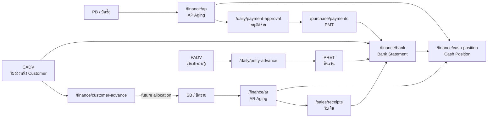

# Finance Debt Flow / Flow หมวดการเงินและหนี้

## Scope

หมวด `การเงิน & หนี้` ใน active Next app มี 6 หน้า:

| Route | Page | Owner |
|---|---|---|
| `/daily/petty-advance` | เงินสำรองจ่าย / กู้กรรมการ | advance outstanding + return flow |
| `/finance/ar` | ลูกหนี้ (AR) | receivable aging read model |
| `/finance/ap` | เจ้าหนี้ (AP) | payable aging read model |
| `/finance/bank` | Cash / Bank Statement | cash/bank ledger read model |
| `/finance/cash-position` | Cash Position | liquidity aggregate |
| `/finance/customer-advance` | รับล่วงหน้าจาก Customer | customer advance liability read model |

หมวดนี้เป็นชั้น operational finance/debt ของระบบ ไม่ใช่ GL/accounting posting เต็มรูปแบบ. เอกสารบัญชีเชิงงบอยู่ในหมวด `การเงิน-บัญชี`; ส่วน flow นี้สนใจว่าเงินเข้า/ออก, ลูกหนี้, เจ้าหนี้, advance, และ cash position อ่านหรือกระทบกันอย่างไร.

## Flow Map

## Page Ownership

| Page | Write/Read | Source of truth | Side effect |
|---|---|---|---|
| Petty Advance | write `PADV`, write `PRET` | `petty_advances`, `petty_advance_returns` | `PRET` creates `bank_statement`; `PADV` create does not |
| AR | read-only | `sales_bills`, `receipts`, future customer advance allocations | none |
| AP | read-only | `purchase_bills`, `payments`, payment approval/payment facts | none |
| Bank Statement | read-only ledger | `bank_statement`, `accounts` | none |
| Cash Position | read-only aggregate | `accounts`, `bank_statement`, AR/AP source facts | none |
| Customer Advance | current read-only | current `bank_statement.ref_type = CADV`; target dedicated advance tables | none in current page |

## Cross-Flow Rules

- `PB` creates payable exposure; `AP` only reads that exposure.
- `SB` creates receivable exposure; `AR` only reads that exposure.
- `PMT`, `RCP`, `TRF`, `PRET`, and `CADV` are examples of money facts that appear in `bank_statement`.
- `PADV` is an outstanding advance document; the current target rule is that creating `PADV` does not write bank statement. Cash/bank impact in this page occurs only when recording `PRET` return.
- `Customer Advance` is a liability. Current Next reads `CADV` rows from `bank_statement`; target should move to dedicated `customer_advances` and `customer_advance_allocations`.
- Cash Position must be rebuildable from facts and should not become a manual source of truth.
- ทุกหน้าแยก `document date` หรือวันที่จ่าย/รับเงินจริง ออกจาก `created_at` เพราะระบบรองรับการบันทึกย้อนหลัง.

## Legacy Baseline

Legacy มีเมนูตรงกันสำหรับ `AR`, `AP`, `Bank`, `Cash Position`, `Customer Advance`, และ `Petty Advance`:

- `AR`: คำนวณจาก sales bills ที่ไม่ cancelled หัก receipts, มี aging bucket `Current`, `1-30`, `31-60`, `61-90`, `>90`, top customer, pending sale banner.
- `AP`: คำนวณจาก purchase bills ที่ไม่ cancelled หัก payments, มี summary/detail view, bucket และ top supplier.
- `Bank`: อ่าน bank statement ตามบัญชีและวันที่, มี running balance, chart, export, และปุ่ม duplicate cleanup ที่ target ต้องแยกเป็น admin-only ก่อนเปิดใช้.
- `Cash Position`: รวม cash/bank/FCD/OD, AR และ AP เพื่อดู liquidity.
- `Customer Advance`: สร้าง `CADV` แล้วเขียน bank statement เงินเข้า; cancel จะลบ/ย้อน bank statement ถ้ายังไม่ถูกใช้.
- `Petty Advance`: legacy เขียน bank statement ตอนสร้าง `PADV`, แต่ target ปัจจุบันเปลี่ยนแล้วว่า `PADV` ยังไม่เขียน `BST`; `PRET` คืนเงินจึงเขียน `BST`.

## Current API Summary

| Page | Current API | Permission |
|---|---|---|
| `/daily/petty-advance` | `GET/POST /api/daily/petty-advances`, `POST /api/daily/petty-advances/returns` | `finance.cash.view` |
| `/finance/ar` | `GET /api/finance/ar` | `finance.cash.view` |
| `/finance/ap` | `GET /api/finance/ap` | `finance.cash.view` |
| `/finance/bank` | `GET /api/finance/bank` | `finance.cash.view` |
| `/finance/cash-position` | `GET /api/finance/cash-position` | `finance.cash.view` |
| `/finance/customer-advance` | `GET /api/finance/customer-advance` | `finance.cash.view` |

## Open Decisions / Gaps

- AP must be reconciled with PMA/PMT states so list/filter/action clearly separate `ยังไม่อนุมัติ`, `รอจ่าย`, `ชำระบางส่วน`, `เสร็จสิ้น`, `ยกเลิก`.
- AR must integrate customer advance allocation facts before `Customer Advance` can show true used/remaining.
- Bank statement correction/duplicate cleanup must be admin-only with audit, backup, and rollback; not a normal finance page action.
- Cash Position needs future `asOf`, branch, and currency/FCD policy if used for historical reporting.
- Petty advance still needs expense allocation/clearing design and append-only status log.
- Dedicated customer advance write/allocation tables remain missing in current Next.

## Related Page Docs

- [[Petty Advance Page Flow]]
- [[Finance AR Page Flow]]
- [[Finance AP Page Flow]]
- [[Finance Bank Statement Page Flow]]
- [[Finance Cash Position Page Flow]]
- [[Customer Advance Page Flow]]
- [[Payment Flow]]
- [[Daily Cash Flow]]
- [[Document Aging Policy]]
