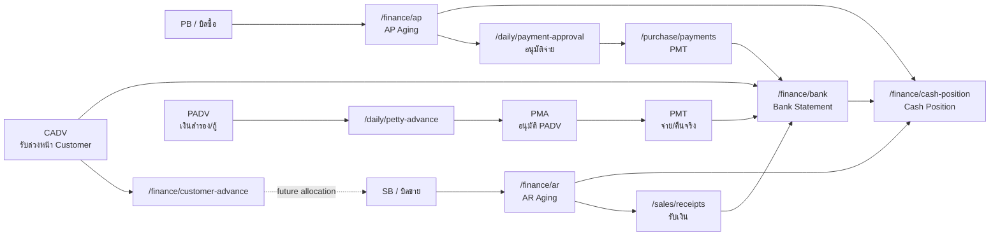

# Finance Debt Flow / Flow หมวดการเงินและหนี้

## Scope

หมวด `การเงิน & หนี้` ใน active Next app มี 6 หน้า:

| Route | Page | Owner |
|---|---|---|
| `/daily/petty-advance` | เงินสำรองจ่าย / กู้กรรมการ | advance outstanding + return flow |
| `/finance/ar` | ลูกหนี้ (AR) | receivable aging read model |
| `/finance/ap` | เจ้าหนี้ (AP) | payable aging read model |
| `/finance/bank` | Cash / Bank Statement | cash/bank ledger read model |
| `/finance/cash-position` | Cash Position | liquidity aggregate |
| `/finance/customer-advance` | รับล่วงหน้าจาก Customer | customer advance liability read model |

หมวดนี้เป็นชั้น operational finance/debt ของระบบ ไม่ใช่ GL/accounting posting เต็มรูปแบบ. เอกสารบัญชีเชิงงบอยู่ในหมวด `การเงิน-บัญชี`; ส่วน flow นี้สนใจว่าเงินเข้า/ออก, ลูกหนี้, เจ้าหนี้, advance, และ cash position อ่านหรือกระทบกันอย่างไร.

สำหรับ summary รายเมนูทั้ง `การเงิน & หนี้` และ `Finance / Accounting` พร้อม close/freeze direction ให้ดู [[Finance And Accounting Menu Summary]]

## Flow Map

## Page Ownership

| Page | Write/Read | Source of truth | Side effect |
|---|---|---|---|
| Petty Advance | write `PADV`, approve/pay via PMA/PMT | `petty_advances`, `payment_approvals`, `payments` | `PADV` enters Payment Approval directly; PMT records payment movement |
| AR | read-only | primary: `sales_bills.receivable_balance`, `sales_bills.received_amount`; drilldown: `customer_receipt_allocations`, `customer_receipts`, legacy `receipts` mirror, customer advance allocations | none |
| AP | read-only | primary: `purchase_bills.payable_balance`, `purchase_bills.paid_amount`; drilldown: `payments`, `payment_allocations`, `payment_approvals`, `supplier_advance_allocations` | none |
| Bank Statement | read-only ledger | `bank_statement`, `accounts` | none |
| Cash Position | read-only aggregate | `accounts`, `bank_statement`, AR/AP source facts | none |
| Customer Advance | current read-only | current `bank_statement.ref_type = CADV`; target dedicated advance tables | none in current page |

## Cross-Flow Rules

- `PB` creates payable exposure; `AP` only reads that exposure.
- `SB` creates receivable exposure; `AR` only reads that exposure.
- `POB`, `WTI`, and `PMA` do not create or reduce AP. `PB` creates AP; active `PMT` and Supplier Advance allocation reduce AP.
- `PO Sell` and `WTO` do not create AR. `SB` creates AR; active `RCP` and Customer Advance allocation reduce AR.
- AR/AP balance read models must use the source document balance snapshots first (`sales_bills.receivable_balance`, `purchase_bills.payable_balance`). Receipt/payment/allocation tables explain the balance in drilldown but must not be used to derive the visible balance before the source snapshot.
- AP aging policy ปัจจุบันไม่มี credit term: ใช้ `purchase_bills.date` เป็นวันที่ตั้งต้นนับอายุหนี้เพื่อแจ้งเตือนการพร้อมจ่ายเท่านั้น ถ้าอนาคตมี credit term ต้องออกแบบ schema/source ใหม่ก่อน
- AP ไม่มี purchase channel source ใน target runtime ปัจจุบัน จึงไม่ควรมี channel filter บน `/finance/ap` จนกว่าจะมี field จริงในเอกสารซื้อ
- `PMT`, `RCP`, `TRF`, `CADV`, and `DIRECTOR_LOAN PADV` are examples of money facts that appear in `bank_statement`.
- Petty Advance target source type for approval is `petty_advance` only. Do not route through `petty_advance_return` / `PRET` as fallback.
- `PADV` is an outstanding advance/loan document. For `DIRECTOR_LOAN`, creating `PADV` must also record the company-account money-in because the company receives borrowed cash. `IN_SYSTEM` loans also record the director-account money-out when that director account exists in `accounts`; `OUTSIDE_SYSTEM` loans do not show director-side cash position because the source account is outside `accounts`.
- `Customer Advance` is a liability. Current Next reads `CADV` rows from `bank_statement`; target should move to dedicated `customer_advances` and `customer_advance_allocations`.
- Cash Position must be rebuildable from facts and should not become a manual source of truth.
- ทุกหน้าแยก `document date` หรือวันที่จ่าย/รับเงินจริง ออกจาก `created_at` เพราะระบบรองรับการบันทึกย้อนหลัง.
- Historical AR/AP/Cash reports must follow [[Reporting History Snapshot Policy]]: current visible AR/AP rows read bill balance snapshots, while backdated dashboard/aging must use allocation facts and daily snapshots as-of date, not today's current balance.

## Legacy Baseline

Legacy มีเมนูตรงกันสำหรับ `AR`, `AP`, `Bank`, `Cash Position`, `Customer Advance`, และ `Petty Advance`:

- `AR`: legacy คำนวณจาก sales bills ที่ไม่ cancelled หัก receipts; target ใหม่ให้ visible balance อ่านจาก `sales_bills.receivable_balance` เพื่อรองรับ Customer Advance allocation และ receipt reversal.
- `AP`: legacy คำนวณจาก purchase bills ที่ไม่ cancelled หัก payments; target ใหม่ให้ visible balance อ่านจาก `purchase_bills.payable_balance` เพื่อรองรับ Supplier Advance allocation และ payment reversal.
- `Bank`: อ่าน bank statement ตามบัญชีและวันที่, มี running balance, chart, export, และปุ่ม duplicate cleanup ที่ target ต้องแยกเป็น admin-only ก่อนเปิดใช้.
- `Cash Position`: รวม cash/bank/FCD/OD, AR และ AP เพื่อดู liquidity.
- `Customer Advance`: สร้าง `CADV` แล้วเขียน bank statement เงินเข้า; cancel จะลบ/ย้อน bank statement ถ้ายังไม่ถูกใช้.
- `Petty Advance`: target now separates `DIRECTOR_LOAN` from `PETTY_CASH`. Director loans write cash/bank movement on `PADV` because the company receives borrowed money; petty cash/advance clearing remains a separate outstanding flow and must not be inferred from the director-loan rule.

## Current API Summary

| Page | Current API | Permission |
|---|---|---|
| `/daily/petty-advance` | `GET/POST /api/daily/petty-advances`, `GET/POST /api/daily/payment-approval`, `/api/purchase/payments` | `finance.cash.view` |
| `/finance/ar` | `GET /api/finance/ar` | `finance.cash.view` |
| `/finance/ap` | `GET /api/finance/ap` | `finance.cash.view` |
| `/finance/bank` | `GET /api/finance/bank` | `finance.cash.view` |
| `/finance/cash-position` | `GET /api/finance/cash-position` | `finance.cash.view` |
| `/finance/customer-advance` | `GET /api/finance/customer-advance` | `finance.cash.view` |

## Open Decisions / Gaps

- `/api/finance/ap` must stop deriving visible AP balance from payment rows before `purchase_bills.payable_balance`; payment/advance rows should become drilldown facts.
- `/api/finance/ar` must stop deriving visible AR balance from legacy receipt rows before `sales_bills.receivable_balance`; receipt/advance rows should become drilldown facts.
- `/finance/ap` UI must remove or hide channel filter until purchase channel exists as a real source field.
- `/finance/ar` and `/finance/ap` detail modals must expose source drilldown facts directly: AR -> SB/RCP/Customer Advance, AP -> PB/PMA/PMT/Supplier Advance.
- AP must be reconciled with PMA/PMT states so list/filter/action clearly separate `ยังไม่อนุมัติ`, `รอจ่าย`, `ชำระบางส่วน`, `เสร็จสิ้น`, `ยกเลิก`.
- AR must expose customer advance allocation facts in drilldown before `Customer Advance` can show true used/remaining.
- Bank statement correction/duplicate cleanup must be admin-only with audit, backup, and rollback; not a normal finance page action.
- Cash Position needs future `asOf`, branch, and currency/FCD policy if used for historical reporting.
- Finance historical snapshots are still missing: daily AR/AP outstanding, daily received/paid movement, daily cash/bank ending balance, and advance remaining snapshots must be defined before monthly/yearly dashboard rollups are considered reliable.
- Petty advance still needs expense allocation/clearing design and append-only status log.
- Dedicated customer advance write/allocation tables remain missing in current Next.

## Related Page Docs

- [[Petty Advance Page Flow]]
- [[Finance AR Page Flow]]
- [[Finance AP Page Flow]]
- [[Finance Bank Statement Page Flow]]
- [[Finance Cash Position Page Flow]]
- [[Customer Advance Page Flow]]
- [[Payment Flow]]
- [[Daily Cash Flow]]
- [[Document Aging Policy]]
