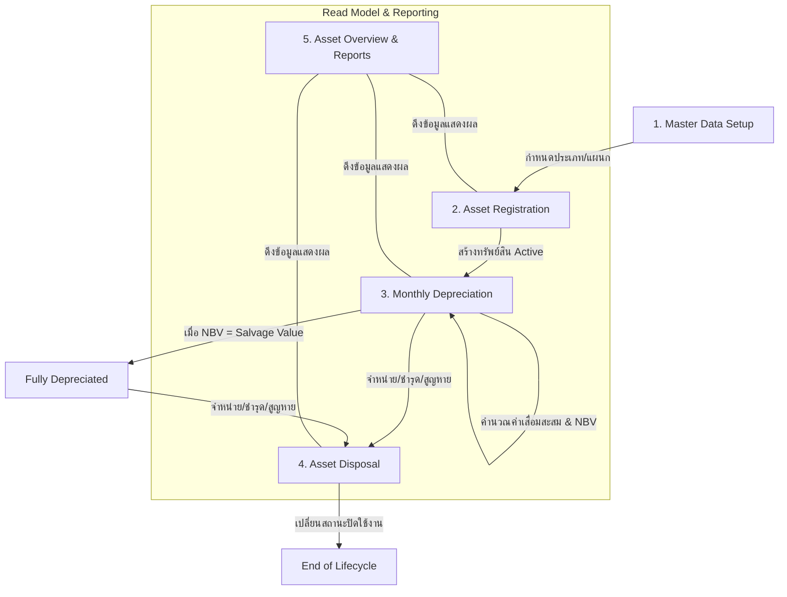

# Fixed Assets Workflow (กระบวนการทำงานระบบทรัพย์สินถาวร)

เอกสารนี้สรุปวงจรชีวิต (Lifecycle) และขั้นตอนการทำงานของระบบทรัพย์สินถาวร (Fixed Assets) ในระบบ NS Scrap ERP รวมถึงการตั้งค่าข้อมูลหลัก การขึ้นทะเบียน การคิดค่าเสื่อมราคา และการจำหน่ายทรัพย์สิน

---

## 1. Asset Lifecycle Overview (ภาพรวมวงจรชีวิตทรัพย์สิน)

วงจรชีวิตของทรัพย์สินในระบบประกอบด้วย 5 ขั้นตอนหลัก ดังนี้:

---

## 2. ขั้นตอนการดำเนินงานละเอียด (Detailed Workflow Steps)

### ขั้นที่ 1: การตั้งค่าข้อมูลหลัก (Master Data Setup)
ก่อนทำการขึ้นทะเบียนทรัพย์สิน ผู้ใช้งานต้องกำหนดข้อมูลพื้นฐานเพื่อจัดหมวดหมู่และระบุผู้รับผิดชอบ:
1. **หมวดหมู่ทรัพย์สิน (Asset Categories):** สำหรับระบุประเภทของทรัพย์สิน เช่น *เครื่องจักร (Equipment), ที่ดิน (Land), ยานพาหนะ (Vehicle), อาคาร (Building)* เพื่อใช้ในการจัดกลุ่มรายงานและกำหนดวิธีการบัญชี
2. **แผนก (Departments):** สำหรับระบุแผนกที่เป็นผู้ดูแลและครอบครองทรัพย์สิน เช่น *สำนักงาน (Office), โรงงาน (Factory), ฝ่ายขาย (Sales)* เพื่อให้สามารถติดตามตำแหน่งและความรับผิดชอบได้ถูกต้อง

### ขั้นที่ 2: การขึ้นทะเบียนทรัพย์สิน (Asset Registration)
* **เมนู:** `ข้อมูลหลัก` -> `ทรัพย์สิน` หรือ `บัญชีการเงิน` -> `ทะเบียนทรัพย์สิน`
* **รายละเอียด:** ผู้ใช้ทำการเพิ่มทรัพย์สินเข้าระบบโดยกำหนดฟิลด์ข้อมูลที่สำคัญ:
  - **ข้อมูลระบุตัวตน:** รหัสทรัพย์สิน (Asset Code - ต้องไม่ซ้ำ), ชื่อทรัพย์สิน (Asset Name)
  - **ข้อมูลการจัดกลุ่ม:** หมวดหมู่ทรัพย์สิน (Category), แผนก (Department)
  - **ข้อมูลทางการเงิน:** วันที่ซื้อ (Purchase Date), ราคาทุน (Original Cost), ภาษีมูลค่าเพิ่ม (VAT Amount), ราคาสุทธิ (Net Asset Cost), มูลค่าซาก (Salvage Value)
  - **การคำนวณค่าเสื่อม:** วิธีการคิดค่าเสื่อมราคา (Depreciation Method) เช่น *Straight Line (เส้นตรง)* และอายุการใช้งาน (Useful Life Months)
* **การบันทึกข้อมูล:** ข้อมูลจะถูกเก็บในตาราง `assets` โดยเริ่มต้นด้วยสถานะ `Active`

### ขั้นที่ 3: การประมวลผลค่าเสื่อมราคารายเดือน (Monthly Depreciation)
* **เมนู:** `บัญชีการเงิน` -> `ค่าเสื่อมราคา`
* **หลักการทำงาน:** ประมวลผลเป็นงวดรายเดือนและปี (Idempotent Period-based Run)
* **ขั้นตอนการทำงาน:**
  1. เลือกงวดเดือน/ปีที่ต้องการคำนวณ
  2. กดปุ่มเพื่อทำ **Preview** ระบบจะดึงรายการทรัพย์สินที่อยู่ในเกณฑ์คำนวณมาแสดงผลลัพธ์ล่วงหน้า
  3. กดปุ่มเพื่อทำ **Commit** ระบบจะบันทึกผลการคำนวณลงตาราง `depreciations` ด้วยสถานะ `posted`
  4. หากคำนวณแล้วมูลค่าสุทธิของทรัพย์สิน (Net Book Value: NBV) ลดลงเหลือเท่ากับมูลค่าซาก (Salvage Value) ระบบจะเปลี่ยนสถานะทรัพย์สินในตาราง `assets` เป็น `Fully Depreciated` โดยอัตโนมัติ
* **การแก้ไขข้อผิดพลาด (Reversal):** หากพบว่าการคิดค่าเสื่อมในงวดนั้นไม่ถูกต้อง ผู้ใช้สามารถสั่ง **Reverse** งวดนั้นได้ ระบบจะไม่ลบแถวข้อมูลออก (Non-destructive) แต่จะเปลี่ยนสถานะแถวใน `depreciations` เป็น `reversed` และล้างผลกระทบเพื่อให้สามารถคำนวณงวดนั้นใหม่ได้

### ขั้นที่ 4: การจำหน่ายและตัดบัญชีทรัพย์สิน (Asset Disposal)
* **เมนู:** `บัญชีการเงิน` -> `จำหน่ายทรัพย์สิน`
* **หลักการทำงาน:** การปิดวงจรการใช้งานของทรัพย์สินออกจากงบการเงิน
* **ขั้นตอนการทำงาน:**
  1. ผู้ใช้เลือกทรัพย์สินที่ยังใช้งานอยู่ (`Active` หรือ `Fully Depreciated`) ระบบจะแสดงมูลค่าสุทธิทางบัญชีล่าสุด (Net Book Value: NBV)
  2. ระบุประเภทการจำหน่าย (Disposal Type):
     - **Sale (ขาย):** ปรับสถานะทรัพย์สินเป็น `Sold`
     - **Lost (สูญหาย):** ปรับสถานะทรัพย์สินเป็น `Lost`
     - **Scrap (ชำรุด/เศษซาก), Write Off (ตัดจำหน่าย), Other (อื่นๆ):** ปรับสถานะทรัพย์สินเป็น `Disposed`
  3. ระบุราคากลาง/ราคาขาย (Selling Price), ลูกค้า (Customer - ตัวเลือก), เลขที่ใบเสร็จ (Receipt Ref - ตัวเลือก) และเหตุผล
  4. ระบบคำนวณกำไร/ขาดทุนจากการจำหน่ายทันที และบันทึกประวัติลงตาราง `asset_disposals`
* **การย้อนกลับรายการ (Reversal):** หากต้องการยกเลิกการจำหน่าย สามารถสั่ง **Reverse** รายการจำหน่ายนั้นได้ ระบบจะปรับสถานะของรายการจำหน่ายเป็น `reversed` และกู้คืนสถานะทรัพย์สินกลับมาเป็น `Active`

### ขั้นที่ 5: แดชบอร์ดและรายงานทรัพย์สิน (Asset Overview)
* **เมนู:** `บัญชีการเงิน` -> `ภาพรวมทรัพย์สิน`
* **รายละเอียด:** หน้าจอสำหรับเรียกดูข้อมูลและรายงานแบบ Read-only แสดงมูลค่าทรัพย์สินรวม, ค่าเสื่อมราคาสะสม, และมูลค่าสุทธิทางบัญชีล่าสุด (NBV) โดยกรองตามหมวดหมู่ แผนก หรือสาขาได้

---

## 3. สูตรคำนวณทางการเงิน (Financial Calculations)

การคำนวณค่าเสื่อมราคาและมูลค่าทรัพย์สินอ้างอิงสูตรมาตรฐาน ดังนี้:

$$\text{Depreciable Amount (มูลค่าที่คิดค่าเสื่อม)} = \text{Net Asset Cost (ราคาสุทธิ)} - \text{Salvage Value (มูลค่าซาก)}$$

$$\text{Monthly Depreciation (ค่าเสื่อมรายเดือน)} = \frac{\text{Depreciable Amount (มูลค่าที่คิดค่าเสื่อม)}}{\text{Useful Life Months (อายุการใช้งานเป็นเดือน)}}$$

$$\text{Accumulated Depreciation (ค่าเสื่อมสะสม)} = \sum (\text{Monthly Depreciation ของงวดที่เป็น active/posted})$$

$$\text{Net Book Value (มูลค่าสุทธิทางบัญชี: NBV)} = \max(\text{Salvage Value}, \text{Net Asset Cost} - \text{Accumulated Depreciation})$$

$$\text{Disposal Gain/Loss (กำไร/ขาดทุนจากการจำหน่าย)} = \text{Selling Price (ราคาขาย)} - \text{Net Book Value (NBV ณ วันจำหน่าย)}$$

---

## 4. กฎทางธุรกิจและเงื่อนไขการตรวจสอบ (Business & Validation Rules)

### 4.1 การขึ้นทะเบียนทรัพย์สิน
1. **รหัสทรัพย์สิน (Asset Code):** ต้องไม่ซ้ำในระบบ (Unique Constraint) ทั้งในการกรอกผ่านหน้าจอและการนำเข้าด้วยไฟล์ CSV/TSV
2. **ข้อมูลบังคับ (Required Fields):** รหัสทรัพย์สิน, ชื่อทรัพย์สิน, ราคาทุน, และราคาสุทธิ
3. **ความสัมพันธ์ทางการเงิน:**
   - ยอดภาษีมูลค่าเพิ่ม (`vatAmount`) ต้องไม่เกินราคาทุน (`originalCost`)
   - มูลค่าซาก (`salvageValue`) ต้องไม่เกินราคาสุทธิ (`netAssetCost`)
   - หากเลือกวิธีคิดค่าเสื่อมแบบ `Straight Line` อายุการใช้งาน (`usefulLifeMonths`) ต้องมีค่ามากกว่า 0

### 4.2 การคิดค่าเสื่อมราคา
1. **ความเหมาะสม (Eligibility):** ทรัพย์สินที่จะถูกคิดค่าเสื่อมในงวดนั้นได้ ต้องเป็นไปตามเงื่อนไขทั้งหมดดังนี้:
   - สถานะทรัพย์สินไม่ใช่ `Inactive`, `Sold`, `Disposed`, `Lost`, หรือ `Fully Depreciated`
   - วิธีการคิดค่าเสื่อมราคาไม่ใช่ `No Depreciation` หรือ `Manual`
   - อายุการใช้งาน (Useful Life) ต้องมากกว่า 0
   - งวดเดือน/ปี ดังกล่าวต้องยังไม่มีรายการค่าเสื่อมที่มีสถานะ `posted` สำหรับทรัพย์สินนั้น
2. **การรันซ้ำป้องกันข้อมูลซ้ำซ้อน (Idempotency):** ระบบไม่อนุญาตให้รันค่าเสื่อมซ้ำในงวดเดียวกัน หากต้องการรันใหม่ต้องทำรายการ Reverse งวดเดิมก่อนเสมอ

### 4.3 การจำหน่ายทรัพย์สิน
1. **การจำกัดการเลือก:** เลือกจำหน่ายได้เฉพาะทรัพย์สินที่ไม่อยู่ในสถานะ `Sold`, `Disposed`, `Lost`, หรือ `Inactive`
2. **ยอดเงินขาย:** ราคาขาย (`sellingPrice`) ต้องไม่เป็นค่าติดลบ (อนุญาตให้เป็น 0 ในกรณีตัดจำหน่ายแบบชำรุด/สูญหาย)

---

## 5. โครงสร้างตารางในระบบฐานข้อมูล (Database Structure)

ข้อมูลของระบบทรัพย์สินถูกจัดเก็บผ่าน 5 ตารางหลัก ดังนี้:

| ชื่อตาราง | คำอธิบาย | คีย์หลัก / คีย์นอก |
|---|---|---|
| `assets` | ตารางเก็บข้อมูลหลักทรัพย์สิน (Asset Master) | `id` (PK), `category_id` (FK -> asset_categories), `department_id` (FK -> departments) |
| `depreciations` | บันทึกประวัติการคิดค่าเสื่อมราคารายเดือน | `id` (PK), `asset_id` (FK -> assets) |
| `asset_disposals` | บันทึกประวัติการจำหน่ายทรัพย์สิน | `id` (PK), `asset_id` (FK -> assets) |
| `asset_categories` | ตารางข้อมูลหลัก: หมวดหมู่ทรัพย์สิน | `id` (PK) |
| `departments` | ตารางข้อมูลหลัก: แผนก/ฝ่าย | `id` (PK) |

---

## 6. แนวทางปฏิบัติด้านอินเตอร์เฟส (UI Design Guidelines - AcexPOS Style)
เพื่อความสอดคล้องกับมาตรฐานความสวยงามระดับพรีเมียมของระบบ:
1. **ไม่มีกรอบขอบดำเข้ม (No Black Borders):** หลีกเลี่ยงการใช้เส้นตารางหรือเส้นกรอบอินพุตสีดำเข้ม ให้ใช้สีพาสเทลนุ่มนวล เช่น `border-slate-100` หรือ `border-slate-200/60`
2. **ลบ Focus Outline:** ปุ่มหรือกล่อง Dropdown ต่างๆ จะต้องไม่แสดงกรอบสีดำตอนคลิก/โฟกัส โดยใช้คลาส `outline-none` เสมอ
3. **ช่องกรอกข้อมูลประเภทพิมพ์ค้นหา (SearchCombobox):** ช่องเลือกหมวดหมู่ทรัพย์สินและแผนกในหน้าจอเพิ่ม/แก้ไขทรัพย์สิน จะใช้รูปแบบ Combobox พิมพ์เพื่อค้นหาข้อมูลสดจากตาราง Master Data โดยตรงเพื่อความรวดเร็วและป้องกันข้อมูลผิดพลาด

---

## 7. สรุปความต้องการและการออกแบบทางธุรกิจ (Business Workflow Summary - What is What & Why)

ในการทดสอบ UAT และการใช้งานระบบทรัพย์สินถาวร มีการกำหนดข้อตกลงและการออกแบบเชิงธุรกิจดังนี้:

### 7.1 ทะเบียนทรัพย์สิน (Asset Register)
* **อะไรคืออะไร (What is what):**
  * **ทรัพย์สิน (Asset)**: คือสินทรัพย์ที่มีตัวตนเพื่อใช้ในการดำเนินงานของบริษัท (ต่างจากสินค้าสต๊อกซื้อมาขายไป) โดยบันทึกราคาทุนสุทธิ (`netAssetCost`) และมูลค่าซาก (`salvageValue`) ซึ่งเป็นมูลค่าสุดท้ายทางบัญชีที่จะเหลืออยู่หลังคิดค่าเสื่อมเสร็จสิ้น
  * **หมวดหมู่ (Category) และแผนก (Department)**: เป็นกลุ่มระบุโครงสร้างทางบัญชีและการระบุตำแหน่งผู้ดูแลสินทรัพย์เพื่อการตรวจสอบ
* **ทำไมต้องเป็นแบบนี้ (Why it has to be like this):**
  * **ห้ามลบทำลายประวัติ (No Destructive Delete)**: ตามมาตรฐานการบัญชี สินทรัพย์เมื่อขึ้นระบบแล้วห้ามลบทิ้งเพราะจะกระทบต่อการกระทบยอดบัญชีแยกประเภท หากสิ้นสุดการใช้งานต้องใช้การปรับสถานะเป็น `Inactive` หรือบันทึกจำหน่ายเท่านั้น
  * **การควบคุมฟิลด์ผ่าน SearchCombobox**: ป้องกันผู้ใช้พิมพ์ชื่อแผนกหรือหมวดหมู่เองแบบอิสระ ซึ่งจะส่งผลเสียต่อการออกรายงานแยกตามกลุ่ม จึงใช้ระบบ SearchCombobox เพื่อดึงข้อมูลเฉพาะรายการ Master Data ที่ได้รับการอนุมัติแล้วเท่านั้น

### 7.2 ค่าเสื่อมราคาประจำเดือน (Monthly Depreciation)
* **อะไรคืออะไร (What is what):**
  * **ค่าเสื่อมราคารายเดือน (Monthly Depreciation Amount)**: กระจายยอดสุทธิโดยใช้สูตรการคำนวณแบบเส้นตรง `(Net Asset Cost - Salvage Value) / Useful Life Months`
  * **ประวัติการรันและ NBV**: บันทึกแยกรายงวดในตาราง `depreciations` ในสถานะ `posted` และทำการหักลบมูลค่าสุทธิทางบัญชีล่าสุด (Net Book Value - NBV) หากมูลค่าเหลือเท่ากับ Salvage Value แล้ว ระบบจะเปลี่ยนสถานะเป็น `Fully Depreciated` โดยอัตโนมัติ
* **ทำไมต้องเป็นแบบนี้ (Why it has to be like this):**
  * **ป้องกันยอดซ้ำซ้อน (Idempotence)**: ระบบล็อกไม่ให้กด Commit ยอดในงวดเดียวกันซ้ำ หากต้องการรันใหม่เนื่องจากข้อมูลผิดพลาด ต้องทำรายการยกเลิกงวดเก่า (**Reverse**) ก่อนเสมอเพื่อความปลอดภัยของข้อมูลการเงิน
  * **การยกเลิกงวดแบบรักษารอยประวัติ (Audit Trail)**: การทำ Reverse จะไม่ลบเรคคอร์ดออกจากฐานข้อมูลจริง แต่จะเปลี่ยนสถานะประวัติเดิมเป็น `reversed` พร้อมใส่เหตุผลในการแก้ไข เพื่อความสะดวกในการตรวจสอบบัญชีย้อนหลัง (Auditable Trail)
  * **ระบบล็อกลำดับเวลาย้อนกลับ (Sequence Lock Check)**: ในการยกเลิกค่าเสื่อมราคา (Reverse Depreciation) ระบบจะป้องกันไม่ให้ผู้ใช้กลับรายการงวดบัญชีเก่าที่อยู่ตรงกลางหรือข้ามงวดได้ โดยจะต้องทำการยกเลิกย้อนหลังจากงวดล่าสุดไล่กลับไปตามลำดับเวลาเท่านั้น (Reverse-Chronological Order) เพื่อป้องกันไม่ให้เกิดช่องว่างความไม่ต่อเนื่องสะสมในยอดค่าเสื่อมสะสม (Accumulated Depreciation Gap)
  * **การคืนสถานะทรัพย์สินอัตโนมัติ (Automatic Status Restoration)**: เมื่อทำการกลับรายการค่าเสื่อมราคางวดที่ทำให้ทรัพย์สินมีค่าเสื่อมครบแล้ว (งวดที่เปลี่ยนสถานะเป็น `Fully Depreciated`) ระบบจะทำการปรับสถานะทรัพย์สินกลับไปเป็น `Active` ให้โดยอัตโนมัติ เพื่อให้สามารถคิดค่าเสื่อมราคาต่อได้หรือคำนวณใหม่ได้อย่างถูกต้อง

### 7.3 การจำหน่ายทรัพย์สิน (Asset Disposal)
* **อะไรคืออะไร (What is what):**
  * **การจำหน่าย (Disposal)**: คือการตัดบัญชีทรัพย์สินออกจากระบบเมื่อมีกรณีขาย (Sold), ชำรุด (Scrap), หรือสูญหาย (Lost) โดยระบบจะคำนวณกำไร/ขาดทุนให้ทันทีผ่าน `Selling Price - NBV`
* **ทำไมต้องเป็นแบบนี้ (Why it has to be like this):**
  * **หยุดคิดค่าเสื่อมราคาโดยอัตโนมัติ**: เมื่อทำรายการจำหน่ายเสร็จสิ้น ระบบจะเปลี่ยนสถานะของสินทรัพย์นั้นทันที เพื่อไม่ให้ถูกนำมาคำนวณค่าเสื่อมราคารายเดือนซ้ำในงวดเดือนถัดๆ ไป
  * **การย้อนกลับรายการจำหน่าย (Reverse Disposal)**: ในกรณีที่ผู้ใช้ระบุรายการจำหน่ายผิดพลาด สามารถกด Reverse เพื่อยกเลิกรายการจำหน่ายและดึงสถานะกลับมาเป็น `Active` ได้ โดยระบบยังคงบันทึกรายการจำหน่ายเก่านั้นเป็น `reversed` ไว้เป็น Audit Trail เสมอ
