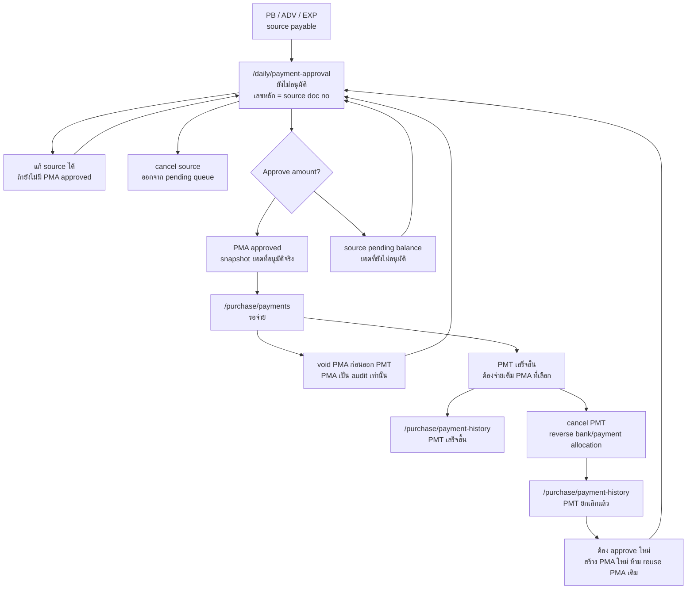
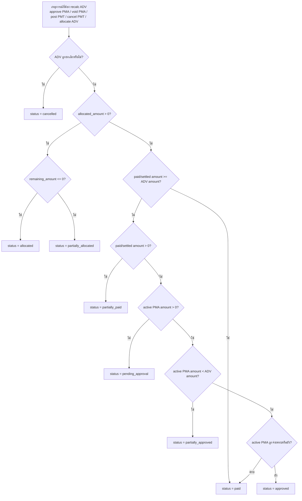

# Payment Flow / Flow จ่ายเงิน

เอกสารนี้เป็น canonical flow สำหรับ `อนุมัติจ่ายเงิน`, `รอจ่าย`, `ทำจ่าย`, `จ่ายเงินล่วงหน้า / มัดจำ`, และ `ประวัติการจ่ายเงิน` ฝั่ง Supplier

เอกสารที่เกี่ยวข้อง:

- [[Purchase Flow]] สำหรับต้นน้ำฝั่งซื้อ เช่น `PO Buy`, `WTI`, `Purchase Bill`, และ allocation มัดจำเข้าบิล
- [[Purchase Flow Status Matrix]] สำหรับสถานะเอกสารราย step ของ `POB`, `WTI`, `ADV`, `PB`, `PMA`, และ `PMT`
- [[Supplier Advance Payment Flow]] สำหรับ source document `ADV`, การจ่ายเงินล่วงหน้า Supplier, และการ allocate ADV เข้าบิลรับซื้อ
- [[Sales Flow]] สำหรับฝั่งรับเงิน/ลูกค้า

## ขอบเขตของเอกสารนี้

flow นี้ต้องรองรับ source document อย่างน้อย:

- `บิลรับซื้อ`
- `จ่ายเงินล่วงหน้า / มัดจำ`
- `ค่าใช้จ่าย`

queue กลางของงานนี้ใน target system ต้องใช้ชื่อ `อนุมัติจ่ายเงิน`

## จุดรับช่วงจากเอกสารต้นทาง

Payment Flow เริ่มเมื่อเอกสารต้นทางคำนวณยอดค้างจ่ายแล้วและส่งเข้ามาเป็น source payable:

| Source | เอกสารต้นทาง | เงื่อนไขเข้า Payment Flow | เจ้าของก่อน handoff | เจ้าของหลัง handoff |
|---|---|---|---|---|
| `PB` | [[Purchase Flow]] | `PB` saved, ไม่ถูกยกเลิก, และ `payable_balance > 0` | Purchase Flow | Payment Flow |
| `ADV` | [[Supplier Advance Payment Flow]] | บันทึก ADV แล้วต้องจ่ายจริงก่อนนำไป allocate เข้าบิล | Advance/Purchase side | Payment Flow |
| `EXP` | Expense flow | ค่าใช้จ่ายบันทึกแล้วและต้องจ่าย Supplier/ผู้รับเงิน | Expense flow | Payment Flow |

กติกาข้าม flow:

- Purchase Flow จบที่ `PB/payable handoff`; รายละเอียด `approve/split -> PMA -> PMT -> payment history` อยู่ในเอกสารนี้
- ถ้า `PB` ถูกแก้ก่อนมี payment cycle active, pending queue ต้องอ่าน source ปัจจุบัน
- ถ้า `PB` ถูกยกเลิกก่อนมี payment cycle active, source นั้นต้องหายจาก pending queue
- ถ้ามี `PMA approved` หรือ `PMT active` แล้ว source document ต้อง lock field ที่กระทบยอด คู่ค้า สาขา ภาษี ส่วนลด และ allocation
- ถ้า void PMA หรือ cancel PMT แล้วต้องกลับไปจ่ายใหม่ ต้องกลับไปอ่าน source ปัจจุบันและสร้าง `PMA` ใหม่ ห้าม reuse PMA เดิม

## เอกสารหลัก

| เอกสาร | ใช้ทำอะไร | เลขเอกสาร |
|---|---|---|
| `PB / ADV / EXP` | source document ที่ก่อให้เกิดยอดค้างจ่าย | ตามเลขเอกสารของ source |
| `PMA` | approval snapshot ของยอดที่อนุมัติจริง | `PMA{branchCode}{YYMM}-NNNN` |
| `PMT` | payment snapshot / ใบจ่ายเงินจริง | `PMT{branchCode}{YYMM}-NNNN` |

กติกา:

- `ยังไม่อนุมัติ` เป็น queue จาก source document โดยตรง ยังไม่ใช่ `PMA`
- `PMA` เกิดตอนกดอนุมัติเท่านั้น และเก็บเฉพาะยอดที่อนุมัติจริง
- source document 1 ใบสามารถเกิด `PMA` ได้หลายใบหรือหลาย approval item ตามการ split ยอด
- ถ้าอนุมัติแบบ split แต่ละ split ต้องได้เลข PMA running ใหม่ของตัวเอง ห้ามแสดงหรือสร้างเลขต่อท้ายแบบ `PMA.../1`, `PMA.../2`
- ยอด source ที่ยังไม่ถูกอนุมัติยังอยู่ใน queue `ยังไม่อนุมัติ` ต่อ
- เมื่อมี `PMA approved` อย่างน้อย 1 รายการ source document ต้อง lock field ที่กระทบยอด คู่ค้า สาขา ภาษี ส่วนลด และ allocation
- `PMT` ต้องจ่ายเต็มตาม `PMA` ที่เลือก ห้าม partial payment ที่ชั้น `PMT`
- ถ้าต้องจ่ายบางส่วน ให้กำหนดยอดบางส่วนตั้งแต่ตอนอนุมัติเป็น `PMA` ยอดย่อย
- เลข `BST` ที่เกิดจาก `PMT` ต้องไม่ถูกนำกลับมาใช้ซ้ำหลัง cancel แม้ runtime จะลบแถว `bank_statement` จริงแล้ว เพราะ `payment_account_splits` เก็บ split history แบบ reversed เพื่อ audit trail
- `payment_account_splits.split_key` ของ `PMT` ต้องผูกกับทั้งเลข `PMT` และเลข `BST` เพื่อไม่ให้ชนกับ split history เดิมเมื่อมีการยกเลิกแล้วทำจ่ายใหม่

## Lifecycle ของรายการจ่าย

รายการจ่ายต้องถูกมองเป็น lifecycle เดียว แต่ต้องแยกให้ชัดระหว่าง `source document`, `PMA`, และ `PMT`

| Stage | เอกสารหลัก | หน้า | ความหมาย |
|---|---|---|---|
| `ยังไม่อนุมัติ` | `PB / ADV / EXP` | `/daily/payment-approval` | source ยังมียอดค้างที่ยังไม่ถูกอนุมัติ |
| `อนุมัติแล้ว` | `PMA` | `/daily/payment-approval` | snapshot ของยอดที่อนุมัติแล้ว |
| `รอจ่าย` | `PMA` | `/purchase/payments` | PMA approved ที่ยังไม่ได้ออก PMT |
| `เสร็จสิ้น` | `PMT` | `/purchase/payment-history` | จ่ายจริงแล้ว |
| `ยกเลิกแล้ว` | `PMT` | `/purchase/payment-history` | payment voucher ถูกยกเลิกและต้องเริ่ม approval ใหม่สำหรับยอดที่ reverse |

## Queue และหน้าจอ

| หน้า | หน้าที่ | ลักษณะข้อมูล |
|---|---|---|
| `/daily/payment-approval` | queue `อนุมัติจ่ายเงิน` | pending source candidates + approved PMA snapshots |
| `/purchase/payments` | queue `รอจ่าย` | approved PMA items ที่ต้องออก PMT |
| `/purchase/payment-history` | ประวัติการจ่ายเงิน | PMT success/cancelled snapshots |

กติกา:

- `/daily/payment-approval`
  - แท็บ `ยังไม่อนุมัติ` แสดง `PB / ADV / EXP` เป็นเลขเอกสารหลัก
  - แท็บ `อนุมัติแล้ว` แสดง `PMA` เป็นเลขเอกสารหลัก
  - แท็บ/filter `ยกเลิกแล้ว` แสดง `PMA voided` เป็น snapshot read-only
  - แท็บ `อนุมัติแล้ว` ต้องมีคอลัมน์ `เอกสารอ้างอิง` สำหรับ `PB / ADV / EXP`
  - pending rows ต้องคำนวณยอดจาก source ปัจจุบัน โดยหักยอดที่ถูกอนุมัติหรือจ่ายไปแล้ว และไม่หัก `PMA voided`
  - source ที่ถูก cancel ก่อนอนุมัติต้องหายจาก pending queue
- `/purchase/payments`
  - อ่านเฉพาะ `PMA approved` ที่ยังไม่ถูกออก `PMT`
  - เลือกหลาย `PMA` ของผู้รับเงินเดียวกันมาจ่ายใน `PMT` เดียวได้
  - PMT ต้องจ่ายเต็มทุก PMA ที่เลือก
  - PMT modal ไม่ให้ผู้ใช้เลือก `วิธีจ่าย` ซ้ำเอง; `method` ของ PMT ต้อง derive จาก `destination_payment_method_snapshot` ของ PMA ที่เลือก
  - PMA ที่เลือกใน PMT เดียวกันต้องมีผู้รับเงินเดียวกันและ `destination_payment_method_snapshot` เดียวกัน
  - section `รายการจ่าย` ต้องแสดง PMA/source/ผู้รับเงิน พร้อม `ช่องทางรับเงิน` และ `บัญชีรับเงิน` ของ PMA ในบรรทัดข้อมูลเอกสารก่อน แล้วค่อยแสดงช่องยอดตั้งแต่ `ค้าง`, `จ่าย`, `WHT`, `Discount`, และ `Bank Fee` ในบรรทัดถัดไป
- `/purchase/payment-history`
  - read-only
  - แสดง `PMT` ที่ `เสร็จสิ้น` และ `ยกเลิกแล้ว`
  - downstream accounting/report/bank posting ใช้เฉพาะ `เสร็จสิ้น`

## Split Approval Model

approval ต้องไม่ยึด `1 source = 1 PMA` อย่างเดียวอีกต่อไป

ตัวอย่าง:

- `PB001` มียอดค้าง 1,000
- ผู้อนุมัติอนุมัติรอบแรกเป็น 2 รายการ:
  - `PMA001` = 300
  - `PMA002` = 300
- ยอดที่เหลือ 400 ยังเป็น pending candidate ของ `PB001`

ผลลัพธ์:

- `/daily/payment-approval` แท็บ `อนุมัติแล้ว` เห็น `PMA001` และ `PMA002`
- `/daily/payment-approval` แท็บ `ยังไม่อนุมัติ` ยังเห็น `PB001` ด้วยยอดคงเหลือ 400
- `/purchase/payments` เห็น `PMA001` และ `PMA002` เป็นรายการรอจ่าย
- `PB001` ถูก lock field การเงินทั้งใบตั้งแต่มี PMA approved อย่างน้อย 1 รายการ

ขั้นต่ำของ snapshot ต่อ PMA:

- `source_type`
- `source_id`
- `source_doc_no_snapshot`
- `party_id`
- `party_name_snapshot`
- `approved_amount`
- `destination_payment_method_snapshot`
- `destination_bank_account_id_snapshot`
- `destination_bank_name_snapshot`
- `destination_account_no_snapshot`
- `approved_at`
- `approved_by`

## กติกา Lock

### ก่อนมี PMA approved

- source document ยังแก้ไขได้
- source document ยังยกเลิกได้
- ถ้า source ถูกยกเลิก รายการ pending ต้องหายจาก `/daily/payment-approval`
- การแก้ source ต้องสะท้อนใน pending queue เพราะ pending อ่านจาก source ปัจจุบัน

### หลังมี PMA approved อย่างน้อย 1 รายการ

- source document ต้อง lock field ที่กระทบยอดและ accounting meaning ทั้งใบ
- ห้ามแก้ supplier, branch, date ที่กระทบบัญชี, line item, จำนวน/น้ำหนัก, ราคา, VAT/WHT, ส่วนลด, advance allocation และ payable amount
- ยังแก้ได้เฉพาะ note, attachment, comment หรือ metadata ที่ไม่กระทบยอดและมี audit trail
- ยอด source ที่ยังไม่ถูกอนุมัติยังสามารถถูกอนุมัติเพิ่มเป็น PMA ใหม่ได้
- ถ้าต้องแก้ source financial fields ต้องยกเลิก approval/payment cycle ที่ active อยู่ด้วย action ที่ trace ได้ก่อน

## ทำจ่าย

`ทำจ่าย` ใน `/purchase/payments` ทำงานระดับ PMA item

ผลที่ต้องเกิด:

1. ผู้ใช้เลือก `PMA approved` ของผู้รับเงินเดียวกัน
2. ระบบ derive `PMT.method` จาก `destination_payment_method_snapshot` ของ PMA ที่เลือก ไม่ใช่จาก manual field ใน PMT modal
3. ระบบสร้าง `PMT`
4. `PMT` ต้อง settle เต็มยอดของทุก PMA ที่เลือก
5. `payments` / payment allocation ต้องชี้กลับ PMA ที่ถูกจ่าย
6. PMA ที่ถูกจ่ายต้องเปลี่ยนเป็น consumed/paid ตาม implementation status
7. history ต้องเห็น `PMT` เป็น `เสร็จสิ้น`
8. source document ต้อง recalc `paid_amount`, `payable_balance`, และ payment status ใน transaction เดียวกัน

กติกายอด:

- PMT total = ผลรวมยอด `approved_amount` ของ PMA ที่เลือก
- ถ้า PMT ใช้หลายบัญชีจ่าย ยอด allocation ของแต่ละบัญชีรวมกันต้องเท่ากับ PMT total
- ถ้า PMA หนึ่งใบถูกจ่ายด้วยหลายบัญชี ยอด allocation รวมของ PMA นั้นต้องเท่ากับ `approved_amount`
- ห้ามบันทึก PMT ที่จ่ายต่ำกว่ายอด PMA ที่เลือก
- `cash amount + withholding tax + discount` ต้องไม่เกินและต้อง reconcile กับ `approved_amount`
- `method` ของ PMT ต้องตรงกับ approved payment method ของ PMA ที่เลือกทุกใบ; ถ้า PMA มีช่องทางรับเงินต่างกันต้องแยก PMT

Implementation contract ขั้นต่ำ:

- `payments.payment_approval_id` หรือ payment allocation table ต้องชี้กลับ `PMA/payment_approvals` ที่ถูกจ่าย
- `payment_approvals.status` เปลี่ยนเป็น `paid` หรือ consumed status ที่เทียบเท่าเมื่อยอด approval ถูกใช้ครบ
- สำหรับ source `PB`, `purchase_bills.paid_amount`, `purchase_bills.payable_balance`, และสถานะการจ่ายต้องถูก recalc ใน transaction เดียวกับ PMT
- สำหรับ source `ADV`, `supplier_advance_payments.status` ต้องถูก recalc ใน transaction เดียวกับ PMT
- สำหรับ source `EXP`, `expenses.status`, `expenses.paid_status`, และ `expenses.paid_at` ต้องถูก recalc ใน transaction เดียวกับ PMT
- bank statement/payment ledger ต้องเกิดเฉพาะเมื่อ PMT สำเร็จ และต้อง reverse ได้เมื่อ cancel PMT

## Void PMA ก่อนออก PMT

ถ้า approval ถูกอนุมัติแล้วแต่ยังไม่เกิด PMT:

- void ได้จาก queue `รอจ่าย` หรือ action ที่ Payment Flow กำหนด
- `PMA` เดิมต้องออกจาก queue `approved` และอยู่เป็น audit/history
- ยอดของ source document ต้องกลับไปคำนวณเป็น pending candidate
- ถ้าจะจ่ายใหม่ ต้องอนุมัติใหม่และสร้าง `PMA` ใหม่
- history/audit ต้องเห็น snapshot PMA รายการนั้นในสถานะ `voided` หรือสถานะเทียบเท่าตาม schema
- `/daily/payment-approval` ต้องยังเห็น `PMA voided` ใน filter `ยกเลิกแล้ว` แบบ read-only เพื่อให้ตรวจสอบว่า approval item ถูกยกเลิกจาก queue แล้ว

## ยกเลิก PMT แล้วเริ่มใหม่

เมื่อ `PMT` ที่จ่ายเงินจริงแล้วถูกยกเลิก:

1. `PMT` เดิมต้องอยู่ใน history เป็น `ยกเลิกแล้ว`
2. ต้อง reverse ผลกระทบเงินออก เช่น bank statement และ payment allocation
3. PMA ที่ถูกใช้ใน PMT นั้นถือว่าจบ cycle เดิมแล้ว ห้ามนำกลับมาใช้จ่ายใหม่
4. ยอดที่ถูก reverse ต้องกลับไปคำนวณเป็น pending candidate ของ source document เดิม
5. ถ้าจะจ่ายใหม่ ต้องอนุมัติใหม่จาก source ปัจจุบันเพื่อสร้าง `PMA` ใหม่ แล้วค่อยออก `PMT` ใหม่

เหตุผล: การยกเลิก PMT คือการเริ่มรอบ approval/payment ใหม่สำหรับยอดนั้น ไม่ใช่การแก้ voucher เดิมหรือ reuse PMA เดิม

## จ่ายเงินล่วงหน้า / มัดจำ

advance payment เป็น source document ของ flow นี้เช่นกัน

ขั้นต่ำของข้อมูล:

- `Supplier`
- `สาขา`
- `วันที่จ่าย`
- `ยอดจ่ายล่วงหน้า`
- large-scale source fields ตามที่กำหนดใน [[Purchase Flow]]

หลังบันทึก:

1. advance payment เข้า queue `อนุมัติจ่ายเงิน` เป็น source pending candidate
2. ผู้อนุมัติ split ยอดได้เช่นเดียวกับ source อื่น
3. ยอดที่อนุมัติจริงจึงเกิด `PMA`
4. จ่ายจริงเต็ม PMA แล้วจึงเกิด `PMT`

หมายเหตุล่าสุด: หน้า ADV ไม่รับ `วิธีจ่าย` และ `บัญชีที่จ่าย` ตอนสร้าง source document แล้ว ข้อมูลช่องทางจ่ายจริงให้กำหนดในขั้น `อนุมัติจ่ายเงิน` / `ทำจ่าย`

### สถานะ runtime ของ ADV

สถานะปัจจุบันของ `supplier_advance_payments.status` ต้องมีเฉพาะ:

- `pending_approval` = ยังไม่อนุมัติ
- `partially_approved` = อนุมัติแล้วบางส่วน
- `approved` = อนุมัติแล้วเต็มยอด แต่ยังจ่ายไม่ครบ
- `partially_paid` = จ่าย ADV แล้วบางส่วน แต่ยังไม่ได้ allocate
- `paid` = จ่าย ADV ครบยอดแล้ว แต่ยังไม่ได้ allocate ครบ
- `partially_allocated` = ใช้หักบิลบางส่วน
- `allocated` = ใช้หักบิลแล้วครบยอด
- `cancelled` = ยกเลิก

`partially_approved` เกิดเมื่อ active PMA (`approved` หรือ `paid`) รวมกันยังน้อยกว่ายอด ADV ทั้งใบและยังเหลือยอด pending ให้ approve ต่อ

การ void PMA หรือ cancel PMT ต้อง recalc ADV จาก active PMA/PMT/allocation ใหม่ใน transaction เดียวกัน:

- ถ้าไม่มี active PMA เหลือ -> กลับเป็น `pending_approval`
- ถ้ายังมี active PMA บางส่วน -> เป็น `partially_approved`
- ถ้า PMA active ครบยอดแต่ยังจ่ายไม่ครบ -> เป็น `approved`
- ถ้าจ่ายบางส่วน -> เป็น `partially_paid` เว้นแต่มี allocation ทำให้เป็น `partially_allocated` หรือ `allocated`
- ถ้าจ่ายครบแล้ว -> เป็น `paid` เว้นแต่มี allocation ทำให้เป็น `partially_allocated` หรือ `allocated`
- เมื่อ PB ถูกยกเลิกหรือ supplier swap void PB เดิม ต้อง release ADV allocation แล้ว recalc กลับเป็น `paid` หรือ `partially_paid` ตามยอด PMT ที่จ่ายจริง

`refunding` และ `refunded` ไม่ใช่สถานะ runtime/current status ของ ADV แล้ว และต้องไม่แสดงใน filter หน้า `/purchase/advance-payments`

## ค่าใช้จ่าย / EXP source

`/daily/expense` เป็น source document ฝั่งค่าใช้จ่ายของ Payment Flow ไม่ใช่หน้าทำจ่ายเงินจริง

กติกา source:

- สร้างเอกสารเป็น `EXP` แล้วเข้าสถานะ `pending_approval` (`ยังไม่อนุมัติ`)
- modal สร้าง/แก้ไขต้องไม่ให้ผู้ใช้กรอก `เลขที่เอกสาร`; เลข `EXP{branchCode}{YYMM}-NNNN` generate server-side ตอน save
- ผู้ใช้เลือก `วันที่จ่าย` เองใน modal และค่า `expenses.date` ต้องมาจาก `expenseFormSchema.date`
- year/month ของเลข `EXP` ใหม่อิง `วันที่จ่าย` ที่เลือก แต่ตัวเลข running ยังเป็น server-owned
- modal สร้างไม่แสดงหรือแก้ `สถานะเอกสาร`; สถานะเปลี่ยนผ่าน approval/payment lifecycle เท่านั้น
- `บัญชีที่ใช้ทำจ่าย` ไม่อยู่ใน modal ค่าใช้จ่าย เพราะบัญชี/ช่องทางจ่ายจริงเป็นเรื่องของ `อนุมัติจ่ายเงิน` และ `ทำจ่าย`
- `ผู้รับเงิน` ใน current flow ใช้ suggestion จาก active Supplier master และค่าที่บันทึกยังอยู่ใน `expenses.payee`

กติกา line item:

- section `รายการค่าใช้จ่าย` รองรับหลายบรรทัดแบบ legacy
- แต่ละบรรทัดมี `หมวดค่าใช้จ่าย`, รายละเอียด, จำนวนเงิน, VAT, WHT %, และ WHT amount
- `หมวดค่าใช้จ่าย` ใช้ searchable combobox ค้นได้จาก code/name/type ของ active expense category
- รายละเอียดบรรทัดเก็บใน `expenses.items`
- header totals ต้องเขียน `amount`, `vat`, `wht`, และ `net_amount` เพื่อให้ approval/payment/report ใช้ต่อได้

กติกา list/detail:

- ตาราง `/daily/expense` ต้องแสดงคอลัมน์ `วันที่จ่าย`
- คลิกแถวรายการค่าใช้จ่ายต้องเปิด detail route `/daily/expense/{docNo}`
- action ในแถว เช่น `แก้ไข` และ `ยกเลิก` ต้องไม่ trigger row navigation
- detail page เป็น read surface ของ source document และต้องเรียกวันที่เดียวกันว่า `วันที่จ่าย`

กติกา status และ lock:

- `expenses.status` ใช้ `pending_approval`, `approved`, `paid`, `cancelled`
- `paid_status` เป็น compatibility mirror เท่านั้น ไม่ใช่ business status หลัก
- แก้ไข/ยกเลิกได้เฉพาะ `pending_approval`
- เมื่อมี active `PMA approved` หรือ payment cycle active แล้ว EXP source ต้อง lock field ที่กระทบยอด ผู้รับเงิน ภาษี และรายการค่าใช้จ่าย
- PMT save/cancel ต้อง recalc `expenses.status`, `expenses.paid_status`, และ `expenses.paid_at` ใน transaction เดียวกับ payment allocation/bank reversal

## คืนเงินมัดจำ / คืนเงินล่วงหน้า

ถ้า `advance > final bill amount`

- ห้าม carry forward เป็นเครดิต supplier อัตโนมัติในระบบตอนนี้
- ต้องเข้าฝั่ง `คืนเงินมัดจำ / คืนเงินล่วงหน้า` เป็น flow แยกในอนาคต
- เป็น flow ฝั่ง `Supplier`
- ไม่ reuse เมนูคืนเงินฝั่ง `Customer`
- flow นี้ยังไม่ใช่สถานะของตาราง `supplier_advance_payments` และยังไม่อยู่ใน filter ปัจจุบันของหน้า ADV

## Target History / Table Design

Payment Flow ใช้แนวทางใน [[Document History Table Design]]: แยก current state, status log, และ fact table เฉพาะตามเอกสาร ไม่รวมทุก event เข้า table กลาง

| ชั้นข้อมูล | Target table | หน้าที่ |
|---|---|---|
| pending source queue | ไม่มี table PMA pending | อ่านจาก `PB / ADV / EXP` current state และหัก active/consumed PMA |
| PMA current snapshot | `payment_approvals` | เก็บยอดอนุมัติจริงและ source snapshot |
| PMA history | `payment_approval_status_logs` | เก็บ approved, voided, paid/consumed, reversed-by-payment-cancel |
| PMT current voucher | `payments` | เก็บ voucher จ่ายเงินจริง |
| PMT history | `payment_status_logs` | เก็บ created, posted, cancelled, bank-posted, bank-reversed |
| PMT -> PMA fact | `payment_allocations` | PMT หนึ่งใบจ่าย PMA ไหน ยอดเท่าไหร่ |
| PMT account split | `payment_account_splits` | PMT หนึ่งใบจ่ายออกจากบัญชีไหนบ้าง |

กติกาสำคัญ:

- `ยังไม่อนุมัติ` ไม่ใช่ `PMA` และไม่ควรสร้าง `payment_approvals` row
- `PMA` เกิดเมื่อ approve เท่านั้น และต้องมี `payment_approval_status_logs`
- `PMT` ต้องจ่ายเต็ม PMA ที่เลือก แต่ PMT หนึ่งใบเลือกหลาย PMA ของผู้รับเงินเดียวกันได้
- ถ้า PMT ใช้หลายบัญชี ให้เก็บใน `payment_account_splits` ไม่ยัดใน JSON เพื่อเป็น source of truth
- ถ้า PMT ถูก cancel ให้ reverse ผ่าน `payment_status_logs`, `payment_allocations`, และ bank statement/reversal ใน transaction เดียว
- ห้าม reuse PMA เดิมหลัง cancel PMT; ยอดที่ reverse ต้องกลับไป pending source และต้อง approve ใหม่เพื่อสร้าง PMA ใหม่

## State Matrix ย่อ

| สถานะ | เอกสารหลัก | queue/page | source edit | history |
|---|---|---|---|---|
| `ยังไม่อนุมัติ` | `PB / ADV / EXP` | `/daily/payment-approval` | ได้ ถ้ายังไม่มี PMA approved ของ source นั้น | ไม่อยู่ใน history |
| `อนุมัติแล้ว` | `PMA` | `/daily/payment-approval` | lock financial fields | approval snapshot |
| `รอจ่าย` | `PMA` | `/purchase/payments` | lock financial fields | ไม่อยู่ใน payment history |
| `เสร็จสิ้น` | `PMT` | `/purchase/payment-history` | lock | อยู่ |
| `ยกเลิกแล้ว` | `PMT` | `/purchase/payment-history` | ยอด reverse กลับไป source pending candidate | อยู่ |

## Use Case Status Examples

| Use case | Step | Source status | PMA status | PMT status | หน้า/ผลลัพธ์ |
|---|---|---|---|---|---|
| approve partial | `PB001 = 1,000` ถูกสร้าง | `ยังไม่อนุมัติ 1,000` | ไม่มี | ไม่มี | `/daily/payment-approval` เห็น `PB001` |
| approve partial | อนุมัติ `300 + 300` | `ยังไม่อนุมัติ 400`, financial fields locked | `PMA001 approved 300`, `PMA002 approved 300` | ไม่มี | approved tab เห็น PMA, pending tab เห็น PB balance |
| full PMT | เลือก `PMA001 + PMA002` ทำจ่าย | source ยังเหลือ pending 400 | `PMA001/PMA002 consumed` | `PMT001 เสร็จสิ้น 600` | `/purchase/payment-history` เห็น PMT |
| combine same-payee PMAs | เลือก PMA จากหลาย source ของผู้รับเงินเดียวกัน | source แต่ละใบคำนวณ balance ตามจริง | หลาย PMA approved | PMT เดียวจ่ายรวมเต็ม | `/purchase/payments` รวมหลาย PMA ใน PMT เดียวได้ |
| cancel PMT | ยกเลิก `PMT001` | ยอด 600 กลับเป็น pending candidate ของ source | PMA เดิมจบ cycle ใช้เป็น audit | `PMT001 ยกเลิกแล้ว` | ต้องอนุมัติใหม่ก่อนจ่ายใหม่ |

## Implementation Baseline Evidence

baseline เดิมที่เคยอยู่ใน Purchase Flow ถูกย้ายมาที่เอกสารนี้ เพราะเป็นพฤติกรรมของ Payment Flow:

- browser/API smoke ของ local baseline เคยยืนยันเส้น `PB012605-0035 -> PMA012605-0001 -> PMT012605-0291`
- เลข approval เป้าหมายคือ `PMA{branchCode}{YYMM}-NNNN`; snapshot history แยกรายการด้วย `สถานะ` และ `เวลา` ไม่ใช้ suffix เพิ่มท้ายเลข
- approval snapshot ตัวอย่างใช้บัญชีปลายทาง `ธนาคารทหารไทยธนชาต / 9401001129`
- หลัง settle ครบ approval ต้องหายออกจากทั้ง `/daily/payment-approval` และ `/purchase/payments`

## Open Implementation Batch

1. เสร็จแล้ว: ถอย runtime จาก model `PMA pending` เป็น source-derived pending queue
2. เสร็จแล้ว: ให้ `/daily/payment-approval` pending tab อ่าน `PB / ADV / EXP` โดยคำนวณ remaining approval balance จาก source minus active/consumed PMA
3. เสร็จแล้ว: ให้ approve action สร้าง `PMA approved` ตาม split amount ที่อนุมัติจริง
4. เสร็จแล้ว: ให้ `/purchase/payments` อ่าน `PMA approved` ของ `PB / ADV / EXP`, บังคับ PMT full-pay สำหรับ PMA ที่เลือก, และรองรับหลาย PMA ของผู้รับเงินเดียวกันใน PMT เดียว
5. เสร็จแล้ว: ให้ `EXP` ใช้ split approval UI เดียวกับ `PB/ADV` โดยเลือกบัญชีปลายทางและยอดอนุมัติผ่าน `splits[]` ไม่ auto approve เต็มยอด
6. เสร็จแล้วใน runtime หลัก: ให้ `cancel PMT` reverse bank/payment allocation, void PMA cycle เดิม, และ recalc source `PB / ADV / EXP` เพื่อให้ยอดกลับไป pending candidate
7. เพิ่ม browser smoke / regression:
   - create source -> pending source row
   - approve บางส่วน -> PMA rows + source balance remains pending
   - PMT full-pay selected PMAs
   - cancel PMT -> source balance returns to pending approval

Implementation note 2026-06-07:

- `payment_approvals.status = pending` ถูกถอดออกจาก runtime และ DB constraint แล้ว
- legacy pending placeholder rows ถูก mark เป็น `voided` เพื่อจองเลข PMA เดิมและไม่ reuse เลขเอกสาร
- `/daily/payment-approval` pending tab ใช้เลข source document เป็นเลขหลัก
- PMA เกิดเฉพาะตอน approve และเก็บเฉพาะยอดที่อนุมัติจริง
- `expenses.status` ใช้ `pending_approval / approved / paid / cancelled` เท่านั้น และ `pending`/ค่าว่างไม่ใช่สถานะ valid อีกต่อไป
