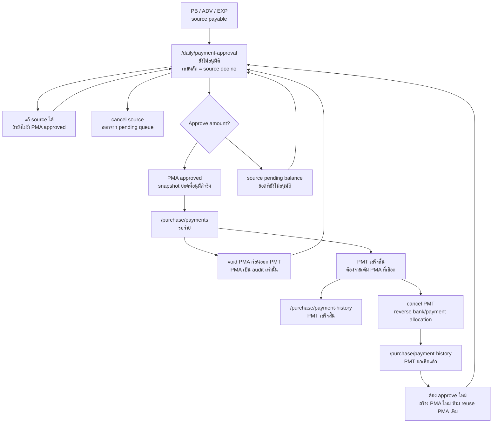

---

## title: Payment Flow
aliases:
  - Flow จ่ายเงิน
  - Approval and Payment Flow
  - Supplier Payment Flow
  - อนุมัติจ่ายเงิน
tags:
  - ns-scrap-erp
  - payment
  - approval
  - finance
  - business-flow
status: draft
created: 2026-05-28
updated: 2026-07-13

# Payment Flow / Flow จ่ายเงิน

เอกสารนี้เป็น canonical flow สำหรับ `อนุมัติจ่ายเงิน`, `รอจ่าย`, `ทำจ่าย`, `จ่ายเงินล่วงหน้า / มัดจำ`, `ประวัติการจ่ายเงิน`, และ `คืนเงินมัดจำ/คืนเงินล่วงหน้า` ฝั่ง Supplier

เอกสารที่เกี่ยวข้อง:

- [[Purchase Flow]] สำหรับต้นน้ำฝั่งซื้อ เช่น `PO Buy`, `WTI`, `Purchase Bill`, และ allocation มัดจำเข้าบิล
- [[Supplier Advance Payment Flow]] สำหรับ source document `ADV`, การจ่ายเงินล่วงหน้า Supplier, และการ allocate ADV เข้าบิลรับซื้อ
- [[Sales Flow]] สำหรับฝั่งรับเงิน/ลูกค้า
- [[Purchase and Sales Bill LINE Notification]] สำหรับการส่ง Flex หลัง PMT บันทึกสำเร็จ

## ขอบเขตของเอกสารนี้

flow นี้ต้องรองรับ source document อย่างน้อย:

- `บิลรับซื้อ`
- `จ่ายเงินล่วงหน้า / มัดจำ`
- `ค่าใช้จ่าย`

queue กลางของงานนี้ใน target system ต้องใช้ชื่อ `อนุมัติจ่ายเงิน`

## เอกสารหลัก

| เอกสาร           | ใช้ทำอะไร                                | เลขเอกสาร                    |
| ---------------- | ---------------------------------------- | ---------------------------- |
| `PB / ADV / EXP` | source document ที่ก่อให้เกิดยอดค้างจ่าย | ตามเลขเอกสารของ source       |
| `PMA`            | approval snapshot ของยอดที่อนุมัติจริง   | `PMA{branchCode}{YYMM}-NNNN` |
| `PMT`            | payment snapshot / ใบจ่ายเงินจริง        | `PMT{branchCode}{YYMM}-NNNN` |

กติกา:

- `ยังไม่อนุมัติ` เป็น queue จาก source document โดยตรง ยังไม่ใช่ `PMA`
- `PMA` เกิดตอนกดอนุมัติเท่านั้น และเก็บเฉพาะยอดที่อนุมัติจริง
- source document 1 ใบสามารถเกิด `PMA` ได้หลายใบหรือหลาย approval item ตามการ split ยอด
- ยอด source ที่ยังไม่ถูกอนุมัติยังอยู่ใน queue `ยังไม่อนุมัติ` ต่อ
- เมื่อมี `PMA approved` อย่างน้อย 1 รายการ source document ต้อง lock field ที่กระทบยอด คู่ค้า สาขา ภาษี ส่วนลด และ allocation
- `PMT` ต้องจ่ายเต็มตาม `PMA` ที่เลือก ห้าม partial payment ที่ชั้น `PMT`
- ถ้าต้องจ่ายบางส่วน ให้กำหนดยอดบางส่วนตั้งแต่ตอนอนุมัติเป็น `PMA` ยอดย่อย

## Lifecycle ของรายการจ่าย

รายการจ่ายต้องถูกมองเป็น lifecycle เดียว แต่ต้องแยกให้ชัดระหว่าง `source document`, `PMA`, และ `PMT`

| Stage           | เอกสารหลัก       | หน้า                        | ความหมาย                                                                |
| --------------- | ---------------- | --------------------------- | ----------------------------------------------------------------------- |
| `ยังไม่อนุมัติ` | `PB / ADV / EXP` | `/daily/payment-approval`   | source ยังมียอดค้างที่ยังไม่ถูกอนุมัติ                                  |
| `อนุมัติแล้ว`   | `PMA`            | `/daily/payment-approval`   | snapshot ของยอดที่อนุมัติแล้ว                                           |
| `รอจ่าย`        | `PMA`            | `/purchase/payments`        | PMA approved ที่ยังไม่ได้ออก PMT                                        |
| `เสร็จสิ้น`     | `PMT`            | `/purchase/payment-history` | จ่ายจริงแล้ว                                                            |
| `ยกเลิกแล้ว`    | `PMTมำเป`        | `/purchase/payment-history` | payment voucher ถูกยกเลิกและต้องเริ่ม approval ใหม่สำหรับยอดที่ reverse |

## Queue และหน้าจอ

| หน้า                        | หน้าที่                 | ลักษณะข้อมูล                                       |
| --------------------------- | ----------------------- | -------------------------------------------------- |
| `/daily/payment-approval`   | queue `อนุมัติจ่ายเงิน` | pending source candidates + approved PMA snapshots |
| `/purchase/payments`        | queue `รอจ่าย`          | approved PMA items ที่ต้องออก PMT                  |
| `/purchase/payment-history` | ประวัติการจ่ายเงิน      | PMT success/cancelled snapshots                    |

กติกา:

- `/daily/payment-approval`
  - แท็บ `ยังไม่อนุมัติ` แสดง `PB / ADV / EXP` เป็นเลขเอกสารหลัก
  - แท็บ `อนุมัติแล้ว` แสดง `PMA` เป็นเลขเอกสารหลัก
  - แท็บ `อนุมัติแล้ว` ต้องมีคอลัมน์ `เอกสารอ้างอิง` สำหรับ `PB / ADV / EXP`
  - pending rows ต้องคำนวณยอดจาก source ปัจจุบัน โดยหักยอดที่ถูกอนุมัติหรือจ่ายไปแล้ว
  - source ที่ถูก cancel ก่อนอนุมัติต้องหายจาก pending queue
- `/purchase/payments`
  - อ่านเฉพาะ `PMA approved` ที่ยังไม่ถูกออก `PMT`
  - หลัง transaction สร้าง `PMT` สำเร็จ ให้สร้างและส่ง LINE job ประเภท `purchase_payment` / `PMT`; LINE ล้มเหลวต้องไม่ย้อน transaction การจ่ายเงิน
  - เลือกหลาย `PMA` ของ supplier เดียวกันมาจ่ายใน `PMT` เดียวได้เฉพาะเมื่อ destination payment method, bank และ account snapshot ตรงกัน
  - เลข `PMT` ออกโดย server เท่านั้น ห้ามรับเลขเอกสารจาก client
  - PMT ต้องจ่ายเต็มทุก PMA ที่เลือก
- `/purchase/payment-history`
  - read-only
  - แสดง `PMT` ที่ `เสร็จสิ้น` และ `ยกเลิกแล้ว`
  - ห้ามแก้ PMT เดิม; หากต้องเปลี่ยนข้อมูลการจ่ายให้ cancel/reverse แล้วเริ่ม approval/payment cycle ใหม่
  - downstream accounting/report/bank posting ใช้เฉพาะ `เสร็จสิ้น`

## Split Approval Model

approval ต้องไม่ยึด `1 source = 1 PMA` อย่างเดียวอีกต่อไป

ตัวอย่าง:

- `PB001` มียอดค้าง 1,000
- ผู้อนุมัติอนุมัติรอบแรกเป็น 2 รายการ:
  - `PMA001` = 300
  - `PMA002` = 300
- ยอดที่เหลือ 400 ยังเป็น pending candidate ของ `PB001`

ผลลัพธ์:

- `/daily/payment-approval` แท็บ `อนุมัติแล้ว` เห็น `PMA001` และ `PMA002`
- `/daily/payment-approval` แท็บ `ยังไม่อนุมัติ` ยังเห็น `PB001` ด้วยยอดคงเหลือ 400
- `/purchase/payments` เห็น `PMA001` และ `PMA002` เป็นรายการรอจ่าย
- `PB001` ถูก lock field การเงินทั้งใบตั้งแต่มี PMA approved อย่างน้อย 1 รายการ

ขั้นต่ำของ snapshot ต่อ PMA:

- `source_type`
- `source_id`
- `source_doc_no_snapshot`
- `party_id`
- `party_name_snapshot`
- `approved_amount`
- `destination_payment_method_snapshot`
- `destination_bank_account_id_snapshot`
- `destination_bank_name_snapshot`
- `destination_account_no_snapshot`
- `approved_at`
- `approved_by`

## กติกา Lock

### ก่อนมี PMA approved

- source document ยังแก้ไขได้
- source document ยังยกเลิกได้
- ถ้า source ถูกยกเลิก รายการ pending ต้องหายจาก `/daily/payment-approval`
- การแก้ source ต้องสะท้อนใน pending queue เพราะ pending อ่านจาก source ปัจจุบัน

### หลังมี PMA approved อย่างน้อย 1 รายการ

- source document ต้อง lock field ที่กระทบยอดและ accounting meaning ทั้งใบ
- ห้ามแก้ supplier, branch, date ที่กระทบบัญชี, line item, จำนวน/น้ำหนัก, ราคา, VAT/WHT, ส่วนลด, advance allocation และ payable amount
- ยังแก้ได้เฉพาะ note, attachment, comment หรือ metadata ที่ไม่กระทบยอดและมี audit trail
- ยอด source ที่ยังไม่ถูกอนุมัติยังสามารถถูกอนุมัติเพิ่มเป็น PMA ใหม่ได้
- ถ้าต้องแก้ source financial fields ต้องยกเลิก approval/payment cycle ที่ active อยู่ด้วย action ที่ trace ได้ก่อน

## ทำจ่าย

`ทำจ่าย` ใน `/purchase/payments` ทำงานระดับ PMA item

ผลที่ต้องเกิด:

1. ผู้ใช้เลือก `PMA approved` ของ supplier เดียวกัน
2. ระบบสร้าง `PMT`
3. `PMT` ต้อง settle เต็มยอดของทุก PMA ที่เลือก
4. `payments` / payment allocation ต้องชี้กลับ PMA ที่ถูกจ่าย
5. PMA ที่ถูกจ่ายต้องเปลี่ยนเป็น consumed/paid ตาม implementation status
6. history ต้องเห็น `PMT` เป็น `เสร็จสิ้น`

กติกายอด:

- PMT total = ผลรวมยอด `approved_amount` ของ PMA ที่เลือก
- ถ้า PMT ใช้หลายบัญชีจ่าย ยอด allocation ของแต่ละบัญชีรวมกันต้องเท่ากับ PMT total
- ถ้า PMA หนึ่งใบถูกจ่ายด้วยหลายบัญชี ยอด allocation รวมของ PMA นั้นต้องเท่ากับ `approved_amount`
- ห้ามบันทึก PMT ที่จ่ายต่ำกว่ายอด PMA ที่เลือก
- `cash amount + withholding tax + discount` ต้องไม่เกินและต้อง reconcile กับ `approved_amount`

## ยกเลิก PMT แล้วเริ่มใหม่

เมื่อ `PMT` ที่จ่ายเงินจริงแล้วถูกยกเลิก:

1. `PMT` เดิมต้องอยู่ใน history เป็น `ยกเลิกแล้ว`
2. ต้อง reverse ผลกระทบเงินออก เช่น bank statement และ payment allocation
3. PMA ที่ถูกใช้ใน PMT นั้นถือว่าจบ cycle เดิมแล้ว ห้ามนำกลับมาใช้จ่ายใหม่
4. ยอดที่ถูก reverse ต้องกลับไปคำนวณเป็น pending candidate ของ source document เดิม
5. ถ้าจะจ่ายใหม่ ต้องอนุมัติใหม่จาก source ปัจจุบันเพื่อสร้าง `PMA` ใหม่ แล้วค่อยออก `PMT` ใหม่

เหตุผล: การยกเลิก PMT คือการเริ่มรอบ approval/payment ใหม่สำหรับยอดนั้น ไม่ใช่การแก้ voucher เดิมหรือ reuse PMA เดิม

## จ่ายเงินล่วงหน้า / มัดจำ

advance payment เป็น source document ของ flow นี้เช่นกัน

ขั้นต่ำของข้อมูล:

- `Supplier`
- `สาขา`
- `วันที่จ่าย`
- `วิธีจ่าย`
- `บัญชีที่จ่าย`
- `ยอดจ่ายล่วงหน้า`
- large-scale source fields ตามที่กำหนดใน [[Purchase Flow]]

หลังบันทึก:

1. advance payment เข้า queue `อนุมัติจ่ายเงิน` เป็น source pending candidate
2. ผู้อนุมัติ split ยอดได้เช่นเดียวกับ source อื่น
3. ยอดที่อนุมัติจริงจึงเกิด `PMA`
4. จ่ายจริงเต็ม PMA แล้วจึงเกิด `PMT`

## คืนเงินมัดจำ / คืนเงินล่วงหน้า

ถ้า `advance > final bill amount`

- ห้าม carry forward เป็นเครดิต supplier อัตโนมัติในระบบตอนนี้
- ต้องเข้าฝั่ง `คืนเงินมัดจำ / คืนเงินล่วงหน้า`
- เป็น flow ฝั่ง `Supplier`
- ไม่ reuse เมนูคืนเงินฝั่ง `Customer`

## State Matrix ย่อ

| สถานะ           | เอกสารหลัก       | queue/page                  | source edit                                  | history                   |
| --------------- | ---------------- | --------------------------- | -------------------------------------------- | ------------------------- |
| `ยังไม่อนุมัติ` | `PB / ADV / EXP` | `/daily/payment-approval`   | ได้ ถ้ายังไม่มี PMA approved ของ source นั้น | ไม่อยู่ใน history         |
| `อนุมัติแล้ว`   | `PMA`            | `/daily/payment-approval`   | lock financial fields                        | approval snapshot         |
| `รอจ่าย`        | `PMA`            | `/purchase/payments`        | lock financial fields                        | ไม่อยู่ใน payment history |
| `เสร็จสิ้น`     | `PMT`            | `/purchase/payment-history` | lock                                         | อยู่                      |
| `ยกเลิกแล้ว`    | `PMT`            | `/purchase/payment-history` | ยอด reverse กลับไป source pending candidate  | อยู่                      |

## Use Case Status Examples

| Use case              | Step                                   | Source status                                 | PMA status                                   | PMT status             | หน้า/ผลลัพธ์                                       |
| --------------------- | -------------------------------------- | --------------------------------------------- | -------------------------------------------- | ---------------------- | -------------------------------------------------- |
| approve partial       | `PB001 = 1,000` ถูกสร้าง               | `ยังไม่อนุมัติ 1,000`                         | ไม่มี                                        | ไม่มี                  | `/daily/payment-approval` เห็น `PB001`             |
| approve partial       | อนุมัติ `300 + 300`                    | `ยังไม่อนุมัติ 400`, financial fields locked  | `PMA001 approved 300`, `PMA002 approved 300` | ไม่มี                  | approved tab เห็น PMA, pending tab เห็น PB balance |
| full PMT              | เลือก `PMA001 + PMA002` ทำจ่าย         | source ยังเหลือ pending 400                   | `PMA001/PMA002 consumed`                     | `PMT001 เสร็จสิ้น 600` | `/purchase/payment-history` เห็น PMT               |
| combine supplier PMAs | เลือก PMA จากหลาย PB supplier เดียวกัน | source แต่ละใบคำนวณ balance ตามจริง           | หลาย PMA approved                            | PMT เดียวจ่ายรวมเต็ม   | `/purchase/payments` รวมหลาย PMA ใน PMT เดียวได้   |
| cancel PMT            | ยกเลิก `PMT001`                        | ยอด 600 กลับเป็น pending candidate ของ source | PMA เดิมจบ cycle ใช้เป็น audit               | `PMT001 ยกเลิกแล้ว`    | ต้องอนุมัติใหม่ก่อนจ่ายใหม่                        |

## Open Implementation Batch

1. ถอย runtime จาก model `PMA pending` เป็น source-derived pending queue
2. ให้ `/daily/payment-approval` pending tab อ่าน `PB / ADV / EXP` โดยคำนวณ remaining approval balance จาก source minus active/consumed PMA
3. ให้ approve action สร้าง `PMA approved` ตาม split amount ที่อนุมัติจริง
4. ให้ `/purchase/payments` บังคับ PMT full-pay สำหรับ PMA ที่เลือก และรองรับหลาย PMA ของ supplier เดียวกันใน PMT เดียว
5. ให้ `cancel PMT` reverse ยอดกลับไป source pending candidate และปิด PMA cycle เดิม
6. เพิ่ม browser smoke:
  - create source -> pending source row
  - approve บางส่วน -> PMA rows + source balance remains pending
  - PMT full-pay selected PMAs
  - cancel PMT -> source balance returns to pending approval

