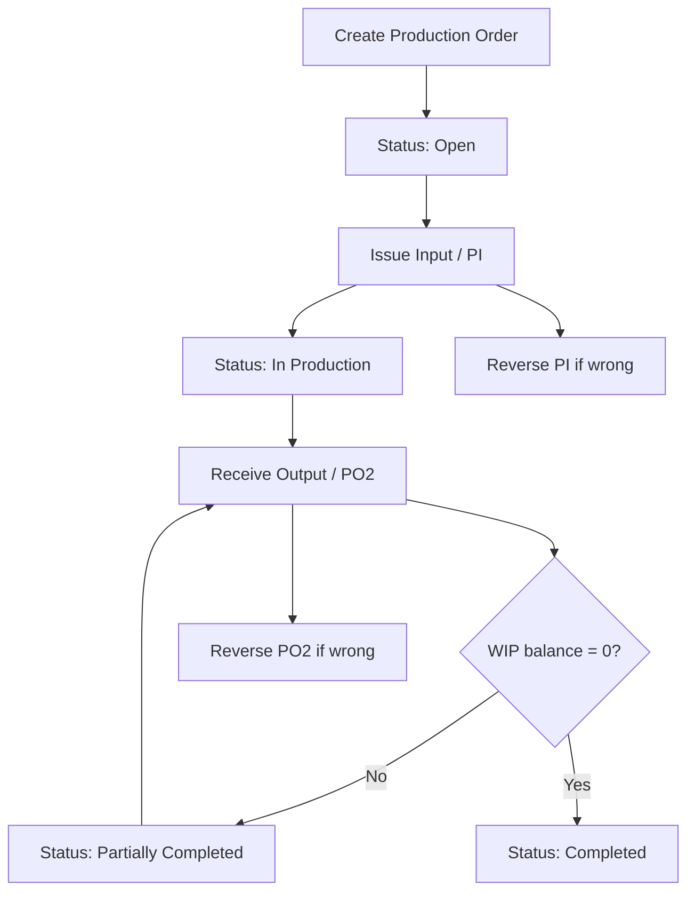

# Production Order DB/API Design / ใบสั่งผลิต

## Purpose

เอกสารนี้เป็น contract สำหรับ write flow ของ `/production/orders` ใน active Next app หลังเทียบเอกสาร, legacy, และ flow ที่ user ยืนยันวันที่ 2026-06-12.

MVP ครอบคลุม:

- เปิดใบสั่งผลิตเป็น `Open`
- เบิกวัตถุดิบเข้า WIP ด้วย `PI`
- รับผลผลิตเป็น `FG` หรือ `RM` ด้วย `PO2`
- บันทึก `Loss` เพื่อเคลียร์ WIP
- reverse เอกสารผิดด้วย `PI-REV` / `PO2-REV`
- รายงาน WIP/Yield/Stock Ledger จาก facts จริง

นอก MVP:

- approval flow
- process cost
- cost allocation
- customer return output
- auto grade adjustment
- delete/rewrite stock ledger

## Confirmed Business Decisions

| Decision | Target contract |
|---|---|
| ไม่มี approval ใน MVP | สร้าง order แล้วเป็น `Open` ทันที |
| สถานะหลัก | `Open -> In Production -> Partially Completed -> Completed` |
| ไม่มี auto output เป็นสินค้า target | ผู้ใช้ต้องเลือกสินค้า/grade ที่รับจริงใน output modal |
| WIP เหลือแล้วอยากจบงาน | รับส่วนที่เหลือกลับเป็น `RM` หรือบันทึกเป็น `Loss` ผ่าน output flow เดียวกัน |
| ห้าม completed ถ้า WIP ยังเหลือ | server reject complete action ถ้า WIP balance != 0 |
| Stock ห้ามติดลบ | input issue ต้อง validate available stock ก่อนเขียน ledger |
| WAC | ใช้ WAC ณ วันที่เบิก input เป็นต้นทุน input line |
| แก้ input/output หลังบันทึก | ไม่แก้ ledger เดิมโดยตรง ให้ reverse แล้วบันทึกใหม่ |
| Legacy fallback | ห้าม fallback เช่น `code ?? id`, live master snapshot fallback, hard delete ledger, auto grade convert |

## Flow



## Order Create

Required MVP fields:

| Field | Rule |
|---|---|
| `date` | required business date |
| `production_type` | required allowed value |
| `product_id` | required target/intended product only |
| `branch_id` | required, resolve from outward branch code |
| `warehouse_from_id` | required source warehouse |
| `warehouse_wip_id` | required WIP warehouse; must belong to branch and have warehouse type `WIP` |
| `warehouse_to_id` | required destination warehouse |
| `machine_id` | optional |
| `production_line_id` | optional |
| `shift` | optional |
| `notes` | optional |

Removed from MVP create form:

- `target_lot_no`
- `supervisor_name`
- `operator_name`
- `planned_input_qty`
- `planned_output_qty`
- `cost_allocation_method`
- `normal_loss_percent`
- `process cost`

System result:

- create `production_orders`
- generate `doc_no = POYYMM-NNNN`
- status = `Open`
- no stock ledger movement
- append status log `created`

Create UI WIP rule:

- after branch selection, if the branch has exactly one active `WIP` warehouse, auto-fill and lock `คลัง WIP`
- if the branch has no active `WIP` warehouse, block save and show a setup error
- if the branch has multiple active `WIP` warehouses, require explicit user selection from WIP warehouses only
- server must reject any `wipWarehouseCode` that is not an active `WIP` warehouse in the selected branch

## Input / เบิกวัตถุดิบ

UI MVP:

- users add one input document at a time from the order detail modal
- after save, the modal stays open, the selected order refreshes, and users can save the next input round without closing
- the server API still accepts `lines[]` for document grouping, but the current parity UI does not require an editable multi-line grid inside the modal

Validation:

- order status must be `Open`, `In Production`, or `Partially Completed`
- selected product must be active
- source warehouse must belong to order branch
- source stock status must be stock-ready (`RM` or allowed source status)
- available stock must be enough at `branch + warehouse + product + lot/status`
- qty must be positive
- WAC must be determinable for that product/warehouse/date
- no fallback to latest price, product default price, or zero-cost unless a documented explicit zero-cost policy exists

Ledger rows in one DB transaction:

| Row | ref_type | movement_type | Direction |
|---|---|---|---|
| source out | `PI` | `PRODUCTION_INPUT_OUT` | `qty_out`, `value_out` |
| WIP in | `PI` | `WIP_IN` | `qty_in`, `value_in` |

System result:

- create `production_inputs`
- write paired stock ledger
- update status to `In Production` after first active input
- recompute WIP/input cost
- append status/log event `input_created`

## Output / รับผลผลิต

MVP output modal:

| Control | Rule |
|---|---|
| Date | required |
| Output lines | at least one FG/RM line or loss qty |
| Product per line | required for FG/RM; user chooses actual product/grade |
| Destination type | `FG` or `RM` only |
| Net qty | positive |
| Lot No | optional/manual |
| Loss kg | optional, non-negative |
| Summary | show WIP before, FG total, RM total, loss, WIP remaining |

UI MVP:

- users add one output/loss document at a time from the order detail modal
- repeated output rounds are allowed until WIP reaches zero
- `completeOrder` is an explicit user action and server-side validation rejects completion while WIP remains
- this matches legacy multi-round behavior, where `productionOutputs` is an accumulated array of saved output rounds rather than a required in-modal line editor

Validation:

- order must have active WIP
- output qty + RM qty + loss must not exceed WIP balance
- completed action requires output qty + RM qty + loss = WIP balance
- output product must be active and selected explicitly
- destination warehouse must belong to order branch
- category must be one of MVP categories: `FG`, `RM`, `LOSS`
- `CUSTOMER_RETURN` is not accepted in MVP API
- no auto Grade Adjustment if output product differs from input

Ledger rows:

| Case | Row | ref_type | movement_type | Direction |
|---|---|---|---|---|
| FG line | WIP out | `PO2` | `PRODUCTION_OUTPUT_WIP_OUT` | `qty_out` from WIP |
| FG line | FG in | `PO2` | `PRODUCTION_OUTPUT_IN` | `qty_in` to stock |
| RM line | WIP out | `PO2` | `PRODUCTION_OUTPUT_WIP_OUT` | `qty_out` from WIP |
| RM line | RM in | `PO2` | `PRODUCTION_OUTPUT_RM_IN` | `qty_in` to stock |
| Loss | WIP out/loss | `PO2` | `PRODUCTION_LOSS` | `qty_out`, no stock-in |

## Status Contract

| Status | Meaning | Allowed actions |
|---|---|---|
| `Open` | order created, no input yet | edit header, issue input, cancel |
| `In Production` | has active input and WIP > 0 | issue input, receive output, reverse eligible rows |
| `Partially Completed` | has output but WIP remains | issue input, receive remaining FG/RM/loss, reverse eligible output |
| `Completed` | WIP = 0 | view/report, reverse only if downstream stock not consumed |
| `Cancelled` | no active movement or fully reversed | view only |

Not in MVP: `Draft`, `Pending Approval`, `Approved`, `Closed`.

## No-Fallback Contract

Runtime must fail loudly when required target data is missing.

Forbidden:

- `businessCode ?? internalId`
- `docNo ?? id`
- missing WAC -> `0`
- missing output category -> default `FG`
- missing warehouse -> branch default
- insufficient stock -> confirm over-issue
- hard delete old stock ledger rows on edit
- auto create Grade Adjustment when product/grade changes
- infer completed when WIP cannot reconcile

Allowed:

- reject API request with field-level validation
- add migration/backfill task
- fix seed/master data
- add explicit DB constraint after data is clean

## DB Design

Current tables already present:

- `production_orders`
- `production_inputs`
- `production_outputs`
- `production_output_categories`
- `stock_ledger`
- `process_costs`

Additive schema for MVP:

### `production_order_status_logs`

| Column | Rule |
|---|---|
| `id` bigint identity PK | internal only |
| `event_key` text unique | outward row id |
| `order_id` bigint FK | required |
| `order_doc_no` text | required snapshot |
| `action` text | required |
| `from_status` / `to_status` | lifecycle transition |
| `note` text | optional |
| `meta` jsonb | optional structured audit |
| `created_at` / `created_by` | audit |

### `production_inputs` additions

| Column | Rule |
|---|---|
| `doc_no` | generated `PIYYMM-NNNN`, document group key; not unique because one PI can contain multiple input lines |
| `status` | `active` / `reversed` |
| `source_warehouse_id` | source stock warehouse |
| `wip_warehouse_id` | WIP warehouse |
| `lot_no` | optional |
| `wac_unit_cost` | required by API for new rows |
| `reversed_at/by/reason` | nullable |
| `reversal_doc_no` | generated `PI-REVYYMM-NNNN`, document group key for reversing all lines in one PI |

### `production_outputs` additions

| Column | Rule |
|---|---|
| `doc_no` | generated `PO2YYMM-NNNN`, document group key; not unique because one PO2 can contain multiple FG/RM/loss lines |
| `status` | `active` / `reversed` |
| `category_code` | `FG` / `RM` / `LOSS` for MVP |
| `destination_warehouse_id` | required for FG/RM, null for loss |
| `lot_no` | optional |
| `source_wip_qty` | WIP qty consumed |
| `reversed_at/by/reason` | nullable |
| `reversal_doc_no` | generated `PO2-REVYYMM-NNNN`, document group key for reversing all lines in one PO2 |

### Ledger Reference Rules

| Document | ref_type | ref_no | ref_id |
|---|---|---|---|
| Input issue | `PI` | input `doc_no` | input internal id as text |
| Input reverse | `PI-REV` | reversal doc no | original input id as text |
| Output receive | `PO2` | output `doc_no` | output internal id as text |
| Output reverse | `PO2-REV` | reversal doc no | original output id as text |

## API Design

All writes run in DB transaction and validate with shared server schema.

| Endpoint | Purpose |
|---|---|
| `GET /api/production/orders` | list/read baseline |
| `POST /api/production/orders` | create order as `Open`, no stock ledger |
| `PATCH /api/production/orders/[docNo]` | update header/cancel/complete |
| `POST /api/production/orders/[docNo]/inputs` | create `PI` |
| `POST /api/production/orders/[docNo]/inputs/[inputDocNo]/reverse` | create `PI-REV` |
| `POST /api/production/orders/[docNo]/inputs/reverse` | create `PI-REV` with `inputDocNo` in body; stable runtime endpoint for browser clients |
| `POST /api/production/orders/[docNo]/outputs` | create `PO2` |
| `POST /api/production/orders/[docNo]/outputs/[outputDocNo]/reverse` | create `PO2-REV` |
| `POST /api/production/orders/[docNo]/outputs/reverse` | create `PO2-REV` with `outputDocNo` in body; stable runtime endpoint for browser clients |
| `GET /api/production/orders/options` | page-scoped options |
| `GET /api/production/orders/product-stock` | selected product stock |
| `GET /api/production/orders/[docNo]/wip` | current WIP breakdown |
| `GET /api/production/reconciliation` | read production document/ledger mismatch report from `production_reconciliation_issues`; surfaced by `/production/reconciliation` |

## Reconciliation SQL Draft

```sql
-- PI qty/value must balance source-out and WIP-in per input doc.
select
  ref_no,
  sum(case when movement_type = 'PRODUCTION_INPUT_OUT' then coalesce(qty_out, 0) else 0 end) as source_qty_out,
  sum(case when movement_type = 'WIP_IN' then coalesce(qty_in, 0) else 0 end) as wip_qty_in,
  sum(case when movement_type = 'PRODUCTION_INPUT_OUT' then coalesce(value_out, 0) else 0 end) as source_value_out,
  sum(case when movement_type = 'WIP_IN' then coalesce(value_in, 0) else 0 end) as wip_value_in
from public.stock_ledger
where ref_type = 'PI'
group by ref_no
having
  sum(case when movement_type = 'PRODUCTION_INPUT_OUT' then coalesce(qty_out, 0) else 0 end)
    <> sum(case when movement_type = 'WIP_IN' then coalesce(qty_in, 0) else 0 end)
  or
  sum(case when movement_type = 'PRODUCTION_INPUT_OUT' then coalesce(value_out, 0) else 0 end)
    <> sum(case when movement_type = 'WIP_IN' then coalesce(value_in, 0) else 0 end);

-- PO2 must consume WIP equal to FG/RM stock-in plus loss per output doc.
select
  ref_no,
  sum(case when movement_type in ('PRODUCTION_OUTPUT_WIP_OUT', 'PRODUCTION_LOSS') then coalesce(qty_out, 0) else 0 end) as wip_qty_out,
  sum(case when movement_type in ('PRODUCTION_OUTPUT_IN', 'PRODUCTION_OUTPUT_RM_IN') then coalesce(qty_in, 0) else 0 end) as destination_qty_in,
  sum(case when movement_type = 'PRODUCTION_LOSS' then coalesce(qty_out, 0) else 0 end) as loss_qty
from public.stock_ledger
where ref_type = 'PO2'
group by ref_no
having
  sum(case when movement_type in ('PRODUCTION_OUTPUT_WIP_OUT', 'PRODUCTION_LOSS') then coalesce(qty_out, 0) else 0 end)
    <> (
      sum(case when movement_type in ('PRODUCTION_OUTPUT_IN', 'PRODUCTION_OUTPUT_RM_IN') then coalesce(qty_in, 0) else 0 end)
      + sum(case when movement_type = 'PRODUCTION_LOSS' then coalesce(qty_out, 0) else 0 end)
    );

-- Completed orders must have zero WIP from active facts.
with input_totals as (
  select order_id, sum(qty) as input_qty
  from public.production_inputs
  where status = 'active'
  group by order_id
),
output_totals as (
  select order_id, sum(source_wip_qty) as output_wip_qty
  from public.production_outputs
  where status = 'active'
  group by order_id
)
select
  po.doc_no,
  coalesce(input_totals.input_qty, 0) - coalesce(output_totals.output_wip_qty, 0) as wip_qty
from public.production_orders po
left join input_totals on input_totals.order_id = po.id
left join output_totals on output_totals.order_id = po.id
where po.status = 'Completed'
  and coalesce(input_totals.input_qty, 0) - coalesce(output_totals.output_wip_qty, 0) <> 0;

-- Active PI rows must have ledger rows.
select pi.doc_no
from public.production_inputs pi
where pi.status = 'active'
  and not exists (
    select 1
    from public.stock_ledger sl
    where sl.ref_type = 'PI'
      and sl.ref_no = pi.doc_no
  );

-- Active PO2 rows must have ledger rows.
select po2.doc_no
from public.production_outputs po2
where po2.status = 'active'
  and not exists (
    select 1
    from public.stock_ledger sl
    where sl.ref_type = 'PO2'
      and sl.ref_no = po2.doc_no
  );
```

## Implementation Task Breakdown

### Batch P3A: Docs and Schema Contract

- [x] Document simplified production flow and no-fallback policy.
- [x] Document API/DB contract before coding.
- [x] Decide final additive columns and migration names.
- [x] Update OpenAPI skeleton for production order write endpoints.
- [x] Add reconciliation SQL draft under migration docs or notes.

### Batch P3B: DB Migration

- [x] Add `production_order_status_logs`.
- [x] Add `doc_no/status/reversal/warehouse/wac` fields to `production_inputs`.
- [x] Add `doc_no/status/category_code/reversal/destination/source_wip_qty` fields to `production_outputs`.
- [x] Add production-focused stock ledger indexes.
- [x] Correct `production_inputs.doc_no`, `production_outputs.doc_no`, and reversal doc numbers from unique row keys to non-unique document group keys.
- [x] Add `production_reconciliation_issues` DB view for PI/PO2/WIP mismatch checks.
- [x] Generate Prisma client.
- [x] Apply migration to `dev-target`.
- [x] Run DB smoke checks and document result.

### Batch P3C: Server Domain Services

- [x] Add document-number generator for `PO`, `PI`, `PO2`, `PI-REV`, `PO2-REV`.
- [x] Add production order create service.
- [x] Add WIP calculation service from active facts/ledger.
- [x] Add WAC lookup that rejects missing/ambiguous cost.
- [x] Add stock availability validator with branch/warehouse/product/status/lot dimensions.
- [x] Add PI transaction writer.
- [x] Add PO2 transaction writer.
- [x] Add reverse PI/PO2 services with downstream-consumption guard.
- [x] Add status recompute and status-log append service.

### Batch P3D: API Routes and Validation

- [x] Implement production write API routes and Zod schemas.

### Batch P3E: UI Enablement

- [x] Simplify production order create/input/output modals and enable MVP actions.
- [x] Use searchable product combobox for create modal target product selection.
- [x] Require explicit create-modal selections instead of auto-selecting first reference values.
- [x] Auto-fill and lock create-modal WIP warehouse when the selected branch has exactly one active WIP warehouse.
- [x] Show selected target product stock by branch/warehouse in the create modal.
- [x] Use searchable product comboboxes for input and output product/grade selection.
- [x] Keep the detail modal open after PI/PO2 saves and support repeated one-document input/output rounds.

### Batch P3F: Reports and Reconciliation

- [x] Add `GET /api/production/reconciliation` read API for PI/PO2 ledger mismatch, completed order WIP mismatch, open order movement mismatch, and missing reversal ledger checks.
- [x] Run logged-in browser QA for create -> repeated input rounds -> repeated output/loss rounds -> complete -> reverse-block -> reconciliation.
- [x] Confirm legacy parity: repeated modal saves are sufficient for MVP; an in-modal multi-line editor is not required.
- [x] Surface production reconciliation in read-only `/production/reconciliation` UI.

## 2026-06-12 Browser QA Evidence

- Environment: production build + `next start` on `http://127.0.0.1:3003`, dev-target Supabase.
- Result doc: `PO2606-0021`.
- Passed: UI create, input `SKU001 10kg` twice in the same detail modal, output `FG SKU001 8kg`, output `RM SKU001 7kg + loss 5kg` with complete checked.
- Final state: `Completed`, `inputCount=2`, `inputQty=20`, `outputCount=3`, `outputQty=20`.
- Guard: reverse after completed returned HTTP 400.
- Reconciliation: `GET /api/production/reconciliation` returned `issueCount=0`.

## 2026-06-12 Reconciliation UI Evidence

- Added read-only page `/production/reconciliation`.
- Added Production navigation item `Production Reconciliation`.
- Page displays total issue count, ref-type counts, issue-type filter, search, refresh, and issue details table.
- Authenticated browser QA passed with `GET /api/production/reconciliation = 200`, `issueCount=0`, empty state rendered, and no browser console errors.
