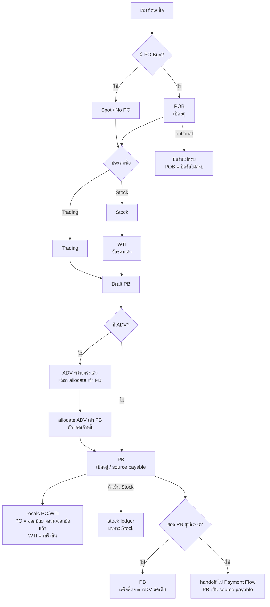

# Purchase Flow / Flow ซื้อ

เอกสารนี้เป็น target flow สำหรับงานซื้อในระบบ Next app โดยยึด business rule ที่คุยล่าสุด:

- เมื่อกดบันทึก ให้ถือว่าออกเอกสารและมีผลทันที
- ระบบ target ไม่ใช้เลข `WT` เดี่ยว; เอกสารชั่งน้ำหนักต้องแยกขาเข้า/ขาออกด้วย prefix ตั้งแต่เลขเอกสาร
- `ใบรับของ / Weight Ticket In` ใช้เลขเอกสาร `WTI{branchCode}{YYMM}-NNNN` และเป็นเอกสารรับของจริงสำหรับกรณีซื้อเข้า stock
- ฝั่งส่งของต้องแยกเป็น `ใบส่งของ / Weight Ticket Out` ใช้เลขเอกสาร `WTO{branchCode}{YYMM}-NNNN` ใน Sales/Delivery flow ไม่ปนกับใบรับของ
- ซื้อเข้า stock ต้องมี `ใบรับของ` และระบบต้อง auto-select `คลัง RM` ที่ active ของสาขาบิลก่อนออกบิลรับซื้อ ไม่ว่าจะอ้าง PO หรือเป็น Spot Buy / No PO
- เมื่อบันทึก `PB Stock` จำนวน stock และ stock value เพิ่มทันที และ WAC ปัจจุบันเปลี่ยนตามราคาซื้อของบิลนั้น
- เมื่อยกเลิก `PB Stock` ต้อง reverse ด้วย `PB-CANCEL` โดยเอาจำนวนและมูลค่าของ PB เดิมออกด้วย unit cost/value เดิม แล้วให้ WAC ปัจจุบันคำนวณใหม่จาก stock ledger ที่เหลือ
- ถ้า stock จาก PB เดิมถูกขาย/โอน/ผลิต/ปรับออกจนยอดพร้อมใช้ไม่พอสำหรับ reverse ต้อง block cancel หรือใช้ correction/approval flow แยก ห้ามลบหรือแก้ ledger เดิมเงียบ ๆ
- คลังของบิลรับซื้อ Stock ไม่ใช่ field ที่ผู้ใช้เลือกเองแล้ว; หน้า `/purchase/bills` แสดงคลังเป็น read-only จาก active RM warehouse ของสาขา และ API ต้อง reject payload ที่ไม่ใช่ RM หรืออยู่นอกสาขา
- Trading ไม่เข้า stock และไม่ใช้ใบรับของเป็นแหล่งน้ำหนักหลัก ผู้ใช้ต้องกรอกจำนวน/น้ำหนักในหน้าบิลรับซื้อ
- PO กับใบรับของเป็นความสัมพันธ์ที่ต้องแยกให้ชัด: `PO` 1 ใบยังรับของได้หลายครั้ง/หลายเอกสาร แต่ target ใหม่คือ `WTI 1 ใบ -> PB 1 ใบ`; `WTI` ต้องถูกตัดครบใน `Purchase Bill` เดียว ห้าม split ไปหลาย `PB` และ `PB` แบบ Stock ต้องเลือก `WTI` ได้ 1 ใบเป็น source หลัก; ภายใน `PB` เดียวยัง allocate ระดับรายการสินค้า/น้ำหนักและผสม `PO` + `Spot Buy` ได้
- PO item snapshot ต้องมี canonical internal `productIdInternal` ที่ resolve จาก `products.id` เพื่อใช้ตัด allocation/reconciliation; `productId`/`productCode` เป็น outward display/search key เท่านั้น ห้ามใช้เป็น matching key สำหรับยอดคงเหลือ
- สินค้ารองรับหน่วย `กก.` และ `ลัง`; รายการสินค้าใน PO/WTI/PB และเอกสารต่อเนื่องต้องแสดงหน่วยจริงจาก snapshot หรือ master data ต่อบรรทัด
- Summary/KPI/report ใน purchase flow ต้องแยกยอดตามหน่วยเป็น default เช่น `รวม 1,250 กก. / 32 ลัง`; ห้ามรวมจำนวน `กก.` กับ `ลัง` เป็นเลขเดียว เว้นแต่มี conversion rule ที่อนุมัติไว้เฉพาะรายงานนั้น
- ฟอร์มกรอกภายในใช้ label กลางได้ เช่น `จำนวน (กก./ลัง)` หรือ `ราคา/หน่วย`; detail, print, export, และเอกสารที่คู่ค้าเห็นต้องแสดงหน่วยจริงรายบรรทัดเสมอ
- PO Buy (`POB...`) ต้องพิมพ์รายใบและ Save as PDF ได้จาก `/purchase/po-buy` list/detail โดยใช้หัวกระดาษจาก `ข้อมูลบริษัท (สำหรับใบพิมพ์)` และแสดงสาขาเฉพาะใน header บริษัทตาม Company Profile, แสดง Supplier, ที่อยู่ Supplier, วันที่เอกสาร, วันที่กำหนดส่ง, รายการสินค้าพร้อมหน่วยจริง, ราคา/หน่วย, ยอดสั่งซื้อ, ยอดคงเหลือ, หมายเหตุ และช่องลงนาม โดยการพิมพ์ต้องไม่ตัดยอด PO/WTI/PB หรือสร้าง transaction ใด ๆ; กรณียกเลิกให้แสดงเป็นลายน้ำ audit เท่านั้น ไม่ใส่สถานะเป็น field metadata ปกติ
- Cost Pool ใช้เฉพาะสินค้ากลุ่มทองแดง/ทองเหลือง (`ทองแดง`, `ทองเหลือง`, `copper`, `brass`) ไม่ใช่ทุกสินค้าที่ซื้อเข้า stock
- `WTI` ต้องแยกข้อมูลเป็น 3 ชั้น: header total ทั้งเอกสาร, raw lot ชั่งจริง, และ summary ระดับสินค้าในเอกสารเดียวกัน; รายละเอียด design อยู่ใน [[WTI Product Summary Design]]

เอกสาร test/use case สำหรับใช้ run UAT, smoke, regression และ hardening checklist อยู่ที่ [[Purchase Flow Test Matrix]]

matrix สถานะเอกสารราย use case และราย step แยกไว้ที่ [[Purchase Flow Status Matrix]]

เอกสาร flow เฉพาะหน้า `/purchase/po-buy` แยกไว้ที่ [[PO Buy Page Flow]] เพื่อเก็บรายละเอียด PO commitment, close-short, allocation log, print, aging, และกติกาว่า `POB` ไม่สร้าง stock/AP เอง

เอกสาร flow เฉพาะหน้า `/purchase/bills` แยกไว้ที่ [[Purchase Bills Page Flow]] เพื่อเก็บรายละเอียด PB create/edit/cancel, supplier swap, UI guard, stock/AP side effects, และ payment lock ระดับ page

เอกสาร canonical สำหรับส่วน `อนุมัติจ่ายเงิน / รอจ่าย / ทำจ่าย / ประวัติการจ่ายเงิน / คืนเงินมัดจำ` ถูกแยกไปที่ [[Payment Flow]]

## Scope Boundary / จุดตัดกับ Payment Flow

Purchase Flow จบเมื่อ `PB` ถูกบันทึกและผลกระทบฝั่งซื้อครบ:

- ตัด `POB` ตาม allocation
- อัปเดต `WTI`
- สร้าง/ปรับ stock movement ของ `PB Stock` โดยอ้าง `WTI`
- allocate `ADV` ที่จ่ายจริงแล้วเข้าบิล ถ้ามี
- คำนวณ `payable_balance`
- ถ้า `payable_balance > 0` ส่ง `PB` เป็น source payable เข้า [[Payment Flow]]
- ถ้า `payable_balance = 0` ถือว่า PB เสร็จสิ้นจากฝั่งซื้อ เพราะ ADV ตัดเต็ม

Payment Flow เริ่มจาก source payable ที่ต้องจ่าย เช่น `PB`, `ADV`, หรือ `EXP` แล้วค่อยทำ `approve/split -> PMA -> PMT -> payment history`

Purchase Flow รู้สถานะการจ่ายเพื่อ lock/edit/cancel ให้ถูก แต่รายละเอียด `PMA`, `PMT`, void PMA, cancel PMT และ payment history เป็นขอบเขตของ [[Payment Flow]]

## AP Contract / กติกาเจ้าหนี้

- `AP / เจ้าหนี้` เกิดตอนบันทึก `Purchase Bill (PB)` ไม่ใช่ตอน `WTI`, `POB`, `PMA`, หรือ `PMT`
- `WTI` เป็นหลักฐานรับของ/ชั่งเข้า ยังไม่ตั้งเจ้าหนี้
- `POB` เป็น commitment สั่งซื้อ ยังไม่ตั้งเจ้าหนี้
- `PB` ตั้งเจ้าหนี้จาก `purchase_bills.total_amount` และเก็บยอดค้างหลักที่ `purchase_bills.payable_balance`
- Supplier Advance ที่จ่ายจริงแล้วและ allocate เข้า `PB` ต้องลด AP ผ่าน `purchase_bills.paid_amount` / `purchase_bills.payable_balance` และ `supplier_advance_allocations`
- `PMA` เป็น approval/queue เพื่อทำจ่าย ยังไม่ลด AP
- `PMT` ลด AP หลังบันทึกจ่ายจริง โดยยอดที่ตัด AP รวม payment amount, withholding tax, และ discount ตาม payment allocation ที่ active
- `/finance/ap` และ report ที่เป็น AP balance ต้องอ่าน `purchase_bills.payable_balance` และ `purchase_bills.paid_amount` เป็น source หลัก
- `payments`, `payment_allocations`, `payment_approvals`, และ `supplier_advance_allocations` ใช้เป็น drilldown/audit ว่าเอกสารใดตัดยอด ไม่ใช้ derive balance ทับจาก log ก่อน snapshot ของ `purchase_bills`
- AP read model ต้องไม่ derive ยอดค้างจ่ายจาก `payments` ก่อน เพราะอาจไม่รวม Supplier Advance allocation; ให้ใช้ `purchase_bills.payable_balance` เป็น source หลัก

## Mermaid Flow ถึง Payment Handoff



เอกสารเฉพาะของ `จ่ายเงินล่วงหน้า / มัดจำ Supplier` และ Mermaid flow อยู่ที่ [[Supplier Advance Payment Flow]]

## หลักการแยกแกน Stock/Trading กับ PO/Spot

`Stock`/`Trading` และ `PO`/`Spot Buy` เป็นคนละมิติของเอกสารซื้อ:

| มิติ | ตัวเลือก | ความหมาย | ผลหลัก |
|---|---|---|---|
| ประเภทการซื้อ | `Stock` | ซื้อเพื่อเข้า stock | ใช้ใบรับของ, สร้าง stock ledger, กระทบ Stock On Hand/WAC และอาจเข้า Cost Pool ถ้าเป็นสินค้า eligible |
| ประเภทการซื้อ | `Trading` | ซื้อขายผ่านมือ ไม่รับเข้าคลัง | ไม่ใช้ใบรับของเป็นแหล่งน้ำหนักหลัก, ไม่สร้าง stock ledger, ไม่กระทบ WAC/Stock On Hand, ใช้ Trading Matching |
| แหล่งซื้อ | `PO` | อ้าง PO Buy เดิม | ต้องตัดยอด PO ตามจำนวน/น้ำหนักที่ allocate หรือกรอกในบิล |
| แหล่งซื้อ | `Spot Buy` | ไม่มี PO ให้ตัด | ไม่ตัด PO |

กติกาสำคัญ:

- `Spot Buy` ไม่ได้แปลว่าเข้า stock; แปลว่าไม่มี PO เท่านั้น
- `Trading + Spot` คือ Trading ที่ไม่อ้าง PO: กรอกสินค้า/จำนวน/น้ำหนักในบิลรับซื้อ, ไม่เข้า stock, ไม่ตัด PO
- `Trading + PO` คือ Trading ที่อ้าง PO: กรอกสินค้า/จำนวน/น้ำหนักในบิลรับซื้อ, ไม่เข้า stock, แต่ตัด PO
- `Stock + Spot` คือ Stock ที่ไม่มี PO: ต้องมีใบรับของ, เข้า stock, ไม่ตัด PO
- `Stock + PO` คือ Stock ที่มี PO: ต้องมีใบรับของ, เข้า stock, และตัด PO ผ่าน allocation ในบิลรับซื้อ
- ในบิลรับซื้อ source `PO`/`Spot Buy` ต้องเลือกได้ระดับรายการสินค้า เพราะบิลเดียวกันอาจมีทั้ง PO และ Spot; ค่า header source derive จากรายการจริงเป็น `SPOT_BUY`, `PO_RECEIPT`, หรือ `MIXED`
- ระบบต้องรองรับกรณี `จ่ายเงินล่วงหน้า / มัดจำ` ก่อนออกบิลรับซื้อเต็มใบ ทั้งใน flow ที่มี `PO Buy` และไม่มี PO เช่น รถส่งของแบบน้ำหนักรวมจากเครื่องชั่งใหญ่ แต่ยังไม่ได้แตกชั่งย่อย/ตรวจสอบละเอียดในเมนู `ชั่งขาเข้า`
- เมื่อออก `บิลรับซื้อ` ภายหลัง ต้องมีส่วนให้เลือก/กรอก `รายการจ่ายเงินล่วงหน้า` ที่จะนำมาตัดกับบิลนั้น

## ภาพรวมเอกสารใน Flow ซื้อ

| เอกสาร | ใช้ทำอะไร | ผู้ใช้กรอกหลัก ๆ | เลขเอกสารที่เกิด | สถานะแรกหลังบันทึก |
|---|---|---|---|---|
| PO Buy | สั่งซื้อ / จองซื้อจาก Supplier และพิมพ์ใบสั่งซื้อได้ | สาขา, Supplier, วันส่งมอบ, สินค้า, จำนวน, ราคา | `POB{branchCode}{YYMM}-NNNN` | `เปิดอยู่` |
| ใบรับของ / WTI | รับของเข้า stock จริงและยืนยันน้ำหนัก | ประเภทรับของ, Supplier, สาขา, ทะเบียนรถ, สินค้า, Gross, หัก, Net, รูปต่อรายการสินค้า | `WTI{branchCode}{YYMM}-NNNN` | `รับของแล้ว` |
| จ่ายเงินล่วงหน้า / มัดจำ | source เงินล่วงหน้าที่ต้องจ่ายผ่าน Payment Flow ก่อนนำมา allocate เข้าบิลรับซื้อ | Supplier, สาขา, วันที่, ยอดจ่ายล่วงหน้า, หมายเหตุ, เอกสารอ้างอิง | `ADV{branchCode}{YYMM}-NNNN` หรือเลขที่กำหนดภายหลัง | `บันทึกแล้ว` |
| บิลรับซื้อ | ออกบิล / ตั้งเจ้าหนี้ / ลง stock เฉพาะกรณี Stock | ประเภทซื้อ, แหล่งซื้อ PO/Spot, ใบรับของและสาขาถ้าเป็น Stock, PO/Spot allocation, จำนวน/น้ำหนักถ้าเป็น Trading, ราคา, VAT, หมายเหตุ | `PB{branchCode}{YYMM}-NNNN` | `เปิดอยู่` |

เอกสาร `PMA` และ `PMT` อยู่ในขอบเขต [[Payment Flow]]

## กติกา auto-select คลังของบิลรับซื้อ Stock

- ช่อง `คลัง` ในบิลรับซื้อ Stock เป็น read-only และมาจากระบบเท่านั้น
- หลังเลือกสาขา ระบบต้องหา active warehouse ในสาขานั้นที่ `warehouses.type = RM` แล้วใส่เป็น `warehouseId` ให้อัตโนมัติ
- หน้า `/purchase/bills` ต้องแสดงช่อง `คลัง` เป็น read-only; ถ้าไม่มี active RM warehouse ในสาขานั้นให้แสดงว่าไม่พบคลัง RM และต้องบันทึกไม่ได้
- ถ้าเปลี่ยนสาขา ระบบต้องคำนวณ `warehouseId` ใหม่จาก active RM warehouse ของสาขาใหม่ เพื่อไม่ให้เกิด cross-branch warehouse
- ถ้าเป็น Trading ต้องไม่บังคับเลือกคลังและต้องไม่เขียน stock ledger
- API ต้อง resolve outward warehouse code กลับเป็น internal `warehouses.id` เฉพาะฝั่ง server
- API ต้อง reject เมื่อไม่พบคลัง, คลัง inactive, คลังอยู่คนละสาขากับบิล, หรือ `warehouses.type` ไม่ใช่ `RM`
- ห้ามใช้ fallback จาก `warehouses.name`, `warehouses.code`, หรือ hint อื่นเพื่อเลือกคลังแทนกติกา branch + active RM เพราะจะทำให้ stock movement ผิดคลังโดยไม่เห็นจากหน้า UI

## โครงข้อมูล WTI ที่ต้องใช้กับบิลรับซื้อ

เพื่อให้ `ใบรับของ` ใช้ได้ทั้งฝั่งหน้างานและ office:

1. `weight_tickets`
   - เก็บ header และยอดรวมทั้งเอกสาร
2. `weight_ticket_lines`
   - เก็บ lot ชั่งจริง
3. `weight_ticket_product_summaries` (target design)
   - เก็บยอดรวมระดับสินค้าใน WTI เดียวกัน
   - เป็น source ที่ `บิลรับซื้อ Stock` ควรใช้

หลักการสำคัญ:

- ห้าม merge lot ชั่งทับ `weight_ticket_lines`
- `Purchase Bill Stock` ไม่ควรดึง raw lines ไปใช้งานตรง ๆ เป็น default source
- ต้องดึงยอดจาก summary ระดับสินค้า เพื่อให้สินค้าชนิดเดียวกันใน WTI เดียวกันถูกใช้เป็น “ทั้งก้อน” ได้
- raw lines ต้องยัง trace ได้เสมอ
- implementation direction ปัจจุบันของ repo เดินตามนี้แล้ว: `/api/purchase/bills` ใช้ summary ระดับสินค้าเป็น source สำหรับ section `รายการจากใบรับของ`

ดูรายละเอียด schema/reasoning ใน [[WTI Product Summary Design]]

## จ่ายเงินล่วงหน้า / มัดจำก่อนออกบิล

use case หลัก:

1. รถเข้าของแบบน้ำหนักรวมจากเครื่องชั่งใหญ่
2. ฝั่งหน้างานยังไม่ได้แตกชั่งย่อย/ตรวจสอบละเอียดใน `WTI`
3. บริษัทต้องจ่ายเงินล่วงหน้าให้ supplier บางส่วนก่อน
4. ภายหลังจึงสร้าง `บิลรับซื้อ` จากข้อมูลชั่ง/ตรวจสอบที่สมบูรณ์
5. ตอนสร้างหรือแก้ `บิลรับซื้อ` ต้องมีส่วนให้เลือก `รายการจ่ายเงินล่วงหน้า`
6. ระบบต้องหักยอดจ่ายล่วงหน้าที่เลือกออกจากยอดบิลก่อน handoff ยอดสุทธิที่เหลือเข้า [[Payment Flow]]

กติกา:

- `จ่ายเงินล่วงหน้า` เป็น source payable ของ [[Payment Flow]] และต้องถูกจ่ายจริงก่อนนำมา allocate เข้าบิลรับซื้อ
- `จ่ายเงินล่วงหน้า` ต้องผูกได้อย่างน้อยกับ `supplier`, `branch`, วันที่, และยอดเงิน; ช่องทางจ่ายจริงให้กำหนดใน [[Payment Flow]]
- form ของ `จ่ายเงินล่วงหน้า / มัดจำ` ต้องรองรับข้อมูลต้นทางจากใบชั่งน้ำหนักใหญ่ โดยอย่างน้อยต้องมี:
  - `เลขที่เอกสารใบชั่งน้ำหนักใหญ่`
  - `วันที่เข้า`
  - `วันที่ออก`
  - `ทะเบียนรถ`
  - `รูปรถ` (ไม่บังคับ)
  - `ชื่อสินค้า`
  - `น้ำหนักเข้า`
  - `น้ำหนักออก`
  - `น้ำหนักสุทธิ` เป็นค่า derive จาก `น้ำหนักเข้า - น้ำหนักออก` ไม่ใช่ช่องที่แก้เอง
  - `ราคา/กก.`
  - `หมายเหตุ`
  - `ราคาที่ต้องจ่ายล่วงหน้า`
- ข้อมูลสำหรับการจ่ายจริงและ approval detail อยู่ใน [[Payment Flow]] / [[Supplier Advance Payment Flow]]; Purchase Flow ใช้ผลลัพธ์เป็นยอด ADV ที่จ่ายแล้วและยัง available สำหรับ allocate
- field ขั้นต่ำที่ Purchase Flow ต้องรู้เพื่อ allocate:
  - `Supplier`
  - `สาขา`
  - `เลข ADV`
  - `ยอด ADV ที่จ่ายจริง`
  - `ประเภท VAT` ของ ADV
  - `ยอด ADV ก่อน VAT`
  - `VAT amount` ของ ADV
  - `ยอด ADV available`
- `จ่ายเงินล่วงหน้า` 1 รายการอาจถูกตัดเข้าบิลเดียวหรือหลายบิลได้ตาม policy ที่จะออกแบบต่อ
- `บิลรับซื้อ` 1 ใบอาจอ้างหลายรายการจ่ายล่วงหน้าได้
- ยอดจ่ายล่วงหน้าที่ถูก allocate เข้าบิลแล้ว ต้องไม่ถูกใช้ซ้ำเกินยอดจริง
- ยอดเจ้าหนี้สุทธิของบิล = `ยอดบิลเต็ม - ยอดจ่ายล่วงหน้าที่ allocate แล้ว`
- ถ้า ADV มี VAT ต้องหักกับ PB แบบแยกฐานและ VAT:
  - `PB base/subtotal` หักด้วย `ADV base amount` ที่ allocate
  - `PB VAT` หักหรืออ้างอิงด้วย `ADV VAT amount` ที่ allocate
  - ห้ามเอา `ADV gross amount` ไปหัก `PB base/subtotal`
  - ยอดเจ้าหนี้สุทธิหลังหัก ADV มี VAT = `(PB base - allocated ADV base) + (PB VAT - allocated ADV VAT)`
- เฉพาะยอดเจ้าหนี้สุทธิที่เหลือเท่านั้นที่ handoff เข้า [[Payment Flow]]
- สถานะของ `บิลรับซื้อ` หลังหัก advance payment ให้ใช้กติกานี้:
  - ถ้า `ยอดสุทธิหลังหักมัดจำ > 0` -> บิลอยู่สถานะ `ยังไม่อนุมัติ`
  - ถ้า `ยอดสุทธิหลังหักมัดจำ = 0` -> บิลอยู่สถานะ `เสร็จสิ้น`
- กรณีที่มัดจำตัดเต็มบิลแล้ว บิลไม่ต้อง handoff `PB` เข้า [[Payment Flow]]
- ระบบต้องไม่ยอมให้ allocate มัดจำเกินยอดบิลสุทธิ
- ถ้า `ยอดมัดจำ > ยอดบิลจริง`:
  - ส่วนเกินต้องเข้าสู่ flow `คืนเงินมัดจำ/คืนเงินล่วงหน้า` ก่อน
  - ยังไม่ให้ carry forward เป็นเครดิต supplier อัตโนมัติในระบบ
  - ถ้าธุรกิจต้องการนำส่วนเกินไปชดเชยหรือทำเป็นส่วนลดกับบิลอื่น ให้ทำนอกระบบไปก่อนในระยะนี้
- flow `คืนเงินมัดจำ/คืนเงินล่วงหน้า` นี้ต้องเป็นเมนู/route ฝั่ง `Supplier` แยกจาก flow คืนเงินฝั่งขายหรือฝั่ง `Customer`
- ไม่ควร reuse เมนูคืนเงินจากฝั่งรับเงินขาย เพราะคู่ค้า, ทิศทางเงิน, และกติกาทางบัญชีเป็นคนละชุด

สถานะต่อ step ของ ADV แยกไว้ที่ [[Purchase Flow Status Matrix#ADV Before PB]]

ตัวอย่างเลขเอกสาร:

| ประเภทเอกสาร | ตัวอย่าง |
|---|---|
| PO Buy | `POB012605-0001` |
| ใบรับของ / Weight Ticket In | `WTI012605-0001` |
| ใบส่งของ / Weight Ticket Out | `WTO012605-0001` |
| บิลรับซื้อ | `PB012605-0001` |

เลข `PMA` และ `PMT` อยู่ใน [[Payment Flow]]

## ประเภท Flow ซื้อที่ต้องรองรับ

| Flow | แหล่งซื้อ | ใช้ใบรับของ | จำนวน/น้ำหนักในบิลรับซื้อ | เข้า Stock | ตัด PO |
|---|---|---:|---:|---:|---:|
| Stock + PO | PO Buy | ใช่ | ดึงจากใบรับของและ allocate PO ในบิล | ใช่ | ใช่ |
| Stock + Spot Buy / No PO | Spot | ใช่ | ดึงจากใบรับของและตั้ง source เป็น Spot ในบิล | ใช่ | ไม่ |
| Trading + PO | PO Buy | ไม่ | กรอกในบิลรับซื้อ | ไม่ | ใช่ |
| Trading + Spot | Spot | ไม่ | กรอกในบิลรับซื้อ | ไม่ | ไม่ |

## Use Case Map

หัวข้อนี้ใช้เช็คว่า flow ซื้อครอบคลุมกรณีธุรกิจอะไรบ้าง และกรณีไหนยังเป็น follow-up

| Use Case | ชื่อกรณี | ครอบคลุมในเอกสารนี้ | Sequence หลัก | สถานะ |
|---|---|---|---|---|
| `UC-PUR-01` | ซื้อเข้า stock โดยอ้าง PO | ใช่ | `Flow Stock + PO` | ครบระดับ business flow |
| `UC-PUR-02` | ซื้อเข้า stock แบบ Spot / No PO | ใช่ | `Flow Stock + Spot Buy / No PO` | ครบระดับ business flow |
| `UC-PUR-03` | ซื้อแบบ Trading โดยอ้าง PO | ใช่ | `Flow Trading + PO` | ครบระดับ business flow |
| `UC-PUR-04` | ซื้อแบบ Trading แบบ Spot | ใช่ | `Flow Trading + Spot` | ครบระดับ business flow |
| `UC-PUR-05` | รับของตาม PO ไม่ครบแล้วปิด short | ใช่ | `ปิด PO แบบส่งของไม่ครบ` | ครบระดับ business rule |
| `UC-PUR-06` | ใบรับของ 1 ใบตัดหลาย PO ในบิลเดียว | ใช่ | `กติกา allocation` ของ Stock + PO | ครบระดับ flow และ UI; ใบรับของต้องถูกจัดสรรครบใน PB เดียว แม้ภายในบิลจะ split ไปหลาย PO/Spot ได้ |
| `UC-PUR-07` | PO 1 ใบถูกตัดจากหลายใบรับของ | ใช่ | `กติกา allocation` ของ Stock + PO | ครบระดับ business rule |
| `UC-PUR-08` | ใบรับของ 1 ใบมีทั้ง PO และ Spot ในบิลเดียว | ใช่ | `กติกา allocation` ของ Stock + PO | ครบระดับ business rule; ยอด WTI summary ที่เลือกต้องจัดสรรครบก่อน save |
| `UC-PUR-09` | เลือก WTI แล้วเปลี่ยนสาขา/ผู้ขาย/ใบรับของกลางทาง โดยคลังคำนวณใหม่จากสาขา | ใช่ | `Lock ต้นทางหลังเลือกใบรับของ` | ครบระดับ UX/control rule |
| `UC-PUR-10` | เลือก PO แล้วให้ดึงราคา/กก. อัตโนมัติและห้ามแก้ | ใช่ | `ระบบดึงราคาจาก PO อัตโนมัติ` | ครบระดับ UX/control rule |
| `UC-PUR-11` | ส่วนลดมีเฉพาะท้ายบิล ไม่ให้มีรายบรรทัด | ใช่ | `รายละเอียดข้อมูลบิลรับซื้อ` + allocation rules | ครบระดับ rule |
| `UC-PUR-12` | ซื้อเข้า stock แล้วลง `stock_ledger` | ใช่ | `Flow Stock + PO` / `Flow Stock + Spot` | ครบระดับ system effect |
| `UC-PUR-13` | ซื้อแบบ Trading แล้วไม่ลง `stock_ledger` | ใช่ | `Flow Trading + PO` / `Flow Trading + Spot` | ครบระดับ system effect |
| `UC-PUR-14` | handoff ยอดเจ้าหนี้สุทธิหลังออกบิลซื้อเข้า Payment Flow | ใช่ | `PB source payable -> Payment Flow` | ครบระดับ boundary contract |

สถานะต่อ use case และ step pattern กลางแยกไว้ที่ [[Purchase Flow Status Matrix#Use Case Matrix]] และ [[Purchase Flow Status Matrix#Step Pattern Matrix]]

### Use Case Follow-up ที่ยังต้องออกแบบต่อ

| Use Case | เรื่อง | เหตุผล |
|---|---|---|
| `UC-PUR-F01` | แตก 1 receipt line เป็นหลาย purchase-bill line เพื่อ allocate หลาย PO/Spot ใน UI เดียว | business rule มีแล้ว แต่ interaction design ในฟอร์มยังต้อง refine เพิ่ม |
| `UC-PUR-F05` | แตก 1 WTI product summary เป็นหลาย purchase-bill line เพื่อกระจายไปหลาย `PO` หรือ `Spot Buy` | superseded by rule 2026-06-06: เมื่อเลือก WTI/summary เข้า PB แล้วต้องจัดสรรยอดคงเหลือที่เลือกให้ครบในบิลนั้น; partial save จาก selected WTI ไม่ใช่ target behavior |
| `UC-PUR-F02` | Guard ห้ามแก้ไข/ยกเลิก WTI เมื่อถูกใช้กับบิลซื้อ/บิลขายแล้วครบทุกกรณี | ต้องผูก usage reference และ policy ให้ครบทั้ง Purchase/Sales side |
| `UC-PUR-F03` | Reconciliation/report use case ระหว่าง WTI, PB, PO, stock ledger, และ Cost Pool | flow หลักมีแล้ว แต่รายงานตรวจสอบและ exception flow ยังต้องแยกเอกสารเพิ่ม |
| `UC-PUR-F04` | ใบรับของ/ใบส่งของต้องพิมพ์เอกสารและแชร์เข้า LINE ได้ | ต้องออกแบบ print layout, document URL/share flow, และ audit/permission ของการแชร์เอกสาร |
| `UC-PUR-F06` | แยก allocation fact tables ของบิลรับซื้อออกจาก line display table | implement แล้วระดับ schema/write-path/read-model แรกด้วย `purchase_bill_receipt_allocations` และ `purchase_bill_po_allocations`; ยังต้องต่อยอด audit/reconcile/report เพิ่ม |
| `UC-PUR-F07` | บิลรับซื้อต้องพิมพ์รายใบจาก `/purchase/bills` | รายละเอียด design อยู่ใน [[Purchase Bills Page Flow#Print Purchase Bill]] และต้องเทียบหัวกระดาษกับรูปตัวอย่างลูกค้าก่อน implement |

## กติกา Cost Pool ใน Flow ซื้อ

กติกา Cost Pool แยกเป็นเอกสาร canonical ที่ [[Cost Pool]]

สรุปสำหรับ Flow ซื้อ:

- Cost Pool ใช้เฉพาะสินค้ากลุ่มทองแดง/ทองเหลือง (`ทองแดง`, `ทองเหลือง`, `copper`, `brass`)
- `PO Buy` ของสินค้า eligible เข้าเป็น reserve cost candidate ตั้งแต่สร้าง PO แต่ยังไม่ใช่ stock จริง
- `Purchase Bill` ที่ไม่มี PO / `Spot Buy` ของสินค้า eligible เข้า Cost Pool จากต้นทุนซื้อจริง
- `Purchase Bill` ที่อ้าง PO ไม่สร้าง Cost Pool source เพิ่ม; ระบบใช้/reconcile `PO Buy` candidate เดิม
- สินค้าอื่นยังเข้า stock/WAC ได้ตามปกติ แต่ไม่เข้า Cost Pool
- Trading flow ไม่เข้า Cost Pool; ใช้ Trading Matching แยกต่างหาก

## Flow Stock + PO

ใช้เมื่อซื้อสินค้าเข้า stock โดยมี PO Buy เป็นยอดตั้งต้น

| ขั้นตอน | ผู้ใช้ทำอะไร | กรอกอะไรบ้าง | ระบบออกเลขอะไร | สถานะที่เกิด | ผลกระทบ |
|---|---|---|---|---|---|
| 1 | สร้าง PO Buy | สาขา, Supplier, วันส่งมอบ, สินค้า, จำนวน, ราคา, หมายเหตุ | `POB...` | PO = `เปิดอยู่` | เก็บยอดสั่งซื้อและยอดคงเหลือรอรับ |
| 2 | จ่ายเงินล่วงหน้า / มัดจำตาม PO (optional) | Supplier, สาขา, วันที่จ่าย, ยอดจ่ายล่วงหน้า, เอกสารอ้างอิง PO/ใบชั่งน้ำหนักใหญ่ถ้ามี; ถ้าเป็น ADV แบบ invoice ต้องมีเลข Invoice และประเภท VAT | `ADV...` | ADV = `บันทึกแล้ว` | เป็น source แยกของ [[Payment Flow]]; Purchase Flow ใช้ได้เฉพาะยอด ADV ที่จ่ายจริงแล้วและยัง available; ช่องทางจ่ายกำหนดใน Payment Flow |
| 3 | Supplier เอาของมาส่ง | ยังไม่กรอกในระบบ | ไม่มี | PO ยัง `เปิดอยู่` | รอรับของจริง |
| 4 | บันทึกใบรับของ / WTI | ประเภท `Stock`, เลือก Supplier, สาขา, ทะเบียนรถ, สินค้า, น้ำหนัก, วิธีหักสิ่งเจือปน, รูปต่อรายการสินค้า/หมายเหตุ | `WTI...` | ใบรับของ = `รับของแล้ว` | บันทึกยอดรับจริงเป็น source ของ PB; ยังไม่เขียน stock ledger |
| 5 | Office สร้างบิลรับซื้อ Stock | เลือกสาขา, ผู้ขาย, และใบรับของที่ยังไม่ถูกออกบิล | ไม่มีจนกว่าจะ save | Draft PB | ระบบดึงรายละเอียดสินค้าและน้ำหนักจากใบรับของ |
| 6 | Lock ต้นทางหลังเลือกใบรับของ | ไม่ต้องกรอกเพิ่ม | ไม่มี | Draft PB | หลังเลือก WTI แล้ว ระบบต้องล็อก `ประเภทบิล`, `สาขา`, `คลัง`, `ผู้ขาย`, และ `ใบรับของ`; หากต้องการเปลี่ยนต้องกด `ล้างใบรับของ` ก่อน เพื่อ reset รายการสินค้าและข้อมูลปลายทาง |
| 7 | Allocate ใบรับของเข้ากับ PO/Spot | เลือก PO เพื่อเอาจำนวน/น้ำหนักไปตัด PO; ถ้ายังเหลือในสินค้าเดิมให้กด `เพิ่มสินค้า` ใต้ summary เดิม แล้วเลือก `PO` อื่นหรือ `Spot Buy` | ไม่มี | Draft PB | แยกยอดใบรับของเดียวกันเป็น PO และ Spot ได้ แต่ selected WTI summary ต้องจัดสรรครบก่อน save |
| 8 | ระบบดึงราคาจาก PO อัตโนมัติ | ถ้า line อ้าง PO ให้ระบบ fill `ราคา/กก.` จาก PO และล็อกห้ามแก้; ถ้าเป็น Spot Buy ให้กรอกราคาเอง | ไม่มี | Draft PB | ราคา line ที่อ้าง PO ต้องไม่เปิดให้แก้มือ |
| 9 | เลือกมัดจำที่จะหักกับบิล (ถ้ามี) | เลือก `ADV` ของ supplier/branch เดียวกัน และระบุยอดที่จะ allocate เข้าบิล | ไม่มี | Draft PB | ถ้า ADV ไม่มี VAT ให้หักยอดตามปกติ; ถ้า ADV มี VAT ให้หักฐานกับ VAT แยกกัน ห้ามใช้ยอดรวม VAT ไปหัก subtotal; ห้ามใช้ ADV ซ้ำเกินยอดจริง |
| 10 | บันทึกบิลรับซื้อ | กรอกราคา, VAT, เลขอ้างอิง Supplier, หมายเหตุ, ตรวจยอด allocation PO/WTI และ ADV | `PB...` | PB = `เปิดอยู่` หรือ `เสร็จสิ้น` ถ้า ADV ตัดเต็ม | ตั้งเจ้าหนี้/AP เฉพาะยอดสุทธิหลังหักมัดจำ |
| 11 | ระบบอัปเดตใบรับของ | ไม่ต้องกรอกเพิ่ม | ไม่มี | ใบรับของ = `เสร็จสิ้น` สำหรับ WTI ที่เลือกในบิลนี้ | กันการนำใบรับของไปออกบิลซ้ำ; target flow ไม่มี partial WTI state |
| 12 | ระบบอัปเดต PO จากบิล | ไม่ต้องกรอกเพิ่ม | ไม่มี | PO = `ออกบิลบางส่วน` หรือ `ออกบิลแล้ว` | ตัด PO เฉพาะยอดที่ allocate เป็น PO |
| 13 | ระบบสร้าง stock/cost | ไม่ต้องกรอกเพิ่ม | stock ledger `ref_type = PB` | Stock movement อ้าง `PB` และ trace กลับไป `WTI` | PB ใช้ยอดจาก WTI เพื่อ billing/cost/allocation และเป็นจุดรับ stock เข้า/WAC |
| 14 | Handoff ยอดเจ้าหนี้สุทธิเข้า Payment Flow | ไม่ต้องกรอกเพิ่มใน Purchase Flow | ไม่มี | PB payment status = `ยังไม่อนุมัติ` ถ้ามียอดค้าง | ส่ง `PB` เป็น source payable ให้ [[Payment Flow]] เป็นเจ้าของ `PMA/PMT` ต่อ |
| 15 | ระบบสะท้อนสถานะการจ่ายจาก Payment Flow | ไม่ต้องกรอกเพิ่ม | ไม่มี | PB payment status = `ชำระบางส่วน` หรือ `เสร็จสิ้น` | Purchase Flow ใช้สถานะนี้เพื่อ lock/edit/cancel ให้ถูก แต่ไม่เป็นเจ้าของขั้นตอนจ่าย |
| 16 | ยกเลิกบิลรับซื้อ (ถ้ายังไม่มี payment cycle active) | กรอกเหตุผลการยกเลิก | ไม่มี | PB = `ยกเลิก` | reverse stock movement ของ PB, release/recalc การใช้งาน WTI, PO allocation, และ ADV allocation |

สถานะต่อ step ของ flow นี้แยกไว้ที่ [[Purchase Flow Status Matrix#Flow Stock + PO]]

กติกา allocation:

- `PB` แบบ Stock target เลือก `WTI` ได้ 1 ใบต่อบิล
- ใบรับของ 1 ใบสามารถถูกแตกในบิลรับซื้อไปหลาย PO ได้ ถ้าเป็น Supplier เดียวกันและสินค้า/เงื่อนไขตรงกัน
- ใบรับของ 1 ใบสามารถมีบางส่วนเป็น `PO` และบางส่วนเป็น `Spot Buy` ได้ เมื่อยอดรับจริงมากกว่า PO ที่เลือกมาตัด แต่ยอด WTI/summary ที่เลือกเข้า PB ต้องถูกจัดสรรครบในบิลนั้น
- PO 1 ใบสามารถถูกตัดจากใบรับของหลายใบได้จนกว่าจะครบหรือปิดรับไม่ครบ
- การตัดยอดต้องทำระดับ line: product, น้ำหนัก/จำนวน, receipt line, PO line, billed/cut qty
- การตัด PO เกิดตอน save บิลรับซื้อ ไม่ใช่ตอนบันทึกใบรับของ
- ถ้าหลังตัด PO ทุกใบใน draft แล้วยังเหลือยอด WTI summary ที่เลือก ผู้ใช้ต้องเพิ่ม `Spot Buy` line สำหรับยอดที่เหลือก่อนจึงจะ save ได้
- ถ้า line อ้าง `PO Buy` ระบบต้องดึง `ราคา/กก.` จาก PO มาให้โดยอัตโนมัติและล็อกห้ามแก้; ถ้า line เป็น `Spot Buy` จึงเปิดให้กรอกราคาเอง
- บิลรับซื้อจากใบรับของไม่มี `ส่วนลดรายบรรทัด`; ส่วนลดมีได้เฉพาะ `ส่วนลดท้ายบิล`
- ถ้า PO ส่งของไม่ครบและไม่รอรับต่อ ให้ใช้ปุ่ม `ปิดรับไม่ครบ` ที่ PO Buy เพื่อตัดยอดคงเหลือออกจากยอดรอรับและ Cost Pool candidate เฉพาะสินค้า eligible
- ถ้ายกเลิก `บิลรับซื้อ` ได้สำเร็จ ระบบต้อง recalc `WTI` และ `weight_ticket_product_summaries` จากบิลที่ยังไม่ถูกยกเลิกทั้งหมด ไม่ใช่เขียนคืนแบบเดาทีละ field
- การยกเลิก `บิลรับซื้อ` ต้องทำไม่ได้ถ้าบิลนั้นมีการชำระเงินแล้ว
- source of truth สำหรับการตัดยอดฝั่ง Stock purchase bill ต้องแยกเป็น:
  - `purchase_bill_receipt_allocations` สำหรับ WTI summary usage
  - `purchase_bill_po_allocations` สำหรับ PO cuts
- `purchase_bill_items` เป็น line display/print snapshot ของบิล จึงต้อง mirror น้ำหนักที่ allocate จริงของ line นั้น; เมื่อแตก `WTI product summary` เป็นหลายบรรทัด ห้ามเก็บ gross/deduct เต็ม summary ซ้ำทุก line
- source of truth สำหรับสถานะและยอดคงเหลือของ `PO Buy` ต้องมาจาก active `purchase_bill_po_allocations` รวมกับ short-close state ไม่ใช่เชื่อ `remaining_qty` ที่ค้างใน header เดิมอย่างเดียว
- หน้า `รายละเอียดบิลรับซื้อ` ต้องอ่านจาก allocation tables เหล่านี้เพื่อแสดงทั้ง `สรุปต่อสินค้า` และ `รายละเอียด allocation รายแถว` พร้อม trace จาก `WTI / summary / PO`
- ถ้า flow PO มีการจ่ายล่วงหน้า ต้องแสดง trace จาก `PO / ADV / WTI / PB` ให้เห็นว่ายอดมัดจำใดถูกใช้หักบิลใดแล้ว และยอด ADV คงเหลือเท่าไร
- รายละเอียด `อนุมัติจ่ายเงิน`, split approval, `PMA`, `PMT`, void/cancel payment, และ payment history อยู่ใน [[Payment Flow]]
- Purchase Flow ต้องรู้ผลลัพธ์จาก Payment Flow เท่าที่จำเป็นต่อการ lock/edit/cancel `PB` และการแสดงสถานะใน `/purchase/bills`

### Payment Handoff Contract ของ PB

ขอบเขตของ Purchase Flow ในส่วนจ่ายเงินมีแค่ contract นี้:

- `PB` ที่ `payable_balance > 0` และไม่ถูกยกเลิก ต้องถูกส่งเป็น source payable ให้ [[Payment Flow]]
- `PB` ที่ `payable_balance = 0` เพราะ ADV ที่จ่ายจริงแล้วตัดเต็ม ไม่ต้องส่งเข้า Payment Flow และถือว่า `เสร็จสิ้น` ฝั่งซื้อ
- ถ้า `PB` ถูกแก้ก่อนเริ่ม payment cycle active, Payment Flow ต้องอ่าน source ปัจจุบัน ไม่ใช้ snapshot เก่า
- ถ้า Payment Flow แจ้งว่ามี payment cycle active แล้ว `PB` ต้อง lock field ที่กระทบยอด คู่ค้า สาขา ภาษี ส่วนลด และ allocation
- ถ้า Payment Flow reverse/cancel จนไม่มี active payment cycle และยอดกลับมาเป็น source pending, `PB` กลับมาใช้ guard ปกติของ Purchase Flow
- ถ้า `PB` ถูกยกเลิกก่อน handoff หรือก่อนมี active payment cycle, รายการนั้นต้องไม่ถูกส่งต่อเป็น source payable

สถานะ payment lifecycle แบบเต็มอยู่ใน [[Payment Flow]] และ acceptance matrix ข้าม flow อยู่ที่ [[Purchase Flow Status Matrix]]

### Purchase Bill Payment Read Model

หน้า `/purchase/bills` อ่านสถานะการจ่ายกลับจาก Payment Flow เพื่อแสดงผลและควบคุมปุ่มเท่านั้น:

| สถานะการจ่ายที่แสดงใน Purchase | ความหมายใน Purchase Flow | ผลต่อ PB |
|---|---|---|
| `ยังไม่อนุมัติ` | PB ยังเป็น source payable ที่ยังไม่มี active payment cycle | แก้ field การเงินได้ถ้า guard อื่นผ่าน |
| `รอจ่าย` | Payment Flow มี `PMA approved` ที่ยังไม่ได้ออก `PMT` | lock field การเงินและ allocation |
| `ชำระบางส่วน` | Payment Flow ชำระแล้วบางส่วน แต่ยังมียอดคงเหลือ | lock field การเงินและ allocation |
| `เสร็จสิ้น` | `payable_balance <= 0` | lock financial outcome และใช้เป็นสถานะจบจากมุม PB |
| `ยกเลิก` | PB ถูกยกเลิกตาม guard | ไม่ส่งเป็น source payable |

หมายเหตุ: `อนุมัติแล้ว` เป็นสถานะของ `PMA` ใน [[Payment Flow]] ไม่ใช่ filter หลักของหน้า `/purchase/bills`

### ปิด PO แบบส่งของไม่ครบ

ใช้เมื่อ Supplier ยืนยันว่าจะไม่ส่งของตาม PO ครบแล้ว

| เงื่อนไข | กติกา |
|---|---|
| ใช้กับ | PO Buy ที่ยังมี remaining qty/amount และยังไม่ถูกยกเลิก |
| ผู้ใช้ต้องกรอก | เหตุผลการปิดรับไม่ครบ |
| ผลต่อ PO | เปลี่ยนสถานะเป็น `ปิดรับไม่ครบ`, หยุดรับของเพิ่มในส่วนที่เหลือ, บันทึก short-closed qty/amount |
| ผลต่อใบรับของ/บิลที่มีแล้ว | ไม่ลบ ไม่ลด และยังต้องออกบิล/จ่ายเงินตามยอดที่รับจริง |
| ผลต่อ stock ledger | ไม่สร้าง stock movement ใหม่ เพราะไม่มีของเข้า/ออกจริง |
| ผลต่อ Cost Pool | ตัดเฉพาะยอด PO คงเหลือที่ยังไม่ได้รับ/ยังไม่ได้ออกบิลออกจาก Cost Pool candidate สำหรับสินค้าทองแดง/ทองเหลือง |

ตัวอย่าง:

```text
POB012605-0005 สั่งทองแดง 500 กก.
-> WTI012605-0005 รับของจริง 300 กก.
-> PB012605-0005 ออกบิล 300 กก.
-> ผู้ขายไม่ส่งเพิ่ม
-> กด ปิดรับไม่ครบ
-> PO ปิดที่รับจริง 300 กก.; remaining 200 กก. ถูกตัดออกจากยอดรอรับและ Cost Pool candidate
```

### ตัวอย่าง Flow Stock + PO แบบรับครบและชำระครบ

```text
POB012605-0001 เปิดอยู่
-> ADV012605-0001 บันทึกแล้ว (optional: จ่ายมัดจำตาม PO)
-> ADV012605-0001 จ่ายจริงแล้วผ่าน Payment Flow
-> WTI012605-0001 รับของแล้ว
-> PB012605-0001 เปิดอยู่ (เลือก WTI, allocate ไป PO ครบ, และหัก ADV ถ้ามี)
-> WTI012605-0001 เสร็จสิ้น
-> POB012605-0001 ออกบิลแล้ว
-> handoff PB ยอดคงเหลือหลังหัก ADV ไป Payment Flow
-> PB012605-0001 เสร็จสิ้น
```

### ตัวอย่าง Flow Stock + PO แบบรับบางส่วน

```text
POB012605-0001 เปิดอยู่
-> ADV012605-0001 บันทึกแล้ว (optional)
-> WTI012605-0001 รับของแล้ว
-> PB012605-0001 เปิดอยู่ (เลือก WTI, allocate น้ำหนัก WTI ทั้งหมดของรอบนี้เข้า PO; PO ยังเหลือเพราะ PO ใหญ่กว่า WTI)
-> WTI012605-0001 เสร็จสิ้น
-> POB012605-0001 ออกบิลบางส่วน
```

ถ้า Supplier ส่งของงวดถัดไป ให้เกิด WTI และ PB รอบใหม่จน PO ครบหรือถูกปิดรับไม่ครบ; ห้ามใช้ PB เดียวบันทึก WTI ที่เลือกแบบจัดสรรไม่ครบ

### Payment Flow รับช่วง

รายละเอียด approval, PMA, PMT, void/cancel, และ payment history อยู่ใน [[Payment Flow]]

Purchase Flow ต้องส่งต่อแค่ข้อมูลขั้นต่ำของ `PB`:

- `PB id/doc no`
- `branch`
- `supplier`
- `source date`
- `payable_balance`
- payment status read model สำหรับ `/purchase/bills`

baseline smoke และ implementation contract ของ PMA/PMT ถูกย้ายไปอยู่ใน [[Payment Flow#Implementation Baseline Evidence]]

## Flow Stock + Spot Buy / No PO

ใช้เมื่อซื้อสินค้าเข้า stock โดยไม่มี PO Buy ให้ตัดยอด

| ขั้นตอน | ผู้ใช้ทำอะไร | กรอกอะไรบ้าง | ระบบออกเลขอะไร | สถานะที่เกิด | ผลกระทบ |
|---|---|---|---|---|---|
| 1 | Supplier เอาของมาส่งโดยไม่มี PO | ยังไม่กรอกในระบบ | ไม่มี | ไม่มี | เริ่มจากหน้างาน |
| 2 | บันทึกใบรับของ / WTI | ประเภท `Stock + Spot`, Supplier, สาขา, ทะเบียนรถ, สินค้า, น้ำหนัก, วิธีหักสิ่งเจือปน, รูปต่อรายการสินค้า/หมายเหตุ | `WTI...` | ใบรับของ = `รับของแล้ว` | บันทึกยอดรับจริงแบบไม่มี PO; ยังไม่เขียน stock ledger |
| 3 | ออกบิลรับซื้อจากใบรับของ | เลือกใบรับของ, ตรวจ Supplier/สินค้า/น้ำหนัก, กรอกราคา, VAT, เลขอ้างอิง Supplier, หมายเหตุ | `PB...` | PB = `เปิดอยู่` | ตั้งเจ้าหนี้/AP |
| 4 | ระบบอัปเดตใบรับของ | ไม่ต้องกรอกเพิ่ม | ไม่มี | ใบรับของ = `เสร็จสิ้น` | บิลใหม่ห้ามปล่อยยอด WTI ที่เลือกค้างจัดสรร; target flow บังคับให้ WTI ที่ถูกเลือกต้องถูกจัดสรรครบใน PB เดียว |
| 5 | ระบบสร้าง stock/cost | ไม่ต้องกรอกเพิ่ม | stock ledger `ref_type = PB` | Stock movement อ้าง `PB` และ trace กลับไป `WTI` | PB ใช้ยอดจาก WTI เพื่อ billing/cost/allocation; ถ้าเป็นทองแดง/ทองเหลืองจึงเข้า Cost Pool ตาม allocation |
| 6 | Handoff ยอดเจ้าหนี้สุทธิเข้า Payment Flow | ไม่ต้องกรอกเพิ่มใน Purchase Flow | ไม่มี | PB payment status = `ยังไม่อนุมัติ` ถ้ามียอดค้าง | ส่ง `PB` เป็น source payable ให้ [[Payment Flow]] |
| 7 | ระบบสะท้อนสถานะการจ่ายจาก Payment Flow | ไม่ต้องกรอกเพิ่ม | ไม่มี | PB payment status = `ชำระบางส่วน` หรือ `เสร็จสิ้น` | ใช้เพื่อ lock/edit/cancel ให้ถูก |

สถานะต่อ step ของ flow นี้แยกไว้ที่ [[Purchase Flow Status Matrix#Flow Stock + Spot]]

### ตัวอย่าง Flow Stock + Spot แบบชำระครบ

```text
WTI012605-0002 รับของแล้ว
-> PB012605-0002 เปิดอยู่
-> WTI012605-0002 เสร็จสิ้น
-> handoff PB ไป Payment Flow
-> PB012605-0002 เสร็จสิ้น
```

## Flow Trading + PO

ใช้เมื่อซื้อเพื่อขายต่อแบบ Trading โดยอ้าง PO Buy แต่สินค้าไม่เข้า stock

| ขั้นตอน | ผู้ใช้ทำอะไร | กรอกอะไรบ้าง | ระบบออกเลขอะไร | สถานะที่เกิด | ผลกระทบ |
|---|---|---|---|---|---|
| 1 | สร้างหรือมี PO Buy สำหรับ Trading | สาขา, Supplier, วันส่งมอบ, สินค้า, จำนวน, ราคา, หมายเหตุ | `POB...` | PO = `เปิดอยู่` | เก็บยอดสั่งซื้อและยอดคงเหลือรอตัด |
| 2 | จ่ายเงินล่วงหน้า / มัดจำตาม PO (optional) | Supplier, สาขา, วันที่จ่าย, ยอดจ่ายล่วงหน้า, เอกสารอ้างอิง PO/ดีล; ถ้าเป็น ADV แบบ invoice ต้องมีเลข Invoice และประเภท VAT | `ADV...` | ADV = `บันทึกแล้ว` | เป็น source แยกของ [[Payment Flow]]; Purchase Flow ใช้ได้เฉพาะยอด ADV ที่จ่ายจริงแล้วและยัง available; ช่องทางจ่ายกำหนดใน Payment Flow |
| 3 | หน้างานระบุว่าเป็น Trading + PO | ระบุว่าอ้าง PO ไม่ใช่ Spot | ไม่มี | ไม่มี | ไม่มีใบรับของและไม่เข้า stock |
| 4 | Office ออกบิลรับซื้อ Trading | ประเภท `Trading`, แหล่งซื้อ `PO`, Supplier, PO/PO line, สินค้า, จำนวน/น้ำหนัก, ราคา, VAT, หมายเหตุ, ADV ที่ต้องนำมาหักถ้ามี | `PB...` | PB = `เปิดอยู่` หรือ `เสร็จสิ้น` ถ้า ADV ตัดเต็ม | ตั้งเจ้าหนี้/AP สุทธิหลังหัก ADV; ถ้า ADV มี VAT ต้องหักฐานและ VAT แยกกัน แล้วตัด PO ตามจำนวน/น้ำหนักที่กรอกในบิล |
| 5 | ระบบไม่ลง stock | ไม่ต้องกรอกเพิ่ม | ไม่มี | ไม่มี stock movement | ไม่กระทบ Stock On Hand / WAC |
| 6 | ระบบเปิดให้ใช้ใน Trading Matching | ไม่ต้องกรอกเพิ่ม | ไม่มี | PB พร้อมจับคู่ | นำ PB Trading ไปจับคู่กับ Sales Trading |
| 7 | Handoff ยอดเจ้าหนี้สุทธิเข้า Payment Flow | ไม่ต้องกรอกเพิ่มใน Purchase Flow | ไม่มี | PB payment status = `ยังไม่อนุมัติ` ถ้ามียอดค้าง | ถ้า ADV ตัดเต็มไม่ต้อง handoff PB |
| 8 | ระบบสะท้อนสถานะการจ่ายจาก Payment Flow | ไม่ต้องกรอกเพิ่ม | ไม่มี | PB payment status = `ชำระบางส่วน` หรือ `เสร็จสิ้น` | ใช้เพื่อ lock/edit/cancel ให้ถูก |

สถานะต่อ step ของ flow นี้แยกไว้ที่ [[Purchase Flow Status Matrix#Flow Trading + PO]]

### ตัวอย่าง Flow Trading + PO

```text
POB012605-0003 เปิดอยู่
-> ADV012605-0003 บันทึกแล้ว (optional)
-> ADV012605-0003 จ่ายจริงแล้วผ่าน Payment Flow
-> PB012605-0003 เปิดอยู่ (Trading + PO, กรอกน้ำหนักในบิล, หัก ADV ถ้ามี)
-> POB012605-0003 ออกบิลบางส่วน/ออกบิลแล้ว
-> handoff PB ไป Payment Flow
-> PB012605-0003 เสร็จสิ้น
```

## Flow Trading + Spot

ใช้เมื่อซื้อเพื่อขายต่อแบบ Trading โดยไม่มี PO Buy และสินค้าไม่เข้า stock

| ขั้นตอน | ผู้ใช้ทำอะไร | กรอกอะไรบ้าง | ระบบออกเลขอะไร | สถานะที่เกิด | ผลกระทบ |
|---|---|---|---|---|---|
| 1 | หน้างานระบุว่าเป็น Trading + Spot | ระบุว่าเป็น Spot ไม่อ้าง PO | ไม่มี | ไม่มี | ไม่มีใบรับของและไม่เข้า stock |
| 2 | Office ออกบิลรับซื้อ Trading | ประเภท `Trading`, แหล่งซื้อ `Spot`, Supplier, สินค้า, จำนวน/น้ำหนัก, ราคา, VAT, หมายเหตุ | `PB...` | PB = `เปิดอยู่` | ตั้งเจ้าหนี้/AP จากจำนวน/น้ำหนักที่กรอกในบิล |
| 3 | ระบบไม่ลง stock | ไม่ต้องกรอกเพิ่ม | ไม่มี | ไม่มี stock movement | ไม่กระทบ Stock On Hand / WAC |
| 4 | ระบบเปิดให้ใช้ใน Trading Matching | ไม่ต้องกรอกเพิ่ม | ไม่มี | PB พร้อมจับคู่ | นำ PB Trading ไปจับคู่กับ Sales Trading |
| 5 | Handoff ยอดเจ้าหนี้สุทธิเข้า Payment Flow | ไม่ต้องกรอกเพิ่มใน Purchase Flow | ไม่มี | PB payment status = `ยังไม่อนุมัติ` ถ้ามียอดค้าง | ส่ง `PB` เป็น source payable ให้ [[Payment Flow]] |
| 6 | ระบบสะท้อนสถานะการจ่ายจาก Payment Flow | ไม่ต้องกรอกเพิ่ม | ไม่มี | PB payment status = `ชำระบางส่วน` หรือ `เสร็จสิ้น` | ใช้เพื่อ lock/edit/cancel ให้ถูก |

สถานะต่อ step ของ flow นี้แยกไว้ที่ [[Purchase Flow Status Matrix#Flow Trading + Spot]]

### ตัวอย่าง Flow Trading + Spot

```text
PB012605-0004 เปิดอยู่ (Trading + Spot, กรอกน้ำหนักในบิล)
-> handoff PB ไป Payment Flow
-> PB012605-0004 เสร็จสิ้น
```

## มุมเมนูที่ใช้ในแต่ละขั้นตอน

หัวข้อนี้แยกจาก flow หลักเพื่อให้ดูเร็วว่าแต่ละ step ต้องไปทำที่เมนูไหน ส่วน step ที่เป็นระบบอัตโนมัติไม่ต้องเข้าหน้าเอง

### Flow Stock + PO

| Step | ทำอะไร | เมนูที่ใช้ | Route |
|---|---|---|---|
| 1 | สร้าง PO Buy | `Dual Costing (จองดีล) > PO Buy (จองซื้อ)` | `/purchase/po-buy` |
| 2 | จ่ายเงินล่วงหน้า / มัดจำตาม PO (optional) | `การเงินและหนี้ > จ่ายล่วงหน้า Supplier` หรือ route target ของ ADV | `/purchase/advance-payments` |
| 3 | จ่าย ADV ให้เสร็จก่อน allocate เข้าบิล | อยู่ใน [[Payment Flow]] / [[Supplier Advance Payment Flow]] | ดูเอกสารที่เกี่ยวข้อง |
| 4 | Supplier เอาของมาส่ง | ไม่ต้องเข้าระบบ | - |
| 5 | บันทึกใบรับของ / WTI | `รายการประจำวัน > ชั่งสินค้า / รับ-ส่งของ` | `/daily/weight-tickets` |
| 6 | ออกบิลรับซื้อจากใบรับของ, allocate PO/Spot, และหัก ADV ถ้ามี | `รายการประจำวัน > บิลรับซื้อ` | `/purchase/bills` |
| 7 | ระบบอัปเดตใบรับของ | ระบบอัตโนมัติ | - |
| 8 | ระบบอัปเดต PO จากบิล | ระบบอัตโนมัติ | - |
| 9 | ระบบลง stock | ระบบอัตโนมัติ | - |
| 10 | Handoff ยอดคงเหลือหลังหัก ADV | ระบบอัตโนมัติ ส่ง `PB` ไป [[Payment Flow]] | - |
| 11 | ระบบสะท้อนสถานะจ่ายกลับมาที่ PB | ระบบอัตโนมัติจาก [[Payment Flow]] | - |

### Flow Stock + Spot Buy / No PO

| Step | ทำอะไร | เมนูที่ใช้ | Route |
|---|---|---|---|
| 1 | Supplier เอาของมาส่งโดยไม่มี PO | ไม่ต้องเข้าระบบ | - |
| 2 | บันทึกใบรับของ / WTI | `รายการประจำวัน > ชั่งสินค้า / รับ-ส่งของ` | `/daily/weight-tickets` |
| 3 | ออกบิลรับซื้อจากใบรับของ | `รายการประจำวัน > บิลรับซื้อ` | `/purchase/bills` |
| 4 | ระบบอัปเดตใบรับของ | ระบบอัตโนมัติ | - |
| 5 | ระบบลง stock | ระบบอัตโนมัติ | - |
| 6 | Handoff ยอดบิลเข้า Payment Flow | ระบบอัตโนมัติ ส่ง `PB` ไป [[Payment Flow]] | - |
| 7 | ระบบสะท้อนสถานะจ่ายกลับมาที่ PB | ระบบอัตโนมัติจาก [[Payment Flow]] | - |

### Flow Trading + PO

| Step | ทำอะไร | เมนูที่ใช้ | Route |
|---|---|---|---|
| 1 | สร้างหรือเลือก PO Buy | `Dual Costing (จองดีล) > PO Buy (จองซื้อ)` | `/purchase/po-buy` |
| 2 | จ่ายเงินล่วงหน้า / มัดจำตาม PO/ดีล (optional) | `การเงินและหนี้ > จ่ายล่วงหน้า Supplier` หรือ route target ของ ADV | `/purchase/advance-payments` |
| 3 | จ่าย ADV ให้เสร็จก่อน allocate เข้าบิล | อยู่ใน [[Payment Flow]] / [[Supplier Advance Payment Flow]] | ดูเอกสารที่เกี่ยวข้อง |
| 4 | หน้างานระบุว่าเป็น Trading + PO | ขั้นตอนธุรกิจ/เอกสารประกอบภายนอกระบบ | - |
| 5 | ออกบิลรับซื้อ, กรอกจำนวน/น้ำหนัก, และหัก ADV ถ้ามี | `รายการประจำวัน > บิลรับซื้อ` | `/purchase/bills` |
| 6 | ระบบตัด PO และไม่ลง stock | ระบบอัตโนมัติ | - |
| 7 | จับคู่ Trading ภายหลัง | `Trading / ซื้อมาขายไป > Trading Matching / จับคู่ดีล` | `/trading/matching` |
| 8 | Handoff ยอดคงเหลือหลังหัก ADV | ระบบอัตโนมัติ ส่ง `PB` ไป [[Payment Flow]] | - |
| 9 | ระบบสะท้อนสถานะจ่ายกลับมาที่ PB | ระบบอัตโนมัติจาก [[Payment Flow]] | - |

### Flow Trading + Spot

| Step | ทำอะไร | เมนูที่ใช้ | Route |
|---|---|---|---|
| 1 | หน้างานระบุว่าเป็น Trading + Spot | ขั้นตอนธุรกิจ/เอกสารประกอบภายนอกระบบ | - |
| 2 | ออกบิลรับซื้อและกรอกจำนวน/น้ำหนัก | `รายการประจำวัน > บิลรับซื้อ` | `/purchase/bills` |
| 3 | ระบบไม่ลง stock | ระบบอัตโนมัติ | - |
| 4 | จับคู่ Trading ภายหลัง | `Trading / ซื้อมาขายไป > Trading Matching / จับคู่ดีล` | `/trading/matching` |
| 5 | Handoff ยอดบิลเข้า Payment Flow | ระบบอัตโนมัติ ส่ง `PB` ไป [[Payment Flow]] | - |
| 6 | ระบบสะท้อนสถานะจ่ายกลับมาที่ PB | ระบบอัตโนมัติจาก [[Payment Flow]] | - |

### หน้าเอกสารรับ-ส่งของ

| หน้า | ใช้ทำอะไร | Route target | หมายเหตุ |
|---|---|---|---|
| `ชั่งสินค้า / รับ-ส่งของ` | สร้างเอกสารใหม่ เลือกว่าจะเป็น `WTI ใบรับของ` หรือ `WTO ใบส่งของ` | `/daily/weight-tickets` | หน้ากรอก/ชั่งน้ำหนักและแนบรูปต่อรายการสินค้า |
| `รายการใบรับ-ส่งของ` | ดูรายการเอกสาร WTI/WTO, ค้นหา, filter, เปิดดูรายละเอียด, และใช้เป็นแหล่งให้ office เลือกไปออกบิล | `/daily/weight-ticket-list` หรือ route equivalent ที่ทีมเลือกตอน implement | ต้อง filter ได้ `ทั้งหมด`, `ใบรับของ WTI`, `ใบส่งของ WTO`, สถานะ, สาขา, Supplier/Customer, ทะเบียนรถ |
| `รายละเอียดใบรับ-ส่งของ` | ดูรายละเอียดเอกสารเต็ม, รูปสินค้า/รูปรถ, timeline, และ action เอกสาร | `/daily/weight-ticket-list/[documentNo]` หรือ route equivalent | ต้องมี action `พิมพ์`, `แชร์เข้า LINE`, `แก้ไข`, และ `ยกเลิก` ตามสิทธิ์และสถานะเอกสาร |

คอลัมน์ขั้นต่ำของหน้า `รายการใบรับ-ส่งของ`:

| Column | หมายเหตุ |
|---|---|
| เลขที่ | แสดง `WTI...` หรือ `WTO...` |
| ประเภท | `ใบรับของ WTI` หรือ `ใบส่งของ WTO` |
| วันที่/เวลา | วันที่เอกสารและเวลาสร้าง |
| Supplier/Customer | WTI ใช้ Supplier, WTO ใช้ Customer |
| สาขา | ใช้ branch scope และ filter |
| ทะเบียนรถ | ค้นหาได้ |
| น้ำหนักสุทธิ | รวม net weight ของเอกสาร |
| สถานะ | WTI: `รับของแล้ว`, `เสร็จสิ้น`, `ยกเลิก`; WTO: `ส่งของแล้ว`, `ออกบิลแล้ว`, `ยกเลิก` |
| อ้างอิงบิล | PB/SB ที่นำเอกสารไปออกบิลแล้ว ถ้ามี |
| ผู้กรอก | user ที่สร้างเอกสาร |

## มุมสิทธิ์และสาขา

หัวข้อนี้ยังเป็นข้อกำหนดเบื้องต้น เพราะ role matrix และ branch-scope enforcement ยังต้อง finalize แยกต่างหาก

| เรื่อง | กติกาเบื้องต้น |
|---|---|
| เมนูที่ใช้ | ตารางเมนูด้านบนบอก functional path เท่านั้น ไม่ได้แปลว่าทุก role จะเห็นหรือทำได้ |
| สิทธิ์ role | ต้องอิง role/permission matrix จาก `app_roles`, `app_permissions`, `app_role_permissions`, และ `app_user_roles` |
| สิทธิ์สาขา | ต้องอิง `app_user_branch_access`; `Admin`/`Owner` อาจเห็นทุกสาขา แต่ role อื่นต้องเห็นเฉพาะสาขาที่ได้รับสิทธิ์ |
| ความหมายของ `สาขา` | ใน flow นี้หมายถึงสาขาของเอกสารและเลขเอกสาร ไม่ใช่สิทธิ์ในการเข้าถึงโดยอัตโนมัติ |
| Supplier branch eligibility | Supplier ที่เลือกใน POB/WTI/PB/ADV/PMA/PMT/AP ต้องมี active `supplier_branches` กับสาขาเอกสาร; ไม่มี mapping ต้องไม่เสนอเป็น option และ API ต้อง reject โดยไม่ fallback เป็นทุกสาขา |
| ตัวเลือก `ทุกสาขา` | ต้องหมายถึงทุกสาขาที่ user มีสิทธิ์ ไม่ใช่ทุกสาขาในระบบ |
| ระบบอัตโนมัติ | step ที่เป็นระบบอัตโนมัติต้อง enforce ใน API/server transaction ไม่พึ่ง logic ฝั่ง browser |
| งานข้ามสาขา | ถ้าต้องรับ/จ่าย/โอน/ลง stock ข้ามสาขา ต้องมี rule เฉพาะก่อน implement |

## รายละเอียดข้อมูลที่กรอกในแต่ละหน้า

### 1. PO Buy

ผู้ใช้กรอก:

| Field | จำเป็น | หมายเหตุ |
|---|---:|---|
| สาขา | ใช่ | ใช้กำหนดเลขเอกสารและ scope |
| Supplier | ใช่ | ผู้ขายที่จะสั่งซื้อ และต้อง active ใน `supplier_branches` ของสาขา |
| วันส่งมอบที่คาดไว้ | ใช่ | ต้องไม่ก่อนวันที่ออก PO |
| สินค้า | ใช่ | รองรับหลายรายการ |
| จำนวนที่สั่ง | ใช่ | ใช้เป็นยอดตั้งต้นของ PO และต้องแสดงหน่วยสินค้าจาก master/snapshot |
| ราคา/หน่วย | ใช่ | ใช้คำนวณมูลค่า PO โดยหน่วยมาจากสินค้า |
| หมายเหตุ | ไม่ | ข้อมูลประกอบ |

ระบบสร้าง/คำนวณ:

| Field | ค่า |
|---|---|
| เลขเอกสาร | `POB{branchCode}{YYMM}-NNNN` |
| จำนวนรวม | รวมจากรายการสินค้าโดยแยกตามหน่วยเมื่อมีหลายหน่วย |
| มูลค่ารวม | จำนวน x ราคา |
| จำนวนคงเหลือรอรับ | เริ่มเท่ากับจำนวนรวม และต้องแสดงแยกหน่วยเมื่อมีหลายหน่วย |
| มูลค่าคงเหลือ | เริ่มเท่ากับมูลค่ารวม |
| สถานะ | `เปิดอยู่` |

หมายเหตุ: PO Buy เป็นยอดสั่งซื้อ/จองซื้อ ไม่ได้แปลว่าต้องเข้า stock เสมอไป การตัด PO จะเกิดจากบิลรับซื้อ Stock ที่อ้างใบรับของ หรือจากบิลรับซื้อ Trading โดยตรง

### 2. ใบรับของ / WTI

ใช้เฉพาะกรณีซื้อเข้า stock เท่านั้น ทั้งแบบมี PO และ Spot Buy / No PO

เมื่อบันทึกสำเร็จ ระบบต้องออกเอกสาร `ใบรับของ / Weight Ticket In` ทันที โดยเลขเอกสาร วันที่เอกสาร เวลา และผู้กรอกเป็นค่า auto จากระบบ ผู้ใช้ไม่ต้องกรอกเอง และหน้ากรอกไม่ต้องดึง/แสดงค่าเหล่านี้ก่อนบันทึก

ผู้ใช้กรอก/เลือก:

| Field | จำเป็น | Stock + PO | Stock + Spot | หมายเหตุ |
|---|---:|---:|---:|---|
| ประเภทรับของ | ใช่ | ใช่ | ใช่ | `Stock + PO` หรือ `Stock + Spot` |
| สาขา | ใช่ | Default จาก PO ได้ แต่ต้องยืนยัน/เลือก | เลือกเอง | ใช้กำหนดเลข WTI และ branch scope |
| Supplier | ใช่ | ดึงจาก PO ได้ | เลือก/กรอกเอง | ผู้ส่งของ และต้อง active ใน `supplier_branches` ของสาขา |
| PO Buy อ้างอิงเบื้องต้น | ไม่ | เลือกได้ | ไม่ | ใช้ช่วยค้นหา/อ้างอิงเท่านั้น ไม่ใช่ source of truth ของการตัด PO |
| ทะเบียนรถ | ใช่ | กรอก | กรอก | หลักฐานหน้างาน |
| ชื่อคนขับ/ผู้ส่ง | ไม่ | ใช่ | ใช่ | ถ้ามี |
| เบอร์โทร | ไม่ | ใช่ | ใช่ | ถ้ามี |
| สินค้า | ใช่ | ดึงจาก PO ได้ | เลือกเอง | รองรับหลายรายการ |
| น้ำหนักชั่ง/Gross weight | ใช่ | กรอก | กรอก | น้ำหนักก่อนหัก |
| วิธีหักสิ่งเจือปน | ใช่ | เลือกต่อรายการ | เลือกต่อรายการ | มี 3 แบบ: `ไม่หัก`, `หัก`, `หัก%` |
| สิ่งเจือปนที่หัก | เฉพาะ `หัก`/`หัก%` | เลือกจาก master data | เลือกจาก master data | ใช้ active row จาก `รายการสิ่งเจือปน` |
| น้ำหนักหัก | เฉพาะ `หัก` | กรอก | กรอก | หักเป็นน้ำหนักจริง เช่น กก. |
| เปอร์เซ็นต์หัก | เฉพาะ `หัก%` | กรอก | กรอก | ระบบคำนวณน้ำหนักหักจาก Gross |
| Net weight | ระบบคำนวณ | แสดง | แสดง | Gross - น้ำหนักหัก; แก้เองได้เฉพาะสิทธิ์ที่อนุญาต |
| รูปภาพ/เอกสารแนบต่อรายการสินค้า | ใช่ | เพิ่มต่อรายการ | เพิ่มต่อรายการ | หลักฐานหน้างาน อย่างน้อย 1 รูปต่อ 1 รายการสินค้า |
| หมายเหตุ | ไม่ | ใช่ | ใช่ | ข้อมูลประกอบ |

ระบบสร้าง/คำนวณ:

| Field | ค่า |
|---|---|
| เลขเอกสาร | `WTI{branchCode}{YYMM}-NNNN` |
| วันที่เอกสาร | วันที่ปัจจุบันตอนสร้างเอกสารตาม timezone ธุรกิจ |
| เวลาสร้าง | เวลาที่บันทึกเอกสาร |
| ผู้กรอก | ผู้ใช้ที่ login และกดบันทึก |
| สถานะใบรับของ | `รับของแล้ว` |
| น้ำหนักหัก | `ไม่หัก` = 0, `หัก` = น้ำหนักที่กรอก, `หัก%` = Gross x เปอร์เซ็นต์ |
| จำนวนรับจริง | รวม Net weight หลังหักสิ่งเจือปน |
| จำนวนยังไม่ออกบิล | เริ่มเท่ากับจำนวนรับจริง |
| ผลต่อ PO | ยังไม่ตัด PO ตอนบันทึกใบรับของ; PO จะถูกตัดตอน save บิลรับซื้อ Stock |

### 3. บิลรับซื้อ

บิลรับซื้อมี 2 แหล่งข้อมูลหลัก:

- Stock: office เลือกสาขาและผู้ขายก่อน แล้วเลือกใบรับของที่ `รับของแล้ว`; ระบบแสดงสินค้าและน้ำหนักจากใบรับของให้ใช้เป็นฐานออกบิล
- Trading: ไม่เลือกใบรับของ ต้องกรอกสินค้า จำนวน และน้ำหนักในบิลรับซื้อ

ผู้ใช้กรอก/ตรวจ:

| Field | จำเป็น | Stock | Trading | หมายเหตุ |
|---|---:|---|---|---|
| ประเภทซื้อ | ใช่ | `Stock` | `Trading` | เป็นตัวกำหนดว่าจะลง stock หรือไม่ |
| สาขา | ใช่ | เลือกก่อนเลือกใบรับของ | กรอกในบิล | ใช้กำหนดเลข PB และกรองใบรับของ |
| Supplier | ใช่ | เลือกก่อนเลือกใบรับของ | กรอกในบิล | ใช้กรองใบรับของและ PO และต้อง active ใน `supplier_branches` ของสาขา |
| ใบรับของอ้างอิง | เฉพาะ Stock | เลือกใบรับของ `WTI...` | ไม่ใช้ | ต้องยังไม่ถูกออกบิล และต้องตรงสาขา/ผู้ขาย |
| รายละเอียดสินค้า/น้ำหนักจากใบรับของ | ระบบแสดง | ดึงจากใบรับของ | ไม่ใช้ | แสดงสินค้า, Gross, หัก, Net, ยอดที่ยังไม่ออกบิล |
| แหล่งซื้อรายบรรทัด | ใช่ | `PO` หรือ `Spot Buy` | `PO` หรือ `Spot` | Stock เลือกต่อบรรทัดจากยอดใบรับของ; Trading เลือกในบิลโดยตรง |
| PO อ้างอิง / PO line allocation | เฉพาะแหล่งซื้อ `PO` | เลือกในบิล | เลือกในบิล | ตัดระดับสินค้า/น้ำหนัก ไม่ใช่ตัดทั้งใบแบบเหมารวม |
| สินค้า | ใช่ | ดึงจากใบรับของ | เลือกสินค้าในบิล | Stock ห้ามเปลี่ยนสินค้าเองนอกเหนือจากใบรับของ; Trading เลือกได้หลายรายการ |
| น้ำหนักชั่ง/Gross | ใช่สำหรับ Trading | ดึงจากใบรับของ | กรอกในบิล | น้ำหนักก่อนหักสิ่งเจือปน |
| น้ำหนักหัก | ใช่สำหรับ Trading | ดึงจากใบรับของ | กรอกในบิล | หักเป็นน้ำหนักจริง; ห้ามมากกว่า Gross |
| จำนวน/น้ำหนักสุทธิ | ใช่ | ดึงจากใบรับของและแตกยอดได้ | ระบบคำนวณจาก Gross - หัก | ต้องแสดงหน่วยจริงรายบรรทัด; Stock ห้ามเกินยอดรับจริงที่ยังไม่ออกบิล; PO allocation ห้ามเกิน PO remaining |
| จำนวนตัดบิล | ใช่ | กรอก/derive จากยอดจัดสรร | ใช้เท่ากับน้ำหนักสุทธิ หรือจำนวนที่ตัดจาก PO | น้ำหนักของสินค้าที่นำส่ง/ใช้คิดยอดเงิน; อาจน้อยกว่า/เท่ากับ/มากกว่า PO line ได้ตามกรณี แต่ห้ามตัด PO เกิน remaining |
| เพิ่มสินค้า/เพิ่มบรรทัด | เฉพาะกรณีแตกยอด | เลือกใบรับของเดิมซ้ำได้ | เพิ่มบรรทัดเอง | ใช้เมื่อใบรับของเกิน PO: ส่วนเกินต้องเลือก `Spot Buy` หรือ PO อื่นให้ยอดครบใบรับของ |
| ราคา/หน่วย | ใช่ | จาก PO หรือกรอกตอนออกบิล | จาก PO หรือกรอกในบิล | PO อาจตั้งราคา default ได้; ใช้หน่วยเดียวกับรายการสินค้า |
| ราคาหน้าใบ | ใช่ | กรอก/ตรวจใน section สินค้า | กรอกใน section สินค้า | ใช้เป็นฐานข้อมูลสำหรับคำนวณ commission ของ sale ใน Sale Tracking; ไม่ใช่ราคาต้นทุนซื้อ |
| ส่วนลดท้ายใบ | ไม่ | กรอกยอดรวมท้ายใบ | กรอกยอดรวมท้ายใบ | มีเฉพาะระดับหัวบิล/ท้ายใบเท่านั้น ไม่ให้กรอกส่วนลดรายสินค้า |
| เลขที่อ้างอิง Supplier | ไม่ | กรอก | กรอก | เช่น invoice/supplier bill no. |
| VAT | ใช่ | เลือก | เลือก | ไม่มี VAT / VAT แยก / VAT รวม |
| เลขใบกำกับภาษี | เฉพาะ VAT | กรอก | กรอก | ถ้าได้รับแล้ว |
| วันที่ใบกำกับภาษี | เฉพาะ VAT | กรอก | กรอก | ถ้าได้รับแล้ว |
| หมายเหตุ | ไม่ | กรอก | กรอก | ข้อมูลประกอบ |

ระบบสร้าง/คำนวณ:

| Field | ค่า |
|---|---|
| เลขเอกสาร | `PB{branchCode}{YYMM}-NNNN` |
| สถานะ PB | `เปิดอยู่` |
| Subtotal | รวมยอดเงินรายการจาก `จำนวน/น้ำหนักสุทธิ x ราคา/หน่วย` โดยไม่มีส่วนลดรายสินค้า |
| ส่วนลดท้ายใบ | บันทึกเป็นรายการค่าใช้จ่าย/ส่วนลดแยกที่หัวบิล ไม่ปันกลับเข้าต้นทุนสินค้า |
| VAT amount | คำนวณจาก VAT config ณ วันออกบิล |
| Total amount | ยอดสุทธิ |
| Paid amount | เริ่ม 0 |
| Payable balance | เริ่มเท่ากับ total amount |
| ใบรับของ billed qty | เพิ่มตามน้ำหนักที่นำมาออกบิล เฉพาะ Stock |
| PO billed/cut qty | เพิ่มตามน้ำหนักที่นำมาออกบิล เฉพาะแหล่งซื้อ `PO` |
| Sale Tracking commission basis | เก็บราคาหน้าใบต่อรายการจาก `ราคาหน้าใบ` เพื่อให้ Sale Tracking ใช้คำนวณ commission ต่อ |
| Stock ledger | Target เกิดจาก `PB Stock` save โดยอ้าง WTI; ต้นทุนสินค้าไม่ถูกลดด้วยส่วนลดท้ายใบ |
| Trading Matching readiness | สร้าง/เปิดสถานะพร้อมจับคู่เฉพาะ `Trading` |

กติกา allocation ของบิลรับซื้อ Stock:

- Office ต้องเลือกสาขาและผู้ขายก่อน เพื่อกรองใบรับของและ PO ที่เกี่ยวข้อง
- เมื่อเลือกใบรับของ ระบบต้องแสดงรายละเอียดสินค้าและน้ำหนักจากใบรับของ ไม่ให้ผู้ใช้คีย์สินค้า/น้ำหนักใหม่เองแทนใบรับของ
- เมื่อเลือกใบรับของแล้ว ระบบต้องล็อก `ประเภทบิล`, `สาขา`, `คลัง`, `ผู้ขาย`, และ `ใบรับของ`; หากต้องการเปลี่ยน context ต้องกด `ล้างใบรับของ` ก่อน
- ผู้ใช้เลือก PO เพื่อเอาจำนวน/น้ำหนักจากใบรับของไปตัด PO นั้น
- ถ้าแถวที่เลือก PO ยังไม่ครอบคลุมยอด WTI summary แล้วผู้ใช้กด `+ เพิ่มแถว`, แถวใหม่ต้องตั้งเป็น `Spot Buy` อัตโนมัติและเติมจำนวน/น้ำหนักเป็นยอด WTI summary ที่เหลือใน draft
- เมื่อใบรับของถูกยกระดับเป็น `WTI product summary` แล้ว ผู้ใช้เริ่มจาก 1 แถวต่อสินค้าในใบรับของ ไม่ใช่ 1 แถวต่อ raw lot
- ถ้าน้ำหนักในใบรับของมากกว่า PO ที่เลือกมาตัด ผู้ใช้ต้องกด `เพิ่มสินค้า`/เพิ่มบรรทัดใต้สินค้าเดิม แล้วเลือก `Spot Buy` สำหรับยอดส่วนที่ต้องการออกบิลเพิ่ม หรือเลือก PO อื่นที่ยังเหลือยอด
- ถ้า `WTI summary` สินค้าเดียวมีน้ำหนักสุทธิ 200 กก. แต่ `PO` ที่เลือกเหลือเพียง 100 กก. ระบบต้องให้แตกแถวเพิ่มภายใต้ `receiptSummaryId` เดียวกัน เพื่อ allocate อีก 100 กก. ไป `PO` อื่นหรือ `Spot Buy`
- `Spot Buy` เป็นทางบังคับสำหรับยอด WTI summary ที่ PO ไม่ครอบคลุมเมื่อผู้ใช้เลือก WTI/summary นั้นเข้า PB แล้ว
- ผลรวม `qty` ของทุกแถวที่อ้าง `receiptSummaryId` เดียวกันต้องเท่ากับ `summary.remainingWeight` ของ summary ที่ถูกเลือก ณ เวลา save; ถ้าเกินหรือขาดต้องบันทึกไม่ได้
- `ขาด` หมายถึงผลรวม line ใน draft น้อยกว่า `summary.remainingWeight` เช่น WTI เหลือ 70 กก. แต่ allocate PO 50 กก. และยังไม่มี Spot/PO อีก 20 กก.
- `เกิน` หมายถึงผลรวม line ใน draft มากกว่า `summary.remainingWeight` เช่น WTI เหลือ 70 กก. แต่ allocate PO 50 กก. + Spot 30 กก.
- สูตร validation คือ `sum(PB draft lines ที่อ้าง receiptSummaryId เดียวกัน) = summary.remainingWeight`; ส่วน PO remaining ใช้เป็น limit ต่อ PO line เท่านั้น ไม่ใช่ยอดที่ต้องปิดให้ครบ
- ระบบตัด PO เฉพาะบรรทัดที่เลือกแหล่งซื้อเป็น `PO`; บรรทัด `Spot Buy` ไม่ตัด PO แต่ยังเข้า stock เพราะเป็นบิลรับซื้อประเภท Stock
- ถ้าบรรทัดเลือก `PO` ระบบต้องดึง `ราคา/กก.` จาก PO มาให้อัตโนมัติและไม่ให้แก้มือ; ถ้าเป็น `Spot Buy` จึงเปิดให้กรอกราคา
- การแสดง `จำนวนคงเหลือของ PO` ในฟอร์มต้องอิง `po_buys.remaining_qty` และต้องลดตาม allocation ที่ผู้ใช้กรอกในฟอร์มเดียวกันก่อน save เพื่อกัน over-allocation
- `ราคาหน้าใบ` อยู่ใน section สินค้าและต้องเก็บระดับรายการ เพื่อส่งต่อให้ Sale Tracking คำนวณ commission ของ sale โดยไม่ปนกับ `ราคา/กก.` ที่ใช้คิดต้นทุนซื้อ/AP
- บิลรับซื้อมีเฉพาะ `ส่วนลดท้ายใบ`; ห้ามมีส่วนลดรายสินค้า และส่วนลดท้ายใบต้องบันทึกเป็นค่าใช้จ่าย/รายการแยก ไม่กระทบต้นทุนสินค้า, stock ledger, WAC, หรือ Cost Pool

### 4. Payment Read Model ของบิลรับซื้อ

ฟอร์มและ validation ของ `ใบจ่ายเงิน Supplier` อยู่ใน [[Payment Flow]]

ฝั่ง Purchase ต้องแสดงผลกลับมาที่ `PB` เท่านั้น:

| Field | ความหมาย |
|---|---|
| `paid_amount` | ยอดที่ Payment Flow ชำระสำเร็จแล้ว |
| `payable_balance` | ยอดคงเหลือที่ยังต้องจ่ายหรือรอ Payment Flow จัดการ |
| `payment_status` | สถานะอ่านกลับจาก Payment Flow เพื่อ lock/edit/cancel และ filter ใน `/purchase/bills` |

## สถานะภาษาไทย

### ภาพรวมสถานะเอกสารใน flow ซื้อถึงจ่าย

| เอกสาร | ชุดสถานะ user-facing | เจ้าของ flow | หมายเหตุ |
|---|---|---|---|
| `POB` | `เปิดอยู่`, `รับบางส่วน`, `รับครบ รอออกบิล`, `ออกบิลบางส่วน`, `ออกบิลแล้ว`, `ปิดรับไม่ครบ`, `ยกเลิก` | Purchase Flow | `รับบางส่วน` / `ออกบิลบางส่วน` ใช้กับ PO ได้ เพราะ PO หนึ่งใบทยอยรับหรือทยอยออกบิลได้ |
| `WTI` | `รับของแล้ว`, `เสร็จสิ้น`, `ยกเลิก` | WTI/WTO Flow + Purchase Flow handoff | ไม่มีสถานะ partial ใน target; `WTI 1 ใบ -> PB 1 ใบ` |
| `PB` document | `เปิดอยู่`, `ยกเลิก` | Purchase Flow | สถานะเอกสารหลัก ไม่ใช่สถานะการจ่าย |
| `PB` payment/source | `ยังไม่อนุมัติ`, `รอจ่าย`, `ชำระบางส่วน`, `เสร็จสิ้น`, `ยกเลิก` | Payment read model | `อนุมัติแล้ว` เป็นสถานะของ `PMA` ไม่ใช่ filter หลักของ PB |
| `PMA` | `อนุมัติแล้ว`, `ยกเลิกแล้ว` | Payment Flow | approval snapshot; ถ้า void แล้วห้าม reuse |
| `PMT` | `เสร็จสิ้น`, `ยกเลิกแล้ว` | Payment Flow | ประวัติหน้า `/purchase/payments` อาจแสดง label สั้นเป็น `จ่ายแล้ว` / `ยกเลิก` |

กติกา:

- `สถานะเอกสาร` ใช้บอก lifecycle ของเอกสารนั้น
- `สถานะการจ่าย` ใช้บอกสถานะ source payable / payment read model
- `lock/edit/cancel` เป็นอีกแกนหนึ่ง ต้อง derive จาก active usage/payment facts เช่น `WTI -> PB`, `PMA approved`, หรือ `PMT active`

### PO Buy

| สถานะ | ใช้เมื่อไหร่ |
|---|---|
| `เปิดอยู่` | สร้าง PO แล้ว ยังไม่มีการรับของ |
| `รับบางส่วน` | มีใบรับของบางส่วน แต่ยังไม่ครบจำนวน PO |
| `รับครบ รอออกบิล` | รับครบตาม PO แล้ว แต่ยังไม่ได้ออกบิลครบ |
| `ออกบิลบางส่วน` | นำของที่รับแล้วไปออกบิลบางส่วน |
| `ออกบิลแล้ว` | ออกบิลครบตามของที่รับ/ตาม PO แล้ว |
| `ปิดรับไม่ครบ` | ปิด PO ทั้งที่ Supplier ส่งไม่ครบ, บันทึกเหตุผล, และตัดยอดคงเหลือออกจากยอดรอรับ/Cost Pool candidate |
| `ยกเลิก` | ยกเลิก PO ก่อน flow จบ |

หมายเหตุ implementation ปัจจุบัน:
- `Open` = ยังไม่รับ
- `Partially Received` = รับบางส่วน
- `Received` = รับครบ
- `Short Closed` = ปิดรับไม่ครบ
- `Cancelled` = ยกเลิก
- status transitions ของ `PO Buy` ต้องถูก recalc จาก `purchase_bill_po_allocations` ทุกครั้งหลัง create/edit/cancel `บิลรับซื้อ`

### ใบรับของ / WTI

| สถานะ | ใช้เมื่อไหร่ |
|---|---|
| `รับของแล้ว` | บันทึกใบรับของแล้วและรับของจริงหน้างานแล้ว แต่ยังไม่เขียน stock ledger จนกว่า `PB Stock` save |
| `เสร็จสิ้น` | น้ำหนักในใบรับของถูกนำไปออกบิลครบแล้ว |
| `ยกเลิก` | ยกเลิกใบรับของ |

หมายเหตุ: `WTI`/`WTO` เป็นตัวบอกทิศทางเอกสารตั้งแต่เลขเอกสาร ส่วน `สถานะ` ใช้บอก lifecycle ของเอกสารเท่านั้น ห้ามใช้ status แทนการแยกขาเข้า/ขาออก

Wording rule: `WTI` target behavior ไม่มีสถานะ partial ใน new write path อีกต่อไป ถ้าคำว่า `ออกบิลบางส่วน` หรือ `รับของแล้วบางส่วน` ยังเจอใน UI/API ของ WTI ให้ถือว่าเป็น legacy wording debt ที่ต้องทยอยลบ ไม่ใช่ business rule เป้าหมาย

### บิลรับซื้อ

สถานะเอกสารหลัก:

| สถานะ | ใช้เมื่อไหร่ |
|---|---|
| `เปิดอยู่` | ออกบิลแล้ว ตั้งเจ้าหนี้แล้ว เอกสารยัง active |
| `ยกเลิก` | ยกเลิกบิลตาม rule ที่อนุญาต |

สถานะการจ่ายของบิลรับซื้อ:

| สถานะ | ใช้เมื่อไหร่ |
|---|---|
| `ยังไม่อนุมัติ` | ยังมียอด source approval balance ที่ยังไม่ถูกสร้าง PMA |
| `รอจ่าย` | มี PMA approved ที่ยังไม่ได้ออก PMT |
| `ชำระบางส่วน` | มี PMT สำเร็จแล้วบางส่วน แต่ source ยังมียอดคงเหลือ |
| `เสร็จสิ้น` | payable balance เหลือ 0 |
| `ยกเลิก` | บิลถูกยกเลิกก่อนเข้า payment cycle หรือหลัง guard อนุญาต |

### ใบจ่ายเงิน

สถานะ `PMT` และประวัติการจ่ายเงินอยู่ใน [[Payment Flow]]

### รายการสต๊อก

| สถานะ | ใช้เมื่อไหร่ |
|---|---|
| `บันทึกแล้ว` | รายการ stock มีผลแล้ว |
| `กลับรายการ` | มีรายการกลับ stock แล้ว |

## Validation Rules

### ตอนบันทึกใบรับของ

- ระบบต้องเป็นเจ้าของค่าเลขเอกสาร วันที่เอกสาร เวลาสร้าง และผู้กรอก ห้ามรับค่าจาก client เป็น source of truth
- หน้ากรอกไม่ต้อง preview เลขเอกสาร วันที่ เวลา หรือผู้กรอกก่อนบันทึก ให้แสดงค่าที่ระบบออกจริงหลังบันทึกหรือในหน้ารายการเอกสาร
- ต้องเลือกสาขา กรอกทะเบียนรถ เลือกสินค้า กรอกน้ำหนัก และเลือกวิธีหักสิ่งเจือปนก่อนบันทึก
- วิธีหักสิ่งเจือปนต้องเป็นหนึ่งใน `ไม่หัก`, `หัก`, `หัก%`
- ถ้าเลือก `หัก` หรือ `หัก%` ต้องเลือกชื่อสิ่งเจือปนจาก master data `รายการสิ่งเจือปน` ที่ยัง active อยู่
- ถ้าเลือก `ไม่หัก` น้ำหนักหักต้องเป็น 0 และ Net weight เท่ากับ Gross weight
- ถ้าเลือก `หัก` ต้องกรอกน้ำหนักหัก และน้ำหนักหักต้องไม่ติดลบหรือมากกว่า Gross weight
- ถ้าเลือก `หัก%` ต้องกรอกเปอร์เซ็นต์หักในช่วง 0-100 และระบบคำนวณน้ำหนักหักจาก Gross weight
- ต้องมีรูปภาพหลักฐานอย่างน้อย 1 รูปต่อ 1 รายการสินค้าก่อนออกเอกสาร
- Net weight หลังหักต้องมากกว่า 0 สำหรับทุกรายการสินค้า

### ตอนสร้างใบรับของจาก PO

- PO ต้องไม่ใช่ `ยกเลิก`
- PO ต้องยังไม่ `ออกบิลแล้ว` หรือ `ปิดรับไม่ครบ`
- PO ต้องเป็น PO ที่ใช้กับ Stock receipt ไม่ใช่ Trading-only/costing-only
- ใบรับของใช้บันทึกของจริงและน้ำหนักจริงก่อนออกบิล ส่วนการตัด PO ให้ทำตอนบิลรับซื้อ Stock
- ถ้าหน้างานเลือก PO เป็น context ระหว่างรับของ ต้องถือเป็นข้อมูลช่วยกรอง/อ้างอิง ไม่ใช่ source of truth ของการตัด PO จนกว่าจะบันทึกบิลรับซื้อ

### ตอนปิด PO แบบส่งของไม่ครบ

- ต้องเป็น PO ที่ยังมี remaining qty/amount
- ต้องบันทึกเหตุผลก่อนปิด
- ต้องไม่ลบใบรับของ บิลรับซื้อ stock ledger หรือ payment ที่เกิดขึ้นแล้ว
- ต้องหยุดการรับของเพิ่มจาก PO line ที่ถูกปิด
- ต้องตัด remaining qty/amount ที่ปิดออกจาก Cost Pool candidate เฉพาะสินค้าทองแดง/ทองเหลือง
- ถ้าสินค้าไม่ใช่ทองแดง/ทองเหลือง ไม่มีผลต่อ Cost Pool แต่ยังต้องตัดยอดรอรับของ PO

### ตอนออกบิลรับซื้อ Stock

- ต้องเลือกสาขาและ Supplier ก่อนเลือกใบรับของ
- ต้องเลือกใบรับของที่สถานะ `รับของแล้ว`
- ห้ามเลือกใบรับของที่ `เสร็จสิ้น` หรือ `ยกเลิก`
- ใบรับของที่เลือกต้องตรงกับสาขาและ Supplier ของบิล
- ระบบต้องแสดงสินค้าและน้ำหนักจากใบรับของ โดยใช้ `WTI product summary` เป็น source ระดับสินค้า และยังต้อง trace กลับ raw receipt lines เดิมได้
- น้ำหนักที่ออกบิลต้องไม่เกินยอดรับจริงที่ยังไม่ออกบิล
- ถ้าเป็น Stock + PO ต้องเลือก PO/PO line ในบิลรับซื้อ และน้ำหนักที่ตัดต้องไม่เกิน PO remaining
- ใบรับของ 1 ใบสามารถแตกหลายบรรทัดในบิลเดียวกันได้ เพื่อ allocate ไป PO หลายใบ หรือแยกส่วนเกินเป็น `Spot Buy`
- หลัง migrate ไปใช้ `WTI product summary` แล้ว การแตกหลายบรรทัดต้องเกิดภายใต้ `receiptSummaryId` เดียวกัน ไม่ใช่กระจายแบบหลุด source
- ถ้ายอดใบรับของเกิน PO ที่เลือก ผู้ใช้ต้องกด `เพิ่มสินค้า` ใต้สินค้าเดิม แล้วเลือก `Spot Buy` หรือ PO อื่นสำหรับยอดที่ต้องการออกบิลเพิ่ม
- ผลรวม allocation ของ `receiptSummaryId` เดียวกันในบิลต้องเท่ากับยอดยังไม่ออกบิลของ summary ที่เลือก; ถ้ายังขาดต้องเพิ่ม `Spot Buy` หรือ PO อื่นก่อน save และถ้าเกินต้องบันทึกไม่ได้
- น้ำหนัก gross/deduct ที่เก็บบน `purchase_bill_items` ต้องคำนวณตามสัดส่วน `line.qty / summary.net_weight` ของ summary ที่เลือก เพื่อให้หน้ารายละเอียดบิล หน้าตาราง และ API แสดงน้ำหนัก line เดียวกับ allocation fact
- หน้า detail ของ `บิลรับซื้อ` ควรแสดง 2 ชั้น:
  - `สรุปต่อสินค้า`
  - `รายละเอียด allocation รายแถว`
- `purchase_bill_items` เป็น line display ของบิล แต่ไม่ควรเป็น source of truth เดียวของ allocation ระยะยาว
- ต้องกรอก `ราคาหน้าใบ` ต่อรายการสินค้า และค่าต้องไม่ติดลบ เพื่อให้ Sale Tracking ใช้เป็นฐานคำนวณ commission
- ห้ามกรอกส่วนลดรายสินค้า; ส่วนลดมีได้เฉพาะ `ส่วนลดท้ายใบ`
- `ส่วนลดท้ายใบ` ต้องไม่ถูกเฉลี่ยกลับไปลดต้นทุนสินค้า ต้นทุน/stock ledger/Cost Pool ใช้ยอดสินค้าก่อนส่วนลดท้ายใบ
- Target stock movement ต้องเกิดจาก `PB Stock` save ตาม legacy bill-driven model
- `WTI` เป็น source evidence/น้ำหนักจริงและ usage control แต่ไม่เขียน stock ledger เอง
- `PB Stock` ต้องสร้าง/ปรับ stock ledger ใน transaction เดียวกับบิล และ trace กลับไป `WTI`

### ตอนออกบิลรับซื้อ Trading

- ห้ามเลือกใบรับของ เพราะ Trading ไม่เข้า stock
- ต้องกรอก/เลือกสินค้าในหน้าบิลรับซื้อได้หลายรายการ
- แต่ละรายการต้องมีสินค้า, PO Buy อ้างอิงถ้าเป็น Trading + PO, Gross, หัก, น้ำหนักสุทธิ, ราคา/กก., จำนวนตัดบิล, ราคาหน้าใบ, และยอดรวม
- น้ำหนักสุทธิ = Gross - น้ำหนักหัก
- ยอดรวมรายการ = น้ำหนักสุทธิ x ราคา/กก.
- `ราคาหน้าใบ` คือราคาที่เซลของบริษัททำการสั่งซื้อ ใช้เป็นฐาน commission; ถ้าราคาหน้าใบน้อยกว่าหรือเท่ากับราคาต่อกิโลกรัมของรายการนั้น ต้องนำราคาหน้าใบไปคำนวณค่า commission
- ถ้าเป็น Trading + PO ต้องเลือก PO/PO line ในบิลและห้ามตัดเกิน PO remaining
- เมื่อเลือก PO Buy แล้วสินค้า/น้ำหนักจริงที่มาส่งไม่ครบตาม PO Buy ผู้ใช้ต้องเพิ่มบรรทัดเองด้านล่าง เพื่อเพิ่มสินค้า/น้ำหนักให้ครบตาม PO Buy หรือแยกส่วนที่ไม่อ้าง PO เป็น Spot Buy ตาม source rule
- ถ้าเป็น Trading + Spot ต้องไม่มี PO allocation
- ต้องไม่สร้าง stock ledger และต้องไม่กระทบ Stock On Hand / WAC
- ต้องพร้อมใช้ใน Trading Matching หลังบันทึก
- ถ้าสินค้าบริษัทจาก Stock ต้องถูกตัดออกจริง ให้ใช้ flow ขาย Stock ผ่าน `WTO -> pending_out -> Sales Bill` แยกต่างหาก; ห้ามให้ PB Trading เป็น owner ของ stock-out และห้ามให้ Trading sale line ตัด stock เอง

### ตอน handoff ไป Payment Flow

- `PB` ต้องถูกบันทึกสำเร็จและผลกระทบฝั่งซื้อครบก่อน handoff
- ถ้า `payable_balance > 0` และ PB ไม่ถูกยกเลิก ต้องส่งเป็น source payable ให้ [[Payment Flow]]
- ถ้า `payable_balance = 0` เพราะ ADV ตัดเต็ม ไม่ต้อง handoff เป็น source payable
- Purchase Flow ต้องไม่สร้าง `PMA` หรือ `PMT` เอง

### ตอนยกเลิกบิลรับซื้อ

- ยกเลิกได้เฉพาะ PB ที่ยังไม่มีการชำระเงิน
- เมื่อยกเลิกแล้วต้อง:
  - เปลี่ยนสถานะ PB เป็น `ยกเลิก`
  - reverse/delete-rebuild `stock_ledger` ของ PB ตาม movement strategy ที่เลือก
  - release billing/allocation ของ PB
  - recalc `WTI` ที่อ้างอิงอยู่ทั้งหมดใหม่จากบิลรับซื้อที่ยัง active
  - recalc `weight_ticket_product_summaries.billed_weight` และ `remaining_weight` ใหม่
  - append `purchase_bill_status_logs`
  - append `weight_ticket_usage_logs` สำหรับยอด WTI ที่ถูกคืนจาก PB ที่ยกเลิก
  - append `weight_ticket_status_logs` ถ้า recalc แล้วสถานะ WTI เปลี่ยน
  - append `po_buy_allocation_logs` สำหรับยอด PO ที่ถูกคืน ถ้ามีการตัด PO
  - append `supplier_advance_allocation_logs` สำหรับยอด ADV ที่ถูกคืน ถ้ามีการ allocate ADV เข้า PB
- ผลลัพธ์ของ WTI หลัง recalc:
  - ถ้าไม่เหลือการอ้างอิงเลย -> `รับของแล้ว`
  - target flow ใหม่ไม่ควรเหลือกรณีถูกใช้บางส่วนในบิลอื่น; ถ้าเจอถือเป็น legacy debt ที่ต้อง migrate ออก
  - ถ้ายังถูกใช้ครบจากบิลอื่น -> `เสร็จสิ้น`

## Source of Truth ที่ควรมี

| เรื่อง | Source of truth |
|---|---|
| PO ปัจจุบัน | `po_buys` |
| ยอดรับจริงเข้า stock | `weight_tickets` + `weight_ticket_lines` ที่มีเลขเอกสาร prefix `WTI` |
| Metadata ใบรับของ | `weight_tickets` หรือ header table equivalent: เลขเอกสาร `WTI...`, direction `IN`, วันที่เอกสาร, เวลาสร้าง, ผู้กรอก, สาขา, Supplier, ทะเบียนรถ |
| รูปภาพหลักฐานต่อรายการสินค้า | `weight_ticket_lines.image_names` / `image_count` หรือ attachment table equivalent ที่ผูกกับ `weight_ticket_lines`; ต้องมีอย่างน้อย 1 รูปต่อ 1 รายการสินค้า |
| วิธีหักสิ่งเจือปน | `weight_ticket_lines` หรือ line table equivalent: Gross, deduction mode, impurity reference, deduction weight/percent, Net |
| Allocation บิลรับซื้อ Stock -> ใบรับของ | `purchase_bill_receipt_allocations` หรือ line reference equivalent ที่ผูก PB line กับ receipt line |
| Allocation บิลรับซื้อ Stock -> WTI product summary | ต้องรองรับหลาย `purchase_bill_items` ต่อ `receiptSummaryId` เดียว เพื่อให้ 1 สินค้าใน `WTI` แตกไปหลาย `PO/Spot` rows ได้จนยอดสุทธิครบ |
| Allocation fact table บิลรับซื้อ -> WTI summary | ควรเป็น `purchase_bill_receipt_allocations` ที่เก็บ `purchase_bill_id`, `purchase_bill_item_id`, `weight_ticket_id`, `weight_ticket_product_summary_id`, `allocated_qty`, `allocated_gross_weight`, `allocated_deduct_weight`, `created_at`, `created_by` |
| ยอดออกบิล | `purchase_bills` + `purchase_bill_items` |
| Allocation บิลรับซื้อ -> PO/Spot | `purchase_bill_po_allocations` หรือ line/source allocation table ที่เทียบเท่า; `Spot Buy` คือส่วนที่ไม่ตัด PO |
| Allocation fact table บิลรับซื้อ -> PO Buy | ควรเป็น `purchase_bill_po_allocations` ที่เก็บ `purchase_bill_id`, `purchase_bill_item_id`, `po_buy_id`, `allocated_qty`, `allocated_amount`, `unit_price_snapshot`, `created_at`, `created_by` |
| Status log ของ PO Buy | `po_buy_status_logs` |
| Usage log ของ PO Buy | `po_buy_allocation_logs` สำหรับดูว่า POB ถูก PB ตัด/คืน/short-close เท่าไหร่ระดับ line |
| Status log ของ WTI/WTO | `weight_ticket_status_logs` สำหรับ create/edit/cancel/status change |
| Usage log ของ WTI/WTO | `weight_ticket_usage_logs` สำหรับดูว่า WTI/WTO ถูกนำไปออกบิล ใช้เท่าไหร่ และถูกคืนจากการยกเลิกเท่าไหร่ |
| Status log ของ ADV | `supplier_advance_status_logs` |
| Allocation log ของ ADV | `supplier_advance_allocation_logs` สำหรับดูว่า ADV ถูกตัดเข้า PB หรือถูกคืนจาก PB cancel เท่าไหร่ |
| ราคาหน้าใบสำหรับ commission | `purchase_bill_items.sales_price` หรือ field equivalent ระดับ line item |
| ส่วนลดท้ายใบ | `purchase_bills.discount_total` หรือ field equivalent ระดับหัวบิล; บันทึกเป็นค่าใช้จ่าย/รายการแยก ไม่ใช่ต้นทุนสินค้า |
| ประเภทซื้อ/แหล่งซื้อ | `purchase_bills.purchase_flow` (`Stock`/`Trading`) + `purchase_bills.purchase_source` (`PO`/`Spot`) หรือ field equivalent |
| ยอดจ่าย | อยู่ใน [[Payment Flow]] ผ่าน `payment_approvals`, `payments`, `payment_allocations`, และ `payment_account_splits` |
| ผลต่อเงินสด/ธนาคาร | `bank_statement` |
| ผลต่อ stock | `stock_ledger` เฉพาะ Stock |
| Aging เอกสาร | อ่านตาม [[Document Aging Policy]]: `PB` ใช้ financial due aging, `WTI/POB` ใช้ operational pending aging |
| Cost Pool eligibility | `products.metal_group` หรือ field equivalent; เฉพาะทองแดง/ทองเหลือง |
| Cost Pool availability | source rows ของ Cost Pool ที่หัก active allocation และหัก PO remaining ที่ `ปิดรับไม่ครบ` แล้ว |
| ผลต่อ Trading Matching | `trading_deals` / matching tables เฉพาะ Trading |
| ประวัติสถานะ/การใช้งาน | แยก history table ตาม [[Document History Table Design]] ไม่ใช้ generic event table เดียว |

## งาน Implementation ที่ตามมา

- ใช้ target table กลางสำหรับเอกสารชั่งน้ำหนัก เช่น `weight_tickets` + `weight_ticket_lines` โดยแยกขาเข้าด้วยเลข `WTI` และขาออกด้วยเลข `WTO`; ไม่ใช้เลข `WT` เดี่ยว
- เพิ่มตาราง/field สำหรับใบรับของ `WTI`, รายการสินค้า, รูปภาพหลักฐานต่อรายการสินค้า, และ allocation บิลรับซื้อ Stock -> ใบรับของ/PO สำหรับ Stock + PO
- เพิ่ม field auto สำหรับวันที่เอกสาร เวลาสร้าง และผู้กรอกในใบรับของ โดยใช้ค่า server/auth เป็น source of truth
- เพิ่ม field ใบรับของสำหรับทะเบียนรถ สาขา สินค้า น้ำหนัก วิธีหักสิ่งเจือปน 3 แบบ (`ไม่หัก`, `หัก`, `หัก%`) และ reference ไป `impurities` เมื่อมีการหักสิ่งเจือปน
- ใช้เลขเอกสารใบรับของ `WTI{branchCode}{YYMM}-NNNN` และใบส่งของ `WTO{branchCode}{YYMM}-NNNN`; ไม่มีเลข `WT` เดี่ยวใน target
- เพิ่ม link จากใบรับของไป PO Buy และ Purchase Bill เฉพาะ Stock flow
- ปรับบิลรับซื้อให้แยก `purchase_flow` = `Stock`/`Trading` และ `purchase_source` = `PO`/`Spot`
- ปรับบิลรับซื้อ Stock ให้เลือกสาขา/ผู้ขายก่อน แล้วเลือกใบรับของที่รับของแล้ว
- ปรับบิลรับซื้อ Stock ให้แสดงสินค้า/น้ำหนักจากใบรับของ และรองรับปุ่ม `เพิ่มสินค้า` เพื่อเลือกใบรับของเดิมซ้ำสำหรับยอดส่วนเกิน
- เพิ่ม field `ราคาหน้าใบ` ใน section สินค้าของบิลรับซื้อทุกบรรทัด และส่งต่อให้ Sale Tracking/commission calculation
- ปรับบิลรับซื้อให้มี `ส่วนลดท้ายใบ` เท่านั้น ไม่มีส่วนลดรายสินค้า และบันทึกส่วนลดเป็นค่าใช้จ่าย/รายการแยกที่ไม่กระทบต้นทุนสินค้า
- ปรับบิลรับซื้อ Trading ให้กรอกสินค้า จำนวน และน้ำหนักในบิล และห้ามสร้าง stock ledger
- เพิ่ม allocation บิลรับซื้อ -> PO/Spot สำหรับ Trading + PO และ Stock + PO โดย Stock ต้องอ้าง receipt line
- เพิ่ม action `ปิดรับไม่ครบ` ใน PO Buy พร้อม reason, status log, และการตัด remaining qty/amount
- เพิ่มกติกา Cost Pool ให้รับเฉพาะสินค้า metal group ทองแดง/ทองเหลือง และไม่ดึง PO remaining ที่ปิดรับไม่ครบแล้ว
- เพิ่ม field/summary ยอด `received_qty`, `unbilled_qty`, `billed_qty`
- เพิ่ม status/usage log ฝั่ง Purchase ตาม [[Document History Table Design]]: `po_buy_status_logs`, `po_buy_allocation_logs`, `weight_ticket_status_logs`, `weight_ticket_usage_logs`, `purchase_bill_status_logs`, `supplier_advance_status_logs`, `supplier_advance_allocation_logs`
  - checkpoint 2026-06-06: `weight_ticket_status_logs` และ `weight_ticket_usage_logs` สำหรับ `WTI -> PB` ถูก implement แล้ว; WTI detail แสดง `Timeline เอกสาร` จาก dedicated logs และตาราง `ประวัติการใช้งานใบรับของ`; ฝั่ง `WTO -> SB` ยังเป็นงานถัดไป
- Payment history ของ `PMA/PMT` อยู่ใน [[Payment Flow]] ไม่ให้ Purchase Flow เป็นเจ้าของ table เหล่านั้น
- เพิ่ม aging read model ตาม [[Document Aging Policy]] สำหรับ `PB` เจ้าหนี้ค้างจ่าย, `WTI` ค้างออกบิลรับซื้อ, และ `POB` ค้างรับ/ค้างออกบิล
- ทำหน้า reconcile/report สำหรับ `PO Buy` ที่เห็น allocation ตามสินค้า, บิลรับซื้อที่ตัด, ยอดคงเหลือ, และประวัติ status log
- เพิ่ม validation กันออกบิลเกินยอดรับจริง
- เพิ่ม validation กันตัด PO เกินยอดคงเหลือทั้งจากบิล Stock ที่อ้างใบรับของและบิล Trading
- เพิ่ม UI แจ้งเตือนเมื่อ PO `รับครบ รอออกบิล`
- เพิ่ม flow ยกเลิก/กลับรายการที่ไม่ rewrite history
