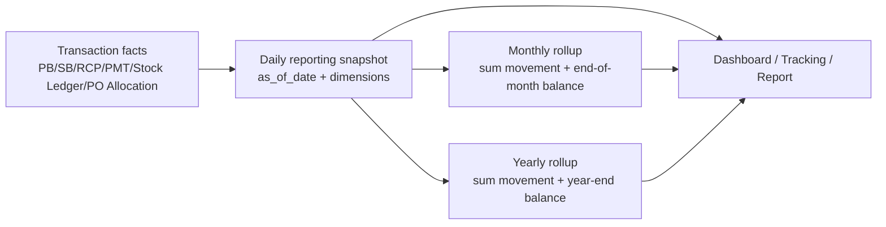

# Reporting History Snapshot Policy

กฎกลางสำหรับข้อมูลย้อนหลังที่ต้องเอาไปแสดงบน Dashboard, Report, Tracking 360, AR/AP, Stock, PO/Bill history และ rollup รายวัน/รายเดือน/รายปี

เอกสารนี้ต่อยอดจาก [[Document Timeline Policy]] และ [[Document History Table Design]]: timeline/history ใช้ตรวจว่าเอกสารเกิดอะไรขึ้น แต่ Dashboard ย้อนหลังต้องมี read-model/snapshot ที่ตอบคำถามแบบ `as of date` ได้โดยไม่อ่านยอดปัจจุบันผิดช่วงเวลา

## Core Decision

ข้อมูลสำหรับ report ย้อนหลังต้องแยก 3 ชั้น:

| Layer | หน้าที่ | ตัวอย่าง | ใช้ทำอะไร |
|---|---|---|---|
| Transaction facts | เหตุการณ์จริงที่เกิดและไม่ควรแก้ย้อนหลังแบบลบทิ้ง | `stock_ledger`, `sales_bill_lines`, `sales_bill_source_allocations`, `customer_receipt_allocations`, `payment_allocations`, `po_sell_allocation_logs`, status/usage logs | audit, drilldown, rebuild snapshot |
| Document snapshots | ภาพของเอกสาร ณ ตอนบันทึก/โพสต์ | `sales_bills.total_amount`, `receivable_balance`, `purchase_bills.payable_balance`, line cost/price/qty snapshot, supplier/customer snapshot | list/detail, AR/AP current, source link |
| Reporting snapshots | aggregate ที่ freeze ตามวัน/เดือน/ปี | future `reporting_daily_snapshots`, stock daily balance, AR/AP aging daily, PO outstanding daily | Dashboard ย้อนหลัง, owner daily, month/year trend |

ห้ามใช้ current-state table อย่างเดียวเพื่อ reconstruct ยอดย้อนหลัง เช่น stock balance ปัจจุบัน, PO remaining ปัจจุบัน, AR/AP balance ปัจจุบัน เพราะค่าเหล่านี้เปลี่ยนหลังจากมีการรับเงิน/จ่ายเงิน/ยกเลิก/รับของคืน/ตัด stock

## Date Contract

ทุก fact/snapshot ที่ใช้ report ต้องแยกวันที่เหล่านี้:

| Date | ความหมาย | ตัวอย่าง |
|---|---|---|
| `business_date` / `document_date` | วันที่เอกสารมีผลทางธุรกิจ | วันที่บิลซื้อ/บิลขาย, วันที่ใบส่งของ, วันที่รับเงิน/จ่ายเงินจริง |
| `created_at` | เวลาที่ user สร้างข้อมูลในระบบ | บันทึกย้อนหลังวันที่ 20 แต่สร้างจริงวันที่ 24 |
| `updated_at` | เวลาที่แก้ไข metadata/current state ล่าสุด | เปลี่ยนสถานะ/แก้เอกสาร |
| `posted_at` / `effective_at` | เวลาที่ movement มีผลกับ ledger/finance ถ้าแยกจาก document date | stock ledger, bank statement |
| `cancelled_at` / `reversed_at` | เวลาที่ยกเลิกหรือ reverse | ใช้หยุดนับ active/current แต่ยังต้องเห็น history |
| `as_of_date` | วันที่ report ต้องการมองย้อนกลับ | Dashboard วันที่ 2026-06-20 ต้องเห็นยอด ณ สิ้นวันนั้น |

Report รายวัน/รายเดือน/รายปีต้อง group ด้วย `business_date` เป็นหลัก และใช้ `created_at` เฉพาะ audit ว่าใครบันทึกเมื่อไหร่

## Domain Rules

| Domain | Source ชั้นแรก | Snapshot/aggregate ที่ต้องมี | กฎย้อนหลัง |
|---|---|---|---|
| Bill ย้อนหลัง (`PB`, `SB`) | bill header/line + allocation facts + status logs | daily sales/purchase amount, active/cancelled status as-of, line qty/price/cost snapshot | รายงานยอดขาย/ซื้อใช้ document date; cancelled/reversed ต้องมี event ที่ทำให้ report as-of ก่อน cancel ยังเห็นเอกสาร แต่หลัง cancel ไม่รวม active amount |
| PO ย้อนหลัง (`POB`, `POS`) | PO header/line + PB/SB allocation logs | daily PO outstanding, allocated qty/amount, short-close/cancel status | ห้ามใช้ `remaining` ปัจจุบันไปตอบอดีต ต้อง reconstruct จาก allocation/release logs หรือ daily snapshot |
| การเงินย้อนหลัง (`AR`, `AP`, `RCP`, `PMT`, advance, bank) | `sales_bills`/`purchase_bills` balance snapshots + receipt/payment/advance allocations + bank_statement | daily AR/AP aging, daily cash/bank balance, daily received/paid, advance remaining | AR/AP current ใช้ balance snapshot ของ bill; historical aging ต้องใช้ as-of balance จาก bill + active allocation facts ตามวันที่ |
| Stock ย้อนหลัง / real-time | `stock_ledger` append-only + hold/usage facts | current and daily stock qty/value by branch/warehouse/product/status, WAC as-of, pending_out/hold as-of | stock balance real-time ใช้ ledger ถึงเวลาปัจจุบัน; stock balance ย้อนหลังต้อง derive จาก ledger ถึง `as_of_date`. WAC/ต้นทุนเฉลี่ยต้องคำนวณจาก `sum(value_in - value_out) / sum(qty_in - qty_out)` ณ cutoff เดียวกัน; `pending_out` ไม่ใช่ ledger row และไม่เปลี่ยน WAC แต่ต้องมี hold/usage snapshot ถ้าจะโชว์ pending-out as-of |
| Dashboard รายวัน -> รายเดือน -> รายปี | daily reporting snapshots | monthly/yearly rollup derived from daily snapshots | รายเดือน/รายปีควร roll up จาก daily snapshot ที่ตรวจแล้ว ไม่ recompute จาก current state แบบสดทุกครั้ง |

## Minimum Fields For Reportable Facts

fact หรือ snapshot ที่ต้องเข้า Dashboard ย้อนหลังควรมีอย่างน้อย:

- `event_key` หรือ stable outward key
- `source_doc_no`, `source_doc_type`, และ source line key ถ้ามี
- `business_date` หรือ `document_date`
- `branch_id` / `branch_code`
- `customer_id` / `supplier_id` snapshot เมื่อเกี่ยวข้อง
- `product_id`, `product_code_snapshot`, `product_name_snapshot` เมื่อเกี่ยวกับสินค้า
- `warehouse_id`, `stock_status`, `lot_no` เมื่อเกี่ยวกับ stock
- signed `qty_in`, `qty_out`, `amount_in`, `amount_out`, หรือ `value_in/value_out`
- `unit_cost_snapshot`, `unit_price_snapshot`, `currency_code` เมื่อเกี่ยวกับมูลค่า
- `status`, `cancelled_at`, `reversed_at`, `created_by`, `updated_by`

## Daily / Monthly / Yearly Rollup

Target pipeline:

รายวันต้องเก็บทั้ง movement และ ending balance เมื่อ metric เป็นยอดคงเหลือ เช่น stock balance, AR/AP outstanding, cash/bank balance, PO outstanding. รายเดือน/รายปีต้องใช้ ending balance ของวันสุดท้ายในช่วงสำหรับ balance metric และใช้ sum สำหรับ movement metric

สำหรับ stock snapshot ต้องเก็บทั้ง `ending_qty`, `ending_value`, และ `ending_wac` ต่อ bucket (`branch + warehouse + product + lot/status/not_available`) เพราะ Dashboard ต้องตอบย้อนหลังได้ทั้งจำนวนและต้นทุนเฉลี่ย. ถ้ามี transaction ย้อนหลังหรือ reversal เข้าไปในวันเก่า ต้อง rebuild snapshot ตั้งแต่วันนั้นไปจนถึงวันปัจจุบัน ไม่ใช่แก้เฉพาะวันปัจจุบัน

## No-Fallback / Data Quality Rule

- ถ้า report ย้อนหลังขาด fact/snapshot ที่จำเป็น ต้องแสดงว่า data incomplete หรือ reconciliation gap; ห้าม fallback ไปใช้ยอด current เพื่อแทนยอดอดีต
- ถ้าข้อมูล legacy ไม่มี event ครบ ให้ backfill เป็น baseline/imported snapshot พร้อม metadata ว่าเป็น migrated baseline
- ถ้ามีการแก้ไขย้อนหลัง ต้อง append correction/reversal fact แล้ว rebuild snapshot ช่วงวันที่ได้รับผลกระทบ
- Dashboard/read-model ห้ามเขียน transaction, stock ledger, payment/receipt, หรือ status ของ source document

## Implementation Checklist

- [ ] กำหนดตารางหรือ view สำหรับ daily reporting snapshot แยกตาม domain: Bill, PO, Finance, Stock
- [ ] เพิ่ม `asOf` contract ให้ Dashboard/Tracking/Report ที่ต้องดูย้อนหลัง
- [ ] กำหนด Stock real-time/as-of read model ที่คืน `qty`, `value`, `WAC`, `pending_out`, และ `available` ด้วย cutoff เดียวกัน
- [ ] ทำ backfill/rebuild script จาก transaction facts สำหรับช่วงวันที่เลือก
- [ ] เพิ่ม source coverage matrix ว่า card/report แต่ละตัวอ่าน fact/snapshot ใด
- [ ] เพิ่ม reconciliation check: daily snapshot total เทียบกับ source facts
- [ ] ทำ UI warning เมื่อ snapshot ขาดหรือ stale แทนการแสดงยอดจาก current state แบบเงียบ

## Related Docs

- [[Main Dashboard Reports Flow]]
- [[Finance Debt Flow]]
- [[Finance Cash Position Page Flow]]
- [[Tracking 360 Flow]]
- [[Stock Ledger and Stock Balance]]
- [[Document Timeline Policy]]
- [[Document History Table Design]]
- [[Document Aging Policy]]
