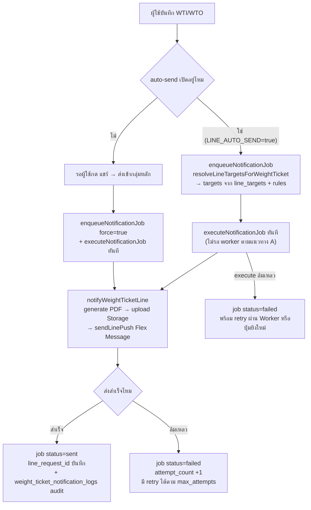

# WTI/WTO Flow / Flow ใบรับ-ส่งของ

เอกสารนี้เป็น canonical flow สำหรับหน้ากลุ่ม `ชั่งสินค้า / รับ-ส่งของ` ในระบบ Next app:

- route สร้าง/แก้ไข: `/daily/weight-tickets`
- route list/detail entry: `/daily/weight-ticket-list`
- route dashboard/read-model: `/daily/weight-ticket-dashboard`

จุดประสงค์ของเอกสารนี้คือแยกกติกาของ `WTI` และ `WTO` ออกจาก [[Purchase Flow]] และ [[Sales Flow]] ให้ชัด โดยหน้า WTI/WTO เป็นเจ้าของ flow เรื่อง:

- การสร้างเอกสารรับของ/ส่งของ
- กติกาหน้าฟอร์ม create/edit
- list/detail/timeline/print/share
- รูปสินค้า/รูปรถ
- สถานะเอกสารก่อนและหลังถูกนำไปใช้ downstream
- contract API เฉพาะหน้าสำหรับ option/product loading

ส่วน flow ซื้อและขายปลายทางให้ถือว่า:

- [[Purchase Flow]] เป็น owner ของ `WTI -> Purchase Bill`
- [[Sales Flow]] เป็น owner ของ `WTO -> Sales Bill`

## หลักการหลักของเอกสาร WTI/WTO

- ระบบ target ไม่ใช้เลข `WT` เดี่ยว
- ขาเข้าต้องใช้ `WTI{branchCode}{YYMM}-NNNN`
- ขาออกต้องใช้ `WTO{branchCode}{YYMM}-NNNN`
- เมื่อกดบันทึก ให้ถือว่าออกเอกสารจริงและมีผลต่อ usage/timeline ทันที แต่ยังไม่เขียน stock ledger
- เลขเอกสาร, วันที่เอกสาร, เวลา, และผู้บันทึก เป็น system-generated หลัง save เท่านั้น
- ผู้ใช้ต้องกรอกข้อมูลธุรกิจและน้ำหนักจริงก่อน ไม่ preview เลขเอกสารล่วงหน้า
- รูปต่อรายการสินค้าเป็นข้อมูลบังคับของเอกสาร WTI/WTO
- รูปสินค้าที่ใช้เลือกในฟอร์มเป็นเพียง master-data thumbnail เพื่อช่วยเลือกสินค้า ไม่ใช่หลักฐานแทนรูปหน้างาน
- PDF/LINE share ต้องให้หน้าแรกเป็นใบพิมพ์ A4 และต่อหน้า 2+ เป็นอัลบั้มรูปหลักฐานจากรูปรถและรูปสินค้า
- history/timeline ของเอกสารต้องเป็น append-only ตาม [[Document Timeline Policy]]

## ขอบเขตของ WTI กับ WTO

| เอกสาร | ใช้ทำอะไร | downstream หลัก | สถานะตั้งต้น |
|---|---|---|---|
| `WTI` | รับของเข้าหน้างาน/ยืนยันน้ำหนักขาเข้า | `Purchase Bill Stock` | `รับของแล้ว` |
| `WTO` | ส่งของออก/ยืนยันน้ำหนักขาออก | `Sales Bill Stock` | `ส่งของแล้ว` |

กติกาหลัก:

- `WTI` เป็น source document ฝั่งซื้อเข้า stock
- `WTO` เป็น source document ฝั่งส่งของ/ขายออก
- หน้า create/edit ใช้ route เดียวกัน แต่ type ต้องชัดว่าเป็น `WTI` หรือ `WTO`
- list page ต้องรวมทั้ง 2 เอกสาร แต่แยก tab/filter ตาม type
- เมื่อ user กดสร้างจาก list tab `WTO` ต้องเปิด `/daily/weight-tickets?type=WTO` เพื่อให้ฟอร์มเริ่มเป็นใบส่งของ ไม่ default เป็น `WTI`
- เมื่อ user กดสร้างจาก list tab `WTI` หรือ `WTO` ให้ซ่อน tab ของอีกประเภท และหลังสร้างแล้วห้ามเปลี่ยน type; API ต้อง reject การเปลี่ยน `WTI <-> WTO`

## ภาพรวม route และ API

| Surface | Route/API | หน้าที่ |
|---|---|---|
| Create/Edit page | `/daily/weight-tickets` | สร้าง/แก้ไข WTI/WTO |
| Dashboard | `/daily/weight-ticket-dashboard` | read-only dashboard สำหรับติดตาม WTI รอเปิด PB, WTO pending out, สรุปตามสถานะ/สาขา/สินค้า |
| List/Detail entry | `/daily/weight-ticket-list` | ค้นหา กรอง เปิด detail และเข้า edit |
| Dashboard API | `GET /api/daily/weight-ticket-dashboard` | สรุปจาก `weight_tickets`, `weight_ticket_product_summaries`, และ active `stock_holds` โดยไม่แสดง cost |
| Header options API | `GET /api/daily/weight-tickets/options` | โหลดสาขา ผู้ขาย ลูกค้า สิ่งเจือปน |
| Product picker API | `GET /api/daily/weight-tickets/products` | preload รายการสินค้าพร้อม thumbnail |
| WTO stock options API | `GET /api/daily/weight-tickets/stock-options` | API สำหรับคลัง RM/FG และคงเหลือรายสินค้า/สาขา/คลัง |
| Save API | `POST /api/daily/weight-tickets` | สร้างเอกสารใหม่ |
| Read/Update API | `GET/PUT/PATCH /api/daily/weight-tickets/{docNo}` | อ่าน detail แก้ไข และ cancel เอกสาร |

หลักการ loading:

- หน้า `/daily/weight-tickets` ต้องไม่ใช้ `/api/master-data/products?all=1` โดยตรง
- ต้องโหลด header options ผ่าน API page-scoped ก่อน
- หลัง options สำเร็จ ระบบ preload product options ต่อทันทีแบบ background
- product picker ต้องเห็นรูป thumbnail ได้โดยไม่ต้องรอผู้ใช้เลือกสาขาหรือคู่ค้าก่อน
- แต่ก่อน save ยังต้อง validate ว่ามีสาขาและคู่ค้าถูกต้องตาม type และคู่ค้านั้นต้องมี active branch mapping กับสาขาเอกสาร
- เมื่อมี `branchId` แล้ว header options API ต้องส่งเฉพาะ Supplier/Customer ที่ผูกกับสาขานั้นผ่าน active `supplier_branches` / `customer_branches`; ถ้าไม่มี mapping ต้องไม่แสดงเป็น option และห้าม fallback เป็นทุกสาขา
- ถ้า user เปลี่ยนสาขาและ Supplier/Customer เดิมไม่อยู่ใน mapping ของสาขาใหม่ UI ต้อง clear คู่ค้าเดิมทันที
- สำหรับ `WTO` ให้ user เลือกสินค้าใน line ก่อน แล้วค่อยเลือก `คลัง` ของสินค้านั้น เพื่อให้ทำงานสะดวกกว่า
- หลังเลือกสินค้าใน `WTO` แล้ว warehouse selector ของ line นั้นต้องแสดงเฉพาะคลัง `RM` / `FG` ที่ active และอยู่ในสาขาที่เลือก
- stock คงเหลือของ `WTO` จะแสดงได้ครบหลังมี `สาขา + สินค้า + คลัง`
- ฟอร์มต้องแสดง `คงเหลือจริง`, `จองไว้`, และ `พร้อมส่ง`
- `WTO` ต้อง validate จาก `พร้อมส่ง = คงเหลือจริง - รอออก` และสร้าง pending_out เมื่อ save
- final stock movement ยังเกิดตอนบันทึก `SB` โดย consume pending_out ของ WTO
- ไม่มี fallback จาก `WTO` ไป `Pending Sale / PSALE`; ถ้าของออกก่อนเปิดบิล ให้ถือว่า `WTO` เป็น pending_out source โดยตรงเท่านั้น

## หลักการคลังของ WTO

ในระบบนี้ `คลัง` ต้องถือเป็น stock location / stock dimension หลัก ไม่ใช่แค่ label ของสถานที่

stock คงเหลือต้องแยกอย่างน้อยตาม:

```text
สาขา + คลัง + สินค้า + สถานะสินค้า
```

ตัวอย่าง:

- สาขาเดียวกัน สินค้าเดียวกัน แต่คนละคลัง `RM` / `FG` ต้องถือว่าเป็น stock คนละกอง
- ถ้าสาขามีคลัง `RM` มากกว่า 1 คลัง ต้องเลือกคลังจริง ไม่ใช่เลือกแค่ประเภท `RM`
- dropdown ใน WTO ควร label ให้ user เข้าใจทั้งประเภทและชื่อคลัง เช่น `RM - คลังวัตถุดิบหลัก`

กติกา line-level ของ `WTO`:

- เลือก `สินค้า` ก่อน เพื่อให้ user ทำงานเร็วและเห็นรูป/ชื่อสินค้าได้ทันที
- หลังเลือกสินค้าแล้วให้เลือก `คลัง` ของสาขานั้น โดย filter เฉพาะคลัง active ที่ `type in (RM, FG)`
- WTO card หลักต้อง group ตาม `สินค้า + คลัง` เพราะนี่คือ stock bucket ที่ pending_out ใช้กัน stock จริง
- สินค้าเดียวกันแต่ต่างคลังให้มีคนละ card ได้ เพราะต้องกัน stock คนละคลัง
- สินค้าเดียวกันและคลังเดียวกันห้ามมีหลาย parent card; UI ต้องรวมเป็นเต๋า/lot ใหม่ใต้ card เดิม และ API ต้อง validate ซ้ำไม่ให้ payload ที่มี duplicate parent card บันทึกได้
- คงเหลือจะแสดงได้ครบหลังมี `สาขา + สินค้า + คลัง`
- ยอดที่ validate ตอน save ต้องเป็น `พร้อมส่ง` ไม่ใช่ `คงเหลือจริง`
- `พร้อมส่ง = คงเหลือจริง - จองไว้`
- line ต้องเก็บ intended warehouse เพื่อให้ `SB` ตัด stock ออกจากคลังเดียวกับที่จองไว้

## Current API / Implementation Alignment

ตรวจ ณ 2026-06-11:

| ส่วน | Current code | Target gap |
|---|---|---|
| `weight_ticket_lines` | มี `warehouse_id` สำหรับ intended warehouse ของ `WTO` แล้ว | ต้อง harden print/export ถ้าต้องแสดงคลัง |
| `stock_holds` | มี durable hold table และ helper สำหรับ `active/released/cancelled/consumed`; `WTO` source layer เหลือเฉพาะ hold ของ WTO และ `SB` consume/reopen เฉพาะกรณียังไม่มี return-from-WTO/SB เท่านั้น ไม่มี PSALE fallback helper | SB cancel ต้อง append `SB-CANCEL`; คืน hold เฉพาะกรณียังไม่มี return, ถ้า return แล้วต้องคืน stock ตรง |
| `GET /api/daily/weight-tickets/options` | ส่ง `branches`, `suppliers`, `customers`, `impurities` | ถ้ามี branch context ต้องกรอง suppliers/customers จาก branch mapping; ไม่ต้องส่ง warehouse options รวม เพราะขึ้นกับ branch + product |
| `GET /api/daily/weight-tickets/products` | ส่ง product options พร้อม `thumbnailUrl` | ยังไม่ส่ง availability และไม่ควรยัด stock ทุกคลังมากับ product list |
| `GET /api/daily/weight-tickets/stock-options` | ส่งคลัง active `RM/FG` พร้อม `onHandQty/onHoldQty/availableQty` ตาม branch + product | ใช้ใน WTO create/edit แล้ว |
| `POST /api/daily/weight-tickets` | validate WTO warehouse + available qty และสร้าง active hold ใน transaction | ตรง target หลัก |
| `PUT /api/daily/weight-tickets/{docNo}` | reject การเปลี่ยน type, release hold เดิม, validate ใหม่, rebuild hold ใหม่ใน transaction เมื่อยังไม่ถูกใช้ | เหลือ SB edit/cancel reversal/reopen hold |
| `PATCH /api/daily/weight-tickets/{docNo}` | cancel เอกสารและ mark active hold เป็น `cancelled` ใน transaction | ต้องคง lock เมื่อถูกใช้โดย bill |
| `stockBalanceSnapshot()` | aggregate `stock_ledger` ตาม product/branch/warehouse และแสดง `จองไว้ / พร้อมส่ง` จาก active hold | detail drilldown ของ hold ยังต้องเพิ่มถ้าต้องการ trace จาก stock page |

## No-Fallback WTO Source Contract

ตั้งแต่ 2026-06-24 เป็นต้นไป runtime ต้นทางของ `WTO` ต้องยึด contract นี้:

- `POST /api/daily/weight-tickets` เมื่อ `type = WTO` ต้องสร้าง `stock_holds.status = active` เท่านั้น
- `PUT /api/daily/weight-tickets/{docNo}` เมื่อ `WTO` ยังไม่ถูกใช้ ต้อง release hold เดิมแล้ว rebuild hold ใหม่ใน transaction เดียวกัน
- `PATCH /api/daily/weight-tickets/{docNo}` เมื่อ `WTO` ยังไม่ถูกใช้ ต้องเปลี่ยน active hold เป็น `cancelled`
- `WTO` ห้ามเขียน `stock_ledger` เองทุกกรณี
- `WTO` ห้ามสร้างหรือ consume `PSALE`
- การตัด stock จริงเกิดที่ `Sales Bill` เท่านั้น โดย consume hold แล้วเขียน `stock_ledger.ref_type = SB`
- การยกเลิก `Sales Bill` ต้อง append `stock_ledger.ref_type = SB-CANCEL`; เปิด hold ของ `WTO` กลับมาเป็น `active` เฉพาะกรณียังไม่มี return-from-WTO/SB ถ้า return แล้วห้าม reopen hold ซ้ำ

แนว API target ที่ควรใช้:

```http
GET /api/daily/weight-tickets/stock-options?branchId={branchCode}&productId={productCode}
```

response target:

```json
{
  "warehouses": [
    {
      "id": "WH-RM-01",
      "code": "WH-RM-01",
      "name": "คลังวัตถุดิบหลัก",
      "type": "RM",
      "branchId": "01",
      "onHandQty": 1000,
      "onHoldQty": 120,
      "availableQty": 880
    }
  ]
}
```

เหตุผลที่แยกเป็น API เฉพาะหน้า:

- product list ต้องเบาและโหลดรูป thumbnail ได้เร็ว
- stock availability ขึ้นกับ `branch + product + warehouse`
- hold-aware available qty ต้องคำนวณจาก ledger + active hold ใน server
- server ต้อง validate ซ้ำตอน save เพื่อกัน race condition ระหว่างหลาย user

## ระบบรับซื้อสิ่งเจือปนเป็นสินค้า (Auto-Buy Impurity Product Flow)

เพื่อความสะดวกในกรณีที่ทางโรงงานรับซื้อวัสดุที่มีสิ่งเจือปนปะปนเข้ามา (เช่น ทองแดงปนขยะ) และต้องการแปลงน้ำหนักที่ถูกหักจากสิ่งเจือปนนั้นไปสร้างเป็นรายการรับซื้อตัวใหม่ (เพื่อคิดเงินให้กับผู้ขายแยกต่างหากในเรทของสินค้าสิ่งเจือปนนั้นๆ) ระบบมีฟังก์ชัน **"รับซื้อสิ่งเจือปนเป็นสินค้า"** สำหรับเอกสาร `WTI`:

### 1. ลอจิกการทำงานและประเภทของสินค้า
- **การแยกประเภทสินค้า**: สินค้าจะถูกแยกกลุ่มออกจากกันอย่างเด็ดขาดผ่านฟิลด์ Category (ประเภทสินค้า):
  - สินค้าปกติ (`normalProducts`): สินค้าที่เป็นเนื้อโลหะหลักหรือสินค้าทั่วไปที่แสดงผลในลิสต์และปุ่มเพิ่มสินค้าหลัก
  - สินค้าสิ่งเจือปน (`impurityProducts`): สินค้ากลุ่มสิ่งเจือปน (เช่น ขยะ, กระดาษ, การ์ด) ที่ใช้เฉพาะในธุรกรรมการหัก/การรับซื้อสิ่งเจือปน
- **การเข้าถึงข้อมูล**: ข้อมูลสินค้าสิ่งเจือปนจะถูกแยกไปบริหารจัดการต่างหากผ่านเมนูย่อยและหน้าเพจ `/master-data/impurity-products` เพื่อป้องกันการเลือกสินค้าผิดฝั่ง

### 2. ลำดับขั้นตอนการใช้งาน (User Flow)
1. **เพิ่มแถวรายการสินค้าหลัก**: ผู้ใช้เพิ่มสินค้าปกติ (เช่น ทองแดง) และกรอกน้ำหนักขาเข้า (Gross) และค่าภาชนะตามปกติ
2. **เพิ่มรายการสิ่งเจือปน (Impurity Child Line)**:
   - ที่แถบรายละเอียดล็อตสินค้าด้านขวามือ ให้คลิกปุ่ม `+ เพิ่มเต๋าหักสิ่งเจือปน`
   - เลือกประเภทสิ่งเจือปน (เช่น ขยะ) และกรอกน้ำหนักที่ต้องการหักออก (เช่น หัก 10 กก.)
3. **การสั่งรับซื้อสิ่งเจือปน**:
   - บนแถวสิ่งเจือปนย่อยที่เพิ่มเข้ามา จะมีปุ่ม **"ซื้อ"** สีน้ำเงินแสดงขึ้นมา
   - เมื่อผู้ใช้คลิกปุ่ม **"ซื้อ"** ระบบจะทำงานดังนี้:
     - **ระบบค้นพบคู่แมตช์อัตโนมัติ (Auto-Match)**: หากชื่อประเภทสิ่งเจือปนตรงกับชื่อสินค้าในกลุ่ม "สินค้าสิ่งเจือปน" (เช่น สิ่งเจือปน "การ์ด" ตรงกับสินค้าสิ่งเจือปน "การ์ด") ระบบจะทำการสร้างแถวรายการรับซื้อใหม่ของสินค้าสิ่งเจือปนตัวนั้นเข้าสู่ใบชั่งน้ำหนักฝั่งซ้ายโดยทันทีเพื่อความสะดวกรวดเร็ว
     - **ระบบไม่พบการจับคู่ หรือเลือก "อื่นๆ"**: ระบบจะเปิดหน้าต่าง Dialog คอนเฟิร์มการรับซื้อขึ้นมา ให้ผู้ใช้เลือกค้นหาและระบุสินค้าสิ่งเจือปนที่ต้องการแปลง (แสดงเฉพาะตัวเลือกจากกลุ่ม `impurityProducts`) จากนั้นกด **"ยืนยันการรับซื้อ"**
4. **การเชื่อมโยงข้อมูลและหมายเหตุปลายทาง**:
   - ระบบจะสร้างแถวรายการรับซื้อหลัก (Parent Line) ตัวใหม่ของสินค้าสิ่งเจือปนนั้นๆ เพิ่มเข้าสู่เอกสาร WTI
   - ล็อตนี้จะมีน้ำหนัก Gross เท่ากับน้ำหนักที่หักไปจากรายการแรก (เช่น Gross = 10 กก.)
   - ที่ฟิลด์ **"หมายเหตุรายการ"** ของรายการรับซื้อใหม่ ระบบจะบันทึกข้อความอ้างอิงความเชื่อมโยงโดยอัตโนมัติเพื่อใช้ตรวจสอบย้อนกลับในรูปแบบ:
     `มาจากสิ่งเจือปน ({ชื่อสิ่งเจือปน} {น้ำหนัก} กก.) ของรายการที่ {ลำดับรายการแม่}: {รหัสสินค้าแม่} - {ชื่อสินค้าแม่}`
     (ตัวอย่างเช่น: *มาจากสิ่งเจือปน (อื่นๆ 13 กก.) ของรายการที่ 1: SKU235 - ก้ามเบรคแกะผ้า / เหล็ก*)
5. **การแสดงผลและปรับปรุงข้อมูล**:
   - เมื่อเลือกรายการสิ่งเจือปนนี้ขึ้นมาแก้ไขในแถบรายละเอียดด้านขวา ระบบจะรับทราบว่าเป็นแถวข้อมูลสินค้าสิ่งเจือปนและจะแสดงตัวเลือกตัวคัดกรองใน Dropdown ค้นหาและกล่องสุ่มรูปภาพ (Image Picker) เป็นกลุ่มสินค้าสิ่งเจือปนโดยเฉพาะ เพื่อป้องกันการเลือกข้ามชนิดกัน

## ภาพรวมข้อมูลในเอกสาร

### Header fields

| Field | ใช้กับ | หมายเหตุ |
|---|---|---|
| ประเภทเอกสาร | WTI/WTO | เลือก `WTI` หรือ `WTO` |
| สาขา | ทั้งคู่ | ใช้ทั้งใน business scope และเลขเอกสาร |
| ผู้ขาย | WTI | ใช้เฉพาะขาเข้า |
| ลูกค้า | WTO | ใช้เฉพาะขาออก |
| ทะเบียนรถ | ทั้งคู่ | ข้อมูลหน้างาน |
| รูปภาพรถส่งของ | ทั้งคู่ | แยกจากรูปต่อรายการสินค้า |
| หมายเหตุเอกสาร | ทั้งคู่ | ระดับเอกสาร |

### Line fields

| Field | หมายเหตุ |
|---|---|
| สินค้า | เลือกจาก product picker/search combobox |
| คลัง | ใช้กับ WTO; เลือกหลังสินค้าในแต่ละ line และแสดงเฉพาะคลัง `RM` / `FG` ของสาขาเดียวกัน |
| คงเหลือในคลัง | ใช้กับ WTO; แสดงตามสินค้า + คลังที่เลือกใน line นั้น |
| น้ำหนักเข้า/Gross | ค่าหลักของหน้างาน |
| วิธีหักสิ่งเจือปน | `ไม่หัก`, `หัก`, `หัก%` |
| สิ่งเจือปน | ใช้เมื่อ line มีการหัก |
| น้ำหนักหัก | derive ตาม mode/ค่าที่กรอก |
| น้ำหนักสุทธิ | ใช้เป็นยอด operational หลัก downstream |
| รูปต่อรายการสินค้า | บังคับอย่างน้อย 1 รูปต่อ line |
| หมายเหตุต่อรายการ | optional |

## โครงข้อมูล 3 ชั้นของ WTI/WTO

WTI/WTO ไม่ได้มีแค่ header + lines แต่ต้องมองเป็น 3 ชั้น:

1. `weight_tickets`
   - header และยอดรวมทั้งเอกสาร
2. `weight_ticket_lines`
   - lot ชั่งจริง / raw lines
3. `weight_ticket_product_summaries`
   - summary ระดับสินค้าต่อเอกสาร

รายละเอียด design ของชั้น summary อยู่ใน [[WTI Product Summary Design]]

กติกาสำคัญ:

- raw line ห้ามถูกทำลาย
- downstream ฝั่ง office ไม่ควรใช้ raw line เป็น operational source หลัก
- `Purchase Bill` และ `Sales Bill` ควรใช้ summary ระดับสินค้าสำหรับการ allocate เป็นหลัก

## Flow สร้าง WTI

| ขั้นตอน | ผู้ใช้ทำอะไร | ระบบทำอะไร | สถานะที่ได้ |
|---|---|---|---|
| 1 | เลือกประเภท `WTI` | เตรียมฟอร์มขาเข้า | draft ในหน้าจอ |
| 2 | เลือกสาขาและผู้ขาย | validate scope และ active `supplier_branches` | draft |
| 3 | กรอกทะเบียนรถ/รูปรถ | เก็บหลักฐานเอกสารระดับ header | draft |
| 4 | เพิ่มรายการสินค้า | เลือกสินค้า, กรอก gross/deduct/net, แนบรูปต่อรายการ | draft |
| 5 | กดบันทึก | ออกเลข `WTI...`, stamp วันเวลา/ผู้บันทึก, เขียน header/line/summary โดยไม่เขียน stock ledger | `รับของแล้ว` |

ผล downstream ของ `WTI`:

- ใช้เป็น source สำหรับ `Purchase Bill` เฉพาะกรณี `Stock`
- เมื่อบันทึก `WTI` สำเร็จ ยังไม่สร้าง stock movement; stock-in จะเกิดตอนบันทึก `Purchase Bill Stock`
- ถ้ายังไม่ถูกนำไปออกบิล จะอยู่สถานะ `รับของแล้ว`
- เมื่อถูกนำไปออก `Purchase Bill` ต้องตัดให้ครบทั้งเอกสารในบิลเดียว ห้ามเหลือ partial สำหรับไปออกบิลอีกใบ
- เมื่อถูกใช้แล้วต้องขยับเป็น `เสร็จสิ้น` ทันที

## Flow สร้าง WTO

| ขั้นตอน | ผู้ใช้ทำอะไร | ระบบทำอะไร | สถานะที่ได้ |
|---|---|---|---|
| 1 | เลือกประเภท `WTO` | เตรียมฟอร์มขาออก | draft ในหน้าจอ |
| 2 | เลือกสาขาและลูกค้า | validate scope และ active `customer_branches` | draft |
| 3 | กรอกทะเบียนรถ/รูปรถ | เก็บหลักฐานเอกสารระดับ header | draft |
| 4 | เพิ่มรายการสินค้า | เลือกสินค้าก่อน แล้วเลือกคลัง `RM` / `FG` ใน line นั้นเพื่อดูคงเหลือและ validate stock | draft |
| 5 | กดบันทึก | ออกเลข `WTO...`, stamp วันเวลา/ผู้บันทึก, เขียน header/line/summary, intended warehouse ต่อ line, และ active pending_out โดยไม่เขียน stock ledger | `ส่งของแล้ว` / `รอออก` |

ผล downstream ของ `WTO`:

- `WTO` เป็นเอกสารส่งของ/ชั่งขาออกต้นทาง แต่ไม่ใช่ movement owner ของ stock
- ตอนสร้าง `WTO` ให้เลือกสินค้าใน line ก่อน แล้วเลือก `warehouse` ของ line นั้นภายหลัง
- `warehouse` ของ `WTO` ต้อง active, อยู่ในสาขาเดียวกัน, และเป็นคลัง `RM` หรือ `FG` เท่านั้น
- stock availability ของ `WTO` เป็นราย line ตาม `สินค้า + warehouse`; ถ้ายังไม่เลือก warehouse ให้แสดงว่ายังไม่ทราบคงเหลือ แต่อย่า block การเลือกสินค้า
- ทุก line ของ `WTO` ต้องเก็บ intended warehouse และสร้าง pending_out เพื่อให้ `Sales Bill` ใช้เป็นคลังต้นทางในการตัด stock
- active pending_out ของ `WTO` ต้องลด available stock ทันที เพื่อกันการสร้าง WTO เพิ่มเกินยอดพร้อมส่ง
- เมื่อบันทึก `WTO` สำเร็จ ยังไม่สร้าง stock movement; stock-out จะเกิดตอนบันทึก `Sales Bill Stock`
- ใช้เป็น source สำหรับ `Sales Bill` ฝั่ง stock sale
- ถ้ายังไม่ถูกนำไปออกบิล จะอยู่สถานะ `ส่งของแล้ว`
- เมื่อถูกนำไปออก `Sales Bill` แล้วอาจออกบิลเต็มจำนวนหรือบางส่วนได้ แต่ `WTO` ใบนั้นยังเป็น source ของ `SB` เดียวเท่านั้น
- ถ้าออกบิลบางส่วน ยอดที่เหลือต้องคงเป็น `pending_out` เพื่อปิดด้วย action `รับของคืน` บน WTO detail; ห้ามนำยอดค้างนั้นไปเปิด `SB` ใบอื่นแบบเงียบ ๆ
- เมื่อถูกใช้ครบต้องขยับเป็น `ออกบิลแล้ว`; ถ้ายังมี active pending_out เหลือหลังออกบิล ให้เป็น `ออกบิลแล้วบางส่วน`

## WTO Two-Loops Model

`WTO` มี 2 loop ที่ต้องแยก owner ให้ชัด:

1. `warehouse / stock loop`
   - owner: หน้า `WTI/WTO` เฉพาะส่วนเก็บ intended warehouse, แสดง stock availability, และสร้าง/release pending_out
   - เกิดตอนสร้าง/แก้ไข/ยกเลิก `WTO`
   - รับผิดชอบ `product-first line entry`, `warehouse selection per line`, stock availability per product+warehouse, active pending_out, rebuild pending_out, และ release pending_out
2. `billing / usage loop`
   - owner: หน้า `Sales Bill`
   - เกิดตอน `WTO` ถูกนำไปออก `SB`
   - รับผิดชอบ consume hold, final stock validation, stock-out ledger, `weight_ticket_usage_logs`, และสถานะ `ส่งของแล้ว -> ออกบิลแล้วบางส่วน/ออกบิลแล้ว`
   - กรณีออกบิลบางส่วน owner ของปุ่ม `รับของคืน` คือ WTO detail แต่ write endpoint ยังคงผูก audit กลับไปที่ `SB` ที่ consume pending_out นั้น

ข้อห้าม:

- ห้าม `WTO` เขียน stock ledger เอง
- ห้าม `WTO` เป็นแค่ check stock เฉย ๆ โดยไม่กันยอดไว้
- ห้าม `SB` ตัด stock จาก warehouse อื่นโดยไม่มีเหตุผล/audit ถ้า `WTO` ระบุ intended warehouse แล้ว
- ถ้ายังไม่ได้บันทึก `SB` ให้ถือว่ายังไม่เกิด stock-out ในระบบ แม้มี `WTO` แล้วก็ตาม

## List Flow / รายการใบรับ-ส่งของ

route หลัก: `/daily/weight-ticket-list`

หน้าที่ของ page นี้:

- รวมรายการ `WTI` และ `WTO`
- มี tab แยกขาเข้า/ขาออก
- filter ตามสถานะ สาขา คู่ค้า วันที่ ทะเบียนรถ และคำค้น
- row click เปิด detail page/modal ตาม implementation ปัจจุบัน
- row actions รองรับ `พิมพ์`, `แชร์`, `แก้ไข`, `ยกเลิก` ตามสิทธิ์และสถานะ

กติกา UI หลัก:

- row ทั้งแถวต้องคลิกเข้า detail ได้
- row action ต้อง `stopPropagation()`
- status filter ของ WTI และ WTO ต้องแยกชุดกัน เพราะสถานะทางธุรกิจไม่เหมือนกัน
- branch filter ต้องใช้ shared branch combobox ตาม design baseline

## Detail / Timeline Flow

detail ของ WTI/WTO ต้องตอบได้ 4 เรื่องพร้อมกัน:

1. ข้อมูลเอกสารปัจจุบัน
2. รายการสินค้า/น้ำหนัก/รูป
3. downstream usage
4. timeline การเปลี่ยนแปลง

timeline ต้องครอบคลุมอย่างน้อย:

- สร้างเอกสาร
- แก้ไขเอกสาร
- ยกเลิกเอกสาร
- ถูกนำไปใช้ downstream
  - `WTI -> PB`
  - `WTO -> SB`

target rule:

- ระยะสั้น detail/timeline อาจยังอ่านจาก audit + usage facts ที่มีอยู่
- ระยะกลาง/ยาวควรแยก dedicated status/usage logs เป็น source of truth ตาม [[Document History Table Design]]

## กติกาแก้ไขและยกเลิก

### WTI

- ถ้า `WTI` ยังไม่ถูกใช้ใน `Purchase Bill` ต้องแก้ไข/ยกเลิกได้ตามสิทธิ์
- ถ้า `WTI` ถูกใช้ใน `Purchase Bill` แล้ว ต้อง lock ทันที เพราะ target flow บังคับตัดครบทั้งเอกสารในบิลเดียว
- การยกเลิกต้องไม่ลบเงียบ ต้องผ่าน status/timeline

### WTO

- ถ้า `WTO` ยังไม่ถูกใช้ใน `Sales Bill` ต้องแก้ไข/ยกเลิกได้ตามสิทธิ์
- การแก้ไข/ยกเลิก `WTO` ไม่ต้อง reverse stock เพราะ `WTO` ไม่ใช่ movement owner
- ถ้า `WTO` ถูกใช้ใน `Sales Bill` แล้ว ต้อง lock edit/cancel ทันที แม้เป็น `ออกบิลแล้วบางส่วน`; ยอด pending_out ที่เหลือต้องปิดด้วย `รับของคืน` ไม่ใช่แก้ WTO เดิม
- การยกเลิกต้องไม่ลบเงียบ ต้องผ่าน status/timeline

### หลักการร่วม

- ใช้ usage facts จริงเป็นตัวตัดสิน lock/edit/cancel
- ไม่ใช้แค่ status string อย่างเดียว
- ถ้า downstream document ถูก cancel/reverse แล้ว ต้อง recalc การ lock ของ WTI/WTO กลับจาก facts ที่ active อยู่จริง

## Mutability / Lock Rules

ให้แยก `document status` ออกจาก `mutability state` ชัดเจน

### Document status

- `WTI`: `รับของแล้ว`, `เสร็จสิ้น`, `ยกเลิก`
- `WTO`: `ส่งของแล้ว`, `ออกบิลแล้วบางส่วน`, `ออกบิลแล้ว`, `ยกเลิก`

### Mutability state

- `edit allowed`
- `cancel allowed`
- `edit locked`
- `cancel locked`

กติกา:

- ถ้าเอกสารยังไม่ถูกใช้ downstream:
  - `edit = allowed`
  - `cancel = allowed`
- ถ้าเอกสารถูกใช้ downstream แล้ว:
  - `edit = locked`
  - `cancel = locked`

mapping:

- `WTI` ถูกใช้โดย `PB` -> lock edit/cancel
- `WTO` ถูกใช้โดย `SB` -> lock edit/cancel

ข้อสำคัญ:

- lock state ต้อง derive จาก active usage facts ไม่ใช่ derive จาก status string อย่างเดียว
- ถ้า downstream document ถูก reverse/cancel สำเร็จแล้ว ต้อง recalc mutability state กลับจาก facts ที่ยัง active จริง

## Stock Reverse Rules

หัวข้อนี้อยู่ที่เอกสาร bill เพราะ target กลับมาเป็น bill-driven ตาม legacy

### Edit / Cancel WTI-WTO

- ถ้า `WTI/WTO` ยังไม่ถูกใช้ใน `PB/SB` ให้แก้ไขหรือยกเลิกเอกสารได้ตามสิทธิ์
- การแก้ไขหรือยกเลิก `WTI/WTO` ไม่ต้อง reverse stock ledger เพราะเอกสารนี้ไม่ได้สร้าง movement
- ถ้าแก้ไข `WTO` ที่ยังไม่ถูกใช้ ต้อง rebuild active hold ให้ตรง line ล่าสุดใน transaction เดียวกัน
- ถ้ายกเลิก `WTO` ที่ยังไม่ถูกใช้ ต้อง release active hold ทั้งหมด
- ถ้า `WTI/WTO` ถูกใช้ใน active `PB/SB` แล้ว ต้อง lock edit/cancel

### Edit / Cancel PB-SB ที่อ้าง WTI-WTO

- `PB` ที่อ้าง `WTI` ต้องเป็น owner ของ stock-in ledger
- `SB` ที่อ้าง `WTO` ต้อง consume hold และเป็น owner ของ stock-out ledger
- ถ้าแก้ไข `PB/SB` ต้อง reverse/rebuild movement ของ bill นั้นใน transaction เดียวกัน
- ถ้ายกเลิก `PB/SB` ต้อง reverse movement ของ bill นั้น และ release/recalc usage/status ของ `WTI/WTO`
- ถ้ายกเลิก `SB` ที่ consume hold จาก `WTO` แล้ว และยังไม่มี return-from-WTO/SB ต้อง reopen/recreate hold เพื่อให้ stock ไม่กลับไป available ให้ขายซ้ำก่อนออกบิลใหม่; ถ้า return แล้ว ให้ `SB-CANCEL` คืน stock ตรงและคง return/diff audit เดิมไว้

### Guard rail

- ถ้า `WTO` ถูกใช้ใน `SB` แล้ว ห้าม edit/cancel เพื่อไม่ให้ stock layer กับ billing layer หลุดจากกัน
- การ reverse stock ต้องอิง ledger/source movement เดิมของ `PB/SB` ไม่ใช่คำนวณใหม่แบบ best guess จาก WTI/WTO อย่างเดียว

## รูปสินค้าและรูปรถ

WTI/WTO มีรูป 2 ระดับ:

1. รูปรถระดับเอกสาร
2. รูประดับรายการสินค้า

### รูประดับรายการสินค้า

- บังคับอย่างน้อย 1 รูปต่อ line
- เป็นหลักฐานหน้างาน
- ต้องแยกจาก master product image

### รูปสินค้าใน product picker

- มาจาก `products.image_storage_key` และ `products.image_thumbnail_storage_key`
- โหลดผ่าน `/api/daily/weight-tickets/products`
- ใช้ thumbnail เพื่อให้ picker เบาและ render เร็ว
- ไม่ต้องรอเลือกสาขาหรือคู่ค้าก่อนจึงเห็นรูปสินค้า

## Print และ Share

### Print

- `WTI` และ `WTO` ต้องพิมพ์ได้จากหน้า list และ detail
- ใช้ข้อมูลบริษัทจาก `ข้อมูลบริษัท (สำหรับใบพิมพ์)`
- ใช้ wording แยกตามทิศทางเอกสาร
  - `WTI` = ใบรับสินค้า / ผู้ขาย / ผู้รับของ
  - `WTO` = ใบส่งของ / ลูกค้า / ผู้ส่งของ / ผู้รับของ

### Share

- list page ต้องมี action `แชร์`
- current share message ใช้ข้อความสั้นเพื่อส่งต่อ เช่น เลขเอกสาร คู่ค้า สาขา วันเวลา น้ำหนักสุทธิ และลิงก์ detail
- share เป็น convenience action ไม่เปลี่ยนสถานะเอกสาร

รายละเอียดเรื่อง printable contract ระดับระบบดูที่ [[Printable Documents]]

## จุดตัดกับ Purchase Flow

`WTI` ใช้ใน Purchase Flow เฉพาะกรณี `Stock`

handoff rule:

- `WTI` เป็น source document ของ `Purchase Bill Stock`
- `Purchase Bill` ต้องดึงจาก product summary เป็นหลัก
- target ใหม่เป็น `WTI 1 ใบ -> PB 1 ใบ`
- `WTI` ต้องถูกใช้ครบใน `PB` เดียว ห้าม split ไปหลาย `PB`
- `PB` แบบ Stock ใน flow นี้ต้องเลือก `WTI` ได้ 1 ใบเป็น source หลัก แต่ภายใน PB เดียวยัง split allocation ระดับสินค้าไปหลาย `PO Buy` หรือ `Spot Buy` ได้
- `PB` เป็น movement owner: เมื่อ save `PB Stock` ต้องเขียน stock-in ledger โดยอ้าง `WTI`
- หลัง save/cancel `PB` ระบบต้อง recalc usage และ status ของ `WTI`

รายละเอียดเชิงซื้อให้ดู [[Purchase Flow]] และ [[Purchase Bills Page Flow]]

## จุดตัดกับ Sales Flow

`WTO` ใช้ใน Sales Flow สำหรับ stock delivery / stock sale

handoff rule:

- `WTO` เป็น source document ของ `Sales Bill`
- `Sales Bill` ต้อง allocate usage ต่อสินค้า/summary ให้ครบตามกติกาหน้าขาย
- target ใหม่เป็น `WTO 1 ใบ -> SB 1 ใบ`
- `WTO` ต้องไม่ split ไปหลาย `SB`; ถ้า `SB` ขายไม่ครบ น้ำหนักที่เหลือต้องคงเป็น active `pending_out` และปิดด้วย `รับของคืน` / loss จาก WTO detail
- `SB` เป็น movement owner: เมื่อ save `SB Stock` ต้อง consume hold และเขียน stock-out ledger โดยอ้าง intended warehouse จาก `WTO`
- หลัง save/cancel `SB` ระบบต้อง recalc usage และ status ของ `WTO`

รายละเอียดเชิงขายให้ดู [[Sales Flow]] และ [[Sales Bills Page Flow]]

## ประวัติการแก้ไขและผลกระทบ stock

WTI/WTO ใช้ timeline ระดับเอกสารร่วมกัน แต่ผลกระทบ stock ไม่เหมือนกัน:

| ส่วน | WTI / ใบรับของ | WTO / ใบส่งของ |
|---|---|---|
| บันทึกเอกสาร | เก็บหลักฐานรับของ น้ำหนัก รูป และ summary เพื่อใช้เปิด Purchase Bill | เก็บหลักฐานส่งของ น้ำหนัก รูป และ summary เพื่อใช้เปิด Sales Bill |
| ผลต่อ stock ตอนบันทึก | ไม่เขียน stock ledger และไม่กัน stock | สร้าง/ปรับ `pending_out` ใน `stock_holds` เพื่อกันของเป็น `รอออก` |
| ราคาต้นทุนเฉลี่ย | ไม่ snapshot cost ในเอกสาร WTI | snapshot ราคาต้นทุนเฉลี่ยของ pending_out ตอน confirm หรือเมื่อมีส่วนเพิ่ม/เต๋าใหม่หลัง confirm |
| ประวัติ field ที่แก้ | เก็บใน `weight_ticket_status_logs.meta.changes` | เก็บใน `weight_ticket_status_logs.meta.changes` เหมือนกัน |
| ประวัติ pending_out/cost | ไม่มี เพราะ WTI ไม่กัน stock | เก็บ immutable audit ใน `weight_ticket_pending_out_events` แยกจาก `stock_holds` |
| downstream หลัก | Purchase Bill เป็น owner ของ stock-in ledger | Sales Bill เป็น owner ของ stock-out ledger โดย consume pending_out |

รายละเอียดที่ถูกเก็บใน `weight_ticket_status_logs.meta.changes` เป็น before/after ของการแก้ไขเอกสาร ไม่ใช่ stock movement และไม่ใช่ตัวเลข current stock:

- ระดับเอกสาร: เลขที่เอกสาร, สาขา, ผู้ขาย/ลูกค้า, ทะเบียนรถ, หมายเหตุ, รูปเอกสาร, น้ำหนักรวม, หักภาชนะ, หักสิ่งเจือปน, น้ำหนักสุทธิ
- ระดับรายการ/เต๋า: เพิ่มรายการ, ลบรายการ, สินค้า, คลัง, น้ำหนักรวม, หักภาชนะ, ประเภทการหัก, ค่าหัก, หักสิ่งเจือปน, น้ำหนักสุทธิ, สิ่งเจือปน, รูปสินค้า, หมายเหตุรายการ

การแสดงผลใน detail/timeline:

- timeline หลักยังเป็น `weight_ticket_status_logs`
- ถ้าเป็น WTI หรือ event ที่ไม่มี pending_out/cost ให้แสดง timeline ระดับเอกสารตามปกติ
- ถ้าเป็น WTO และ event นั้นมี pending_out/cost audit ให้แสดงปุ่ม `ดูรายการเปลี่ยนแปลง`; เมื่อขยายจะแสดงตารางเดียวที่รวม pending_out/cost row และสรุป field change ที่เกี่ยวข้องในคอลัมน์ `รายการเปลี่ยนแปลง`
- ไม่ต้องมีตาราง field-detail แยกด้านล่าง เพราะคอลัมน์ `รายการเปลี่ยนแปลง` ในตารางเดียวกันต้องบอกให้ชัดอยู่แล้ว เช่น `เปลี่ยนคลัง: FG สมุทรสาคร -> RM สมุทรสาคร` หรือ `เปลี่ยนน้ำหนักสุทธิ: 30.00 กก. -> 25.00 กก.`
- ห้าม fallback เพื่อเดาว่ามีอะไรเปลี่ยนจากข้อมูลปัจจุบัน ถ้าต้องแสดงประวัติ ต้องมาจาก `weight_ticket_status_logs.meta.changes` หรือ `weight_ticket_pending_out_events` ที่ถูกเขียนใน transaction นั้น

Implementation separation checkpoint 2026-06-30:

- route/API ยังเป็น URL เดิมเพื่อไม่กระทบ list/detail/create/edit เดิม
- field-level edit audit ถูกแยกเป็น `apps/next/src/lib/server/weight-ticket-write/edit-audit.ts`
- API URL ยังไม่แยกเป็น `/wti` และ `/wto`; route เดิม delegate internal write decisions ไปที่ `apps/next/src/lib/server/weight-ticket-write/handlers.ts`
- `handlers.ts` แยก decision กลางที่ route เคย branch เอง เช่น party snapshot, warehouse resolution, stock validation, และ pending_out create/edit side effect
- WTI-specific write guard อยู่ใน `apps/next/src/lib/server/weight-ticket-write/wti.ts` เช่น supplier eligibility
- WTO-specific write guard อยู่ใน `apps/next/src/lib/server/weight-ticket-write/wto.ts` เช่น customer eligibility และ WTO-only impurity restriction
- WTO edit pending_out/cost plan อยู่ใน `apps/next/src/lib/server/weight-ticket-write/wto.ts` เพื่อให้การ preserve cost snapshot, audit event type, และ qty-before map เป็น logic ของใบส่งของ ไม่กระจายใน API route
- `apps/next/src/lib/server/weight-ticket-write/type-guards.ts` เป็นตัวประสานตาม `values.type` เพื่อให้ route ไม่ต้องมี WTI/WTO guard กระจายหลายจุด
- stock/cost side effect ของ WTO ยังอยู่ใน `stock-holds.ts` และ `weight-ticket-pending-out-events.ts`; WTI ไม่เรียก path เหล่านี้

## สถานะเป้าหมายของ WTI/WTO

สถานะของ WTI/WTO ต้องแยกจากสถานะของเอกสาร downstream:

| เอกสาร | ชุดสถานะ user-facing | ไม่ใช้สถานะนี้ใน target |
|---|---|---|
| `WTI` | `รับของแล้ว`, `เสร็จสิ้น`, `ยกเลิก` | `รับบางส่วน`, `ออกบิลบางส่วน` |
| `WTO` | `ส่งของแล้ว`, `ออกบิลแล้วบางส่วน`, `ออกบิลแล้ว`, `ยกเลิก` | `ส่งบางส่วน` |

หลักการ:

- `draft` เป็น state บนหน้าจอก่อน save เท่านั้น ไม่ใช่สถานะเอกสารที่บันทึกลง lifecycle
- `WTI` เป็น all-or-nothing document ใน target write path: 1 ใบต้องถูกใช้ครบใน downstream PB เดียว
- `WTO` เป็น one-SB source: 1 ใบใช้กับ `SB` เดียว แต่ `SB` อาจขายบางส่วนได้; partial ของ WTO หมายถึงยังมี active `pending_out` รอรับคืน/บันทึก loss ไม่ใช่ยอดรอออกบิลใบถัดไป
- สถานะ partial ใช้ได้กับ `POB/POS` และใช้กับ `WTO` เฉพาะกรณี `ออกบิลแล้วบางส่วน`; `WTI` ไม่มี partial target status
- lock edit/cancel ต้อง derive จาก active usage facts (`WTI -> PB`, `WTO -> SB`) ไม่ใช่ derive จาก status string อย่างเดียว

### WTI

| raw status | label ที่ user เห็น | ความหมาย |
|---|---|---|
| `received` | `รับของแล้ว` | ยังไม่ถูกใช้ใน PB |
| `billed` | `เสร็จสิ้น` | ถูกใช้ใน PB ครบแล้ว |
| `cancelled` | `ยกเลิก` | เอกสารถูกยกเลิก |

### WTO

| raw status | label ที่ user เห็น | ความหมาย |
|---|---|---|
| `delivered` หรือ equivalent | `ส่งของแล้ว` | ยังไม่ถูกใช้ใน SB |
| `partially_billed` | `ออกบิลแล้วบางส่วน` | ถูกใช้ใน SB แล้วบางส่วนและยังมี active pending_out รอรับคืน/บันทึก loss |
| `billed` | `ออกบิลแล้ว` | ถูกใช้ใน SB ครบแล้ว |
| `cancelled` | `ยกเลิก` | เอกสารถูกยกเลิก |

## Use Case Map

| Use Case | ชื่อกรณี | ครอบคลุมในเอกสารนี้ | สถานะ |
|---|---|---|---|
| `UC-WT-01` | สร้าง WTI เพื่อรับของเข้า | ใช่ | ครบระดับ business flow |
| `UC-WT-02` | สร้าง WTO เพื่อส่งของออก | ใช่ | ครบระดับ business flow |
| `UC-WT-03` | ค้นหา/กรอง WTI/WTO ใน list page | ใช่ | ครบระดับ page flow |
| `UC-WT-04` | เปิด detail และดู timeline | ใช่ | ครบระดับ page flow |
| `UC-WT-05` | ใช้ WTI ไปออก PB แล้ว recalc status | ใช่ | handoff covered |
| `UC-WT-06` | ใช้ WTO ไปออก SB แล้ว recalc status | ใช่ | handoff covered |
| `UC-WT-07` | พิมพ์ WTI/WTO | ใช่ | ครบระดับ page flow |
| `UC-WT-08` | แชร์ WTI/WTO | ใช่ | ครบระดับ page flow |

## เรื่องที่ยังเป็น follow-up

| เรื่อง | เหตุผล |
|---|---|
| dedicated `weight_ticket_status_logs` / `weight_ticket_usage_logs` | ให้ timeline/read model แยกจาก audit log รวม |
| policy รายละเอียดของ partial unlock หลัง downstream cancel/reversal | ต้อง finalize จาก usage facts ของ PB/SB ทุกกรณี |
| image cleanup/orphan policy ของรูปหน้างาน | ต้องกำหนด lifecycle ตอน edit/cancel/replace ให้ชัด |
| report/reconciliation และ aging เอกสาร WTI/WTO แยกหน้า | flow หลักมีแล้ว แต่รายงานตรวจสอบและ aging ต้องอิง [[Document Aging Policy]] เพิ่ม |

## Remaining Implementation Gaps

หลัง normalize สถานะ WTI/WTO แล้ว งานที่ยังต้องตาม implementation มี 5 กลุ่ม:

| กลุ่มงาน | ต้องทำอะไร | เหตุผล |
|---|---|---|
| `SB edit/cancel reversal` | เมื่อมี write path edit/cancel ของ `SB` ต้อง reverse ledger และ reopen/release hold/usage facts ให้ถูกตาม return state | create path consume hold แล้ว; cancel ก่อน return ต้อง reopen hold แต่ cancel หลัง return ต้องคืน stock ตรงด้วย `SB-CANCEL` |
| `Stock balance drilldown` | เพิ่ม drilldown ให้เห็นว่า `on hold` มาจาก `WTO` ใบไหน line ไหน | ให้ผู้ใช้ตรวจที่มาของยอดจองได้จากหน้าสต็อก |
| `Usage / timeline QA` | พิสูจน์ detail/timeline ว่าเห็น downstream usage ของ `WTI -> PB` / `WTO -> SB` ครบทุกกรณี | ใช้ lock/edit/cancel และ audit จาก facts จริง |
| `Status labels` | ตรวจ list/detail/filter/print/downstream reference ให้ใช้ status canonical: WTI ไม่มี partial, WTO มี `ออกบิลแล้วบางส่วน` เฉพาะ active pending_out หลัง partial SB และต้องปิดด้วย `รับของคืน` | ป้องกัน UI กลับไปใช้ legacy wording |
| `Reports` | ทำ aging/reconciliation สำหรับ WTI/WTO ค้างออกบิล, legacy partial-billed debt, และ status ไม่ตรง usage | ใช้ตรวจข้อมูลเก่าและ migration debt |

## Backlog ที่ควรทำต่อ

- [x] เพิ่มปุ่ม `กลับไปหน้ารายการ` บนหน้า create/edit
- [x] เพิ่มปุ่ม `กลับไปหน้ารายการ` ใน footer fixed action bar ข้างปุ่มบันทึก
- [x] ปรับ UX/API ของ `WTO` ให้เลือกสินค้าใน line ก่อน แล้วเลือกคลัง `RM/FG` ต่อ line พร้อมแสดงคงเหลือและ validate stock จาก `สินค้า + คลัง`
- [x] เพิ่ม pending_out/reservation สำหรับ `WTO`: create/rebuild/release pending_out และแสดง `คงเหลือจริง / รอออก / พร้อมส่ง`
- [x] เติม `SB Stock` ให้ consume pending_out แล้วเขียน stock-out ledger โดยอ้าง `WTO` และ intended warehouse ตาม bill-driven target ใน create path
- [x] เติม downstream trace baseline ใน detail ให้เห็นว่า `WTI/WTO` ถูกใช้กับ `PB/SB` ไหน ใช้ไปเท่าไร และเหลือเท่าไร
- [x] แยก `weight_ticket_status_logs` และ `weight_ticket_usage_logs` ออกจาก generic audit log
- [x] ล็อก type บนหน้า create/edit และ API ไม่ให้เปลี่ยน `WTI <-> WTO`
- [ ] ปิดกติกา lock/edit/cancel ทุก edge case โดยอิง usage facts จริง ไม่อิง status string อย่างเดียว โดยเฉพาะ downstream edit/cancel/reversal
- [ ] ตรวจและ unify label/status ทุก surface: detail, print, export, และ downstream references
- [ ] กำหนด lifecycle ของรูปรถและรูปรายการสินค้า: replace, remove, cancel, orphan cleanup
- [ ] ตรวจ branch-scope และ permission ของ WTI/WTO APIs และ read models ให้ครบ
- [ ] ทำ reconciliation/report สำหรับ `WTI/WTO ค้างออกบิล`, aging bucket, legacy partial-billed debt, และ `status ไม่ตรง usage`
- [ ] harden print/share wording, signature labels, และ header company info
- [ ] ทำ browser QA จริงทั้ง desktop/mobile ครบ flow create/edit/cancel/detail/print/share และ handoff ไป `PB/SB`
## การจัดเรียงและการแสดงผลตามมาตรฐาน AcexPOS (Sorting & Table Styling)

หน้าจอรายการใบรับ-ส่งของ (`/daily/weight-ticket-list`) ได้รับการปรับปรุงตามมาตรฐาน AcexPOS UI:
1. **การเรียงลำดับข้อมูล (Sorting)**:
   - **ความจำเป็นทางธุรกิจ**: ผู้ใช้จำเป็นต้องสามารถจัดเรียงลำดับใบรับ-ส่งสินค้าจำนวนมากตามมิติต่างๆ เช่น วันที่, เลขที่เอกสาร, น้ำหนัก, คู่ค้า หรือสถานะ เพื่อให้ค้นหา ตรวจสอบ และจับคู่บิลได้สะดวกรวดเร็ว
   - **การทำงานร่วมกันระหว่าง Client และ Server**:
     - ฝั่ง Client (ใน `WeightTicketListPageClient.tsx`): ใช้คอมโพเนนต์ `<SortHeader>` ครบถ้วนทุกคอลัมน์หลักบน Desktop พร้อมส่งคำขอ `sortBy` และ `sortDir` ไปยัง API
     - ฝั่ง Server (ใน `src/lib/server/weight-tickets.ts`): ฟังก์ชัน `weightTicketOrderBy` จะแปลงฟิลด์เรียงลำดับที่มาจาก Client ไปเป็นคิวรีเรียงลำดับระดับฐานข้อมูลผ่าน Prisma โดยตรง (เช่น จัดเรียงตาม `doc_no`, `party_name`, `net_weight`, `container_deduction_weight`, `deduct_weight`, `branches.name` ฯลฯ)
2. **การแสดงผลแบบตารางและขอบตาราง (Table Borders)**:
   - ใช้ขอบตารางบางเบา `border-slate-200` ครอบรอบตาราง Desktop และแบ่งแถวด้วย `divide-y divide-slate-100` ร่วมกับเอฟเฟกต์โฮเวอร์ `hover:bg-slate-50` เพื่อความสวยงามและสบายตาตามข้อกำหนด AcexPOS (หลีกเลี่ยงขอบเส้นสีดำเข้มหรือสีเด่นชัด)
   - หน้าจอเดสก์ท็อปรองรับคอลัมน์แบบยืดหดได้ (Resizable Columns) และแสดงผลปุ่ม "คืนค่าเดิมตาราง" (Reset Widths) เมื่อผู้ใช้เริ่มลากเส้นปรับแต่งขนาด

## เมนูที่ใช้ใน flow นี้

| Step | เมนู | Route |
|---|---|---|
| สร้าง/แก้ไขใบรับ-ส่งของ | `รายการประจำวัน > ชั่งสินค้า / รับ-ส่งของ` | `/daily/weight-tickets` |
| ค้นหารายการใบรับ-ส่งของ | `รายการประจำวัน > รายการใบรับ-ส่งของ` | `/daily/weight-ticket-list` |
| ออกบิลรับซื้อจาก WTI | `รายการประจำวัน > บิลรับซื้อ` | `/purchase/bills` |
| ออกบิลขายจาก WTO | รายการประจำวัน > บิลขาย | /sales/bills |

## การปรับปรุงและบำบัดระบบ WTI/WTO (มิถุนายน 2026)

ในการปรับปรุงรอบนี้ ได้มีการแก้ไขและอัปเกรดระบบ WTI/WTO ใน 5 ประเด็นสำคัญตาม Backlog เพื่อแก้ไขความสับสนและอำนวยความสะดวกให้ผู้ใช้งานหน้างาน:

1. **การแสดงจำนวนเต๋าแทนจำนวนรูปภาพในหน้าฟอร์ม (NSERP-84)**:
   - **แนวคิดการออกแบบ**: แต่เดิมในแถบรายการสินค้าด้านซ้ายของ Modal ใบรับ-ส่งของแสดงคำว่า "X รูป" ซึ่งทำให้ผู้ใช้งานสับสน เนื่องจากผู้ใช้งานหน้างานสนใจนับจำนวนรอบชั่งสินค้า/กองสินค้า ("เต๋า" หรือ Lot) มากกว่าจำนวนไฟล์รูปภาพหลักฐาน
   - **การแก้ไข**: เปลี่ยนการแสดงผลในแถบรายการด้านซ้ายจาก `{getLineEvidenceImages(line).length} รูป` ไปเป็นจำนวนเต๋าชั่งจริงผ่านฟังก์ชันคำนวณจำนวน Lot `{calculateRealLotSummary(line, form.lines).lotCount} เต๋า`

2. **การรวมรายการสินค้าที่มี 1 เต๋าเป็นบรรทัดสีเขียวบรรทัดเดียวในหน้าเอกสาร PDF (NSERP-83)**:
   - **แนวคิดการออกแบบ**: สำหรับรายการสินค้าที่มีการชั่งน้ำหนักเพียงเต๋าเดียว (1 Lot) การแสดงผลในหน้าเอกสาร PDF ไม่จำเป็นต้องแยกแถวรายการสินค้ากับแถวประวัติเต๋า เพราะทำให้เอกสารยาวโดยไม่จำเป็น ควรยุบข้อมูลขึ้นไปแสดงในบรรทัด Highlight สรุป (บรรทัดสีเขียว) เป็นบรรทัดเดียวได้เลย และนำข้อมูลสิ่งเจือปน/โน้ตไปรวบแสดงในคอลัมน์รายละเอียด (Description)
   - **การแก้ไข**: ปรับตรรกะในฟังก์ชัน `buildPrintWeightRows` โดยตรวจสอบว่ารายการสินค้ามีจำนวน Lot จริงเพียง 1 รายการ (`realLotLines.length === 1`) หรือไม่ หากใช่ จะทำการข้ามแถวเต๋าย่อยและยุบยอดน้ำหนักทั้งหมดขึ้นไปที่แถวสินค้าหลัก (`product-total` class ซึ่งจะแสดงพื้นหลังสีเขียวพรีเมียม) พร้อมนำรายการสิ่งเจือปนและโน้ตมาต่อข้อความแสดงในคอลัมน์รายละเอียด

3. **การเรียงลำดับสินค้าตามลำดับการชั่งน้ำหนักจริง (NSERP-82)**:
   - **แนวคิดการออกแบบ**: เอกสารใบรับ-ส่งของหน้ารายละเอียด และหน้าเอกสาร PDF พิมพ์ใบรับสินค้า ควรแสดงรายการสินค้าเรียงตามลำดับที่ผู้ใช้ชั่งน้ำหนักจริง (Weighing/Insertion Order) เพื่อให้ง่ายต่อการตรวจสอบย้อนกลับและเทียบกับใบชั่งรถกระดาษ ไม่ควรจัดเรียงลำดับสินค้าตามตัวอักษรโดยอัตโนมัติ
   - **การแก้ไข**: นำตรรกะการเรียงลำดับตามชื่อตัวอักษรออกในขั้นตอนการประมวลผลข้อมูล (ในไฟล์ `weight-tickets.ts` ฝั่งเซิร์ฟเวอร์) และกำหนดให้กลุ่มข้อมูลของคีย์สินค้าเรียงลำดับตามเวลา/ลำดับที่ชั่งน้ำหนักจริงในระบบแทน

4. **การค้นหาฟิลด์สิ่งเจือปนผ่านการพิมพ์ข้อความ (NSERP-81)**:
   - **แนวคิดการออกแบบ**: รายการสิ่งเจือปนมีจำนวนมาก ทำให้การคลิกหาจาก Dropdown ทั่วไปไม่สะดวก ฟิลด์นี้จึงต้องเป็น Search Combobox ที่พิมพ์ค้นหาได้ ทว่าระบบเดิมมีบั๊กเมื่อผู้ใช้พิมพ์ตัวอักษรค้นหาแล้วบิล/ฟอร์มถูกเรนเดอร์ใหม่ ค่าที่พิมพ์อยู่จะถูกล้าง (Reset) ทันทีเพราะ parent เคลียร์ค่าค้นหา
   - **การแก้ไข**: ปรับปรุงคอมโพเนนต์ `SearchCombobox` ให้มีการใช้ `lastEmittedValueRef` เพื่อจดจำค่าล่าสุดที่เลือก/พิมพ์ และตรวจสอบก่อนเคลียร์ค่า ทำให้ผู้ใช้สามารถพิมพ์ค้นหาชื่อสิ่งเจือปนและเลือกได้อย่างถูกต้องราบรื่น

5. **การกำหนดให้ฟิลด์โกดังสินค้าเป็นข้อมูลบังคับกรอกเฉพาะ WTI (NSERP-80)**:
   - **แนวคิดการออกแบบ**: สำหรับใบรับของ (WTI) ซึ่งเป็นการรับซื้อสินค้าเข้าคลัง การระบุโกดังปลายทางเป็นสิ่งสำคัญมากและห้ามเว้นว่างเด็ดขาดเพื่อไม่ให้มีผลกระทบต่อรายงานคลังสินค้า (ส่วนใบส่งของหรือ WTO คลังจะถูกเลือกที่ระดับ Line รายการแทนอยู่แล้ว)
   - **การแก้ไข**: เพิ่มเงื่อนไข validation ในส่วนของ `weightTicketFormSchema` โดยระบุเงื่อนไข `.refine()` ว่าหาก `type === 'WTI'` ฟิลด์ `warehouseName` จะต้องไม่เป็นค่าว่างหรือ `null` และแสดงป้ายชื่อใน UIเป็น `โกดัง*` เพื่อความชัดเจน

## การส่งแจ้งเตือน LINE ของใบรับ-ส่งของ (LINE Notification Workflow)

เอกสารนี้สรุป **สถานะจริงของระบบ** ณ มิถุนายน 2026 หลังจาก implement เสร็จ
(implementation plan เดิมอยู่ที่ [[WTI-WTO LINE Notification Implementation Plan]])

### เป้าหมาย

เมื่อผู้ใช้สร้าง/บันทึก `WTI` หรือ `WTO` เสร็จ ระบบต้องส่งสรุปเข้า LINE group ที่ตั้งค่าไว้
พร้อม Flex Message ที่มี:

- ข้อมูลหัวเอกสาร (เลขที่, ผู้ขาย/ลูกค้า, สาขา, น้ำหนักสุทธิ)
- ปุ่ม `เปิด PDF + รูป` โดย PDF ต้องให้หน้าแรกเป็นใบพิมพ์ WTI/WTO แบบ A4 ที่ตรงกับตัวพิมพ์และจบใน 1 หน้าเมื่อเป็นเอกสารความหนาแน่นปกติ จากนั้นต่อหน้า 2+ เป็นอัลบั้มรูปหลักฐาน; LINE ยังส่ง album/image attachment แยกได้เพื่อให้เห็นรูปในแชททันที
- ปุ่ม `เปิดในระบบ`

ใช้ **LINE Messaging API + Flex Message** (ไม่ใช้ LINE Notify ที่ปิดบริการแล้ว)

### Trigger Points ทั้ง 3 ทาง

| ทาง | เงื่อนไข | สถานะจริง | ไฟล์ |
|---|---|---|---|
| **Manual** ปุ่ม `แชร์ → ส่งเข้ากลุ่มหลัก` | ผูู้ใช้กดเองในหน้า list/detail | ✅ ทำงาน (force=true, execute ทันที) | `api/daily/weight-tickets/[id]/notify-line/route.ts` |
| **Auto-send หลัง create/edit** | `LINE_AUTO_SEND_WTI`/`LINE_AUTO_SEND_WTO = 'true'` | ✅ ทำงาน (enqueue + execute ทันที) | `api/daily/weight-tickets/route.ts` + `[id]/route.ts` |
| **Worker drain** | กดปุ่ม `⚙️ เรียกใช้งาน Worker` ในหน้า admin/line-settings | ✅ ใช้สำหรับ retry/pending jobs ที่ execute ล้มเหลว | `api/admin/line-jobs/route.ts` action=process |

### ⚠️ ข้อจำกัดสำคัญที่ต้องเข้าใจ

#### 0. PDF ใน LINE/Storage คือใบพิมพ์พร้อมหน้าอัลบั้มรูป

PDF ที่ `notifyWeightTicketLine` สร้างและอัปโหลดขึ้น Storage ต้องเริ่มด้วยเอกสารธุรกิจสำหรับพิมพ์: header บริษัท, ข้อมูลคู่ค้า, รายการน้ำหนัก, สรุป, ลายเซ็น และ footer ต้องอยู่ใน A4 ตาม template ใบพิมพ์เดียวกับระบบหน้า list/detail. หลังจากหน้าใบพิมพ์ ให้ต่อหน้า photo album เป็นหน้า 2+ จากรูปหลักฐานของเอกสารเดียวกัน เพื่อให้ไฟล์ PDF เดียวเปิดดูได้ครบทั้งใบชั่งและรูปหน้างาน. LINE ยังสามารถส่ง album/image path แยกได้เพื่อให้คนในแชทเห็นรูปทันที โดยไม่เปลี่ยนข้อกำหนดว่าหน้าแรกของ PDF ต้องยังเป็นใบพิมพ์ A4 ที่พอดี.

#### 1. Auto-send ทำงานทันทีหลัง save (แนวทาง A)

ตั้งแต่ 2026-06-26 create/edit path จะ **enqueue แล้ว execute ทันที** (ไม่รอ worker):

```ts
// api/daily/weight-tickets/route.ts (POST)
if (autoSendConfig?.value === 'true') {
  const enqueueResult = await enqueueNotificationJob(mapped.documentNo, { requestedBy, force: false })
  for (const job of enqueueResult.jobs) {
    try {
      await executeNotificationJob(job.id, { force: false })  // ✅ ส่งออกจริงทันที
    } catch (err) {
      console.error('[weight-ticket-auto-send] failed to execute job:', job.id, err)
    }
  }
}
```

ผลทางธุรกิจ:
- เปิด `LINE_AUTO_SEND_WTI=true` → สร้าง WTI เสร็จแจ้งเตือนเข้า LINE **ทันที**
- ถ้า execute ล้มเหลว job จะกลายเป็น `status='failed'` และสามารถ retry ผ่าน
  Worker ในหน้า admin/line-settings หรือปุ่ม `🔄 ยิงใหม่` ในแท็บ Outbox
- การสร้างเอกสาร **ไม่ rollback** ถ้าแจ้งเตือนล้มเหลว (error ถูก catch เท่านั้น)
- Worker drain ยังมีประโยชน์สำหรับ retry งานที่ execute ล้มเหลว หรือส่งเข้าคิวจาก
  แหล่งอื่น (เช่น webhook bot command `/retry`)

#### 2. `line_groups` เป็น dead code ใน jobs path

ระบบมี routing engine 2 ตัวซ้อนทับกัน:

| Engine | อ่านตาราง | ใช้จริงไหม |
|---|---|---|
| `resolveLineTargetsForWeightTicket` (ใหม่) | `line_targets` + `line_notification_rules` | ✅ **ใช้จริง** ทุก path (auto + manual routing) |
| `notifyWeightTicketLine` inline logic (เก่า) | `line_groups` | ❌ **dead code** — จะถูกเรียกก็ต่อเมื่อ `targetId` ว่าง แต่ jobs layer ส่ง `targetId` มาเสมอ |

ผล: การแก้ไข routing ควรแก้ที่ `line_targets` + `line_notification_rules` เท่านั้น
การแก้ `line_groups` จะไม่มีผลกับการส่งจริง

### Workflow การส่งจริง (เรียงตามลำดับ)



### หลักการสำคัญ (Fail-Safe)

- **การสร้างเอกสาร WTI/WTO ต้องไม่ rollback** เพียงเพราะ LINE/PDF fail
  (auto-send error ถูก catch และ log เท่านั้น ไม่ทำลาย transaction เอกสาร)
- การส่งซ้ำกันได้ด้วย `X-Line-Retry-Key` (dedup ฝั่ง LINE)
- มี `line_notification_attempts` เก็บประวัติ attempt ทุกครั้ง
- มี `weight_ticket_notification_logs` เป็น audit ระดับเอกสาร

### การตั้งค่าที่เกี่ยวข้อง

ตั้งในหน้า `/admin/line-settings` แท็บ Credentials:

| Setting key | หน้าที่ |
|---|---|
| `LINE_CHANNEL_ACCESS_TOKEN` | token ส่งบอท (DB-first, env-fallback) |
| `LINE_CHANNEL_SECRET` | verify webhook signature |
| `LINE_DEFAULT_TARGET_ID` | target สำรองกรณีไม่มี rule ตรง |
| `LINE_AUTO_SEND_WTI` | เปิด auto-send สำหรับ WTI (enqueue เท่านั้น) |
| `LINE_AUTO_SEND_WTO` | เปิด auto-send สำหรับ WTO (enqueue เท่านั้น) |
| `LINE_NOTIFY_TEXT_TEMPLATE_WTI/WTO` | text message template (ใช้จริง ไม่ใช่ Flex template) |

หมายเหตุ: text template ทำงานจริง แต่ Flex Message Template ในแท็บ Templates
ถูกซ่อนชั่วคราวเพราะยังไม่เชื่อมกับ flow ส่งจริง (ดู [[LINE Notification Control Center Ultimate Plan]])

### การจัดการกลุ่ม/เป้าหมาย

ดูรายละเอียดเต็มที่ [[LINE Notification Control Center Ultimate Plan]] หัวข้อ Target Auto-Sync Flow

สรุปสั้น:
- กลุ่มใหม่เข้าระบบทาง **webhook** (`/api/line/webhook`) เมื่อบอทถูกเชิญ/ได้รับข้อความ
- เปลี่ยน token → **auto-sync** รีเฟรชชื่อ/รูป/สถานะกลุ่มเดิมทันที
- กดปุ่ม `🔄 ซิงค์กลุ่มจาก LINE` ในแท็บ Targets เพื่อ sync ด้วยมือ
- LINE API ไม่มี endpoint "list ทุกกลุ่ม" → กลุ่มที่บอทยังไม่เคยได้รับ event ดึงมาไม่ได้

### Follow-up ที่ควรทำต่อ (ตามสถานะจริง)

| เรื่อง | เหตุผล |
|---|---|
| ทำความสะอาด `line_groups` dead code | เลิกใช้ใน jobs path แล้ว ควร migrate routing ที่เหลือไป `line_targets` แล้วลบตาราง/โค้ดเก่า |
| เชื่อม Flex Message Template เข้า flow ส่งจริง | ตอนนี้ `buildFlexMessage` แบบ hardcoded ไม่ได้ดึงจาก `line_message_templates` |
| เพิ่ม webhook handler `memberJoined`/`follow` | ตอนนี้รับแค่ `join`/`message`/`leave` |
| พิจารณา cron/queue สำหรับงานที่เยอะมาก | auto-send แนว A execute ทันทีใน request — เหมาะกับโหลดปกติ แต่ถ้ามีการบันทึกเอกสารเป็นจำนวนมากพร้อมกันอาจต้องใช้ queue จริง |
