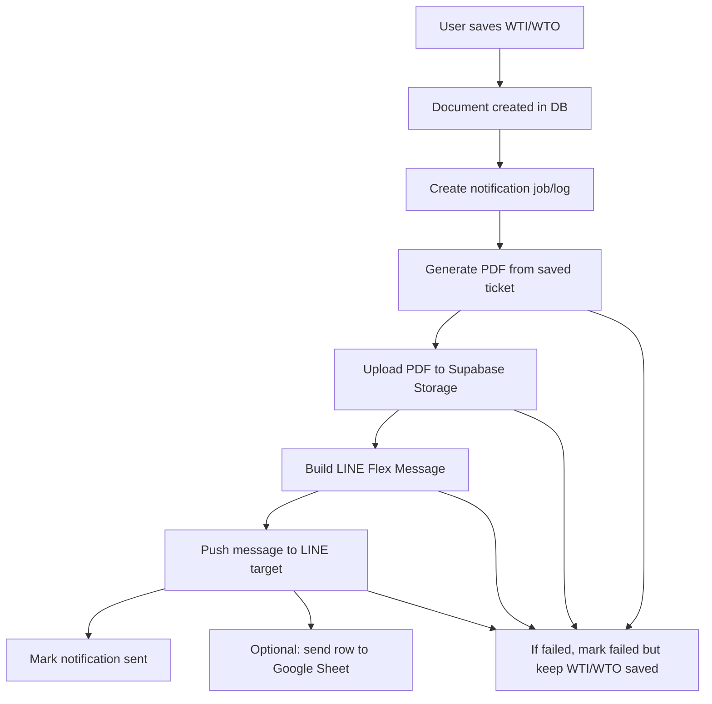

# WTI/WTO LINE Notification Implementation Plan

## Implementation Update 2026-06-23

Implemented the first working slice in `apps/next/`: `/admin/line-settings` is now the setup surface for operators, so day-to-day setup does not require switching to LINE Developers after the initial LINE Messaging API channel/token/secret already exist. The page can save token/secret server-side, verify token, set/check/test webhook for the current domain, capture LINE group/room/user targets from webhook events, select the default target, and send a test message. WTI/WTO sharing generates a PDF, uploads it to Supabase Storage, and pushes a LINE Flex Message; WTI/WTO create can auto-send after save when enabled in settings.

Still true: LINE does not provide a safe API for our app to create the LINE Official Account/Messaging API channel from zero, so the initial `Channel access token` and `Channel secret` must be obtained once outside the app. After that, normal setup is intended to finish in `/admin/line-settings`.

> แผนสำหรับให้ Antigravity หรือ agent ถัดไป implement งานส่ง LINE หลังสร้างใบรับ-ส่งของ
> Scope หลัก: `/daily/weight-ticket-list` และเอกสาร `WTI/WTO` ใน active Next app `apps/next/`
> วันที่จัดทำ: 2026-06-23

## เป้าหมาย

เมื่อลูกค้าสร้างใบรับของ `WTI` หรือใบส่งของ `WTO` เสร็จ ระบบต้องสามารถส่งสรุปเข้า LINE ได้แบบสวยงาม พร้อมลิงก์เปิด PDF ที่รวม:

1. หน้าแรก: ใบพิมพ์ WTI/WTO แบบเดียวกับการกดพิมพ์ในระบบ
2. หน้าถัดไป: รูปหลักฐานของเอกสาร วางสูงสุดหน้า ละ 8 รูป
3. ถ้ามีรูปเกิน 8 รูป ให้ต่อหน้า PDF เพิ่มเป็นชุดละ 8 รูป
4. LINE message ต้องมีปุ่มกดเปิด PDF และปุ่มเปิดเอกสารในระบบ

แนวทางที่แนะนำคือใช้ **LINE Messaging API + Flex Message** ไม่ใช้ LINE Notify เพราะ LINE Notify ปิดบริการแล้วตั้งแต่ 2025-03-31

## ขอบเขตที่ต้องทำ

### In Scope

- เพิ่ม server-side PDF generation สำหรับ WTI/WTO
- Upload PDF ไป Supabase Storage แล้วได้ URL ที่ LINE เปิดได้
- เพิ่ม LINE Messaging API client สำหรับส่ง Flex Message
- เพิ่ม log/job table กันส่งซ้ำและช่วย retry ได้
- เพิ่ม manual action ในหน้า list/detail ก่อน เช่น `ส่ง LINE`
- หลัง manual path stable แล้วค่อยเปิด auto-send หลัง create ถ้าลูกค้ายืนยัน
- อัปเดตเอกสาร flow/checkpoint หลัง implement

### Out of Scope รอบแรก

- ไม่แก้ business rule ของ WTI/WTO, PB, SB, stock hold หรือ stock ledger
- ไม่ทำ SB edit/cancel reversal
- ไม่ย้ายรูปทั้งหมดไป storage ถ้าไม่จำเป็นต่อ PDF รอบแรก
- ไม่ให้ Google Sheet เป็น source of truth
- ไม่ส่ง token/secret ผ่าน client หรือ commit ลง git

## คำถามที่ Antigravity ต้องถามก่อนเริ่ม

ให้ถามลูกค้าหรือเจ้าของระบบก่อนลงมือจริง ตามรายการนี้

### 1. LINE Official Account / Messaging API

- มี LINE Official Account แล้วหรือยัง
- เปิด Messaging API channel แล้วหรือยัง
- ขอ `Channel access token` แบบ long-lived สำหรับส่ง push message
- ขอ `Channel secret` สำหรับ verify webhook signature
- ให้ Bot ส่งเข้าอะไร:
  - group chat
  - room/multi-person chat
  - user 1 คน
- ขอ `groupId`, `roomId`, หรือ `userId` ที่จะใช้เป็น `to`
- ถ้ายังไม่มี `groupId`: ให้เพิ่ม Bot เข้า group แล้วให้คนใน group ส่งข้อความหา Bot 1 ครั้ง จากนั้น webhook จะมี `source.groupId`
- ต้องการส่งไปกี่ group:
  - group เดียวทั้งหมด
  - แยกตามสาขา
  - แยก WTI/WTO
- ชื่อ LINE group ที่ต้องแสดงในระบบคืออะไร
- ต้องเปิด auto-send เลยหรือให้เริ่มจากปุ่ม manual ก่อน
- ถ้าส่งไม่สำเร็จ ต้องให้ใคร retry ได้

### 2. Webhook

- production/staging domain ที่ LINE เรียก webhook ได้คือ URL ไหน
- ใช้ endpoint เช่น `/api/integrations/line/webhook` ได้หรือไม่
- จะให้ webhook ใช้เพื่อเก็บ groupId อย่างเดียว หรือรองรับคำสั่งในอนาคตด้วย
- ลูกค้ายอมให้เปิด webhook ใน LINE Developers Console หรือยัง
- ต้องการให้ระบบแสดงรายการ groupId ที่เคย join ไว้ในหน้า config หรือใช้ env ตรง ๆ ก่อน

### 3. PDF / Storage

- PDF ต้องเปิดแบบ public URL ได้เลย หรือให้เป็น signed URL หมดอายุ
- ถ้าใช้ signed URL ต้องหมดอายุภายในกี่วัน
- Supabase Storage bucket ที่ต้องใช้ชื่ออะไร เช่น `weight-ticket-pdfs`
- bucket รูปเดิมของลูกค้าคือ bucket ไหน เช่น `job-photos`
- ต้องการ filename format แบบไหน:
  - `WTI012606-0019.pdf`
  - `WTI012606-0019-20260623.pdf`
  - หรือแยก path ตามวันที่ `weight-tickets/2026/06/23/WTI012606-0019.pdf`
- PDF ให้รวมรูปประเภทไหน:
  - รูปรายการสินค้าเท่านั้น
  - รูปรถ/ทะเบียนด้วย
  - ทั้งหมด
- รูปต้องเรียงลำดับแบบไหน:
  - ตามลำดับ line
  - ตามเวลา upload
  - รูปรถก่อน แล้วรูปสินค้า
- ถ้ามีรูปน้อยกว่า 8 รูป ให้เว้นช่องว่างหรือจัดใหญ่ขึ้น
- ถ้ารูปโหลดไม่ได้ ต้อง fail ทั้งงาน หรือสร้าง PDF พร้อม placeholder

### 4. LINE Message Content

- ส่งทั้ง `WTI` และ `WTO` หรือเฉพาะประเภทใดประเภทหนึ่ง
- ปุ่ม `แชร์` เดิมในหน้า `/daily/weight-ticket-list` ต้องการให้ทำงานแบบไหน:
  - กดแล้วส่งเข้า LINE group ที่ตั้งค่าไว้ทันที
  - กดแล้วเปิด modal ให้เลือก template/ข้อความก่อนส่งเข้า group ที่ตั้งค่าไว้
  - กดแล้วให้ผู้ใช้เลือกคนหรือห้อง LINE เองผ่าน LIFF Share Target Picker
  - กดแล้วใช้ share URL เดิม เป็นข้อความธรรมดา ให้ผู้ใช้เลือก chat เอง
- ต้องการแยกปุ่ม `ส่ง LINE` กับ `แชร์` หรือรวมเป็นปุ่มเดียว
- ถ้ารวมเป็นปุ่มเดียว ต้องการ default action เป็นอะไร:
  - ส่งเข้ากลุ่มหลักทันที
  - เปิดหน้าต่างเลือกวิธีแชร์
  - เปิด native LINE share แบบเดิม
- ถ้าเปิดให้แก้ข้อความก่อนส่ง ต้องแก้ได้แค่ note เพิ่มเติม หรือแก้ field หลักได้ด้วย
- ถ้าผู้ใช้แก้ข้อความเอง ต้องบันทึกข้อความที่ส่งจริงลง notification log หรือไม่
- ข้อความหัวการ์ดใช้คำว่าอะไร:
  - `ใบรับของ WTI`
  - `ใบส่งของ WTO`
  - หรือชื่อ legacy ตามลูกค้า
- ต้องแสดง field อะไรใน LINE:
  - เลขเอกสาร
  - ผู้ขาย/ลูกค้า
  - สาขา
  - โกดัง/คลัง
  - วันที่/เวลาเอกสาร
  - น้ำหนักรวม
  - หักภาชนะ
  - หักสิ่งเจือปน
  - น้ำหนักสุทธิ
  - จำนวนรายการสินค้า
  - ผู้บันทึก
- ต้องการให้แสดงราคา/ยอดเงินหรือไม่ รอบแรกแนะนำไม่แสดง เพราะ WTI/WTO เป็นเอกสารน้ำหนัก ไม่ใช่บิลซื้อขาย
- ปุ่มใน LINE ต้องมีอะไรบ้าง:
  - `เปิด PDF + รูป`
  - `เปิดในระบบ`
  - `พิมพ์ใบเสร็จ` ถ้าต้องการ wording ตามลูกค้า
- ต้องการส่งรูป preview ใน Flex hero หรือส่งเฉพาะการ์ดข้อความพร้อมปุ่ม

## Share Button Decision

จากรูปปุ่มในหน้า list ตอนนี้มี `พิมพ์` และ `แชร์` อยู่แล้ว ต้องตัดสินใจให้ชัดก่อน implement เพราะคำว่า share มีได้หลายความหมายใน LINE

### Option A: ส่งเข้า LINE group ที่ตั้งค่าไว้

ปุ่ม `แชร์` หรือ `ส่ง LINE` จะเรียก server API แล้วส่ง Flex Message เข้า `LINE_MESSAGING_TARGET_ID`

ข้อดี:

- ทำงานเหมือน automation จริง
- ส่ง Flex Message ได้เต็มรูปแบบ
- มี log/retry/กันส่งซ้ำได้
- เหมาะกับงาน production เช่นส่งเข้า group `NS PRODUCTION`

ข้อเสีย:

- ผู้ใช้เลือกผู้รับเองไม่ได้
- ต้องมี `groupId` หรือ `userId` ล่วงหน้า

แนะนำให้ใช้เป็น default รอบแรก

### Option B: เปิด modal ให้เลือกข้อความก่อนส่งเข้า group

ปุ่ม `แชร์` เปิด modal ในระบบก่อน โดยให้ผู้ใช้เลือก:

- ส่งเป็น `สรุปสั้น`
- ส่งเป็น `สรุปละเอียด`
- เพิ่มข้อความ note ก่อนส่ง
- เลือก target group ถ้าระบบตั้งไว้หลาย group

จากนั้น server ส่ง Flex Message เข้า target ที่เลือก

ข้อดี:

- ยังได้ Flex Message และ log/retry ครบ
- ผู้ใช้ควบคุม wording ได้มากขึ้น
- เหมาะถ้ามีหลาย group หรือบางใบไม่ควรส่งทันที

ข้อเสีย:

- UI เพิ่มมากกว่า Option A
- ต้องกำหนด permission และ target config ชัด

แนะนำเป็น phase 2 หลัง Option A ผ่านแล้ว หรือทำทันทีถ้าลูกค้าต้องการเลือกข้อความจริง ๆ

### Option C: ให้ผู้ใช้เลือกคน/ห้อง LINE เอง

ทำผ่าน LIFF Share Target Picker เพื่อให้ผู้ใช้เลือก recipient เอง และสามารถแชร์ message payload เช่น Flex Message ได้ในนามผู้ใช้

ข้อดี:

- ผู้ใช้เลือกส่งให้ใครก็ได้จาก LINE
- เหมาะกับ share แบบ ad hoc เช่นส่งให้เซลส์/ลูกค้า/เจ้าของ

ข้อเสีย:

- ต้องสร้าง LIFF app เพิ่ม
- ต้องตั้งค่า LINE Login/LIFF ใน LINE Developers Console
- flow จะซับซ้อนกว่า push message
- การส่งจะเป็นในนามผู้ใช้ ไม่ใช่ Bot/group automation แบบปกติ
- ต้อง QA บน LINE mobile จริงมากขึ้น

ไม่แนะนำเป็นรอบแรก เว้นแต่ requirement หลักคือ "ผู้ใช้ต้องเลือกผู้รับเอง"

### Option D: ใช้ LINE share URL เดิม

เปิด `https://line.me/R/msg/text/?...` ส่งข้อความธรรมดาและลิงก์ PDF ให้ผู้ใช้เลือก chat เอง

ข้อดี:

- ทำง่ายสุด
- ไม่ต้องใช้ Channel access token/groupId สำหรับ action นี้
- เหมาะเป็น fallback ถ้า Messaging API ยังไม่พร้อม

ข้อเสีย:

- ไม่ใช่ Flex Message
- ไม่มี log ว่าส่งสำเร็จจริง
- กันส่งซ้ำไม่ได้
- หน้าตาไม่สวยเท่า Bot Flex Message

ใช้เป็น fallback ได้ แต่ไม่ใช่ solution หลักที่ลูกค้าขอ

### Recommendation

ให้ทำสองปุ่มหรือสอง action ภายใต้ปุ่มเดียว:

1. `ส่ง LINE` - ส่ง Flex Message เข้า group ที่ตั้งค่าไว้ผ่าน Messaging API และมี log/retry
2. `แชร์เอง` - ใช้ share URL เดิมหรือ LIFF phase ถัดไป เพื่อให้ผู้ใช้เลือก recipient เอง

ถ้าต้องคง UI ให้สั้นเหมือนภาพ ให้ปุ่ม `แชร์` เปิด dropdown:

- `ส่งเข้ากลุ่มหลัก`
- `แก้ข้อความก่อนส่ง`
- `แชร์เองผ่าน LINE`

รอบแรกที่สั้นและปลอดภัยที่สุด:

- ทำ `ส่งเข้ากลุ่มหลัก` ก่อน
- เก็บ `แชร์เองผ่าน LINE` เป็น fallback text share
- ยังไม่ทำ LIFF จนกว่าลูกค้ายืนยันว่าต้องเลือก recipient เองและต้องเป็น Flex Message

### 5. Google Sheet

จาก repo ตอนนี้ยังไม่พบ integration ธุรกรรม WTI/WTO เข้า Google Sheet โดยตรง ต้องถามเพิ่ม:

- Google Sheet ที่พูดถึงคือ sheet ไหน ขอ URL
- มี Apps Script Web App endpoint แล้วหรือยัง
- ต้องการให้ระบบส่งข้อมูลเข้า Sheet หรือแค่ LINE
- ถ้าส่ง Sheet ต้องส่งตอนไหน:
  - หลังสร้าง WTI/WTO
  - หลังส่ง LINE สำเร็จ
  - กด manual เอง
- column ที่ต้องการใน Sheet มีอะไรบ้าง
- Sheet ใช้เป็น report/log เท่านั้น หรือมีระบบอื่นอ่านต่อ
- ถ้า Sheet fail แต่ LINE สำเร็จ ต้องถือว่างานสำเร็จหรือ fail

### 6. Environment / Secret Delivery

ห้ามส่ง secret ผ่านเอกสารนี้หรือ commit ลง repo ให้เจ้าของระบบใส่ใน `.env.local`, Vercel env, หรือ secret manager เท่านั้น

ขอค่าต่อไปนี้:

```env
LINE_MESSAGING_CHANNEL_ACCESS_TOKEN=
LINE_MESSAGING_CHANNEL_SECRET=
LINE_MESSAGING_TARGET_ID=
LINE_MESSAGING_TARGET_TYPE=group
NEXT_PUBLIC_APP_BASE_URL=
WT_NOTIFICATION_AUTO_SEND=false
WT_NOTIFICATION_PDF_BUCKET=weight-ticket-pdfs
WT_NOTIFICATION_PDF_URL_MODE=public
GOOGLE_SHEETS_WEBHOOK_URL=
```

ถ้าจะ upload Storage ผ่าน server ต้องตรวจว่ามี env ฝั่ง server อยู่แล้วหรือไม่:

```env
NEXT_PUBLIC_SUPABASE_URL=
SUPABASE_SERVICE_ROLE_KEY=
```

## Workflow เป้าหมาย



หลักสำคัญ: การสร้างเอกสาร WTI/WTO ต้องไม่ rollback เพียงเพราะ LINE/PDF/Google Sheet fail

## Data Model ที่แนะนำ

เพิ่ม migration แบบ additive:

```sql
create table if not exists public.weight_ticket_notification_logs (
  id uuid primary key default gen_random_uuid(),
  weight_ticket_id bigint not null references public.weight_tickets(id) on delete restrict,
  weight_ticket_doc_no text not null,
  notification_type text not null default 'line',
  trigger_source text not null default 'manual',
  destination_type text not null default 'group',
  destination_id text not null,
  pdf_storage_key text,
  pdf_url text,
  status text not null default 'pending',
  retry_count integer not null default 0,
  line_request_id text,
  google_sheet_status text,
  last_error text,
  created_by text,
  created_at timestamptz not null default now(),
  sent_at timestamptz,
  updated_at timestamptz not null default now(),
  unique (weight_ticket_doc_no, notification_type, destination_id)
);
```

สถานะที่ใช้:

- `pending`
- `generating_pdf`
- `sending_line`
- `sent`
- `failed`
- `skipped`

หมายเหตุ:

- อย่าเก็บ `Channel access token` หรือ `Channel secret` ในตาราง
- ถ้ากังวลเรื่อง privacy ให้เก็บ `destination_id` แบบ masked/hash ได้ แต่รอบแรกใช้ plain ใน dev ได้ถ้าถูกจำกัดสิทธิ์
- ถ้าต้องส่งหลาย group ให้ unique key เป็น `doc_no + type + destination`

## API ที่แนะนำ

### Manual Send

```text
POST /api/daily/weight-tickets/[id]/notify-line
```

Request:

```json
{
  "force": false
}
```

Response:

```json
{
  "ok": true,
  "status": "sent",
  "pdfUrl": "https://...",
  "sentAt": "2026-06-23T..."
}
```

Behavior:

- ตรวจ permission ก่อนส่ง
- โหลด ticket จาก `doc_no`
- ถ้าเคยส่งแล้วและ `force=false` ให้คืนสถานะเดิม ไม่ส่งซ้ำ
- ถ้า `force=true` ให้ส่งใหม่และเพิ่ม retry count
- สร้าง PDF/upload ก่อนส่ง LINE
- บันทึก error ลง log ถ้าล้มเหลว

### Webhook For LINE

```text
POST /api/integrations/line/webhook
```

Behavior:

- Verify signature ด้วย `LINE_MESSAGING_CHANNEL_SECRET`
- รับ event จาก LINE
- ถ้า event มี `source.groupId` ให้ log ไว้เพื่อให้เจ้าของระบบเอาไปตั้งค่า
- รอบแรกยังไม่ต้อง implement command bot

### Optional Google Sheet

```text
POST GOOGLE_SHEETS_WEBHOOK_URL
```

Payload ตัวอย่าง:

```json
{
  "documentNo": "WTI012606-0019",
  "type": "WTI",
  "partyName": "บจ. เอ็มแอนด์เอ็ม บราส เมททอล",
  "branchName": "สมุทรสาคร",
  "documentDate": "2026-06-23",
  "createdAt": "2026-06-23T07:59:00.000Z",
  "grossWeight": 800,
  "deductionWeight": 204,
  "netWeight": 596,
  "pdfUrl": "https://..."
}
```

## PDF Generation Plan

รอบแรกให้สร้าง PDF จาก source data เดียวกับ detail/read model เพื่อลด drift:

- ใช้ `GET /api/daily/weight-tickets/[id]` logic ฝั่ง server หรือแยก helper กลาง
- ใช้ Company Profile จาก server helper เดียวกับ print ปัจจุบัน
- หน้าที่ 1:
  - header บริษัท
  - เลขเอกสาร
  - WTI/WTO title
  - ผู้ขาย/ลูกค้า
  - สาขา
  - ทะเบียนรถ
  - ผู้ชั่ง/ผู้บันทึก
  - ตารางสินค้า gross/deduct/net
  - สรุปน้ำหนัก
  - ช่องลงชื่อ
- หน้ารูป:
  - A4 portrait
  - title: `รูปประกอบเอกสาร WTI012606-0019`
  - grid 2 x 4
  - ใต้รูปใส่ `#1`, เวลา/ชื่อไฟล์ ถ้ามี
  - footer page number

เรื่อง library:

- ตรวจ dependency ที่มีอยู่ก่อน
- ถ้าเพิ่ม dependency ได้ แนะนำใช้ library ที่ generate PDF บน server ได้จริงและรองรับรูป/ฟอนต์ไทย
- ต้องฝังฟอนต์ไทย เช่น `Noto Sans Thai` ใน artifact/runtime ไม่พึ่งฟอนต์เครื่องผู้ใช้
- ห้ามใช้ browser print เป็นวิธีเดียว เพราะต้อง upload PDF อัตโนมัติขึ้น Storage

## Storage Plan

Bucket แนะนำ:

```text
weight-ticket-pdfs
```

Storage key:

```text
weight-tickets/{YYYY}/{MM}/{DD}/{docNo}.pdf
```

ตัวอย่าง:

```text
weight-tickets/2026/06/23/WTI012606-0019.pdf
```

URL mode:

- ถ้าลูกค้าโอเคให้เปิดใน LINE ได้ง่าย: public bucket
- ถ้าข้อมูล sensitive: signed URL แต่ต้องยอมรับว่าลิงก์หมดอายุ

รอบแรกแนะนำ public เฉพาะ bucket PDF ของเอกสารนี้ ถ้าลูกค้ายืนยันว่า group เป็นกลุ่มปิดและเอกสารไม่มีราคาหรือข้อมูลการเงิน sensitive

## LINE Flex Message Draft

ตัวอย่างสำหรับ `WTI`:

```json
{
  "type": "flex",
  "altText": "ใบรับของ WTI WTI012606-0019",
  "contents": {
    "type": "bubble",
    "size": "mega",
    "header": {
      "type": "box",
      "layout": "vertical",
      "backgroundColor": "#006B4F",
      "contents": [
        { "type": "text", "text": "ใบรับของ WTI", "weight": "bold", "color": "#FFFFFF", "size": "lg" },
        { "type": "text", "text": "WTI012606-0019", "color": "#D1FAE5", "size": "sm" }
      ]
    },
    "body": {
      "type": "box",
      "layout": "vertical",
      "spacing": "sm",
      "contents": [
        { "type": "text", "text": "ผู้ขาย: บจ. เอ็มแอนด์เอ็ม บราส เมททอล", "wrap": true },
        { "type": "text", "text": "สาขา: สมุทรสาคร", "wrap": true },
        { "type": "text", "text": "โกดัง: #2", "wrap": true },
        { "type": "separator" },
        { "type": "text", "text": "น้ำหนักสุทธิ: 596.00 กก.", "weight": "bold", "size": "xl", "color": "#0084B8" },
        { "type": "text", "text": "หักภาชนะ/สิ่งเจือปน: 204.00 กก.", "size": "sm", "color": "#6B7280" }
      ]
    },
    "footer": {
      "type": "box",
      "layout": "vertical",
      "spacing": "sm",
      "contents": [
        { "type": "button", "style": "primary", "color": "#006B4F", "action": { "type": "uri", "label": "เปิด PDF + รูป", "uri": "https://..." } },
        { "type": "button", "style": "secondary", "action": { "type": "uri", "label": "เปิดในระบบ", "uri": "https://..." } }
      ]
    }
  }
}
```

ข้อควรระวัง:

- `altText` ต้องสั้นและเข้าใจได้ เพราะ LINE ใช้แสดง fallback
- URL ในปุ่มต้องเป็น HTTPS ที่มือถือเปิดได้
- ถ้าระบบหลัง login ยังเปิดจาก LINE ไม่สะดวก ให้ปุ่ม PDF เป็น primary ก่อน

## ไฟล์ที่น่าจะแก้

ตรวจจริงก่อนแก้ แต่คาดว่าจะอยู่ในกลุ่มนี้:

```text
apps/next/src/app/api/daily/weight-tickets/[id]/route.ts
apps/next/src/app/api/daily/weight-tickets/[id]/notify-line/route.ts
apps/next/src/app/api/integrations/line/webhook/route.ts
apps/next/src/lib/server/weight-tickets.ts
apps/next/src/lib/server/weight-ticket-pdf.ts
apps/next/src/lib/server/weight-ticket-line-notification.ts
apps/next/src/lib/server/supabase-admin.ts
apps/next/src/components/daily/WeightTicketListPageClient.tsx
apps/next/src/components/daily/WeightTicketDetailModal.tsx
apps/next/prisma/schema.prisma
supabase/migrations/{timestamp}_add_weight_ticket_notification_logs.sql
docs/notes/WTI-WTO Flow.md
docs/notes/page-flows/daily-transactions-daily-weight-ticket-list.md
docs/migration/00-current-work.md
```

## UI Plan

รอบแรกเพิ่มปุ่ม manual:

- ใน row action ของ `/daily/weight-ticket-list`: `ส่ง LINE`
- ใน detail modal: `ส่ง LINE`
- Loading state: `กำลังส่ง...`
- ถ้าเคยส่งแล้ว:
  - แสดง `ส่งแล้ว`
  - มี action `ส่งซ้ำ` เฉพาะ admin/owner หรือ role ที่กำหนด
- ถ้าส่ง fail:
  - แสดง error ภาษาไทย
  - มีปุ่ม retry

ไม่ควรเปิด auto-send ก่อนมี manual path เพราะจะ debug ยากและเสี่ยงส่งเข้ากลุ่มลูกค้าผิด

## Auto-send Plan

หลัง manual path ผ่าน QA แล้ว ค่อยเพิ่ม:

```env
WT_NOTIFICATION_AUTO_SEND=true
```

เมื่อ `POST /api/daily/weight-tickets` สร้างสำเร็จ:

- สร้าง notification job/log
- trigger ส่งแบบ async หลัง DB transaction จบ
- ถ้า LINE fail ไม่ rollback เอกสาร
- API response ควรบอกได้ว่า `notificationStatus: pending|sent|failed|disabled`

ถ้า runtime ไม่มี queue จริง รอบแรกใช้ direct async call หลัง response mapping ก็ได้ แต่ต้องระวัง timeout บน Vercel/hosting

## Validation / QA Checklist

### Local validation

```bash
npm run lint --workspace @ns-scrap-erp/next
npm run type-check --workspace @ns-scrap-erp/next
npm run build --workspace @ns-scrap-erp/next
git diff --check
```

### API tests

- Missing token แล้ว API ต้อง return config error ที่อ่านรู้เรื่อง
- Missing target id แล้วต้องไม่พยายามส่ง
- Invalid ticket doc no ต้อง 404
- Duplicate send `force=false` ต้องไม่ส่งซ้ำ
- Retry `force=true` ต้องสร้าง log/update retry count
- LINE API error ต้องเก็บ `last_error`
- PDF upload error ต้อง mark failed
- Webhook signature invalid ต้อง reject

### PDF visual QA

- เปิด PDF บนมือถือได้
- หน้าแรกไม่ตัดข้อความไทย
- เลขเอกสาร/ผู้ขาย/ลูกค้า/สาขา/น้ำหนักถูกต้อง
- รูปแสดงครบตามจำนวน
- รูป 8 รูปต่อหน้าไม่ทับกัน
- ถ้ามี 9 รูป ต้องขึ้นหน้าถัดไป
- ถ้ารูปแนวตั้ง/แนวนอนปนกัน ต้อง crop/fit อย่างอ่านรู้เรื่อง

### LINE QA

- Bot ส่งเข้า group ถูกต้อง
- Flex Message แสดงบน Android และ iPhone อ่านง่าย
- ปุ่ม `เปิด PDF + รูป` เปิดได้
- ปุ่ม `เปิดในระบบ` เปิด URL ถูกต้อง
- `altText` อ่านเข้าใจเมื่อ Flex preview ไม่พร้อม
- ส่ง WTI และ WTO แยก wording ถูกต้อง
- ไม่ส่งซ้ำเมื่อ refresh/กดซ้ำโดยไม่ตั้งใจ

### Google Sheet QA ถ้าเปิดใช้

- ส่ง row ได้หลัง LINE สำเร็จ
- Column map ตรงที่ลูกค้าขอ
- Sheet fail ไม่ทำให้ LINE/WTI/WTO fail ถ้าลูกค้าตกลงให้เป็น optional

## Acceptance Criteria

งานถือว่าเสร็จเมื่อ:

- สร้าง WTI/WTO แล้วกด `ส่ง LINE` ได้จาก list/detail
- ระบบสร้าง PDF จริงและ upload ขึ้น Supabase Storage
- PDF มีหน้าใบพิมพ์ + หน้ารูป 8 รูปต่อหน้า
- LINE group ได้ Flex Message พร้อมปุ่มเปิด PDF
- มี log ว่าส่งแล้ว/ล้มเหลว/retry ได้
- ไม่มี secret อยู่ใน git diff
- Validation ผ่านตาม baseline
- Docs `WTI-WTO Flow`, page-flow, และ current work ถูกอัปเดต

## Official Reference Links

- LINE Messaging API getting started: https://developers.line.biz/en/docs/messaging-api/getting-started/
- Sending messages: https://developers.line.biz/en/docs/messaging-api/sending-messages/
- Flex Message elements: https://developers.line.biz/en/docs/messaging-api/flex-message-elements/
- URI action: https://developers.line.biz/en/docs/messaging-api/actions/
- Group chats and groupId: https://developers.line.biz/en/docs/messaging-api/group-chats/
- Webhooks and signature validation: https://developers.line.biz/en/docs/messaging-api/receiving-messages/
## Implementation Checkpoint 2026-06-23

สถานะ: เริ่ม implement รอบแรกใน active Next app แล้ว

สิ่งที่ทำในรอบนี้:

- เพิ่มปุ่ม `แชร์` แบบเปิด dialog ใน `/daily/weight-ticket-list`
- ใน dialog มี 2 ทางเลือก:
  - `ส่งเข้ากลุ่มหลัก` สร้าง PDF, อัปโหลด Supabase Storage, แล้วส่ง LINE Flex Message ผ่าน Messaging API
  - `แชร์เองผ่าน LINE` ใช้ LINE share URL เดิมเป็น fallback ให้ผู้ใช้เลือกห้องเอง
- เพิ่ม API `POST /api/daily/weight-tickets/[id]/notify-line`
- เพิ่ม webhook `POST /api/line/webhook` สำหรับ verify `Channel secret` และช่วยดู `groupId` จาก event
- เพิ่ม PDF generator ฝั่ง server โดยใช้ `pdf-lib` และฟอนต์ `Noto Sans Thai`
- PDF หน้าแรกเป็นใบ WTI/WTO สรุปเอกสารและรายการสินค้า
- PDF หน้าถัดไปวางรูปประกอบได้สูงสุด 8 รูปต่อรอบแรก
- เพิ่ม migration `20260623153000_add_weight_ticket_line_notifications.sql`
  - ตาราง `weight_ticket_notification_logs`
  - bucket `weight-ticket-pdfs`
- เพิ่ม env template:
  - `NEXT_PUBLIC_APP_URL`
  - `LINE_CHANNEL_ACCESS_TOKEN`
  - `LINE_CHANNEL_SECRET`
  - `LINE_DEFAULT_TARGET_ID`
  - `WEIGHT_TICKET_PDF_BUCKET`

ข้อจำกัดรอบแรก:

- ยังไม่เปิด auto-send หลังสร้างเอกสารทันที เพื่อเลี่ยงส่งผิด group ระหว่าง setup
- target LINE ใช้ `LINE_DEFAULT_TARGET_ID` เป็นหลัก ยังไม่มีหน้า config หลาย group
- รูปที่เป็น data URL จะฝังเข้า PDF ได้ทันที; รูปที่เหลือเป็นชื่อไฟล์อย่างเดียวจะแสดง placeholder ก่อน
- ถ้า LINE token, groupId, service role key หรือ bucket ยังไม่พร้อม ระบบจะแจ้ง error ใน dialog และยังแชร์เองผ่าน LINE ได้
