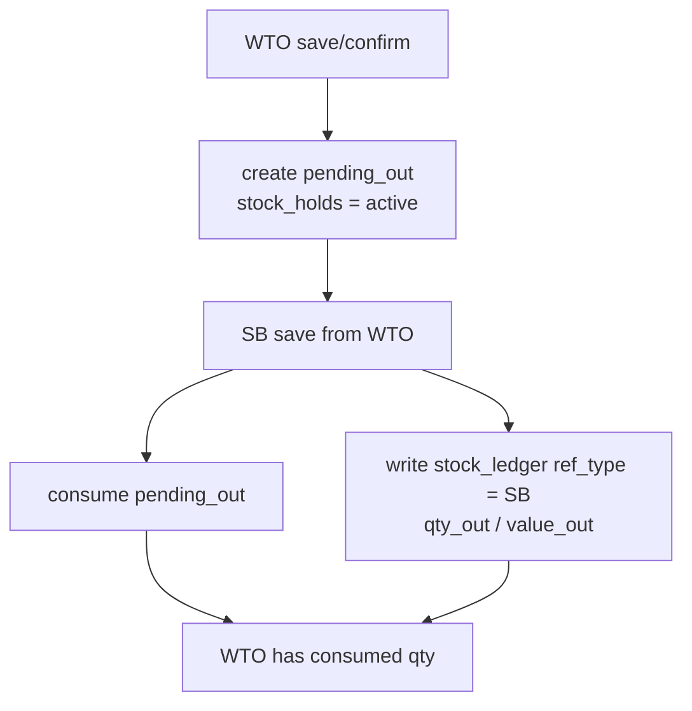
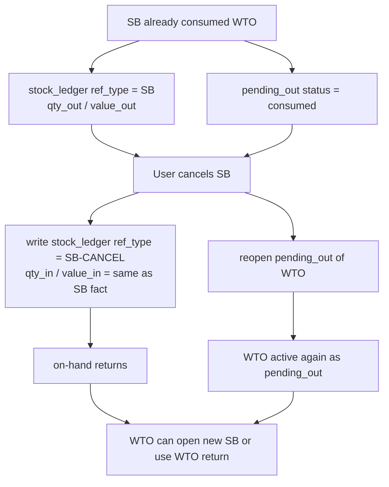
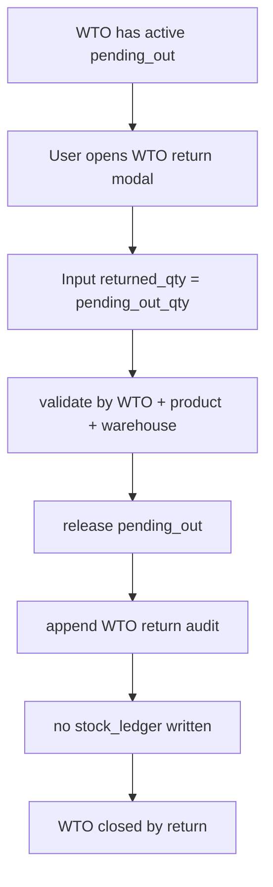
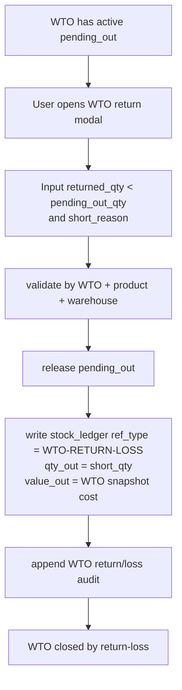
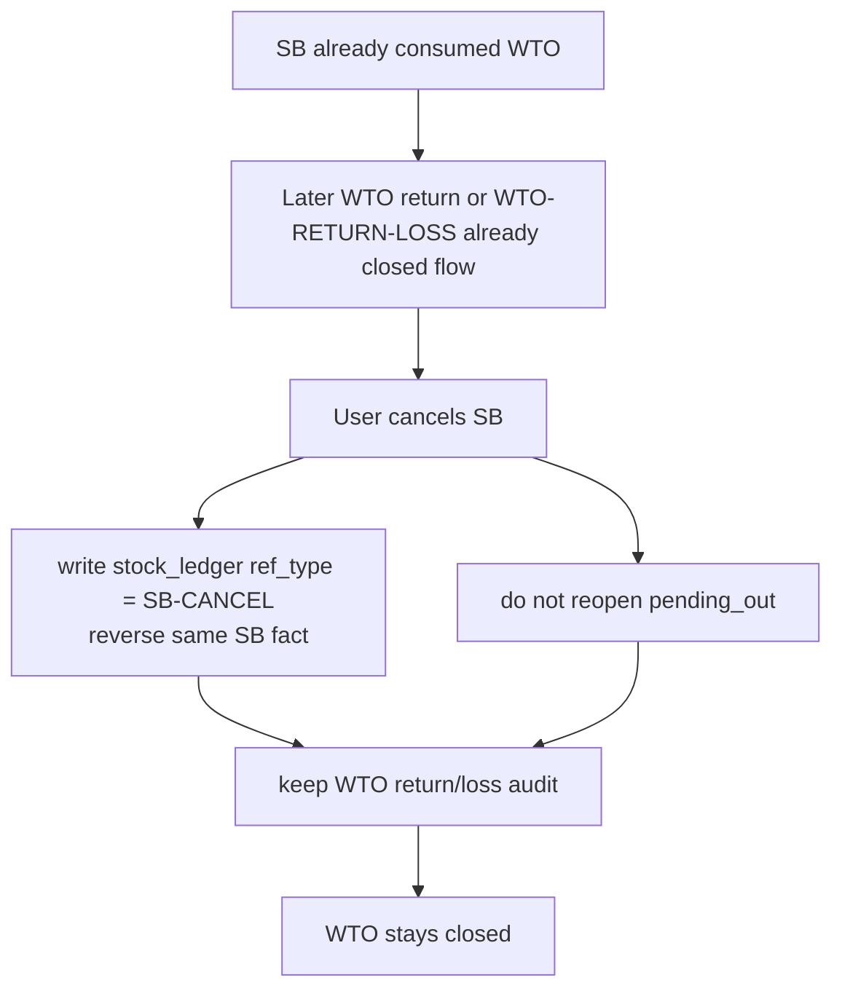

# WTO Return Flow / Flow รับของคืนจาก WTO

เอกสารนี้เป็น canonical flow สำหรับ action `รับของคืน` ของ `WTO` และความสัมพันธ์กับ:

- `WTO pending_out`
- `Sales Bill (SB)`
- `SB-CANCEL`
- `WTO-RETURN-LOSS`
- `stock_holds`
- `stock_ledger`

เอกสารแม่ที่เกี่ยวข้อง:

- [[WTI-WTO Flow]]
- [[Stock Ledger and Stock Balance]]
- [[Sales Flow]]

## หลักการหลัก

- owner ของ action `รับของคืน` คือ `WTO` ไม่ใช่ `SB`
- business key ของยอดค้างที่ต้องปิดคือ `WTO + สินค้า + คลัง`
- `SB` เป็น downstream reference/audit เท่านั้น ไม่ใช่ owner ของ flow รับของคืน
- `เต๋า`, `line`, `source_line_no`, และ internal `stock_holds` split เป็นเพียง detail/audit ไม่ใช่ business row
- ถ้าข้อมูลเก่ายัง split หลาย hold ระบบต้อง aggregate เป็น 1 ก้อนธุรกิจก่อนคำนวณ, ก่อนแสดง modal, และก่อนเขียน ledger/log

## ความหมายของข้อมูล

- `pending_out`
  คือ reservation ของ `WTO` ใน `stock_holds`
  ยังไม่ใช่ stock movement และยังไม่ใช่ `stock_ledger`

- `stock_ledger`
  คือ movement จริงของ stock ที่กระทบ `เข้า / ออก / คงเหลือ / มูลค่า / WAC`

- `WTO return`
  คือ action ปิดยอดค้างของ `WTO` เมื่อของที่ส่งออกไปบางส่วนหรือทั้งหมดไม่ได้ถือว่าออกขายสำเร็จตาม flow เดิม

- `WTO-RETURN-LOSS`
  คือ stock movement สำหรับส่วนขาดจากการรับของคืน ถ้าน้ำหนักรับคืนจริงน้อยกว่ายอด `pending_out`

## สถานะระดับธุรกิจ

1. `WTO active with pending_out`
มีของที่รอออกตามเอกสาร WTO และยังไม่ถูกปิด flow

2. `WTO partially consumed by SB`
มี `SB` มา consume `pending_out` บางส่วนหรือทั้งหมด และมี `stock_ledger.ref_type = SB` เกิดขึ้นแล้ว

3. `WTO reopened after SB-CANCEL`
`SB` ถูกยกเลิกและระบบ reverse ledger แล้ว reopen `pending_out` กลับมาเท่าจำนวนที่เคย consume จริง

4. `WTO closed by return`
ผู้ใช้กด `รับของคืน` และรับคืนครบยอดค้าง ระบบ release `pending_out` โดยไม่เขียน stock-in ledger

5. `WTO closed by return-loss`
ผู้ใช้กด `รับของคืน` แต่รับคืนจริงน้อยกว่ายอดค้าง ระบบ release `pending_out` ทั้งก้อนและเขียน `WTO-RETURN-LOSS` สำหรับส่วนขาด

## Flow หลัก

### 1. WTO ถูกสร้างหรือ confirm

- สร้าง `pending_out` ใน `stock_holds`
- ยังไม่เขียน `stock_ledger`
- ถ้า confirm แล้วให้มี cost snapshot ของ pending_out ระดับ `WTO + สินค้า + คลัง`

ผลลัพธ์:

- stock balance เห็น `รอออก`
- on-hand ไม่ถูกตัด
- available ลดลงตาม pending_out

### 2. SB ใช้ WTO

- `SB` consume `pending_out` ตามยอดที่ใช้จริง
- เขียน `stock_ledger.ref_type = SB`
- `qty_out` และ `value_out` ต้องอิงต้นทุน snapshot ของ WTO ที่ถูก consume จริง
- ถ้า `SB commercial qty` มากกว่า source WTO ให้ cap stock consume ที่ยอด `pending_out` เท่านั้น

ผลลัพธ์:

- on-hand ลดลงตาม `SB`
- pending_out ที่ถูกใช้เปลี่ยนเป็น `consumed`
- ถ้ายังมี pending_out คงเหลือ ผู้ใช้ยังสามารถปิดยอดด้วย `รับของคืน` ได้ในภายหลัง

### 3. รับของคืนจาก WTO

trigger:

- มี active pending_out ของ `WTO` ที่ยังต้องปิดยอด

input:

- 1 row ต่อ `WTO + สินค้า + คลัง`
- submit ผ่าน `POST /api/daily/weight-tickets/{docNo}/stock-return`
- `pending_out_qty`
- `returned_qty`
- `short_reason` ถ้า `returned_qty < pending_out_qty`

validation:

- `returned_qty` ต้องไม่ติดลบ
- `returned_qty` ต้องไม่เกิน `pending_out_qty`
- ถ้าขาด ต้องบังคับเหตุผล

ผลลัพธ์เมื่อคืนครบ:

- release `pending_out` ทั้งก้อน
- append `weight_ticket_usage_logs.action = returned_from_wto`
- ไม่เขียน stock-in ledger
- append audit event ของ WTO return

ผลลัพธ์เมื่อคืนขาด:

- release `pending_out` ทั้งก้อน
- append `weight_ticket_usage_logs.action = returned_from_wto` สำหรับยอดที่คืนจริง
- append `weight_ticket_usage_logs.action = loss_from_wto_return` สำหรับยอดขาด
- เขียน `stock_ledger.ref_type = WTO-RETURN-LOSS` 1 row ต่อ `WTO + สินค้า + คลัง`
- `qty_out` ของ loss = `pending_out_qty - returned_qty`
- `value_out` ของ loss ต้องอิงต้นทุน snapshot ของ WTO ก้อนนั้น
- append audit event ของ WTO return/loss

ข้อห้าม:

- ห้ามแตก `WTO-RETURN-LOSS` เป็นหลาย row ตามเต๋า/line/hold split
- ห้ามอิง `SB` เป็น owner ของ route รับคืน

## กรณี SB-CANCEL

### SB-CANCEL ก่อนมี WTO return/loss

สิ่งที่ต้องเกิด:

- เขียน `stock_ledger.ref_type = SB-CANCEL`
- `qty_in` และ `value_in` ต้อง reverse เท่ากับ `SB` movement ที่เคย post จริง
- reopen `pending_out` ของ WTO กลับมาเท่าจำนวนที่เคย consume จริง

ผลลัพธ์:

- ledger ของคู่ `SB` และ `SB-CANCEL` ต้องหักล้างกัน
- on-hand กลับมา
- available ยังไม่กลับมาเต็ม เพราะ WTO ยัง hold ไว้เป็น pending_out
- WTO เดิมยังใช้เปิด `SB` ใหม่ได้ หรือจะกด `รับของคืน` เพื่อปิดยอดก็ได้

### SB-CANCEL หลังมี WTO return/loss แล้ว

สิ่งที่ต้องเกิด:

- เขียน `stock_ledger.ref_type = SB-CANCEL` เพื่อ reverse เฉพาะ movement ที่ `SB` เคย post จริง
- คง audit ของ WTO return/loss เดิมไว้
- ห้าม reopen `pending_out` ซ้ำ

ผลลัพธ์:

- ledger ของ `SB` ถูก reverse
- แต่ WTO ไม่กลับไปอยู่สถานะ `pending_out active` เพราะ flow ถูกปิดแล้ว
- ห้ามนำ WTO เดิมไปเปิด `SB` ใหม่แบบปกติ

## Mermaid Use Cases

### Use Case 1: SB ใช้ WTO ตามปกติ

### Use Case 2: SB-CANCEL ก่อนมี WTO return/loss

### Use Case 3: WTO return ครบ

### Use Case 4: WTO return ขาด

### Use Case 5: SB-CANCEL หลังมี WTO return/loss แล้ว

## กฎเรื่องต้นทุน

- `SB` ต้องตัดต้นทุนตาม snapshot ของ WTO ที่ consume จริง
- `SB-CANCEL` ต้อง reverse ต้นทุนเท่าเดิมกับ `SB` เดิม ไม่ใช่คำนวณใหม่จาก WAC ปัจจุบัน
- `WTO-RETURN-LOSS` ต้องใช้ต้นทุน snapshot ของ WTO ก้อนที่ถูกปิด
- `WTO-RETURN-LOSS` ต้องอ้าง `ref_no/ref_id` กลับไปที่เอกสาร `WTO` เสมอ แม้ action จะถูกกดจากหน้า `SB`
- คู่ค้าใน stock ledger ของ `WTO-RETURN-LOSS` ต้องเป็น `ลูกค้า` จาก `WTO` ใบนั้น ไม่ใช่ชื่อประเภท movement หรือเลข `SB`
- ถ้าไม่มี cost snapshot ที่ถูกต้อง ต้อง fail flow และให้แก้ข้อมูลต้นทุนก่อน

ตัวอย่าง:

- `SB qty_out = 100`
- `SB value_out = 42,700`
- ตอน `SB-CANCEL` ต้องได้ `qty_in = 100` และ `value_in = 42,700`

## ตารางสรุปผลกระทบ

| เหตุการณ์ | stock_holds | stock_ledger | ผลทางธุรกิจ |
|---|---|---|---|
| WTO save/confirm | สร้างหรือปรับ `pending_out` | ไม่เขียน | กันของเป็น `รอออก` |
| SB save from WTO | consume `pending_out` | `SB qty_out/value_out` | ตัด stock จริง |
| SB-CANCEL ก่อน return | reopen `pending_out` | `SB-CANCEL qty_in/value_in` | ย้อนการขาย แต่ WTO ยังรอออก |
| WTO return ครบ | release `pending_out` | ไม่เขียน | ปิดยอดค้างโดยไม่เกิด stock-in |
| WTO return ขาด | release `pending_out` | `WTO-RETURN-LOSS qty_out/value_out` | ปิดยอดค้างและบันทึกของขาด |
| SB-CANCEL หลัง return/loss | ไม่ reopen | `SB-CANCEL qty_in/value_in` | ย้อนการขาย แต่ไม่เปิด WTO ซ้ำ |

## ข้อสรุปที่ต้องยึด

- `SB cancel` ไม่เท่ากับ `รับของคืน`
- `รับของคืน` เป็น action ปิดยอดค้างของ `WTO`
- `SB-CANCEL` เป็น action reverse ledger ของบิลขาย
- การตัดสินใจว่าจะ reopen pending_out ได้หรือไม่ ขึ้นกับว่า WTO เคยถูกปิดด้วย return/loss แล้วหรือยัง
- `WTI` และ `WTO` ห้ามใช้ flow นี้ร่วมกัน; flow นี้ใช้กับ `WTO` เท่านั้น
